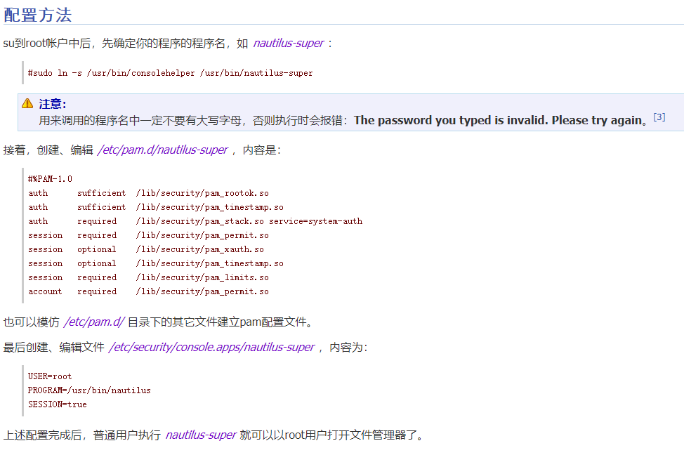
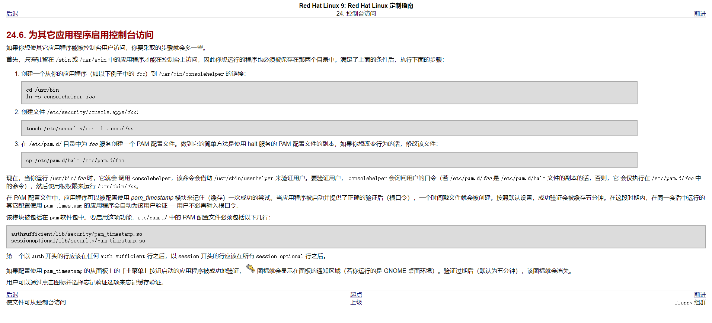

# consolehelper作用

使用consolehelper，可以让经过授权(见PAM)的普通用户以root权限执行程序。以shutdown程序为例[2]：

* 创建软链接 /usr/bin/shutdown -> /usr/bin/consolehelper
* 普通用户执行shutdown时，$PATH中并没有/sbin，故只能执行/usr/bin/shutdown
* 由于软链接的存在，consolehelper被调用，consolehelper调用验证等过程，最终以root身份执行/sbin/shutdown

其实就是类似于sudo，用来做鉴权，可以允许普通用户以root权限执行rootfs构建过程

## 参考

* <http://linux-wiki.cn/wiki/zh-hans/%E4%BD%BF%E7%94%A8consolehelper%E8%8E%B7%E5%BE%97root%E6%9D%83%E9%99%90>
* <https://linux.die.net/man/8/consolehelper>

---
