<!-- MDTOC maxdepth:6 firsth1:1 numbering:0 flatten:0 bullets:1 updateOnSave:1 -->

- [为什么需要bootstrap chroot](#为什么需要bootstrap-chroot)   
   - [bootstrap构建过程](#bootstrap构建过程)   
   - [bootstrap构建过程日志完整版](#bootstrap构建过程日志完整版)   

<!-- /MDTOC -->
# 为什么需要bootstrap chroot

* <https://rpm-software-management.github.io/mock/Feature-bootstrap>

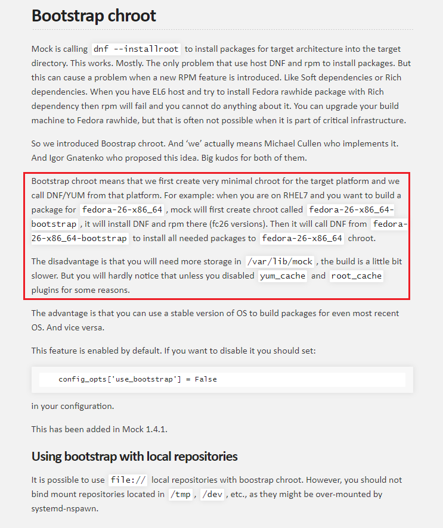

官方说明，有好有坏

* 为了兼容更多发行版
* 消耗磁盘空间

## bootstrap构建过程

这里有一个鸡生蛋的过程，当前rootfs怎么再生一个rootfs？

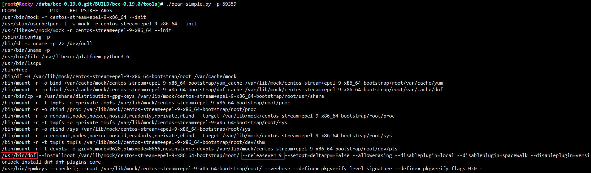

* 关键点是靠yum/dnf，以及对应的软件源
* 这里涉及到了yum的共性，它能够根据源安装指定软件，包括它自己。就像gcc能编译自己一样的。

```
/usr/bin/dnf \
  --installroot /var/lib/mock/centos-stream+epel-9-x86_64-bootstrap/root/ \
  --releasever 9 \
  --setopt=deltarpm=False --allowerasing \
  --disableplugin=local --disableplugin=spacewalk --disableplugin=versionlock \
  install dnf dnf-plugins-core
```


* 这条命令，利用当前发行版的dnf命令，解析centos-stream+epel-9-x86_64配置中yum源，repodata内容，在安装dnf自身，此时dnf以及是centos-stream+epel-9-x86_64的版本了
* 该怎么用段子描述这个过程嘞。。

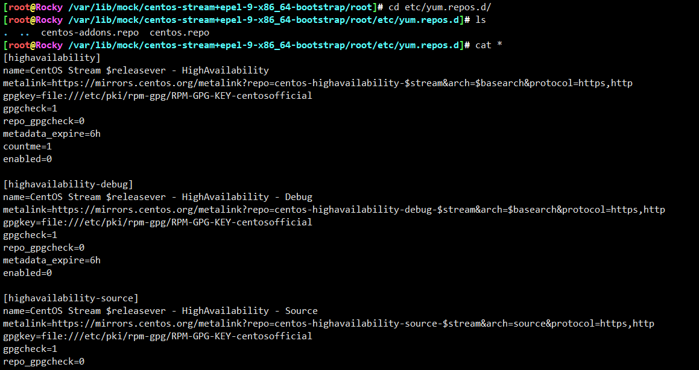

可以看到，目标rootfs中的yum源repo配置，但其实，这不是，这是yum安装release生成的

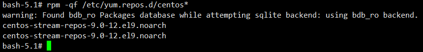

真正的配置应该在```/etc/dnf/dnf.conf```

```
[main]
keepcache=1
debuglevel=2
reposdir=/dev/null
logfile=/var/log/yum.log
retries=20
obsoletes=1
gpgcheck=0
assumeyes=1
syslog_ident=mock
syslog_device=
best=1
install_weak_deps=0
protected_packages=
module_platform_id=platform:el9
user_agent=Mock (centos-stream+epel-9-x86_64-bootstrap; x86_64)


[local-centos-stream]

name=CentOS Stream $releasever - Koji Local - BUILDROOT ONLY!
baseurl=https://kojihub.stream.centos.org/kojifiles/repos/c9s-build/latest/$basearch/
cost=2000
enabled=0
skip_if_unavailable=False

[baseos]
name=CentOS Stream $releasever - BaseOS
#baseurl=http://mirror.stream.centos.org/$releasever-stream/BaseOS/$basearch/os/
metalink=https://mirrors.centos.org/metalink?repo=centos-baseos-$releasever-stream&arch=$basearch
gpgkey=file:///usr/share/distribution-gpg-keys/centos/RPM-GPG-KEY-CentOS-Official
gpgcheck=1
enabled=1
skip_if_unavailable=False

[appstream]
name=CentOS Stream $releasever - AppStream
#baseurl=http://mirror.stream.centos.org/$releasever-stream/AppStream/$basearch/os/
metalink=https://mirrors.centos.org/metalink?repo=centos-appstream-$releasever-stream&arch=$basearch
gpgkey=file:///usr/share/distribution-gpg-keys/centos/RPM-GPG-KEY-CentOS-Official
gpgcheck=1
enabled=1
skip_if_unavailable=False

[crb]
name=CentOS Stream $releasever - CRB
#baseurl=http://mirror.stream.centos.org/$releasever-stream/CRB/$basearch/os/
metalink=https://mirrors.centos.org/metalink?repo=centos-crb-$releasever-stream&arch=$basearch
gpgkey=file:///usr/share/distribution-gpg-keys/centos/RPM-GPG-KEY-CentOS-Official
gpgcheck=1
enabled=1
skip_if_unavailable=False

[highavailability]
name=CentOS Stream $releasever - HighAvailability
#baseurl=http://mirror.stream.centos.org/$releasever-stream/HighAvailability/$basearch/os/
metalink=https://mirrors.centos.org/metalink?repo=centos-highavailability-$releasever-stream&arch=$basearch
gpgkey=file:///usr/share/distribution-gpg-keys/centos/RPM-GPG-KEY-CentOS-Official
gpgcheck=1
enabled=0

[nfv]
name=CentOS Stream $releasever - NFV
#baseurl=http://mirror.stream.centos.org/$releasever-stream/NFV/$basearch/os/
metalink=https://mirrors.centos.org/metalink?repo=centos-nfv-$releasever-stream&arch=$basearch
gpgkey=file:///usr/share/distribution-gpg-keys/centos/RPM-GPG-KEY-CentOS-Official
gpgcheck=1
enabled=0

[rt]
name=CentOS Stream $releasever - RT
#baseurl=http://mirror.stream.centos.org/$releasever-stream/RT/$basearch/os/
metalink=https://mirrors.centos.org/metalink?repo=centos-rt-$releasever-stream&arch=$basearch
gpgkey=file:///usr/share/distribution-gpg-keys/centos/RPM-GPG-KEY-CentOS-Official
gpgcheck=1
enabled=0

[resilientstorage]
name=CentOS Stream $releasever - ResilientStorage
#baseurl=http://mirror.stream.centos.org/$releasever-stream/ResilientStorage/$basearch/os/
metalink=https://mirrors.centos.org/metalink?repo=centos-resilientstorage-$releasever-stream&arch=$basearch
gpgkey=file:///usr/share/distribution-gpg-keys/centos/RPM-GPG-KEY-CentOS-Official
gpgcheck=1
enabled=0

[extras-common]
name=CentOS Stream $releasever - Extras packages
#baseurl=http://mirror.stream.centos.org/SIGs/$releasever-stream/extras/$basearch/extras-common/
metalink=https://mirrors.centos.org/metalink?repo=centos-extras-sig-extras-common-$releasever-stream&arch=$basearch
gpgkey=file:///usr/share/distribution-gpg-keys/centos/RPM-GPG-KEY-CentOS-SIG-Extras-SHA512
gpgcheck=1
enabled=1
skip_if_unavailable=False


[epel]
name=Extra Packages for Enterprise Linux $releasever - $basearch
metalink=https://mirrors.fedoraproject.org/metalink?repo=epel-$releasever&arch=$basearch
enabled=1
gpgcheck=1
gpgkey=file:///usr/share/distribution-gpg-keys/epel/RPM-GPG-KEY-EPEL-$releasever
skip_if_unavailable=False

[epel-debuginfo]
name=Extra Packages for Enterprise Linux $releasever - $basearch - Debug
metalink=https://mirrors.fedoraproject.org/metalink?repo=epel-debug-$releasever&arch=$basearch
enabled=0
gpgcheck=1
gpgkey=file:///usr/share/distribution-gpg-keys/epel/RPM-GPG-KEY-EPEL-$releasever
skip_if_unavailable=False

[epel-source]
name=Extra Packages for Enterprise Linux $releasever - $basearch - Source
metalink=https://mirrors.fedoraproject.org/metalink?repo=epel-source-$releasever&arch=$basearch
enabled=0
gpgcheck=1
gpgkey=file:///usr/share/distribution-gpg-keys/epel/RPM-GPG-KEY-EPEL-$releasever
skip_if_unavailable=False

[epel-testing]
name=Extra Packages for Enterprise Linux $releasever - Testing - $basearch
metalink=https://mirrors.fedoraproject.org/metalink?repo=testing-epel$releasever&arch=$basearch
enabled=0
gpgcheck=1
gpgkey=file:///usr/share/distribution-gpg-keys/epel/RPM-GPG-KEY-EPEL-$releasever
skip_if_unavailable=False

[epel-testing-debuginfo]
name=Extra Packages for Enterprise Linux $releasever - Testing - $basearch - Debug
metalink=https://mirrors.fedoraproject.org/metalink?repo=testing-debug-epel$releasever&arch=$basearch
enabled=0
gpgcheck=1
gpgkey=file:///usr/share/distribution-gpg-keys/epel/RPM-GPG-KEY-EPEL-$releasever
skip_if_unavailable=False

[epel-testing-source]
name=Extra Packages for Enterprise Linux $releasever - Testing - $basearch - Source
metalink=https://mirrors.fedoraproject.org/metalink?repo=testing-source-epel$releasever&arch=$basearch
enabled=0
gpgcheck=1
gpgkey=file:///usr/share/distribution-gpg-keys/epel/RPM-GPG-KEY-EPEL-$releasever
skip_if_unavailable=False


[local]

name=Extra Packages for Enterprise Linux $releasever - Koji Local - BUILDROOT ONLY!
baseurl=https://kojipkgs.fedoraproject.org/repos/epel$releasever-build/latest/$basearch/
cost=2000
enabled=0
skip_if_unavailable=False
```

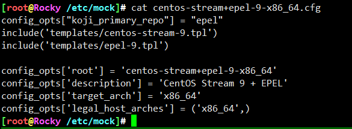

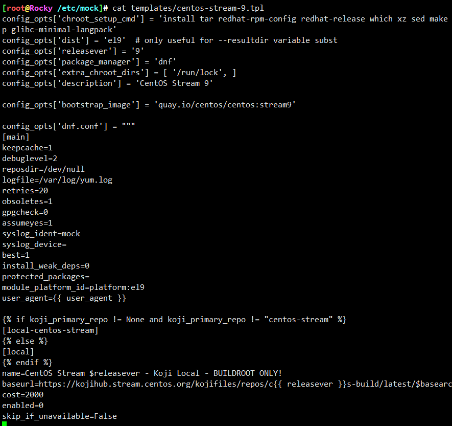

咦，这个bootstrap_image是什么，看着像docker镜像，访问一下瞧瞧

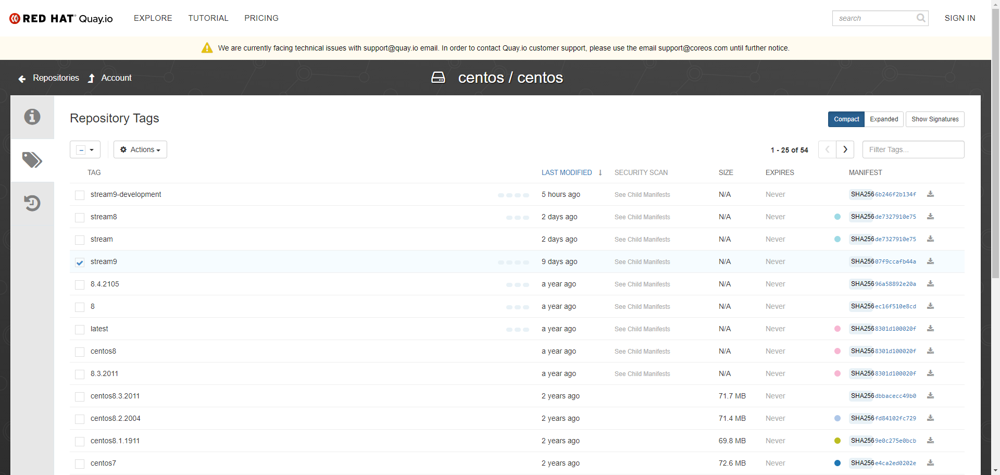

没错，就是docker镜像

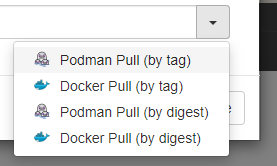

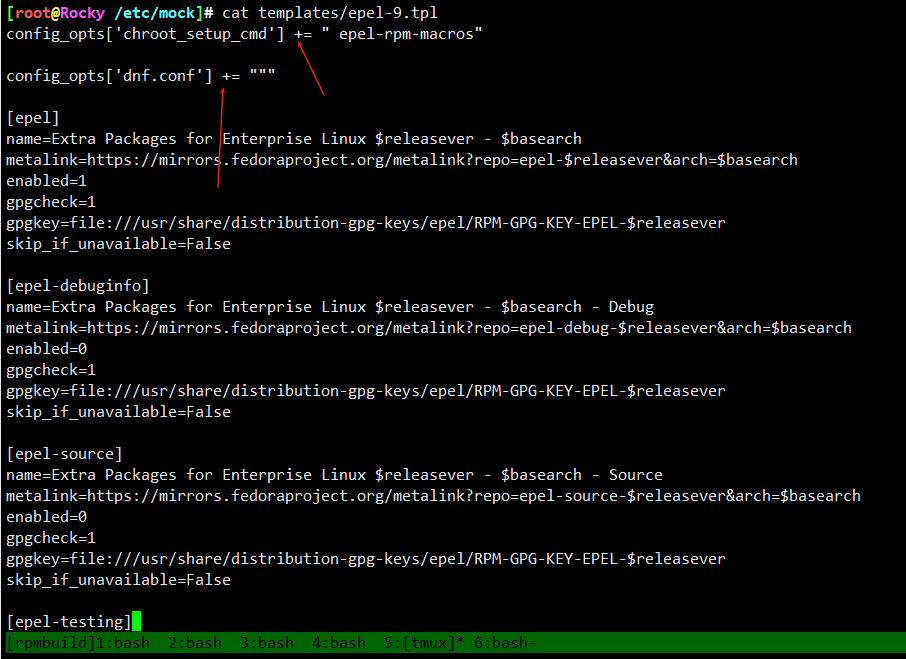


另外，epel作为扩展，ta的配置里面赋值都是 "+="

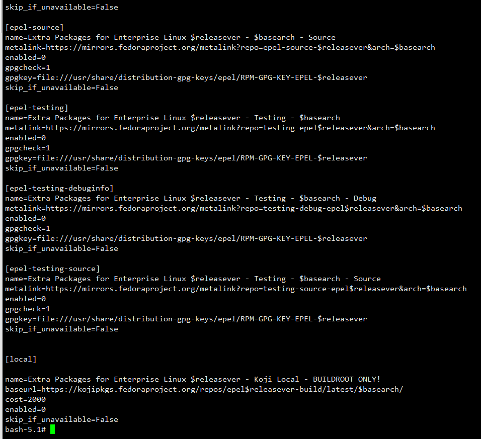

因此，在```/etc/yum.repos.d```最初为空的情况下，mock根据给定的config写入对应dnf.conf到/etc/dnf/dnf.conf中

再，利用本机的dnf命令，指定```--installroot```，此时就是为了产生新的"鸡蛋"，做了前序准备


```
/usr/bin/dnf \
  --installroot /var/lib/mock/centos-stream+epel-9-x86_64-bootstrap/root/ \
  --releasever 9 \
  --setopt=deltarpm=False --allowerasing \
  --disableplugin=local --disableplugin=spacewalk --disableplugin=versionlock \
  install dnf dnf-plugins-core
```

做个小实验，如果一开始没有/etc/dnf/dnf.conf

```
mkdir -p /tmp/rootfs
/usr/bin/dnf \
  --installroot /tmp/rootfs \
  --releasever 9 \
  --setopt=deltarpm=False --allowerasing \
  --disableplugin=local --disableplugin=spacewalk --disableplugin=versionlock \
  install dnf dnf-plugins-core
```

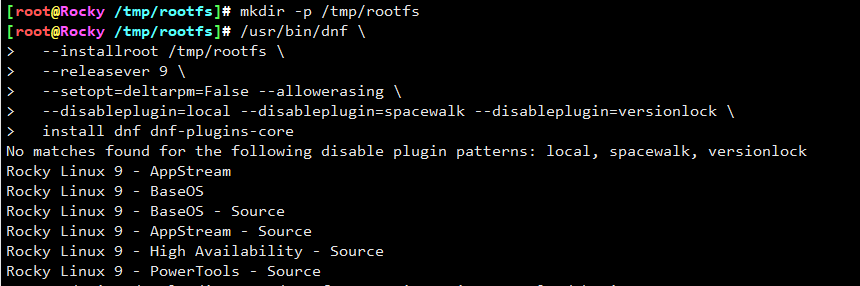


此时，毫无疑问，dnf是使用了宿主机的dnf.conf

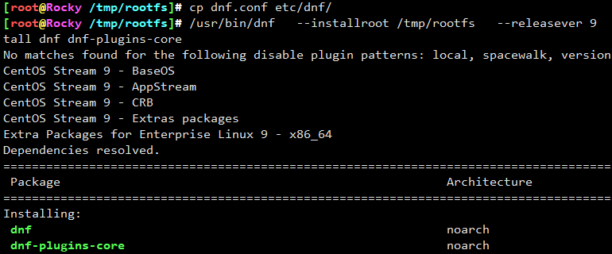

再换一下，使用centos 的dnf.conf配置。可以看出来，dnf是有点局部性原理的味道，如果你提供了局部的dnf.conf，就用局部，否则就用全局的

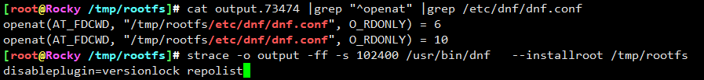

strace再看一下，若然如此，实锤。好了。继续

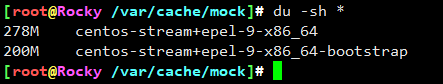

这里，bootstrap执行完，生成了两个cache目录，

先猜测一下，带bootstrap只有dnf环境，另外一个还安装了额外的基础包

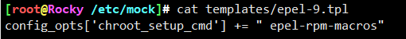

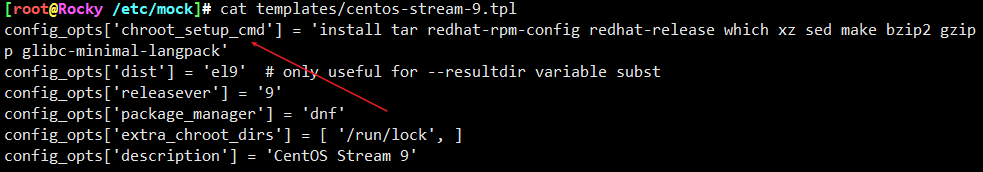

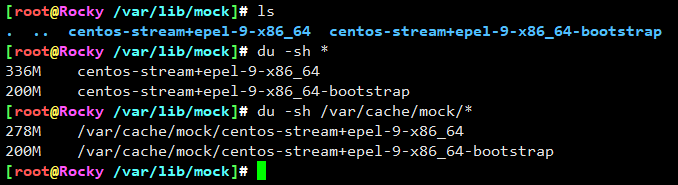

另外，有两个目录，一个是/var/lib/mock，另一个是/var/cache/mock目录

猜测哈，如果你的mock配置没有该，那么cache目录复用，实际编译环境还是会在lib目录，对应的不带bootstrap目录中，使用带bootstrap的目录来构建不带bootstrap的环境。

这么看来，bootstrap其实不一定非要存在，它在构建环境与目标环境中间增加了一个与目标环境类似的中间角色，至少先构建一个mini的中间环节，与最终目标更贴近，兼容性应该也更好。

bootstrap中的包只有这些，符合预期。可以看出来，没有这些包

```
install tar redhat-rpm-config redhat-release which xz sed make bzip2 gzip coreutils unzip shadow-utils diffutils cpio bash gawk rpm-build info patch util-linux findutils gre
p glibc-minimal-langpack
```

只有128个包，这应该是最精简的带dnf的 rootfs 环境了。不能在少了

```
bash-5.1# rpm -qa |wc -l
warning: Found bdb_ro Packages database while attempting sqlite backend: using bdb_ro backend.
bash-5.1# rpm -qa
warning: Found bdb_ro Packages database while attempting sqlite backend: using bdb_ro backend.
libgcc-11.3.1-2.1.el9.x86_64
tzdata-2022a-1.el9.noarch
publicsuffix-list-dafsa-20210518-3.el9.noarch
ncurses-base-6.2-8.20210508.el9.noarch
libreport-filesystem-2.15.2-6.el9.noarch
coreutils-common-8.32-32.el9.x86_64
centos-stream-release-9.0-12.el9.noarch
setup-2.13.7-7.el9.noarch
basesystem-11-13.el9.noarch
glibc-common-2.34-39.el9.x86_64
ncurses-libs-6.2-8.20210508.el9.x86_64
zlib-1.2.11-33.el9.x86_64
xz-libs-5.2.5-8.el9.x86_64
sqlite-libs-3.34.1-5.el9.x86_64
gmp-6.2.0-10.el9.x86_64
popt-1.18-8.el9.x86_64
libxcrypt-4.4.18-3.el9.x86_64
elfutils-libelf-0.187-5.el9.x86_64
readline-8.1-4.el9.x86_64
libacl-2.3.1-3.el9.x86_64
libffi-3.4.2-7.el9.x86_64
libstdc++-11.3.1-2.1.el9.x86_64
libidn2-2.3.0-7.el9.x86_64
libassuan-2.5.5-3.el9.x86_64
expat-2.4.7-1.el9.x86_64
json-c-0.14-11.el9.x86_64
libsepol-3.4-1.1.el9.x86_64
libsmartcols-2.37.4-3.el9.x86_64
lz4-libs-1.9.3-5.el9.x86_64
grep-3.6-5.el9.x86_64
libpsl-0.21.1-5.el9.x86_64
mpfr-4.1.0-7.el9.x86_64
nettle-3.7.3-2.el9.x86_64
elfutils-libs-0.187-5.el9.x86_64
p11-kit-trust-0.24.1-2.el9.x86_64
libbrotli-1.0.9-6.el9.x86_64
audit-libs-3.0.7-103.el9.x86_64
libnghttp2-1.43.0-5.el9.x86_64
libyaml-0.2.5-7.el9.x86_64
pcre2-10.40-2.el9.x86_64
sed-4.8-9.el9.x86_64
coreutils-8.32-32.el9.x86_64
krb5-libs-1.19.1-22.el9.x86_64
libssh-0.9.6-3.el9.x86_64
python3-3.9.13-2.el9.x86_64
python3-libcomps-0.1.18-1.el9.x86_64
python3-dateutil-2.8.1-6.el9.noarch
libmount-2.37.4-3.el9.x86_64
systemd-libs-250-7.el9.x86_64
python3-dbus-1.2.18-2.el9.x86_64
libevent-2.1.12-6.el9.x86_64
openldap-compat-2.6.2-2.el9.x86_64
gnupg2-2.3.3-1.el9.x86_64
librepo-1.14.2-2.el9.x86_64
curl-7.76.1-18.el9.x86_64
rpm-libs-4.16.1.3-15.el9.x86_64
libsolv-0.7.22-1.el9.x86_64
python3-libdnf-0.67.0-1.el9.x86_64
rpm-build-libs-4.16.1.3-15.el9.x86_64
shadow-utils-4.9-4.el9.x86_64
ima-evm-utils-1.4-4.el9.x86_64
python3-rpm-4.16.1.3-15.el9.x86_64
python3-dnf-plugins-core-4.1.0-1.el9.noarch
dnf-4.12.0-2.el9.noarch
gpg-pubkey-8483c65d-5ccc5b19
crypto-policies-20220427-1.gitb2323a1.el9.noarch
python3-setuptools-wheel-53.0.0-10.el9.noarch
pcre2-syntax-10.40-2.el9.noarch
libssh-config-0.9.6-3.el9.noarch
dnf-data-4.12.0-2.el9.noarch
centos-gpg-keys-9.0-12.el9.noarch
centos-stream-repos-9.0-12.el9.noarch
filesystem-3.16-2.el9.x86_64
glibc-minimal-langpack-2.34-39.el9.x86_64
glibc-2.34-39.el9.x86_64
bash-5.1.8-4.el9.x86_64
bzip2-libs-1.0.8-8.el9.x86_64
libzstd-1.5.1-2.el9.x86_64
libcap-2.48-8.el9.x86_64
libgpg-error-1.42-5.el9.x86_64
libxml2-2.9.13-2.el9.x86_64
lua-libs-5.4.2-4.el9.x86_64
file-libs-5.39-8.el9.x86_64
libattr-2.5.1-3.el9.x86_64
libcom_err-1.46.5-3.el9.x86_64
p11-kit-0.24.1-2.el9.x86_64
libunistring-0.9.10-15.el9.x86_64
libuuid-2.37.4-3.el9.x86_64
libgcrypt-1.10.0-4.el9.x86_64
gdbm-libs-1.19-4.el9.x86_64
keyutils-libs-1.6.1-4.el9.x86_64
libsigsegv-2.13-4.el9.x86_64
libtasn1-4.16.0-7.el9.x86_64
pcre-8.44-3.el9.3.x86_64
libcomps-0.1.18-1.el9.x86_64
libksba-1.5.1-4.el9.x86_64
gawk-5.1.0-6.el9.x86_64
elfutils-default-yama-scope-0.187-5.el9.noarch
alternatives-1.20-2.el9.x86_64
gnutls-3.7.3-10.el9.x86_64
libcap-ng-0.8.2-7.el9.x86_64
libgomp-11.3.1-2.1.el9.x86_64
libverto-0.3.2-3.el9.x86_64
npth-1.6-8.el9.x86_64
libselinux-3.4-3.el9.x86_64
openssl-libs-3.0.1-38.el9.x86_64
ca-certificates-2022.2.54-90.0.el9.noarch
cyrus-sasl-lib-2.1.27-20.el9.x86_64
python3-pip-wheel-21.2.3-6.el9.noarch
python3-libs-3.9.13-2.el9.x86_64
python3-six-1.15.0-9.el9.noarch
libblkid-2.37.4-3.el9.x86_64
glib2-2.68.4-5.el9.x86_64
dbus-libs-1.12.20-5.el9.x86_64
libarchive-3.5.3-3.el9.x86_64
openldap-2.6.2-2.el9.x86_64
libcurl-7.76.1-18.el9.x86_64
gpgme-1.15.1-6.el9.x86_64
python3-gpg-1.15.1-6.el9.x86_64
rpm-4.16.1.3-15.el9.x86_64
libmodulemd-2.13.0-2.el9.x86_64
libdnf-0.67.0-1.el9.x86_64
python3-hawkey-0.67.0-1.el9.x86_64
libsemanage-3.4-1.el9.x86_64
tpm2-tss-3.0.3-7.el9.x86_64
rpm-sign-libs-4.16.1.3-15.el9.x86_64
python3-dnf-4.12.0-2.el9.noarch
dnf-plugins-core-4.1.0-1.el9.noarch
```


另外，bootstrap这个特性默认开启，一般不用关

```
config_opts['use_bootstrap'] = False
```

config里默认不带关滴

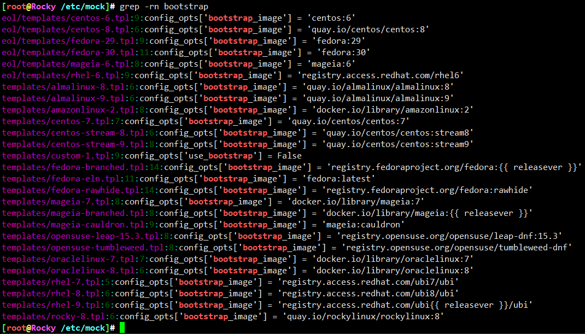

```
 --use-bootstrap-image
            Instead  of creating a bootstrap chroot from scrath, use podman image specified in config_opts['bootstrap_image'], extract it, and use it as a cache for the bootstrap chroot.  This is use‐
            ful when host rpm version is not compatible with the target system, or when using mock on non-RPM distributions.  This option turns --bootstrap-chroot on.
```

* 设计者想的很周到呀，由于一个bootstrap镜像，这样就算构建机器不带rpm环境也能玩。这时候会去官方提供的docker仓库拉取bootstrap使用，完美。
* 如果构建环境自带dnf，则不会使用bootstrap，毕竟这个需要网络访问


## bootstrap构建过程日志完整版

```
[root@Rocky /data/bcc-0.19.0.git/BUILD/bcc-0.19.0/tools]# ./bear-simple.py -p 58313
PCOMM            PID    RET PSTREE ARGS
/usr/bin/mock -r centos-stream+epel-9-x86_64 --init
/usr/sbin/userhelper -t -w mock -r centos-stream+epel-9-x86_64 --init
/usr/libexec/mock/mock -r centos-stream+epel-9-x86_64 --init
/sbin/ldconfig -p
/bin/sh -c uname -p 2> /dev/null
/usr/bin/uname -p
/usr/bin/file /usr/libexec/platform-python3.6
/usr/bin/lscpu
/bin/free
/bin/df -H /var/lib/mock/centos-stream+epel-9-x86_64-bootstrap/root /var/cache/mock
/bin/mount -n -o bind /var/cache/mock/centos-stream+epel-9-x86_64-bootstrap/yum_cache /var/lib/mock/centos-stream+epel-9-x86_64-bootstrap/root/var/cache/yum
/bin/mount -n -o bind /var/cache/mock/centos-stream+epel-9-x86_64-bootstrap/dnf_cache /var/lib/mock/centos-stream+epel-9-x86_64-bootstrap/root/var/cache/dnf
/usr/bin/cp -a /usr/share/distribution-gpg-keys /var/lib/mock/centos-stream+epel-9-x86_64-bootstrap/root/usr/share
/bin/mount -n -t tmpfs -o rprivate tmpfs /var/lib/mock/centos-stream+epel-9-x86_64-bootstrap/root/proc
/bin/mount -n -o rbind /proc /var/lib/mock/centos-stream+epel-9-x86_64-bootstrap/root/proc
/bin/mount -n -o remount,nodev,noexec,nosuid,readonly,rprivate,rbind --target /var/lib/mock/centos-stream+epel-9-x86_64-bootstrap/root/proc
/bin/mount -n -t tmpfs -o rprivate tmpfs /var/lib/mock/centos-stream+epel-9-x86_64-bootstrap/root/sys
/bin/mount -n -o rbind /sys /var/lib/mock/centos-stream+epel-9-x86_64-bootstrap/root/sys
/bin/mount -n -o remount,nodev,noexec,nosuid,readonly,rprivate,rbind --target /var/lib/mock/centos-stream+epel-9-x86_64-bootstrap/root/sys
/bin/mount -n -t tmpfs tmpfs /var/lib/mock/centos-stream+epel-9-x86_64-bootstrap/root/dev/shm
/bin/mount -n -t devpts -o gid=5,mode=0620,ptmxmode=0666,newinstance devpts /var/lib/mock/centos-stream+epel-9-x86_64-bootstrap/root/dev/pts
/usr/bin/dnf --installroot /var/lib/mock/centos-stream+epel-9-x86_64-bootstrap/root/ --releasever 9 --setopt=deltarpm=False --allowerasing --disableplugin=local --disableplugin=spacewalk --disableplugin=versionlock install dnf dnf-plugins-core
/usr/bin/rpmkeys --checksig --root /var/lib/mock/centos-stream+epel-9-x86_64-bootstrap/root/ --verbose --define=_pkgverify_level signature --define=_pkgverify_flags 0x0 -
/usr/bin/rpmkeys --checksig --root /var/lib/mock/centos-stream+epel-9-x86_64-bootstrap/root/ --verbose --define=_pkgverify_level signature --define=_pkgverify_flags 0x0 -
/usr/bin/rpmkeys --checksig --root /var/lib/mock/centos-stream+epel-9-x86_64-bootstrap/root/ --verbose --define=_pkgverify_level signature --define=_pkgverify_flags 0x0 -
/usr/bin/rpmkeys --checksig --root /var/lib/mock/centos-stream+epel-9-x86_64-bootstrap/root/ --verbose --define=_pkgverify_level signature --define=_pkgverify_flags 0x0 -
/usr/bin/rpmkeys --checksig --root /var/lib/mock/centos-stream+epel-9-x86_64-bootstrap/root/ --verbose --define=_pkgverify_level signature --define=_pkgverify_flags 0x0 -
/usr/bin/rpmkeys --checksig --root /var/lib/mock/centos-stream+epel-9-x86_64-bootstrap/root/ --verbose --define=_pkgverify_level signature --define=_pkgverify_flags 0x0 -
/usr/bin/rpmkeys --checksig --root /var/lib/mock/centos-stream+epel-9-x86_64-bootstrap/root/ --verbose --define=_pkgverify_level signature --define=_pkgverify_flags 0x0 -
/usr/bin/rpmkeys --checksig --root /var/lib/mock/centos-stream+epel-9-x86_64-bootstrap/root/ --verbose --define=_pkgverify_level signature --define=_pkgverify_flags 0x0 -
/usr/bin/rpmkeys --checksig --root /var/lib/mock/centos-stream+epel-9-x86_64-bootstrap/root/ --verbose --define=_pkgverify_level signature --define=_pkgverify_flags 0x0 -
/usr/bin/rpmkeys --checksig --root /var/lib/mock/centos-stream+epel-9-x86_64-bootstrap/root/ --verbose --define=_pkgverify_level signature --define=_pkgverify_flags 0x0 -
/usr/bin/rpmkeys --checksig --root /var/lib/mock/centos-stream+epel-9-x86_64-bootstrap/root/ --verbose --define=_pkgverify_level signature --define=_pkgverify_flags 0x0 -
/usr/bin/rpmkeys --checksig --root /var/lib/mock/centos-stream+epel-9-x86_64-bootstrap/root/ --verbose --define=_pkgverify_level signature --define=_pkgverify_flags 0x0 -
/usr/bin/rpmkeys --checksig --root /var/lib/mock/centos-stream+epel-9-x86_64-bootstrap/root/ --verbose --define=_pkgverify_level signature --define=_pkgverify_flags 0x0 -
/usr/bin/rpmkeys --checksig --root /var/lib/mock/centos-stream+epel-9-x86_64-bootstrap/root/ --verbose --define=_pkgverify_level signature --define=_pkgverify_flags 0x0 -
/usr/bin/rpmkeys --checksig --root /var/lib/mock/centos-stream+epel-9-x86_64-bootstrap/root/ --verbose --define=_pkgverify_level signature --define=_pkgverify_flags 0x0 -
/usr/bin/rpmkeys --checksig --root /var/lib/mock/centos-stream+epel-9-x86_64-bootstrap/root/ --verbose --define=_pkgverify_level signature --define=_pkgverify_flags 0x0 -
/usr/bin/rpmkeys --checksig --root /var/lib/mock/centos-stream+epel-9-x86_64-bootstrap/root/ --verbose --define=_pkgverify_level signature --define=_pkgverify_flags 0x0 -
/usr/bin/rpmkeys --checksig --root /var/lib/mock/centos-stream+epel-9-x86_64-bootstrap/root/ --verbose --define=_pkgverify_level signature --define=_pkgverify_flags 0x0 -
/usr/bin/rpmkeys --checksig --root /var/lib/mock/centos-stream+epel-9-x86_64-bootstrap/root/ --verbose --define=_pkgverify_level signature --define=_pkgverify_flags 0x0 -
/usr/bin/rpmkeys --checksig --root /var/lib/mock/centos-stream+epel-9-x86_64-bootstrap/root/ --verbose --define=_pkgverify_level signature --define=_pkgverify_flags 0x0 -
/usr/bin/rpmkeys --checksig --root /var/lib/mock/centos-stream+epel-9-x86_64-bootstrap/root/ --verbose --define=_pkgverify_level signature --define=_pkgverify_flags 0x0 -
/usr/bin/rpmkeys --checksig --root /var/lib/mock/centos-stream+epel-9-x86_64-bootstrap/root/ --verbose --define=_pkgverify_level signature --define=_pkgverify_flags 0x0 -
/usr/bin/rpmkeys --checksig --root /var/lib/mock/centos-stream+epel-9-x86_64-bootstrap/root/ --verbose --define=_pkgverify_level signature --define=_pkgverify_flags 0x0 -
/usr/bin/rpmkeys --checksig --root /var/lib/mock/centos-stream+epel-9-x86_64-bootstrap/root/ --verbose --define=_pkgverify_level signature --define=_pkgverify_flags 0x0 -
/usr/bin/rpmkeys --checksig --root /var/lib/mock/centos-stream+epel-9-x86_64-bootstrap/root/ --verbose --define=_pkgverify_level signature --define=_pkgverify_flags 0x0 -
/usr/bin/rpmkeys --checksig --root /var/lib/mock/centos-stream+epel-9-x86_64-bootstrap/root/ --verbose --define=_pkgverify_level signature --define=_pkgverify_flags 0x0 -
/usr/bin/rpmkeys --checksig --root /var/lib/mock/centos-stream+epel-9-x86_64-bootstrap/root/ --verbose --define=_pkgverify_level signature --define=_pkgverify_flags 0x0 -
/usr/bin/rpmkeys --checksig --root /var/lib/mock/centos-stream+epel-9-x86_64-bootstrap/root/ --verbose --define=_pkgverify_level signature --define=_pkgverify_flags 0x0 -
/usr/bin/rpmkeys --checksig --root /var/lib/mock/centos-stream+epel-9-x86_64-bootstrap/root/ --verbose --define=_pkgverify_level signature --define=_pkgverify_flags 0x0 -
/usr/bin/rpmkeys --checksig --root /var/lib/mock/centos-stream+epel-9-x86_64-bootstrap/root/ --verbose --define=_pkgverify_level signature --define=_pkgverify_flags 0x0 -
/usr/bin/rpmkeys --checksig --root /var/lib/mock/centos-stream+epel-9-x86_64-bootstrap/root/ --verbose --define=_pkgverify_level signature --define=_pkgverify_flags 0x0 -
/usr/bin/rpmkeys --checksig --root /var/lib/mock/centos-stream+epel-9-x86_64-bootstrap/root/ --verbose --define=_pkgverify_level signature --define=_pkgverify_flags 0x0 -
/usr/bin/rpmkeys --checksig --root /var/lib/mock/centos-stream+epel-9-x86_64-bootstrap/root/ --verbose --define=_pkgverify_level signature --define=_pkgverify_flags 0x0 -
/usr/bin/rpmkeys --checksig --root /var/lib/mock/centos-stream+epel-9-x86_64-bootstrap/root/ --verbose --define=_pkgverify_level signature --define=_pkgverify_flags 0x0 -
/usr/bin/rpmkeys --checksig --root /var/lib/mock/centos-stream+epel-9-x86_64-bootstrap/root/ --verbose --define=_pkgverify_level signature --define=_pkgverify_flags 0x0 -
/usr/bin/rpmkeys --checksig --root /var/lib/mock/centos-stream+epel-9-x86_64-bootstrap/root/ --verbose --define=_pkgverify_level signature --define=_pkgverify_flags 0x0 -
/usr/bin/rpmkeys --checksig --root /var/lib/mock/centos-stream+epel-9-x86_64-bootstrap/root/ --verbose --define=_pkgverify_level signature --define=_pkgverify_flags 0x0 -
/usr/bin/rpmkeys --checksig --root /var/lib/mock/centos-stream+epel-9-x86_64-bootstrap/root/ --verbose --define=_pkgverify_level signature --define=_pkgverify_flags 0x0 -
/usr/bin/rpmkeys --checksig --root /var/lib/mock/centos-stream+epel-9-x86_64-bootstrap/root/ --verbose --define=_pkgverify_level signature --define=_pkgverify_flags 0x0 -
/usr/bin/rpmkeys --checksig --root /var/lib/mock/centos-stream+epel-9-x86_64-bootstrap/root/ --verbose --define=_pkgverify_level signature --define=_pkgverify_flags 0x0 -
/usr/bin/rpmkeys --checksig --root /var/lib/mock/centos-stream+epel-9-x86_64-bootstrap/root/ --verbose --define=_pkgverify_level signature --define=_pkgverify_flags 0x0 -
/usr/bin/rpmkeys --checksig --root /var/lib/mock/centos-stream+epel-9-x86_64-bootstrap/root/ --verbose --define=_pkgverify_level signature --define=_pkgverify_flags 0x0 -
/usr/bin/rpmkeys --checksig --root /var/lib/mock/centos-stream+epel-9-x86_64-bootstrap/root/ --verbose --define=_pkgverify_level signature --define=_pkgverify_flags 0x0 -
/usr/bin/rpmkeys --checksig --root /var/lib/mock/centos-stream+epel-9-x86_64-bootstrap/root/ --verbose --define=_pkgverify_level signature --define=_pkgverify_flags 0x0 -
/usr/bin/rpmkeys --checksig --root /var/lib/mock/centos-stream+epel-9-x86_64-bootstrap/root/ --verbose --define=_pkgverify_level signature --define=_pkgverify_flags 0x0 -
/usr/bin/rpmkeys --checksig --root /var/lib/mock/centos-stream+epel-9-x86_64-bootstrap/root/ --verbose --define=_pkgverify_level signature --define=_pkgverify_flags 0x0 -
/usr/bin/rpmkeys --checksig --root /var/lib/mock/centos-stream+epel-9-x86_64-bootstrap/root/ --verbose --define=_pkgverify_level signature --define=_pkgverify_flags 0x0 -
/usr/bin/rpmkeys --checksig --root /var/lib/mock/centos-stream+epel-9-x86_64-bootstrap/root/ --verbose --define=_pkgverify_level signature --define=_pkgverify_flags 0x0 -
/usr/bin/rpmkeys --checksig --root /var/lib/mock/centos-stream+epel-9-x86_64-bootstrap/root/ --verbose --define=_pkgverify_level signature --define=_pkgverify_flags 0x0 -
/usr/bin/rpmkeys --checksig --root /var/lib/mock/centos-stream+epel-9-x86_64-bootstrap/root/ --verbose --define=_pkgverify_level signature --define=_pkgverify_flags 0x0 -
/usr/bin/rpmkeys --checksig --root /var/lib/mock/centos-stream+epel-9-x86_64-bootstrap/root/ --verbose --define=_pkgverify_level signature --define=_pkgverify_flags 0x0 -
/usr/bin/rpmkeys --checksig --root /var/lib/mock/centos-stream+epel-9-x86_64-bootstrap/root/ --verbose --define=_pkgverify_level signature --define=_pkgverify_flags 0x0 -
/usr/bin/rpmkeys --checksig --root /var/lib/mock/centos-stream+epel-9-x86_64-bootstrap/root/ --verbose --define=_pkgverify_level signature --define=_pkgverify_flags 0x0 -
/usr/bin/rpmkeys --checksig --root /var/lib/mock/centos-stream+epel-9-x86_64-bootstrap/root/ --verbose --define=_pkgverify_level signature --define=_pkgverify_flags 0x0 -
/usr/bin/rpmkeys --checksig --root /var/lib/mock/centos-stream+epel-9-x86_64-bootstrap/root/ --verbose --define=_pkgverify_level signature --define=_pkgverify_flags 0x0 -
/usr/bin/rpmkeys --checksig --root /var/lib/mock/centos-stream+epel-9-x86_64-bootstrap/root/ --verbose --define=_pkgverify_level signature --define=_pkgverify_flags 0x0 -
/usr/bin/rpmkeys --checksig --root /var/lib/mock/centos-stream+epel-9-x86_64-bootstrap/root/ --verbose --define=_pkgverify_level signature --define=_pkgverify_flags 0x0 -
/usr/bin/rpmkeys --checksig --root /var/lib/mock/centos-stream+epel-9-x86_64-bootstrap/root/ --verbose --define=_pkgverify_level signature --define=_pkgverify_flags 0x0 -
/usr/bin/rpmkeys --checksig --root /var/lib/mock/centos-stream+epel-9-x86_64-bootstrap/root/ --verbose --define=_pkgverify_level signature --define=_pkgverify_flags 0x0 -
/usr/bin/rpmkeys --checksig --root /var/lib/mock/centos-stream+epel-9-x86_64-bootstrap/root/ --verbose --define=_pkgverify_level signature --define=_pkgverify_flags 0x0 -
/usr/bin/rpmkeys --checksig --root /var/lib/mock/centos-stream+epel-9-x86_64-bootstrap/root/ --verbose --define=_pkgverify_level signature --define=_pkgverify_flags 0x0 -
/usr/bin/rpmkeys --checksig --root /var/lib/mock/centos-stream+epel-9-x86_64-bootstrap/root/ --verbose --define=_pkgverify_level signature --define=_pkgverify_flags 0x0 -
/usr/bin/rpmkeys --checksig --root /var/lib/mock/centos-stream+epel-9-x86_64-bootstrap/root/ --verbose --define=_pkgverify_level signature --define=_pkgverify_flags 0x0 -
/usr/bin/rpmkeys --checksig --root /var/lib/mock/centos-stream+epel-9-x86_64-bootstrap/root/ --verbose --define=_pkgverify_level signature --define=_pkgverify_flags 0x0 -
/usr/bin/rpmkeys --checksig --root /var/lib/mock/centos-stream+epel-9-x86_64-bootstrap/root/ --verbose --define=_pkgverify_level signature --define=_pkgverify_flags 0x0 -
/usr/bin/rpmkeys --checksig --root /var/lib/mock/centos-stream+epel-9-x86_64-bootstrap/root/ --verbose --define=_pkgverify_level signature --define=_pkgverify_flags 0x0 -
/usr/bin/rpmkeys --checksig --root /var/lib/mock/centos-stream+epel-9-x86_64-bootstrap/root/ --verbose --define=_pkgverify_level signature --define=_pkgverify_flags 0x0 -
/usr/bin/rpmkeys --checksig --root /var/lib/mock/centos-stream+epel-9-x86_64-bootstrap/root/ --verbose --define=_pkgverify_level signature --define=_pkgverify_flags 0x0 -
/usr/bin/rpmkeys --checksig --root /var/lib/mock/centos-stream+epel-9-x86_64-bootstrap/root/ --verbose --define=_pkgverify_level signature --define=_pkgverify_flags 0x0 -
/usr/bin/rpmkeys --checksig --root /var/lib/mock/centos-stream+epel-9-x86_64-bootstrap/root/ --verbose --define=_pkgverify_level signature --define=_pkgverify_flags 0x0 -
/usr/bin/rpmkeys --checksig --root /var/lib/mock/centos-stream+epel-9-x86_64-bootstrap/root/ --verbose --define=_pkgverify_level signature --define=_pkgverify_flags 0x0 -
/usr/bin/rpmkeys --checksig --root /var/lib/mock/centos-stream+epel-9-x86_64-bootstrap/root/ --verbose --define=_pkgverify_level signature --define=_pkgverify_flags 0x0 -
/usr/bin/rpmkeys --checksig --root /var/lib/mock/centos-stream+epel-9-x86_64-bootstrap/root/ --verbose --define=_pkgverify_level signature --define=_pkgverify_flags 0x0 -
/usr/bin/rpmkeys --checksig --root /var/lib/mock/centos-stream+epel-9-x86_64-bootstrap/root/ --verbose --define=_pkgverify_level signature --define=_pkgverify_flags 0x0 -
/usr/bin/rpmkeys --checksig --root /var/lib/mock/centos-stream+epel-9-x86_64-bootstrap/root/ --verbose --define=_pkgverify_level signature --define=_pkgverify_flags 0x0 -
/usr/bin/rpmkeys --checksig --root /var/lib/mock/centos-stream+epel-9-x86_64-bootstrap/root/ --verbose --define=_pkgverify_level signature --define=_pkgverify_flags 0x0 -
/usr/bin/rpmkeys --checksig --root /var/lib/mock/centos-stream+epel-9-x86_64-bootstrap/root/ --verbose --define=_pkgverify_level signature --define=_pkgverify_flags 0x0 -
/usr/bin/rpmkeys --checksig --root /var/lib/mock/centos-stream+epel-9-x86_64-bootstrap/root/ --verbose --define=_pkgverify_level signature --define=_pkgverify_flags 0x0 -
/usr/bin/rpmkeys --checksig --root /var/lib/mock/centos-stream+epel-9-x86_64-bootstrap/root/ --verbose --define=_pkgverify_level signature --define=_pkgverify_flags 0x0 -
/usr/bin/rpmkeys --checksig --root /var/lib/mock/centos-stream+epel-9-x86_64-bootstrap/root/ --verbose --define=_pkgverify_level signature --define=_pkgverify_flags 0x0 -
/usr/bin/rpmkeys --checksig --root /var/lib/mock/centos-stream+epel-9-x86_64-bootstrap/root/ --verbose --define=_pkgverify_level signature --define=_pkgverify_flags 0x0 -
/usr/bin/rpmkeys --checksig --root /var/lib/mock/centos-stream+epel-9-x86_64-bootstrap/root/ --verbose --define=_pkgverify_level signature --define=_pkgverify_flags 0x0 -
/usr/bin/rpmkeys --checksig --root /var/lib/mock/centos-stream+epel-9-x86_64-bootstrap/root/ --verbose --define=_pkgverify_level signature --define=_pkgverify_flags 0x0 -
/usr/bin/rpmkeys --checksig --root /var/lib/mock/centos-stream+epel-9-x86_64-bootstrap/root/ --verbose --define=_pkgverify_level signature --define=_pkgverify_flags 0x0 -
/usr/bin/rpmkeys --checksig --root /var/lib/mock/centos-stream+epel-9-x86_64-bootstrap/root/ --verbose --define=_pkgverify_level signature --define=_pkgverify_flags 0x0 -
/usr/bin/rpmkeys --checksig --root /var/lib/mock/centos-stream+epel-9-x86_64-bootstrap/root/ --verbose --define=_pkgverify_level signature --define=_pkgverify_flags 0x0 -
/usr/bin/rpmkeys --checksig --root /var/lib/mock/centos-stream+epel-9-x86_64-bootstrap/root/ --verbose --define=_pkgverify_level signature --define=_pkgverify_flags 0x0 -
/usr/bin/rpmkeys --checksig --root /var/lib/mock/centos-stream+epel-9-x86_64-bootstrap/root/ --verbose --define=_pkgverify_level signature --define=_pkgverify_flags 0x0 -
/usr/bin/rpmkeys --checksig --root /var/lib/mock/centos-stream+epel-9-x86_64-bootstrap/root/ --verbose --define=_pkgverify_level signature --define=_pkgverify_flags 0x0 -
/usr/bin/rpmkeys --checksig --root /var/lib/mock/centos-stream+epel-9-x86_64-bootstrap/root/ --verbose --define=_pkgverify_level signature --define=_pkgverify_flags 0x0 -
/usr/bin/rpmkeys --checksig --root /var/lib/mock/centos-stream+epel-9-x86_64-bootstrap/root/ --verbose --define=_pkgverify_level signature --define=_pkgverify_flags 0x0 -
/usr/bin/rpmkeys --checksig --root /var/lib/mock/centos-stream+epel-9-x86_64-bootstrap/root/ --verbose --define=_pkgverify_level signature --define=_pkgverify_flags 0x0 -
/usr/bin/rpmkeys --checksig --root /var/lib/mock/centos-stream+epel-9-x86_64-bootstrap/root/ --verbose --define=_pkgverify_level signature --define=_pkgverify_flags 0x0 -
/usr/bin/rpmkeys --checksig --root /var/lib/mock/centos-stream+epel-9-x86_64-bootstrap/root/ --verbose --define=_pkgverify_level signature --define=_pkgverify_flags 0x0 -
/usr/bin/rpmkeys --checksig --root /var/lib/mock/centos-stream+epel-9-x86_64-bootstrap/root/ --verbose --define=_pkgverify_level signature --define=_pkgverify_flags 0x0 -
/usr/bin/rpmkeys --checksig --root /var/lib/mock/centos-stream+epel-9-x86_64-bootstrap/root/ --verbose --define=_pkgverify_level signature --define=_pkgverify_flags 0x0 -
/usr/bin/rpmkeys --checksig --root /var/lib/mock/centos-stream+epel-9-x86_64-bootstrap/root/ --verbose --define=_pkgverify_level signature --define=_pkgverify_flags 0x0 -
/usr/bin/rpmkeys --checksig --root /var/lib/mock/centos-stream+epel-9-x86_64-bootstrap/root/ --verbose --define=_pkgverify_level signature --define=_pkgverify_flags 0x0 -
/usr/bin/rpmkeys --checksig --root /var/lib/mock/centos-stream+epel-9-x86_64-bootstrap/root/ --verbose --define=_pkgverify_level signature --define=_pkgverify_flags 0x0 -
/usr/bin/rpmkeys --checksig --root /var/lib/mock/centos-stream+epel-9-x86_64-bootstrap/root/ --verbose --define=_pkgverify_level signature --define=_pkgverify_flags 0x0 -
/usr/bin/rpmkeys --checksig --root /var/lib/mock/centos-stream+epel-9-x86_64-bootstrap/root/ --verbose --define=_pkgverify_level signature --define=_pkgverify_flags 0x0 -
/usr/bin/rpmkeys --checksig --root /var/lib/mock/centos-stream+epel-9-x86_64-bootstrap/root/ --verbose --define=_pkgverify_level signature --define=_pkgverify_flags 0x0 -
/usr/bin/rpmkeys --checksig --root /var/lib/mock/centos-stream+epel-9-x86_64-bootstrap/root/ --verbose --define=_pkgverify_level signature --define=_pkgverify_flags 0x0 -
/usr/bin/rpmkeys --checksig --root /var/lib/mock/centos-stream+epel-9-x86_64-bootstrap/root/ --verbose --define=_pkgverify_level signature --define=_pkgverify_flags 0x0 -
/usr/bin/rpmkeys --checksig --root /var/lib/mock/centos-stream+epel-9-x86_64-bootstrap/root/ --verbose --define=_pkgverify_level signature --define=_pkgverify_flags 0x0 -
/usr/bin/rpmkeys --checksig --root /var/lib/mock/centos-stream+epel-9-x86_64-bootstrap/root/ --verbose --define=_pkgverify_level signature --define=_pkgverify_flags 0x0 -
/usr/bin/rpmkeys --checksig --root /var/lib/mock/centos-stream+epel-9-x86_64-bootstrap/root/ --verbose --define=_pkgverify_level signature --define=_pkgverify_flags 0x0 -
/usr/bin/rpmkeys --checksig --root /var/lib/mock/centos-stream+epel-9-x86_64-bootstrap/root/ --verbose --define=_pkgverify_level signature --define=_pkgverify_flags 0x0 -
/usr/bin/rpmkeys --checksig --root /var/lib/mock/centos-stream+epel-9-x86_64-bootstrap/root/ --verbose --define=_pkgverify_level signature --define=_pkgverify_flags 0x0 -
/usr/bin/rpmkeys --checksig --root /var/lib/mock/centos-stream+epel-9-x86_64-bootstrap/root/ --verbose --define=_pkgverify_level signature --define=_pkgverify_flags 0x0 -
/usr/bin/rpmkeys --checksig --root /var/lib/mock/centos-stream+epel-9-x86_64-bootstrap/root/ --verbose --define=_pkgverify_level signature --define=_pkgverify_flags 0x0 -
/usr/bin/rpmkeys --checksig --root /var/lib/mock/centos-stream+epel-9-x86_64-bootstrap/root/ --verbose --define=_pkgverify_level signature --define=_pkgverify_flags 0x0 -
/usr/bin/rpmkeys --checksig --root /var/lib/mock/centos-stream+epel-9-x86_64-bootstrap/root/ --verbose --define=_pkgverify_level signature --define=_pkgverify_flags 0x0 -
/usr/bin/rpmkeys --checksig --root /var/lib/mock/centos-stream+epel-9-x86_64-bootstrap/root/ --verbose --define=_pkgverify_level signature --define=_pkgverify_flags 0x0 -
/usr/bin/rpmkeys --checksig --root /var/lib/mock/centos-stream+epel-9-x86_64-bootstrap/root/ --verbose --define=_pkgverify_level signature --define=_pkgverify_flags 0x0 -
/usr/bin/rpmkeys --checksig --root /var/lib/mock/centos-stream+epel-9-x86_64-bootstrap/root/ --verbose --define=_pkgverify_level signature --define=_pkgverify_flags 0x0 -
/usr/bin/rpmkeys --checksig --root /var/lib/mock/centos-stream+epel-9-x86_64-bootstrap/root/ --verbose --define=_pkgverify_level signature --define=_pkgverify_flags 0x0 -
/usr/bin/rpmkeys --checksig --root /var/lib/mock/centos-stream+epel-9-x86_64-bootstrap/root/ --verbose --define=_pkgverify_level signature --define=_pkgverify_flags 0x0 -
/usr/bin/rpmkeys --checksig --root /var/lib/mock/centos-stream+epel-9-x86_64-bootstrap/root/ --verbose --define=_pkgverify_level signature --define=_pkgverify_flags 0x0 -
/usr/bin/rpmkeys --checksig --root /var/lib/mock/centos-stream+epel-9-x86_64-bootstrap/root/ --verbose --define=_pkgverify_level signature --define=_pkgverify_flags 0x0 -
/usr/bin/rpmkeys --checksig --root /var/lib/mock/centos-stream+epel-9-x86_64-bootstrap/root/ --verbose --define=_pkgverify_level signature --define=_pkgverify_flags 0x0 -
/usr/bin/rpmkeys --checksig --root /var/lib/mock/centos-stream+epel-9-x86_64-bootstrap/root/ --verbose --define=_pkgverify_level signature --define=_pkgverify_flags 0x0 -
/usr/bin/rpmkeys --checksig --root /var/lib/mock/centos-stream+epel-9-x86_64-bootstrap/root/ --verbose --define=_pkgverify_level signature --define=_pkgverify_flags 0x0 -
/usr/bin/rpmkeys --checksig --root /var/lib/mock/centos-stream+epel-9-x86_64-bootstrap/root/ --verbose --define=_pkgverify_level signature --define=_pkgverify_flags 0x0 -
/usr/bin/rpmkeys --checksig --root /var/lib/mock/centos-stream+epel-9-x86_64-bootstrap/root/ --verbose --define=_pkgverify_level signature --define=_pkgverify_flags 0x0 -
/usr/bin/rpmkeys --checksig --root /var/lib/mock/centos-stream+epel-9-x86_64-bootstrap/root/ --verbose --define=_pkgverify_level signature --define=_pkgverify_flags 0x0 -
/usr/bin/rpmkeys --checksig --root /var/lib/mock/centos-stream+epel-9-x86_64-bootstrap/root/ --verbose --define=_pkgverify_level signature --define=_pkgverify_flags 0x0 -
/usr/bin/rpmkeys --checksig --root /var/lib/mock/centos-stream+epel-9-x86_64-bootstrap/root/ --verbose --define=_pkgverify_level signature --define=_pkgverify_flags 0x0 -
/usr/sbin/ldconfig
/usr/sbin/iconvconfig -o /usr/lib64/gconv/gconv-modules.cache --nostdlib /usr/lib64/gconv
/bin/sh /var/tmp/rpm-tmp.ruwCS3 1
/bin/sh /var/tmp/rpm-tmp.8Ne97B 1
/usr/sbin/update-alternatives --install /usr/lib64/libnssckbi.so libnssckbi.so.x86_64 /usr/lib64/pkcs11/p11-kit-trust.so 30
/bin/sh /var/tmp/rpm-tmp.94ZBxT 1
/bin/sh /var/tmp/rpm-tmp.pLPVz1 1
/usr/bin/ca-legacy install
/bin/grep -i ^legacy *= *disable *$ /etc/pki/ca-trust/ca-legacy.conf
/bin/ln -sf /usr/share/pki/ca-trust-legacy/ca-bundle.legacy.default.crt /etc/pki/ca-trust/source/ca-bundle.legacy.crt
/usr/bin/update-ca-trust
/usr/bin/p11-kit extract --format=openssl-bundle --filter=certificates --overwrite --comment /etc/pki/ca-trust/extracted/openssl/ca-bundle.trust.crt
/usr/bin/trust extract --format=openssl-bundle --filter=certificates --overwrite --comment /etc/pki/ca-trust/extracted/openssl/ca-bundle.trust.crt
/usr/bin/p11-kit extract --format=pem-bundle --filter=ca-anchors --overwrite --comment --purpose server-auth /etc/pki/ca-trust/extracted/pem/tls-ca-bundle.pem
/usr/bin/trust extract --format=pem-bundle --filter=ca-anchors --overwrite --comment --purpose server-auth /etc/pki/ca-trust/extracted/pem/tls-ca-bundle.pem
/usr/bin/p11-kit extract --format=pem-bundle --filter=ca-anchors --overwrite --comment --purpose email /etc/pki/ca-trust/extracted/pem/email-ca-bundle.pem
/usr/bin/trust extract --format=pem-bundle --filter=ca-anchors --overwrite --comment --purpose email /etc/pki/ca-trust/extracted/pem/email-ca-bundle.pem
/usr/bin/p11-kit extract --format=pem-bundle --filter=ca-anchors --overwrite --comment --purpose code-signing /etc/pki/ca-trust/extracted/pem/objsign-ca-bundle.pem
/usr/bin/trust extract --format=pem-bundle --filter=ca-anchors --overwrite --comment --purpose code-signing /etc/pki/ca-trust/extracted/pem/objsign-ca-bundle.pem
/usr/bin/p11-kit extract --format=java-cacerts --filter=ca-anchors --overwrite --purpose server-auth /etc/pki/ca-trust/extracted/java/cacerts
/usr/bin/trust extract --format=java-cacerts --filter=ca-anchors --overwrite --purpose server-auth /etc/pki/ca-trust/extracted/java/cacerts
/usr/bin/p11-kit extract --format=edk2-cacerts --filter=ca-anchors --overwrite --purpose=server-auth /etc/pki/ca-trust/extracted/edk2/cacerts.bin
/usr/bin/trust extract --format=edk2-cacerts --filter=ca-anchors --overwrite --purpose=server-auth /etc/pki/ca-trust/extracted/edk2/cacerts.bin
/bin/sh /var/tmp/rpm-tmp.dt0rUb 1
/bin/mkdir -p /run/blkid
/bin/sh /var/tmp/rpm-tmp.H7tB7M 1
/bin/readlink /etc/nsswitch.conf
/bin/grep -E -q ^(passwd|group):.* systemd /etc/nsswitch.conf
/bin/sed -i.bak -r -e \n                s/^(passwd|group):(.*)/\1:\2 systemd/\n                 /etc/nsswitch.conf
/bin/getent passwd nfsnobody
/bin/getent passwd nobody
/bin/grep -v nobody:[x*]:65534:65534:.*:/:/sbin/nologin
/bin/sh /var/tmp/rpm-tmp.IAjmd1 1
/bin/getent group tss
/sbin/groupadd -f -g 59 -r tss
/bin/getent passwd tss
/bin/getent passwd 59
/sbin/useradd -r -u 59 -g tss -d /dev/null -s /sbin/nologin -c Account used for TPM access tss
/bin/sh /var/tmp/rpm-tmp.AqDQOH 1
/bin/sh /var/tmp/rpm-tmp.jrKwqn 1
/bin/sh /var/tmp/rpm-tmp.G2qHx8 1
/usr/bin/ca-legacy install
/bin/grep -i ^legacy *= *disable *$ /etc/pki/ca-trust/ca-legacy.conf
/bin/ln -sf /usr/share/pki/ca-trust-legacy/ca-bundle.legacy.default.crt /etc/pki/ca-trust/source/ca-bundle.legacy.crt
/usr/bin/update-ca-trust
/usr/bin/p11-kit extract --format=openssl-bundle --filter=certificates --overwrite --comment /etc/pki/ca-trust/extracted/openssl/ca-bundle.trust.crt
/usr/bin/trust extract --format=openssl-bundle --filter=certificates --overwrite --comment /etc/pki/ca-trust/extracted/openssl/ca-bundle.trust.crt
/usr/bin/p11-kit extract --format=pem-bundle --filter=ca-anchors --overwrite --comment --purpose server-auth /etc/pki/ca-trust/extracted/pem/tls-ca-bundle.pem
/usr/bin/trust extract --format=pem-bundle --filter=ca-anchors --overwrite --comment --purpose server-auth /etc/pki/ca-trust/extracted/pem/tls-ca-bundle.pem
/usr/bin/p11-kit extract --format=pem-bundle --filter=ca-anchors --overwrite --comment --purpose email /etc/pki/ca-trust/extracted/pem/email-ca-bundle.pem
/usr/bin/trust extract --format=pem-bundle --filter=ca-anchors --overwrite --comment --purpose email /etc/pki/ca-trust/extracted/pem/email-ca-bundle.pem
/usr/bin/p11-kit extract --format=pem-bundle --filter=ca-anchors --overwrite --comment --purpose code-signing /etc/pki/ca-trust/extracted/pem/objsign-ca-bundle.pem
/usr/bin/trust extract --format=pem-bundle --filter=ca-anchors --overwrite --comment --purpose code-signing /etc/pki/ca-trust/extracted/pem/objsign-ca-bundle.pem
/usr/bin/p11-kit extract --format=java-cacerts --filter=ca-anchors --overwrite --purpose server-auth /etc/pki/ca-trust/extracted/java/cacerts
/usr/bin/trust extract --format=java-cacerts --filter=ca-anchors --overwrite --purpose server-auth /etc/pki/ca-trust/extracted/java/cacerts
/usr/bin/p11-kit extract --format=edk2-cacerts --filter=ca-anchors --overwrite --purpose=server-auth /etc/pki/ca-trust/extracted/edk2/cacerts.bin
/usr/bin/trust extract --format=edk2-cacerts --filter=ca-anchors --overwrite --purpose=server-auth /etc/pki/ca-trust/extracted/edk2/cacerts.bin
/bin/sh /var/tmp/rpm-tmp.5GnZRj 1
/bin/touch /var/lib/rpm/.rebuilddb
/bin/sh /var/tmp/rpm-tmp.G63tPz 0 0
/sbin/ldconfig
/bin/sh /var/tmp/rpm-tmp.QuDsbZ 0 0
/bin/gio-querymodules-64 /usr/lib64/gio/modules
/bin/umount -n -l /var/lib/mock/centos-stream+epel-9-x86_64-bootstrap/root/dev/pts
/bin/umount -n -l /var/lib/mock/centos-stream+epel-9-x86_64-bootstrap/root/dev/shm
/bin/umount -n -l /var/lib/mock/centos-stream+epel-9-x86_64-bootstrap/root/sys
/bin/umount -n -l /var/lib/mock/centos-stream+epel-9-x86_64-bootstrap/root/sys
/bin/umount -n -l /var/lib/mock/centos-stream+epel-9-x86_64-bootstrap/root/proc
/bin/umount -n -l /var/lib/mock/centos-stream+epel-9-x86_64-bootstrap/root/proc
/usr/bin/sync
/usr/bin/gtar --one-file-system --exclude-caches --exclude-caches-under --use-compress-program pigz -cf /var/cache/mock/centos-stream+epel-9-x86_64-bootstrap/root_cache/cache.tar.gz -C /var/lib/mock/centos-stream+epel-9-x86_64-bootstrap/root --exclude=./proc --exclude=./sys --exclude=./dev --exclude=./tmp/ccache --exclude=./var/cache/yum --exclude=./var/cache/dnf --exclude=./var/log --exclude=.//proc --exclude=.//proc --exclude=.//sys --exclude=.//sys --exclude=.//dev/shm --exclude=.//dev/pts --exclude=.//var/cache/yum --exclude=.//var/cache/dnf .
/bin/sh -c pigz
/usr/bin/pigz
/usr/bin/lscpu
/bin/free
/bin/df -H /var/lib/mock/centos-stream+epel-9-x86_64/root /var/cache/mock
/bin/mount -n -o bind /var/cache/mock/centos-stream+epel-9-x86_64/yum_cache /var/lib/mock/centos-stream+epel-9-x86_64/root/var/cache/yum
/bin/mount -n -o bind /var/cache/mock/centos-stream+epel-9-x86_64/dnf_cache /var/lib/mock/centos-stream+epel-9-x86_64/root/var/cache/dnf
/bin/mount -n -t tmpfs -o private tmpfs /var/lib/mock/centos-stream+epel-9-x86_64-bootstrap/root/var/lib/mock/centos-stream+epel-9-x86_64/root
/bin/mount -n -o rbind /var/lib/mock/centos-stream+epel-9-x86_64/root /var/lib/mock/centos-stream+epel-9-x86_64-bootstrap/root/var/lib/mock/centos-stream+epel-9-x86_64/root
/bin/mount -n -o remount,private,rbind --target /var/lib/mock/centos-stream+epel-9-x86_64-bootstrap/root/var/lib/mock/centos-stream+epel-9-x86_64/root
/bin/mount -n -t tmpfs -o rprivate tmpfs /var/lib/mock/centos-stream+epel-9-x86_64/root/proc
/bin/mount -n -o rbind /proc /var/lib/mock/centos-stream+epel-9-x86_64/root/proc
/bin/mount -n -o remount,nodev,noexec,nosuid,readonly,rprivate,rbind --target /var/lib/mock/centos-stream+epel-9-x86_64/root/proc
/bin/mount -n -t tmpfs -o rprivate tmpfs /var/lib/mock/centos-stream+epel-9-x86_64/root/sys
/bin/mount -n -o rbind /sys /var/lib/mock/centos-stream+epel-9-x86_64/root/sys
/bin/mount -n -o remount,nodev,noexec,nosuid,readonly,rprivate,rbind --target /var/lib/mock/centos-stream+epel-9-x86_64/root/sys
/bin/mount -n -t tmpfs tmpfs /var/lib/mock/centos-stream+epel-9-x86_64/root/dev/shm
/bin/mount -n -t devpts -o gid=5,mode=0620,ptmxmode=0666,newinstance devpts /var/lib/mock/centos-stream+epel-9-x86_64/root/dev/pts
/usr/bin/uname -rs
/bin/sh -c systemd-nspawn --help || true
/usr/bin/systemd-nspawn --help
/usr/bin/systemd-nspawn -q -M f7f48a9829ec483fb3a88c309401cb5d -D /var/lib/mock/centos-stream+epel-9-x86_64-bootstrap/root -a --capability=cap_ipc_lock --bind=/tmp/mock-resolv.9g3zw7pr:/etc/resolv.conf --setenv=TERM=vt100 --setenv=SHELL=/bin/bash --setenv=HOME=/var/lib/mock/centos-stream+epel-9-x86_64/root/installation-homedir --setenv=HOSTNAME=mock --setenv=PATH=/usr/bin:/bin:/usr/sbin:/sbin --setenv=PROMPT_COMMAND=printf "\033]0;<mock-chroot>\007" --setenv=PS1=<mock-chroot> \s-\v\$  --setenv=LANG=C.UTF-8 --setenv=LC_MESSAGES=C.UTF-8 --resolv-conf=off /usr/bin/dnf --installroot /var/lib/mock/centos-stream+epel-9-x86_64/root/ --releasever 9 --setopt=deltarpm=False --allowerasing --disableplugin=local --disableplugin=spacewalk --disableplugin=versionlock install tar redhat-rpm-config redhat-release which xz sed make bzip2 gzip coreutils unzip shadow-utils diffutils cpio bash gawk rpm-build info patch util-linux findutils grep glibc-minimal-langpack epel-rpm-macros
/usr/bin/dnf --installroot /var/lib/mock/centos-stream+epel-9-x86_64/root/ --releasever 9 --setopt=deltarpm=False --allowerasing --disableplugin=local --disableplugin=spacewalk --disableplugin=versionlock install tar redhat-rpm-config redhat-release which xz sed make bzip2 gzip coreutils unzip shadow-utils diffutils cpio bash gawk rpm-build info patch util-linux findutils grep glibc-minimal-langpack epel-rpm-macros
/usr/bin/rpmkeys --checksig --root /var/lib/mock/centos-stream+epel-9-x86_64/root/ --verbose --define=_pkgverify_level signature --define=_pkgverify_flags 0x0 -
/usr/bin/gpgconf --list-dirs
/usr/bin/gpgconf --list-components
/usr/bin/gpg --version
/usr/bin/gpgconf --version
/usr/bin/gpg --version
/usr/bin/gpg --enable-special-filenames --batch --no-sk-comments --status-fd 26 --no-tty --charset utf8 --enable-progress-filter --exit-on-status-write-error --logger-fd 28 --import -- -&29
/usr/bin/gpg-agent --homedir /tmp/tmp_o5ii7ca --use-standard-socket --daemon
/usr/libexec/scdaemon   /tmp/tmp_o5ii7ca
/usr/bin/gpg --batch --no-sk-comments --status-fd 26 --no-tty --charset utf8 --enable-progress-filter --exit-on-status-write-error --logger-fd 30 --with-colons --list-keys --
/usr/bin/gpg --batch --no-sk-comments --status-fd 26 --no-tty --charset utf8 --enable-progress-filter --exit-on-status-write-error --logger-fd 28 --export --armor -- 05B555B38483C65D
/usr/bin/rpmkeys --checksig --root /var/lib/mock/centos-stream+epel-9-x86_64/root/ --verbose --define=_pkgverify_level signature --define=_pkgverify_flags 0x0 -
/usr/bin/rpmkeys --checksig --root /var/lib/mock/centos-stream+epel-9-x86_64/root/ --verbose --define=_pkgverify_level signature --define=_pkgverify_flags 0x0 -
/usr/bin/rpmkeys --checksig --root /var/lib/mock/centos-stream+epel-9-x86_64/root/ --verbose --define=_pkgverify_level signature --define=_pkgverify_flags 0x0 -
/usr/bin/rpmkeys --checksig --root /var/lib/mock/centos-stream+epel-9-x86_64/root/ --verbose --define=_pkgverify_level signature --define=_pkgverify_flags 0x0 -
/usr/bin/rpmkeys --checksig --root /var/lib/mock/centos-stream+epel-9-x86_64/root/ --verbose --define=_pkgverify_level signature --define=_pkgverify_flags 0x0 -
/usr/bin/rpmkeys --checksig --root /var/lib/mock/centos-stream+epel-9-x86_64/root/ --verbose --define=_pkgverify_level signature --define=_pkgverify_flags 0x0 -
/usr/bin/rpmkeys --checksig --root /var/lib/mock/centos-stream+epel-9-x86_64/root/ --verbose --define=_pkgverify_level signature --define=_pkgverify_flags 0x0 -
/usr/bin/rpmkeys --checksig --root /var/lib/mock/centos-stream+epel-9-x86_64/root/ --verbose --define=_pkgverify_level signature --define=_pkgverify_flags 0x0 -
/usr/bin/rpmkeys --checksig --root /var/lib/mock/centos-stream+epel-9-x86_64/root/ --verbose --define=_pkgverify_level signature --define=_pkgverify_flags 0x0 -
/usr/bin/rpmkeys --checksig --root /var/lib/mock/centos-stream+epel-9-x86_64/root/ --verbose --define=_pkgverify_level signature --define=_pkgverify_flags 0x0 -
/usr/bin/rpmkeys --checksig --root /var/lib/mock/centos-stream+epel-9-x86_64/root/ --verbose --define=_pkgverify_level signature --define=_pkgverify_flags 0x0 -
/usr/bin/rpmkeys --checksig --root /var/lib/mock/centos-stream+epel-9-x86_64/root/ --verbose --define=_pkgverify_level signature --define=_pkgverify_flags 0x0 -
/usr/bin/rpmkeys --checksig --root /var/lib/mock/centos-stream+epel-9-x86_64/root/ --verbose --define=_pkgverify_level signature --define=_pkgverify_flags 0x0 -
/usr/bin/rpmkeys --checksig --root /var/lib/mock/centos-stream+epel-9-x86_64/root/ --verbose --define=_pkgverify_level signature --define=_pkgverify_flags 0x0 -
/usr/bin/rpmkeys --checksig --root /var/lib/mock/centos-stream+epel-9-x86_64/root/ --verbose --define=_pkgverify_level signature --define=_pkgverify_flags 0x0 -
/usr/bin/rpmkeys --checksig --root /var/lib/mock/centos-stream+epel-9-x86_64/root/ --verbose --define=_pkgverify_level signature --define=_pkgverify_flags 0x0 -
/usr/bin/rpmkeys --checksig --root /var/lib/mock/centos-stream+epel-9-x86_64/root/ --verbose --define=_pkgverify_level signature --define=_pkgverify_flags 0x0 -
/usr/bin/rpmkeys --checksig --root /var/lib/mock/centos-stream+epel-9-x86_64/root/ --verbose --define=_pkgverify_level signature --define=_pkgverify_flags 0x0 -
/usr/bin/rpmkeys --checksig --root /var/lib/mock/centos-stream+epel-9-x86_64/root/ --verbose --define=_pkgverify_level signature --define=_pkgverify_flags 0x0 -
/usr/bin/rpmkeys --checksig --root /var/lib/mock/centos-stream+epel-9-x86_64/root/ --verbose --define=_pkgverify_level signature --define=_pkgverify_flags 0x0 -
/usr/bin/rpmkeys --checksig --root /var/lib/mock/centos-stream+epel-9-x86_64/root/ --verbose --define=_pkgverify_level signature --define=_pkgverify_flags 0x0 -
/usr/bin/rpmkeys --checksig --root /var/lib/mock/centos-stream+epel-9-x86_64/root/ --verbose --define=_pkgverify_level signature --define=_pkgverify_flags 0x0 -
/usr/bin/rpmkeys --checksig --root /var/lib/mock/centos-stream+epel-9-x86_64/root/ --verbose --define=_pkgverify_level signature --define=_pkgverify_flags 0x0 -
/usr/bin/rpmkeys --checksig --root /var/lib/mock/centos-stream+epel-9-x86_64/root/ --verbose --define=_pkgverify_level signature --define=_pkgverify_flags 0x0 -
/usr/bin/rpmkeys --checksig --root /var/lib/mock/centos-stream+epel-9-x86_64/root/ --verbose --define=_pkgverify_level signature --define=_pkgverify_flags 0x0 -
/usr/bin/rpmkeys --checksig --root /var/lib/mock/centos-stream+epel-9-x86_64/root/ --verbose --define=_pkgverify_level signature --define=_pkgverify_flags 0x0 -
/usr/bin/rpmkeys --checksig --root /var/lib/mock/centos-stream+epel-9-x86_64/root/ --verbose --define=_pkgverify_level signature --define=_pkgverify_flags 0x0 -
/usr/bin/rpmkeys --checksig --root /var/lib/mock/centos-stream+epel-9-x86_64/root/ --verbose --define=_pkgverify_level signature --define=_pkgverify_flags 0x0 -
/usr/bin/rpmkeys --checksig --root /var/lib/mock/centos-stream+epel-9-x86_64/root/ --verbose --define=_pkgverify_level signature --define=_pkgverify_flags 0x0 -
/usr/bin/rpmkeys --checksig --root /var/lib/mock/centos-stream+epel-9-x86_64/root/ --verbose --define=_pkgverify_level signature --define=_pkgverify_flags 0x0 -
/usr/bin/rpmkeys --checksig --root /var/lib/mock/centos-stream+epel-9-x86_64/root/ --verbose --define=_pkgverify_level signature --define=_pkgverify_flags 0x0 -
/usr/bin/rpmkeys --checksig --root /var/lib/mock/centos-stream+epel-9-x86_64/root/ --verbose --define=_pkgverify_level signature --define=_pkgverify_flags 0x0 -
/usr/bin/rpmkeys --checksig --root /var/lib/mock/centos-stream+epel-9-x86_64/root/ --verbose --define=_pkgverify_level signature --define=_pkgverify_flags 0x0 -
/usr/bin/rpmkeys --checksig --root /var/lib/mock/centos-stream+epel-9-x86_64/root/ --verbose --define=_pkgverify_level signature --define=_pkgverify_flags 0x0 -
/usr/bin/rpmkeys --checksig --root /var/lib/mock/centos-stream+epel-9-x86_64/root/ --verbose --define=_pkgverify_level signature --define=_pkgverify_flags 0x0 -
/usr/bin/rpmkeys --checksig --root /var/lib/mock/centos-stream+epel-9-x86_64/root/ --verbose --define=_pkgverify_level signature --define=_pkgverify_flags 0x0 -
/usr/bin/rpmkeys --checksig --root /var/lib/mock/centos-stream+epel-9-x86_64/root/ --verbose --define=_pkgverify_level signature --define=_pkgverify_flags 0x0 -
/usr/bin/rpmkeys --checksig --root /var/lib/mock/centos-stream+epel-9-x86_64/root/ --verbose --define=_pkgverify_level signature --define=_pkgverify_flags 0x0 -
/usr/bin/rpmkeys --checksig --root /var/lib/mock/centos-stream+epel-9-x86_64/root/ --verbose --define=_pkgverify_level signature --define=_pkgverify_flags 0x0 -
/usr/bin/rpmkeys --checksig --root /var/lib/mock/centos-stream+epel-9-x86_64/root/ --verbose --define=_pkgverify_level signature --define=_pkgverify_flags 0x0 -
/usr/bin/rpmkeys --checksig --root /var/lib/mock/centos-stream+epel-9-x86_64/root/ --verbose --define=_pkgverify_level signature --define=_pkgverify_flags 0x0 -
/usr/bin/rpmkeys --checksig --root /var/lib/mock/centos-stream+epel-9-x86_64/root/ --verbose --define=_pkgverify_level signature --define=_pkgverify_flags 0x0 -
/usr/bin/rpmkeys --checksig --root /var/lib/mock/centos-stream+epel-9-x86_64/root/ --verbose --define=_pkgverify_level signature --define=_pkgverify_flags 0x0 -
/usr/bin/rpmkeys --checksig --root /var/lib/mock/centos-stream+epel-9-x86_64/root/ --verbose --define=_pkgverify_level signature --define=_pkgverify_flags 0x0 -
/usr/bin/rpmkeys --checksig --root /var/lib/mock/centos-stream+epel-9-x86_64/root/ --verbose --define=_pkgverify_level signature --define=_pkgverify_flags 0x0 -
/usr/bin/rpmkeys --checksig --root /var/lib/mock/centos-stream+epel-9-x86_64/root/ --verbose --define=_pkgverify_level signature --define=_pkgverify_flags 0x0 -
/usr/bin/rpmkeys --checksig --root /var/lib/mock/centos-stream+epel-9-x86_64/root/ --verbose --define=_pkgverify_level signature --define=_pkgverify_flags 0x0 -
/usr/bin/rpmkeys --checksig --root /var/lib/mock/centos-stream+epel-9-x86_64/root/ --verbose --define=_pkgverify_level signature --define=_pkgverify_flags 0x0 -
/usr/bin/rpmkeys --checksig --root /var/lib/mock/centos-stream+epel-9-x86_64/root/ --verbose --define=_pkgverify_level signature --define=_pkgverify_flags 0x0 -
/usr/bin/rpmkeys --checksig --root /var/lib/mock/centos-stream+epel-9-x86_64/root/ --verbose --define=_pkgverify_level signature --define=_pkgverify_flags 0x0 -
/usr/bin/rpmkeys --checksig --root /var/lib/mock/centos-stream+epel-9-x86_64/root/ --verbose --define=_pkgverify_level signature --define=_pkgverify_flags 0x0 -
/usr/bin/rpmkeys --checksig --root /var/lib/mock/centos-stream+epel-9-x86_64/root/ --verbose --define=_pkgverify_level signature --define=_pkgverify_flags 0x0 -
/usr/bin/rpmkeys --checksig --root /var/lib/mock/centos-stream+epel-9-x86_64/root/ --verbose --define=_pkgverify_level signature --define=_pkgverify_flags 0x0 -
/usr/bin/rpmkeys --checksig --root /var/lib/mock/centos-stream+epel-9-x86_64/root/ --verbose --define=_pkgverify_level signature --define=_pkgverify_flags 0x0 -
/usr/bin/rpmkeys --checksig --root /var/lib/mock/centos-stream+epel-9-x86_64/root/ --verbose --define=_pkgverify_level signature --define=_pkgverify_flags 0x0 -
/usr/bin/rpmkeys --checksig --root /var/lib/mock/centos-stream+epel-9-x86_64/root/ --verbose --define=_pkgverify_level signature --define=_pkgverify_flags 0x0 -
/usr/bin/rpmkeys --checksig --root /var/lib/mock/centos-stream+epel-9-x86_64/root/ --verbose --define=_pkgverify_level signature --define=_pkgverify_flags 0x0 -
/usr/bin/rpmkeys --checksig --root /var/lib/mock/centos-stream+epel-9-x86_64/root/ --verbose --define=_pkgverify_level signature --define=_pkgverify_flags 0x0 -
/usr/bin/rpmkeys --checksig --root /var/lib/mock/centos-stream+epel-9-x86_64/root/ --verbose --define=_pkgverify_level signature --define=_pkgverify_flags 0x0 -
/usr/bin/rpmkeys --checksig --root /var/lib/mock/centos-stream+epel-9-x86_64/root/ --verbose --define=_pkgverify_level signature --define=_pkgverify_flags 0x0 -
/usr/bin/rpmkeys --checksig --root /var/lib/mock/centos-stream+epel-9-x86_64/root/ --verbose --define=_pkgverify_level signature --define=_pkgverify_flags 0x0 -
/usr/bin/rpmkeys --checksig --root /var/lib/mock/centos-stream+epel-9-x86_64/root/ --verbose --define=_pkgverify_level signature --define=_pkgverify_flags 0x0 -
/usr/bin/rpmkeys --checksig --root /var/lib/mock/centos-stream+epel-9-x86_64/root/ --verbose --define=_pkgverify_level signature --define=_pkgverify_flags 0x0 -
/usr/bin/rpmkeys --checksig --root /var/lib/mock/centos-stream+epel-9-x86_64/root/ --verbose --define=_pkgverify_level signature --define=_pkgverify_flags 0x0 -
/usr/bin/rpmkeys --checksig --root /var/lib/mock/centos-stream+epel-9-x86_64/root/ --verbose --define=_pkgverify_level signature --define=_pkgverify_flags 0x0 -
/usr/bin/rpmkeys --checksig --root /var/lib/mock/centos-stream+epel-9-x86_64/root/ --verbose --define=_pkgverify_level signature --define=_pkgverify_flags 0x0 -
/usr/bin/rpmkeys --checksig --root /var/lib/mock/centos-stream+epel-9-x86_64/root/ --verbose --define=_pkgverify_level signature --define=_pkgverify_flags 0x0 -
/usr/bin/rpmkeys --checksig --root /var/lib/mock/centos-stream+epel-9-x86_64/root/ --verbose --define=_pkgverify_level signature --define=_pkgverify_flags 0x0 -
/usr/bin/rpmkeys --checksig --root /var/lib/mock/centos-stream+epel-9-x86_64/root/ --verbose --define=_pkgverify_level signature --define=_pkgverify_flags 0x0 -
/usr/bin/rpmkeys --checksig --root /var/lib/mock/centos-stream+epel-9-x86_64/root/ --verbose --define=_pkgverify_level signature --define=_pkgverify_flags 0x0 -
/usr/bin/rpmkeys --checksig --root /var/lib/mock/centos-stream+epel-9-x86_64/root/ --verbose --define=_pkgverify_level signature --define=_pkgverify_flags 0x0 -
/usr/bin/rpmkeys --checksig --root /var/lib/mock/centos-stream+epel-9-x86_64/root/ --verbose --define=_pkgverify_level signature --define=_pkgverify_flags 0x0 -
/usr/bin/rpmkeys --checksig --root /var/lib/mock/centos-stream+epel-9-x86_64/root/ --verbose --define=_pkgverify_level signature --define=_pkgverify_flags 0x0 -
/usr/bin/rpmkeys --checksig --root /var/lib/mock/centos-stream+epel-9-x86_64/root/ --verbose --define=_pkgverify_level signature --define=_pkgverify_flags 0x0 -
/usr/bin/rpmkeys --checksig --root /var/lib/mock/centos-stream+epel-9-x86_64/root/ --verbose --define=_pkgverify_level signature --define=_pkgverify_flags 0x0 -
/usr/bin/rpmkeys --checksig --root /var/lib/mock/centos-stream+epel-9-x86_64/root/ --verbose --define=_pkgverify_level signature --define=_pkgverify_flags 0x0 -
/usr/bin/rpmkeys --checksig --root /var/lib/mock/centos-stream+epel-9-x86_64/root/ --verbose --define=_pkgverify_level signature --define=_pkgverify_flags 0x0 -
/usr/bin/rpmkeys --checksig --root /var/lib/mock/centos-stream+epel-9-x86_64/root/ --verbose --define=_pkgverify_level signature --define=_pkgverify_flags 0x0 -
/usr/bin/rpmkeys --checksig --root /var/lib/mock/centos-stream+epel-9-x86_64/root/ --verbose --define=_pkgverify_level signature --define=_pkgverify_flags 0x0 -
/usr/bin/rpmkeys --checksig --root /var/lib/mock/centos-stream+epel-9-x86_64/root/ --verbose --define=_pkgverify_level signature --define=_pkgverify_flags 0x0 -
/usr/bin/rpmkeys --checksig --root /var/lib/mock/centos-stream+epel-9-x86_64/root/ --verbose --define=_pkgverify_level signature --define=_pkgverify_flags 0x0 -
/usr/bin/rpmkeys --checksig --root /var/lib/mock/centos-stream+epel-9-x86_64/root/ --verbose --define=_pkgverify_level signature --define=_pkgverify_flags 0x0 -
/usr/bin/rpmkeys --checksig --root /var/lib/mock/centos-stream+epel-9-x86_64/root/ --verbose --define=_pkgverify_level signature --define=_pkgverify_flags 0x0 -
/usr/bin/rpmkeys --checksig --root /var/lib/mock/centos-stream+epel-9-x86_64/root/ --verbose --define=_pkgverify_level signature --define=_pkgverify_flags 0x0 -
/usr/bin/rpmkeys --checksig --root /var/lib/mock/centos-stream+epel-9-x86_64/root/ --verbose --define=_pkgverify_level signature --define=_pkgverify_flags 0x0 -
/usr/bin/rpmkeys --checksig --root /var/lib/mock/centos-stream+epel-9-x86_64/root/ --verbose --define=_pkgverify_level signature --define=_pkgverify_flags 0x0 -
/usr/bin/rpmkeys --checksig --root /var/lib/mock/centos-stream+epel-9-x86_64/root/ --verbose --define=_pkgverify_level signature --define=_pkgverify_flags 0x0 -
/usr/bin/rpmkeys --checksig --root /var/lib/mock/centos-stream+epel-9-x86_64/root/ --verbose --define=_pkgverify_level signature --define=_pkgverify_flags 0x0 -
/usr/bin/rpmkeys --checksig --root /var/lib/mock/centos-stream+epel-9-x86_64/root/ --verbose --define=_pkgverify_level signature --define=_pkgverify_flags 0x0 -
/usr/bin/rpmkeys --checksig --root /var/lib/mock/centos-stream+epel-9-x86_64/root/ --verbose --define=_pkgverify_level signature --define=_pkgverify_flags 0x0 -
/usr/bin/rpmkeys --checksig --root /var/lib/mock/centos-stream+epel-9-x86_64/root/ --verbose --define=_pkgverify_level signature --define=_pkgverify_flags 0x0 -
/usr/bin/rpmkeys --checksig --root /var/lib/mock/centos-stream+epel-9-x86_64/root/ --verbose --define=_pkgverify_level signature --define=_pkgverify_flags 0x0 -
/usr/bin/rpmkeys --checksig --root /var/lib/mock/centos-stream+epel-9-x86_64/root/ --verbose --define=_pkgverify_level signature --define=_pkgverify_flags 0x0 -
/usr/bin/rpmkeys --checksig --root /var/lib/mock/centos-stream+epel-9-x86_64/root/ --verbose --define=_pkgverify_level signature --define=_pkgverify_flags 0x0 -
/usr/bin/rpmkeys --checksig --root /var/lib/mock/centos-stream+epel-9-x86_64/root/ --verbose --define=_pkgverify_level signature --define=_pkgverify_flags 0x0 -
/usr/bin/rpmkeys --checksig --root /var/lib/mock/centos-stream+epel-9-x86_64/root/ --verbose --define=_pkgverify_level signature --define=_pkgverify_flags 0x0 -
/usr/bin/rpmkeys --checksig --root /var/lib/mock/centos-stream+epel-9-x86_64/root/ --verbose --define=_pkgverify_level signature --define=_pkgverify_flags 0x0 -
/usr/bin/rpmkeys --checksig --root /var/lib/mock/centos-stream+epel-9-x86_64/root/ --verbose --define=_pkgverify_level signature --define=_pkgverify_flags 0x0 -
/usr/bin/rpmkeys --checksig --root /var/lib/mock/centos-stream+epel-9-x86_64/root/ --verbose --define=_pkgverify_level signature --define=_pkgverify_flags 0x0 -
/usr/bin/rpmkeys --checksig --root /var/lib/mock/centos-stream+epel-9-x86_64/root/ --verbose --define=_pkgverify_level signature --define=_pkgverify_flags 0x0 -
/usr/bin/rpmkeys --checksig --root /var/lib/mock/centos-stream+epel-9-x86_64/root/ --verbose --define=_pkgverify_level signature --define=_pkgverify_flags 0x0 -
/usr/bin/rpmkeys --checksig --root /var/lib/mock/centos-stream+epel-9-x86_64/root/ --verbose --define=_pkgverify_level signature --define=_pkgverify_flags 0x0 -
/usr/bin/rpmkeys --checksig --root /var/lib/mock/centos-stream+epel-9-x86_64/root/ --verbose --define=_pkgverify_level signature --define=_pkgverify_flags 0x0 -
/usr/bin/rpmkeys --checksig --root /var/lib/mock/centos-stream+epel-9-x86_64/root/ --verbose --define=_pkgverify_level signature --define=_pkgverify_flags 0x0 -
/usr/bin/rpmkeys --checksig --root /var/lib/mock/centos-stream+epel-9-x86_64/root/ --verbose --define=_pkgverify_level signature --define=_pkgverify_flags 0x0 -
/usr/bin/rpmkeys --checksig --root /var/lib/mock/centos-stream+epel-9-x86_64/root/ --verbose --define=_pkgverify_level signature --define=_pkgverify_flags 0x0 -
/usr/bin/rpmkeys --checksig --root /var/lib/mock/centos-stream+epel-9-x86_64/root/ --verbose --define=_pkgverify_level signature --define=_pkgverify_flags 0x0 -
/usr/bin/rpmkeys --checksig --root /var/lib/mock/centos-stream+epel-9-x86_64/root/ --verbose --define=_pkgverify_level signature --define=_pkgverify_flags 0x0 -
/usr/bin/rpmkeys --checksig --root /var/lib/mock/centos-stream+epel-9-x86_64/root/ --verbose --define=_pkgverify_level signature --define=_pkgverify_flags 0x0 -
/usr/bin/rpmkeys --checksig --root /var/lib/mock/centos-stream+epel-9-x86_64/root/ --verbose --define=_pkgverify_level signature --define=_pkgverify_flags 0x0 -
/usr/bin/rpmkeys --checksig --root /var/lib/mock/centos-stream+epel-9-x86_64/root/ --verbose --define=_pkgverify_level signature --define=_pkgverify_flags 0x0 -
/usr/bin/rpmkeys --checksig --root /var/lib/mock/centos-stream+epel-9-x86_64/root/ --verbose --define=_pkgverify_level signature --define=_pkgverify_flags 0x0 -
/usr/bin/rpmkeys --checksig --root /var/lib/mock/centos-stream+epel-9-x86_64/root/ --verbose --define=_pkgverify_level signature --define=_pkgverify_flags 0x0 -
/usr/bin/rpmkeys --checksig --root /var/lib/mock/centos-stream+epel-9-x86_64/root/ --verbose --define=_pkgverify_level signature --define=_pkgverify_flags 0x0 -
/usr/bin/rpmkeys --checksig --root /var/lib/mock/centos-stream+epel-9-x86_64/root/ --verbose --define=_pkgverify_level signature --define=_pkgverify_flags 0x0 -
/usr/bin/rpmkeys --checksig --root /var/lib/mock/centos-stream+epel-9-x86_64/root/ --verbose --define=_pkgverify_level signature --define=_pkgverify_flags 0x0 -
/usr/bin/rpmkeys --checksig --root /var/lib/mock/centos-stream+epel-9-x86_64/root/ --verbose --define=_pkgverify_level signature --define=_pkgverify_flags 0x0 -
/usr/bin/rpmkeys --checksig --root /var/lib/mock/centos-stream+epel-9-x86_64/root/ --verbose --define=_pkgverify_level signature --define=_pkgverify_flags 0x0 -
/usr/bin/rpmkeys --checksig --root /var/lib/mock/centos-stream+epel-9-x86_64/root/ --verbose --define=_pkgverify_level signature --define=_pkgverify_flags 0x0 -
/usr/bin/rpmkeys --checksig --root /var/lib/mock/centos-stream+epel-9-x86_64/root/ --verbose --define=_pkgverify_level signature --define=_pkgverify_flags 0x0 -
/usr/bin/rpmkeys --checksig --root /var/lib/mock/centos-stream+epel-9-x86_64/root/ --verbose --define=_pkgverify_level signature --define=_pkgverify_flags 0x0 -
/usr/bin/rpmkeys --checksig --root /var/lib/mock/centos-stream+epel-9-x86_64/root/ --verbose --define=_pkgverify_level signature --define=_pkgverify_flags 0x0 -
/usr/bin/rpmkeys --checksig --root /var/lib/mock/centos-stream+epel-9-x86_64/root/ --verbose --define=_pkgverify_level signature --define=_pkgverify_flags 0x0 -
/usr/bin/rpmkeys --checksig --root /var/lib/mock/centos-stream+epel-9-x86_64/root/ --verbose --define=_pkgverify_level signature --define=_pkgverify_flags 0x0 -
/usr/bin/rpmkeys --checksig --root /var/lib/mock/centos-stream+epel-9-x86_64/root/ --verbose --define=_pkgverify_level signature --define=_pkgverify_flags 0x0 -
/usr/bin/rpmkeys --checksig --root /var/lib/mock/centos-stream+epel-9-x86_64/root/ --verbose --define=_pkgverify_level signature --define=_pkgverify_flags 0x0 -
/usr/bin/rpmkeys --checksig --root /var/lib/mock/centos-stream+epel-9-x86_64/root/ --verbose --define=_pkgverify_level signature --define=_pkgverify_flags 0x0 -
/usr/bin/rpmkeys --checksig --root /var/lib/mock/centos-stream+epel-9-x86_64/root/ --verbose --define=_pkgverify_level signature --define=_pkgverify_flags 0x0 -
/usr/bin/rpmkeys --checksig --root /var/lib/mock/centos-stream+epel-9-x86_64/root/ --verbose --define=_pkgverify_level signature --define=_pkgverify_flags 0x0 -
/usr/bin/rpmkeys --checksig --root /var/lib/mock/centos-stream+epel-9-x86_64/root/ --verbose --define=_pkgverify_level signature --define=_pkgverify_flags 0x0 -
/usr/bin/rpmkeys --checksig --root /var/lib/mock/centos-stream+epel-9-x86_64/root/ --verbose --define=_pkgverify_level signature --define=_pkgverify_flags 0x0 -
/usr/bin/rpmkeys --checksig --root /var/lib/mock/centos-stream+epel-9-x86_64/root/ --verbose --define=_pkgverify_level signature --define=_pkgverify_flags 0x0 -
/usr/bin/rpmkeys --checksig --root /var/lib/mock/centos-stream+epel-9-x86_64/root/ --verbose --define=_pkgverify_level signature --define=_pkgverify_flags 0x0 -
/usr/bin/rpmkeys --checksig --root /var/lib/mock/centos-stream+epel-9-x86_64/root/ --verbose --define=_pkgverify_level signature --define=_pkgverify_flags 0x0 -
/usr/bin/rpmkeys --checksig --root /var/lib/mock/centos-stream+epel-9-x86_64/root/ --verbose --define=_pkgverify_level signature --define=_pkgverify_flags 0x0 -
/usr/bin/rpmkeys --checksig --root /var/lib/mock/centos-stream+epel-9-x86_64/root/ --verbose --define=_pkgverify_level signature --define=_pkgverify_flags 0x0 -
/usr/bin/rpmkeys --checksig --root /var/lib/mock/centos-stream+epel-9-x86_64/root/ --verbose --define=_pkgverify_level signature --define=_pkgverify_flags 0x0 -
/usr/bin/rpmkeys --checksig --root /var/lib/mock/centos-stream+epel-9-x86_64/root/ --verbose --define=_pkgverify_level signature --define=_pkgverify_flags 0x0 -
/usr/bin/rpmkeys --checksig --root /var/lib/mock/centos-stream+epel-9-x86_64/root/ --verbose --define=_pkgverify_level signature --define=_pkgverify_flags 0x0 -
/usr/bin/rpmkeys --checksig --root /var/lib/mock/centos-stream+epel-9-x86_64/root/ --verbose --define=_pkgverify_level signature --define=_pkgverify_flags 0x0 -
/usr/bin/rpmkeys --checksig --root /var/lib/mock/centos-stream+epel-9-x86_64/root/ --verbose --define=_pkgverify_level signature --define=_pkgverify_flags 0x0 -
/usr/bin/rpmkeys --checksig --root /var/lib/mock/centos-stream+epel-9-x86_64/root/ --verbose --define=_pkgverify_level signature --define=_pkgverify_flags 0x0 -
/usr/bin/rpmkeys --checksig --root /var/lib/mock/centos-stream+epel-9-x86_64/root/ --verbose --define=_pkgverify_level signature --define=_pkgverify_flags 0x0 -
/usr/bin/rpmkeys --checksig --root /var/lib/mock/centos-stream+epel-9-x86_64/root/ --verbose --define=_pkgverify_level signature --define=_pkgverify_flags 0x0 -
/usr/bin/rpmkeys --checksig --root /var/lib/mock/centos-stream+epel-9-x86_64/root/ --verbose --define=_pkgverify_level signature --define=_pkgverify_flags 0x0 -
/usr/bin/rpmkeys --checksig --root /var/lib/mock/centos-stream+epel-9-x86_64/root/ --verbose --define=_pkgverify_level signature --define=_pkgverify_flags 0x0 -
/usr/bin/rpmkeys --checksig --root /var/lib/mock/centos-stream+epel-9-x86_64/root/ --verbose --define=_pkgverify_level signature --define=_pkgverify_flags 0x0 -
/usr/bin/rpmkeys --checksig --root /var/lib/mock/centos-stream+epel-9-x86_64/root/ --verbose --define=_pkgverify_level signature --define=_pkgverify_flags 0x0 -
/usr/bin/rpmkeys --checksig --root /var/lib/mock/centos-stream+epel-9-x86_64/root/ --verbose --define=_pkgverify_level signature --define=_pkgverify_flags 0x0 -
/usr/bin/rpmkeys --checksig --root /var/lib/mock/centos-stream+epel-9-x86_64/root/ --verbose --define=_pkgverify_level signature --define=_pkgverify_flags 0x0 -
/usr/bin/rpmkeys --checksig --root /var/lib/mock/centos-stream+epel-9-x86_64/root/ --verbose --define=_pkgverify_level signature --define=_pkgverify_flags 0x0 -
/usr/bin/rpmkeys --checksig --root /var/lib/mock/centos-stream+epel-9-x86_64/root/ --verbose --define=_pkgverify_level signature --define=_pkgverify_flags 0x0 -
/usr/bin/rpmkeys --checksig --root /var/lib/mock/centos-stream+epel-9-x86_64/root/ --verbose --define=_pkgverify_level signature --define=_pkgverify_flags 0x0 -
/usr/bin/rpmkeys --checksig --root /var/lib/mock/centos-stream+epel-9-x86_64/root/ --verbose --define=_pkgverify_level signature --define=_pkgverify_flags 0x0 -
/usr/bin/rpmkeys --checksig --root /var/lib/mock/centos-stream+epel-9-x86_64/root/ --verbose --define=_pkgverify_level signature --define=_pkgverify_flags 0x0 -
/usr/bin/rpmkeys --checksig --root /var/lib/mock/centos-stream+epel-9-x86_64/root/ --verbose --define=_pkgverify_level signature --define=_pkgverify_flags 0x0 -
/usr/bin/rpmkeys --checksig --root /var/lib/mock/centos-stream+epel-9-x86_64/root/ --verbose --define=_pkgverify_level signature --define=_pkgverify_flags 0x0 -
/usr/bin/rpmkeys --checksig --root /var/lib/mock/centos-stream+epel-9-x86_64/root/ --verbose --define=_pkgverify_level signature --define=_pkgverify_flags 0x0 -
/usr/bin/rpmkeys --checksig --root /var/lib/mock/centos-stream+epel-9-x86_64/root/ --verbose --define=_pkgverify_level signature --define=_pkgverify_flags 0x0 -
/usr/bin/rpmkeys --checksig --root /var/lib/mock/centos-stream+epel-9-x86_64/root/ --verbose --define=_pkgverify_level signature --define=_pkgverify_flags 0x0 -
/usr/bin/rpmkeys --checksig --root /var/lib/mock/centos-stream+epel-9-x86_64/root/ --verbose --define=_pkgverify_level signature --define=_pkgverify_flags 0x0 -
/usr/bin/rpmkeys --checksig --root /var/lib/mock/centos-stream+epel-9-x86_64/root/ --verbose --define=_pkgverify_level signature --define=_pkgverify_flags 0x0 -
/usr/bin/rpmkeys --checksig --root /var/lib/mock/centos-stream+epel-9-x86_64/root/ --verbose --define=_pkgverify_level signature --define=_pkgverify_flags 0x0 -
/usr/bin/rpmkeys --checksig --root /var/lib/mock/centos-stream+epel-9-x86_64/root/ --verbose --define=_pkgverify_level signature --define=_pkgverify_flags 0x0 -
/usr/bin/rpmkeys --checksig --root /var/lib/mock/centos-stream+epel-9-x86_64/root/ --verbose --define=_pkgverify_level signature --define=_pkgverify_flags 0x0 -
/usr/bin/rpmkeys --checksig --root /var/lib/mock/centos-stream+epel-9-x86_64/root/ --verbose --define=_pkgverify_level signature --define=_pkgverify_flags 0x0 -
/usr/bin/rpmkeys --checksig --root /var/lib/mock/centos-stream+epel-9-x86_64/root/ --verbose --define=_pkgverify_level signature --define=_pkgverify_flags 0x0 -
/usr/bin/rpmkeys --checksig --root /var/lib/mock/centos-stream+epel-9-x86_64/root/ --verbose --define=_pkgverify_level signature --define=_pkgverify_flags 0x0 -
/usr/bin/rpmkeys --checksig --root /var/lib/mock/centos-stream+epel-9-x86_64/root/ --verbose --define=_pkgverify_level signature --define=_pkgverify_flags 0x0 -
/usr/bin/rpmkeys --checksig --root /var/lib/mock/centos-stream+epel-9-x86_64/root/ --verbose --define=_pkgverify_level signature --define=_pkgverify_flags 0x0 -
/usr/bin/rpmkeys --checksig --root /var/lib/mock/centos-stream+epel-9-x86_64/root/ --verbose --define=_pkgverify_level signature --define=_pkgverify_flags 0x0 -
/usr/bin/rpmkeys --checksig --root /var/lib/mock/centos-stream+epel-9-x86_64/root/ --verbose --define=_pkgverify_level signature --define=_pkgverify_flags 0x0 -
/usr/bin/rpmkeys --checksig --root /var/lib/mock/centos-stream+epel-9-x86_64/root/ --verbose --define=_pkgverify_level signature --define=_pkgverify_flags 0x0 -
/usr/bin/rpmkeys --checksig --root /var/lib/mock/centos-stream+epel-9-x86_64/root/ --verbose --define=_pkgverify_level signature --define=_pkgverify_flags 0x0 -
/usr/bin/rpmkeys --checksig --root /var/lib/mock/centos-stream+epel-9-x86_64/root/ --verbose --define=_pkgverify_level signature --define=_pkgverify_flags 0x0 -
/usr/bin/rpmkeys --checksig --root /var/lib/mock/centos-stream+epel-9-x86_64/root/ --verbose --define=_pkgverify_level signature --define=_pkgverify_flags 0x0 -
/usr/bin/rpmkeys --checksig --root /var/lib/mock/centos-stream+epel-9-x86_64/root/ --verbose --define=_pkgverify_level signature --define=_pkgverify_flags 0x0 -
/usr/bin/rpmkeys --checksig --root /var/lib/mock/centos-stream+epel-9-x86_64/root/ --verbose --define=_pkgverify_level signature --define=_pkgverify_flags 0x0 -
/usr/bin/rpmkeys --checksig --root /var/lib/mock/centos-stream+epel-9-x86_64/root/ --verbose --define=_pkgverify_level signature --define=_pkgverify_flags 0x0 -
/usr/bin/rpmkeys --checksig --root /var/lib/mock/centos-stream+epel-9-x86_64/root/ --verbose --define=_pkgverify_level signature --define=_pkgverify_flags 0x0 -
/usr/bin/rpmkeys --checksig --root /var/lib/mock/centos-stream+epel-9-x86_64/root/ --verbose --define=_pkgverify_level signature --define=_pkgverify_flags 0x0 -
/usr/bin/rpmkeys --checksig --root /var/lib/mock/centos-stream+epel-9-x86_64/root/ --verbose --define=_pkgverify_level signature --define=_pkgverify_flags 0x0 -
/usr/bin/rpmkeys --checksig --root /var/lib/mock/centos-stream+epel-9-x86_64/root/ --verbose --define=_pkgverify_level signature --define=_pkgverify_flags 0x0 -
/usr/bin/rpmkeys --checksig --root /var/lib/mock/centos-stream+epel-9-x86_64/root/ --verbose --define=_pkgverify_level signature --define=_pkgverify_flags 0x0 -
/usr/bin/rpmkeys --checksig --root /var/lib/mock/centos-stream+epel-9-x86_64/root/ --verbose --define=_pkgverify_level signature --define=_pkgverify_flags 0x0 -
/usr/bin/rpmkeys --checksig --root /var/lib/mock/centos-stream+epel-9-x86_64/root/ --verbose --define=_pkgverify_level signature --define=_pkgverify_flags 0x0 -
/usr/bin/rpmkeys --checksig --root /var/lib/mock/centos-stream+epel-9-x86_64/root/ --verbose --define=_pkgverify_level signature --define=_pkgverify_flags 0x0 -
/usr/bin/rpmkeys --checksig --root /var/lib/mock/centos-stream+epel-9-x86_64/root/ --verbose --define=_pkgverify_level signature --define=_pkgverify_flags 0x0 -
/usr/bin/rpmkeys --checksig --root /var/lib/mock/centos-stream+epel-9-x86_64/root/ --verbose --define=_pkgverify_level signature --define=_pkgverify_flags 0x0 -
/usr/bin/rpmkeys --checksig --root /var/lib/mock/centos-stream+epel-9-x86_64/root/ --verbose --define=_pkgverify_level signature --define=_pkgverify_flags 0x0 -
/usr/bin/rpmkeys --checksig --root /var/lib/mock/centos-stream+epel-9-x86_64/root/ --verbose --define=_pkgverify_level signature --define=_pkgverify_flags 0x0 -
/usr/bin/rpmkeys --checksig --root /var/lib/mock/centos-stream+epel-9-x86_64/root/ --verbose --define=_pkgverify_level signature --define=_pkgverify_flags 0x0 -
/usr/bin/rpmkeys --checksig --root /var/lib/mock/centos-stream+epel-9-x86_64/root/ --verbose --define=_pkgverify_level signature --define=_pkgverify_flags 0x0 -
/usr/bin/rpmkeys --checksig --root /var/lib/mock/centos-stream+epel-9-x86_64/root/ --verbose --define=_pkgverify_level signature --define=_pkgverify_flags 0x0 -
/usr/bin/rpmkeys --checksig --root /var/lib/mock/centos-stream+epel-9-x86_64/root/ --verbose --define=_pkgverify_level signature --define=_pkgverify_flags 0x0 -
/usr/bin/rpmkeys --checksig --root /var/lib/mock/centos-stream+epel-9-x86_64/root/ --verbose --define=_pkgverify_level signature --define=_pkgverify_flags 0x0 -
/usr/bin/rpmkeys --checksig --root /var/lib/mock/centos-stream+epel-9-x86_64/root/ --verbose --define=_pkgverify_level signature --define=_pkgverify_flags 0x0 -
/usr/bin/rpmkeys --checksig --root /var/lib/mock/centos-stream+epel-9-x86_64/root/ --verbose --define=_pkgverify_level signature --define=_pkgverify_flags 0x0 -
/usr/bin/rpmkeys --checksig --root /var/lib/mock/centos-stream+epel-9-x86_64/root/ --verbose --define=_pkgverify_level signature --define=_pkgverify_flags 0x0 -
/usr/bin/rpmkeys --checksig --root /var/lib/mock/centos-stream+epel-9-x86_64/root/ --verbose --define=_pkgverify_level signature --define=_pkgverify_flags 0x0 -
/usr/bin/rpmkeys --checksig --root /var/lib/mock/centos-stream+epel-9-x86_64/root/ --verbose --define=_pkgverify_level signature --define=_pkgverify_flags 0x0 -
/usr/bin/rpmkeys --checksig --root /var/lib/mock/centos-stream+epel-9-x86_64/root/ --verbose --define=_pkgverify_level signature --define=_pkgverify_flags 0x0 -
/usr/bin/rpmkeys --checksig --root /var/lib/mock/centos-stream+epel-9-x86_64/root/ --verbose --define=_pkgverify_level signature --define=_pkgverify_flags 0x0 -
/usr/bin/rpmkeys --checksig --root /var/lib/mock/centos-stream+epel-9-x86_64/root/ --verbose --define=_pkgverify_level signature --define=_pkgverify_flags 0x0 -
/usr/bin/rpmkeys --checksig --root /var/lib/mock/centos-stream+epel-9-x86_64/root/ --verbose --define=_pkgverify_level signature --define=_pkgverify_flags 0x0 -
/usr/bin/rpmkeys --checksig --root /var/lib/mock/centos-stream+epel-9-x86_64/root/ --verbose --define=_pkgverify_level signature --define=_pkgverify_flags 0x0 -
/usr/bin/rpmkeys --checksig --root /var/lib/mock/centos-stream+epel-9-x86_64/root/ --verbose --define=_pkgverify_level signature --define=_pkgverify_flags 0x0 -
/usr/bin/rpmkeys --checksig --root /var/lib/mock/centos-stream+epel-9-x86_64/root/ --verbose --define=_pkgverify_level signature --define=_pkgverify_flags 0x0 -
/usr/bin/rpmkeys --checksig --root /var/lib/mock/centos-stream+epel-9-x86_64/root/ --verbose --define=_pkgverify_level signature --define=_pkgverify_flags 0x0 -
/usr/bin/rpmkeys --checksig --root /var/lib/mock/centos-stream+epel-9-x86_64/root/ --verbose --define=_pkgverify_level signature --define=_pkgverify_flags 0x0 -
/usr/bin/rpmkeys --checksig --root /var/lib/mock/centos-stream+epel-9-x86_64/root/ --verbose --define=_pkgverify_level signature --define=_pkgverify_flags 0x0 -
/usr/bin/rpmkeys --checksig --root /var/lib/mock/centos-stream+epel-9-x86_64/root/ --verbose --define=_pkgverify_level signature --define=_pkgverify_flags 0x0 -
/usr/bin/gpg --version
/usr/bin/gpg --enable-special-filenames --batch --no-sk-comments --status-fd 30 --no-tty --charset utf8 --enable-progress-filter --exit-on-status-write-error --logger-fd 32 --import -- -&33
/usr/bin/gpg-agent --homedir /tmp/tmpmrpaeffy --use-standard-socket --daemon
/usr/libexec/scdaemon   /tmp/tmpmrpaeffy
/usr/bin/gpg --batch --no-sk-comments --status-fd 30 --no-tty --charset utf8 --enable-progress-filter --exit-on-status-write-error --logger-fd 34 --with-colons --list-keys --
/usr/bin/gpg --batch --no-sk-comments --status-fd 30 --no-tty --charset utf8 --enable-progress-filter --exit-on-status-write-error --logger-fd 32 --export --armor -- 8A3872BF3228467C
/usr/bin/rpmkeys --checksig --root /var/lib/mock/centos-stream+epel-9-x86_64/root/ --verbose --define=_pkgverify_level signature --define=_pkgverify_flags 0x0 -
/usr/bin/rpmkeys --checksig --root /var/lib/mock/centos-stream+epel-9-x86_64/root/ --verbose --define=_pkgverify_level signature --define=_pkgverify_flags 0x0 -
/usr/sbin/ldconfig
/usr/sbin/iconvconfig -o /usr/lib64/gconv/gconv-modules.cache --nostdlib /usr/lib64/gconv
/bin/sh /var/tmp/rpm-tmp.YZ5VPK 1
/bin/sh /var/tmp/rpm-tmp.wsSA8l 1
/usr/sbin/update-alternatives --install /usr/bin/soelim soelim /usr/bin/soelim.groff 300 --slave /usr/share/man/man1/soelim.1.gz soelim.1.gz /usr/share/man/man1/soelim.groff.1.gz
/bin/sh /var/tmp/rpm-tmp.P9NPBw 1
/usr/sbin/groupadd -g 22 -r -f utmp
/usr/sbin/groupadd -g 35 -r -f utempter
/bin/sh /var/tmp/rpm-tmp.fb9i8H 1
/bin/sh /var/tmp/rpm-tmp.ZhWgLO 1
/usr/sbin/update-alternatives --install /usr/lib64/libnssckbi.so libnssckbi.so.x86_64 /usr/lib64/pkcs11/p11-kit-trust.so 30
/bin/sh /var/tmp/rpm-tmp.n4toZ8 1
/bin/sh /var/tmp/rpm-tmp.gLi7AP 1
/usr/bin/ca-legacy install
/bin/grep -i ^legacy *= *disable *$ /etc/pki/ca-trust/ca-legacy.conf
/bin/ln -sf /usr/share/pki/ca-trust-legacy/ca-bundle.legacy.default.crt /etc/pki/ca-trust/source/ca-bundle.legacy.crt
/usr/bin/update-ca-trust
/usr/bin/p11-kit extract --format=openssl-bundle --filter=certificates --overwrite --comment /etc/pki/ca-trust/extracted/openssl/ca-bundle.trust.crt
/usr/bin/trust extract --format=openssl-bundle --filter=certificates --overwrite --comment /etc/pki/ca-trust/extracted/openssl/ca-bundle.trust.crt
/usr/bin/p11-kit extract --format=pem-bundle --filter=ca-anchors --overwrite --comment --purpose server-auth /etc/pki/ca-trust/extracted/pem/tls-ca-bundle.pem
/usr/bin/trust extract --format=pem-bundle --filter=ca-anchors --overwrite --comment --purpose server-auth /etc/pki/ca-trust/extracted/pem/tls-ca-bundle.pem
/usr/bin/p11-kit extract --format=pem-bundle --filter=ca-anchors --overwrite --comment --purpose email /etc/pki/ca-trust/extracted/pem/email-ca-bundle.pem
/usr/bin/trust extract --format=pem-bundle --filter=ca-anchors --overwrite --comment --purpose email /etc/pki/ca-trust/extracted/pem/email-ca-bundle.pem
/usr/bin/p11-kit extract --format=pem-bundle --filter=ca-anchors --overwrite --comment --purpose code-signing /etc/pki/ca-trust/extracted/pem/objsign-ca-bundle.pem
/usr/bin/trust extract --format=pem-bundle --filter=ca-anchors --overwrite --comment --purpose code-signing /etc/pki/ca-trust/extracted/pem/objsign-ca-bundle.pem
/usr/bin/p11-kit extract --format=java-cacerts --filter=ca-anchors --overwrite --purpose server-auth /etc/pki/ca-trust/extracted/java/cacerts
/usr/bin/trust extract --format=java-cacerts --filter=ca-anchors --overwrite --purpose server-auth /etc/pki/ca-trust/extracted/java/cacerts
/usr/bin/p11-kit extract --format=edk2-cacerts --filter=ca-anchors --overwrite --purpose=server-auth /etc/pki/ca-trust/extracted/edk2/cacerts.bin
/usr/bin/trust extract --format=edk2-cacerts --filter=ca-anchors --overwrite --purpose=server-auth /etc/pki/ca-trust/extracted/edk2/cacerts.bin
/bin/sh /var/tmp/rpm-tmp.v069gC 1
/bin/mkdir -p /run/blkid
/bin/sh /var/tmp/rpm-tmp.WT9fZ4 1
/bin/readlink /etc/nsswitch.conf
/bin/grep -E -q ^(passwd|group):.* systemd /etc/nsswitch.conf
/bin/sed -i.bak -r -e \n                s/^(passwd|group):(.*)/\1:\2 systemd/\n                 /etc/nsswitch.conf
/bin/getent passwd nfsnobody
/bin/getent passwd nobody
/bin/grep -v nobody:[x*]:65534:65534:.*:/:/sbin/nologin
/bin/sh /var/tmp/rpm-tmp.ZUv5BD 1
/bin/sh /var/tmp/rpm-tmp.ucdbOF 1
/usr/bin/rm -f /usr/bin/man
/usr/bin/rm -f /usr/share/man/man1/man.1.gz
/usr/bin/rm -f /usr/bin/apropos
/usr/bin/rm -f /usr/share/man/man1/apropos.1.gz
/usr/bin/rm -f /usr/bin/whatis
/usr/bin/rm -f /usr/share/man/man1/whatis.1.gz
/bin/sh /var/tmp/rpm-tmp.SFbwAp 1
/usr/sbin/update-alternatives --install /usr/bin/man man /usr/bin/man.man-db 300 --slave /usr/bin/apropos apropos /usr/bin/apropos.man-db --slave /usr/bin/whatis whatis /usr/bin/whatis.man-db --slave /usr/share/man/man1/man.1.gz man.1.gz /usr/share/man/man1/man.man-db.1.gz --slave /usr/share/man/man1/apropos.1.gz apropos.1.gz /usr/share/man/man1/apropos.man-db.1.gz --slave /usr/share/man/man1/whatis.1.gz whatis.1.gz /usr/share/man/man1/whatis.man-db.1.gz
/usr/bin/rm -rf /var/cache/man/*
/bin/sh /var/tmp/rpm-tmp.X9Hsfh 1
/bin/rm -f /etc/profile.d/modules.sh
/bin/rm -f /etc/profile.d/modules.csh
/bin/rm -f /usr/bin/modulecmd
/bin/readlink /etc/alternatives/modules.sh
/usr/sbin/update-alternatives --install /etc/profile.d/modules.sh modules.sh /usr/share/Modules/init/profile.sh 40 --slave /etc/profile.d/modules.csh modules.csh /usr/share/Modules/init/profile.csh --slave /usr/bin/modulecmd modulecmd /usr/share/Modules/libexec/modulecmd.tcl
/bin/sh /var/tmp/rpm-tmp.6DHHnG 1
/bin/sh /var/tmp/rpm-tmp.8qbip3 1
/usr/sbin/semanage fcontext -a -e / /opt/rh/gcc-toolset-12/root
/sbin/restorecon -R /opt/rh/gcc-toolset-12/root
/bin/touch /opt/rh/gcc-toolset-12/root/etc/selinux-equiv.created
/bin/sh /var/tmp/rpm-tmp.WQ6yQ5 1
/usr/bin/rm -f /opt/rh/gcc-toolset-12/root/usr/bin/ld
/usr/sbin/alternatives --altdir /opt/rh/gcc-toolset-12/root/etc/alternatives --admindir /opt/rh/gcc-toolset-12/root/var/lib/alternatives --install /opt/rh/gcc-toolset-12/root/usr/bin/ld ld /opt/rh/gcc-toolset-12/root/usr/bin/ld.bfd 50
/bin/sh /var/tmp/rpm-tmp.nxflz6 1
/usr/bin/rm -f /usr/bin/ld
/usr/sbin/alternatives --install /usr/bin/ld ld /usr/bin/ld.bfd 50
/usr/sbin/alternatives --install /usr/bin/ld ld /usr/bin/ld.gold 30
/bin/sh /var/tmp/rpm-tmp.pcBoFB 1
/sbin/restorecon /var
/sbin/restorecon /var/run
/sbin/restorecon /var/lock
/sbin/restorecon -r /usr/lib/debug/
/sbin/restorecon /sys
/sbin/restorecon /boot
/sbin/restorecon /dev
/sbin/restorecon /media
/sbin/restorecon /afs
/bin/sh /var/tmp/rpm-tmp.JcQCVz 1
/usr/bin/ca-legacy install
/bin/grep -i ^legacy *= *disable *$ /etc/pki/ca-trust/ca-legacy.conf
/bin/ln -sf /usr/share/pki/ca-trust-legacy/ca-bundle.legacy.default.crt /etc/pki/ca-trust/source/ca-bundle.legacy.crt
/usr/bin/update-ca-trust
/usr/bin/p11-kit extract --format=openssl-bundle --filter=certificates --overwrite --comment /etc/pki/ca-trust/extracted/openssl/ca-bundle.trust.crt
/usr/bin/trust extract --format=openssl-bundle --filter=certificates --overwrite --comment /etc/pki/ca-trust/extracted/openssl/ca-bundle.trust.crt
/usr/bin/p11-kit extract --format=pem-bundle --filter=ca-anchors --overwrite --comment --purpose server-auth /etc/pki/ca-trust/extracted/pem/tls-ca-bundle.pem
/usr/bin/trust extract --format=pem-bundle --filter=ca-anchors --overwrite --comment --purpose server-auth /etc/pki/ca-trust/extracted/pem/tls-ca-bundle.pem
/usr/bin/p11-kit extract --format=pem-bundle --filter=ca-anchors --overwrite --comment --purpose email /etc/pki/ca-trust/extracted/pem/email-ca-bundle.pem
/usr/bin/trust extract --format=pem-bundle --filter=ca-anchors --overwrite --comment --purpose email /etc/pki/ca-trust/extracted/pem/email-ca-bundle.pem
/usr/bin/p11-kit extract --format=pem-bundle --filter=ca-anchors --overwrite --comment --purpose code-signing /etc/pki/ca-trust/extracted/pem/objsign-ca-bundle.pem
/usr/bin/trust extract --format=pem-bundle --filter=ca-anchors --overwrite --comment --purpose code-signing /etc/pki/ca-trust/extracted/pem/objsign-ca-bundle.pem
/usr/bin/p11-kit extract --format=java-cacerts --filter=ca-anchors --overwrite --purpose server-auth /etc/pki/ca-trust/extracted/java/cacerts
/usr/bin/trust extract --format=java-cacerts --filter=ca-anchors --overwrite --purpose server-auth /etc/pki/ca-trust/extracted/java/cacerts
/usr/bin/p11-kit extract --format=edk2-cacerts --filter=ca-anchors --overwrite --purpose=server-auth /etc/pki/ca-trust/extracted/edk2/cacerts.bin
/usr/bin/trust extract --format=edk2-cacerts --filter=ca-anchors --overwrite --purpose=server-auth /etc/pki/ca-trust/extracted/edk2/cacerts.bin
/bin/sh /var/tmp/rpm-tmp.57O38h 1
/bin/sh /var/tmp/rpm-tmp.JFTsUz 0
/sbin/ldconfig
/bin/sh /var/tmp/rpm-tmp.ZL4YcB 0
/usr/sbin/fix-info-dir --create /usr/share/info/dir
/bin/basename /usr/share/info/dir
/bin/dirname /usr/share/info/dir
/bin/cat
/bin/sed -e 1,/^\*\([ 	]\)\{1,\}Menu:/d -e s/^\*\([ 	]\)\{1,\}/* / -e s/\([ 	]\)\{1,\}$//g
/bin/sed -n -e /\* /{\ns/).*$//g\ns/\.gz$//\ns/\.info$//\ns/^.*(//p\n}
/bin/sort -u
/bin/ls -F
/bin/sed -e /\/$/d -e /[-.][0-9]/d -e /^dir$/d -e /^dir.old$/d -e s/[*@]$// -e s/\.gz$// -e s/\.info$//
/bin/sort
/bin/comm -13 /usr/tmp/fx388.info /usr/tmp/fy388.info
/sbin/install-info as.info.gz dir
/bin/expr 0 + 1
/sbin/install-info bash.info.gz dir
/bin/expr 1 + 1
/sbin/install-info bfd.info.gz dir
/bin/expr 2 + 1
/sbin/install-info binutils.info.gz dir
/bin/expr 3 + 1
/sbin/install-info coreutils.info.gz dir
/bin/expr 4 + 1
/sbin/install-info cpio.info.gz dir
/bin/expr 5 + 1
/sbin/install-info diffutils.info.gz dir
/bin/expr 6 + 1
/sbin/install-info ed.info.gz dir
/bin/expr 7 + 1
/sbin/install-info find.info.gz dir
/bin/expr 8 + 1
/sbin/install-info find-maint.info.gz dir
/bin/expr 9 + 1
/sbin/install-info gawk.info.gz dir
/bin/expr 10 + 1
/sbin/install-info gawkinet.info.gz dir
/bin/expr 11 + 1
/sbin/install-info gawkworkflow.info.gz dir
/bin/expr 12 + 1
/sbin/install-info gprof.info.gz dir
/bin/expr 13 + 1
/sbin/install-info grep.info.gz dir
/bin/expr 14 + 1
/sbin/install-info gzip.info.gz dir
/bin/expr 15 + 1
/sbin/install-info history.info.gz dir
/bin/expr 16 + 1
/sbin/install-info info-stnd.info.gz dir
/bin/expr 17 + 1
/sbin/install-info ld.info.gz dir
/bin/expr 18 + 1
/sbin/install-info libgomp.info.gz dir
/bin/expr 19 + 1
/sbin/install-info make.info.gz dir
/bin/expr 20 + 1
/sbin/install-info rluserman.info.gz dir
/bin/expr 21 + 1
/sbin/install-info sed.info.gz dir
/bin/expr 22 + 1
/sbin/install-info tar.info.gz dir
/bin/expr 23 + 1
/sbin/install-info which.info.gz dir
/bin/expr 24 + 1
/bin/rm -f /usr/tmp/fx388.info /usr/tmp/fy388.info
/bin/rm -f /usr/tmp/fx388.info /usr/tmp/fy388.info
/bin/sh /var/tmp/rpm-tmp.sRgUHs 0
/bin/umount -n -l /var/lib/mock/centos-stream+epel-9-x86_64/root/dev/pts
/bin/umount -n -l /var/lib/mock/centos-stream+epel-9-x86_64/root/dev/shm
/bin/umount -n -l /var/lib/mock/centos-stream+epel-9-x86_64/root/sys
/bin/umount -n -l /var/lib/mock/centos-stream+epel-9-x86_64/root/sys
/bin/umount -n -l /var/lib/mock/centos-stream+epel-9-x86_64/root/proc
/bin/umount -n -l /var/lib/mock/centos-stream+epel-9-x86_64/root/proc
/usr/bin/systemd-nspawn -q -M 427dd5daa0754147b0ec206c663f8b5e -D /var/lib/mock/centos-stream+epel-9-x86_64/root -a --setenv=TERM=vt100 --setenv=SHELL=/bin/bash --setenv=HOME=/builddir --setenv=HOSTNAME=mock --setenv=PATH=/usr/bin:/bin:/usr/sbin:/sbin --setenv=PROMPT_COMMAND=printf "\033]0;<mock-chroot>\007" --setenv=PS1=<mock-chroot> \s-\v\$  --setenv=LANG=C.UTF-8 --resolv-conf=off /usr/sbin/userdel -r -f mockbuild
/usr/sbin/userdel -r -f mockbuild
/usr/bin/systemd-nspawn -q -M 3a451fe2048d4bddabb7f3f8661ec278 -D /var/lib/mock/centos-stream+epel-9-x86_64/root -a --setenv=TERM=vt100 --setenv=SHELL=/bin/bash --setenv=HOME=/builddir --setenv=HOSTNAME=mock --setenv=PATH=/usr/bin:/bin:/usr/sbin:/sbin --setenv=PROMPT_COMMAND=printf "\033]0;<mock-chroot>\007" --setenv=PS1=<mock-chroot> \s-\v\$  --setenv=LANG=C.UTF-8 --resolv-conf=off /usr/sbin/groupdel mock
/usr/sbin/groupdel mock
/usr/bin/systemd-nspawn -q -M 21292cc534a64445a1044f3a02a789f2 -D /var/lib/mock/centos-stream+epel-9-x86_64/root -a --setenv=TERM=vt100 --setenv=SHELL=/bin/bash --setenv=HOME=/builddir --setenv=HOSTNAME=mock --setenv=PATH=/usr/bin:/bin:/usr/sbin:/sbin --setenv=PROMPT_COMMAND=printf "\033]0;<mock-chroot>\007" --setenv=PS1=<mock-chroot> \s-\v\$  --setenv=LANG=C.UTF-8 --resolv-conf=off /usr/sbin/groupadd -g 135 mock
/usr/sbin/groupadd -g 135 mock
/usr/bin/systemd-nspawn -q -M a2e23b939e71461bbe998b2ee6e6e8d6 -D /var/lib/mock/centos-stream+epel-9-x86_64/root -a --setenv=TERM=vt100 --setenv=SHELL=/bin/bash --setenv=HOME=/builddir --setenv=HOSTNAME=mock --setenv=PATH=/usr/bin:/bin:/usr/sbin:/sbin --setenv=PROMPT_COMMAND=printf "\033]0;<mock-chroot>\007" --setenv=PS1=<mock-chroot> \s-\v\$  --setenv=LANG=C.UTF-8 --resolv-conf=off /usr/sbin/useradd -o -m -u 0 -g 135 -d /builddir -n mockbuild
/usr/sbin/useradd -o -m -u 0 -g 135 -d /builddir -n mockbuild
/usr/bin/sync
/usr/bin/gtar --one-file-system --exclude-caches --exclude-caches-under --use-compress-program pigz -cf /var/cache/mock/centos-stream+epel-9-x86_64/root_cache/cache.tar.gz -C /var/lib/mock/centos-stream+epel-9-x86_64/root --exclude=./proc --exclude=./sys --exclude=./dev --exclude=./tmp/ccache --exclude=./var/cache/yum --exclude=./var/cache/dnf --exclude=./var/log --exclude=.//proc --exclude=.//proc --exclude=.//sys --exclude=.//sys --exclude=.//dev/shm --exclude=.//dev/pts --exclude=.//var/cache/yum --exclude=.//var/cache/dnf --exclude=./var/lib/mock/centos-stream+epel-9-x86_64-bootstrap/root/var/lib/mock/centos-stream+epel-9-x86_64/root --exclude=./var/lib/mock/centos-stream+epel-9-x86_64-bootstrap/root/var/lib/mock/centos-stream+epel-9-x86_64/root .
/bin/sh -c pigz
/usr/bin/pigz
/usr/bin/systemd-nspawn -q -M 25732253d5734270b9c834a860a4c96d -D /var/lib/mock/centos-stream+epel-9-x86_64-bootstrap/root -a --setenv=TERM=vt100 --setenv=SHELL=/bin/bash --setenv=HOME=/builddir --setenv=HOSTNAME=mock --setenv=PATH=/usr/bin:/bin:/usr/sbin:/sbin --setenv=PROMPT_COMMAND=printf "\033]0;<mock-chroot>\007" --setenv=PS1=<mock-chroot> \s-\v\$  --setenv=LANG=C.UTF-8 --resolv-conf=off /bin/rpm -qa --root /var/lib/mock/centos-stream+epel-9-x86_64/root
/bin/rpm -qa --root /var/lib/mock/centos-stream+epel-9-x86_64/root
/bin/machinectl list --no-legend --no-pager
/bin/umount -n -l /var/lib/mock/centos-stream+epel-9-x86_64-bootstrap/root/var/lib/mock/centos-stream+epel-9-x86_64/root
/bin/umount -n -l /var/lib/mock/centos-stream+epel-9-x86_64-bootstrap/root/var/lib/mock/centos-stream+epel-9-x86_64/root
/bin/umount -n /var/lib/mock/centos-stream+epel-9-x86_64/root/var/cache/dnf
/bin/umount -n /var/lib/mock/centos-stream+epel-9-x86_64/root/var/cache/yum
/bin/machinectl list --no-legend --no-pager
/bin/umount -n /var/lib/mock/centos-stream+epel-9-x86_64-bootstrap/root/var/cache/dnf
/bin/umount -n /var/lib/mock/centos-stream+epel-9-x86_64-bootstrap/root/var/cache/yum
/usr/bin/mock -r centos-stream+epel-9-x86_64 --chroot /bin/bash
/usr/sbin/userhelper -t -w mock -r centos-stream+epel-9-x86_64 --chroot /bin/bash
/usr/libexec/mock/mock -r centos-stream+epel-9-x86_64 --chroot /bin/bash
/sbin/ldconfig -p
/bin/sh -c uname -p 2> /dev/null
/usr/bin/uname -p
/usr/bin/file /usr/libexec/platform-python3.6
/usr/bin/lscpu
/bin/free
/bin/df -H /var/lib/mock/centos-stream+epel-9-x86_64-bootstrap/root /var/cache/mock
/bin/mount -n -o bind /var/cache/mock/centos-stream+epel-9-x86_64-bootstrap/yum_cache /var/lib/mock/centos-stream+epel-9-x86_64-bootstrap/root/var/cache/yum
/bin/mount -n -o bind /var/cache/mock/centos-stream+epel-9-x86_64-bootstrap/dnf_cache /var/lib/mock/centos-stream+epel-9-x86_64-bootstrap/root/var/cache/dnf
/usr/bin/cp -a /usr/share/distribution-gpg-keys /var/lib/mock/centos-stream+epel-9-x86_64-bootstrap/root/usr/share
/usr/bin/lscpu
/bin/free
/bin/df -H /var/lib/mock/centos-stream+epel-9-x86_64/root /var/cache/mock
/bin/mount -n -o bind /var/cache/mock/centos-stream+epel-9-x86_64/yum_cache /var/lib/mock/centos-stream+epel-9-x86_64/root/var/cache/yum
/bin/mount -n -o bind /var/cache/mock/centos-stream+epel-9-x86_64/dnf_cache /var/lib/mock/centos-stream+epel-9-x86_64/root/var/cache/dnf
/bin/mount -n -t tmpfs -o private tmpfs /var/lib/mock/centos-stream+epel-9-x86_64-bootstrap/root/var/lib/mock/centos-stream+epel-9-x86_64/root
/bin/mount -n -o rbind /var/lib/mock/centos-stream+epel-9-x86_64/root /var/lib/mock/centos-stream+epel-9-x86_64-bootstrap/root/var/lib/mock/centos-stream+epel-9-x86_64/root
/bin/mount -n -o remount,private,rbind --target /var/lib/mock/centos-stream+epel-9-x86_64-bootstrap/root/var/lib/mock/centos-stream+epel-9-x86_64/root
/usr/bin/uname -rs
/bin/sh -c systemd-nspawn --help || true
/usr/bin/systemd-nspawn --help
/usr/bin/systemd-nspawn -q -M 57af9e4db7da47bb9cbc578b209b9522 -D /var/lib/mock/centos-stream+epel-9-x86_64/root -a --setenv=TERM=vt100 --setenv=SHELL=/bin/bash --setenv=HOME=/builddir --setenv=HOSTNAME=mock --setenv=PATH=/usr/bin:/bin:/usr/sbin:/sbin --setenv=PROMPT_COMMAND=printf "\033]0;<mock-chroot>\007" --setenv=PS1=<mock-chroot> \s-\v\$  --setenv=LANG=C.UTF-8 --resolv-conf=off /usr/sbin/usermod -u 0 mockbuild
/usr/sbin/usermod -u 0 mockbuild
/usr/bin/systemd-nspawn -q -M 8cbda7e26a7b447a8b01fe851a2c7bee -D /var/lib/mock/centos-stream+epel-9-x86_64/root -a --capability=cap_ipc_lock --bind=/tmp/mock-resolv.1h3yqm7s:/etc/resolv.conf --bind=/dev/loop-control --bind=/dev/loop0 --bind=/dev/loop1 --bind=/dev/loop2 --bind=/dev/loop3 --bind=/dev/loop4 --bind=/dev/loop5 --bind=/dev/loop6 --bind=/dev/loop7 --bind=/dev/loop8 --bind=/dev/loop9 --bind=/dev/loop10 --bind=/dev/loop11 --setenv=TERM=vt100 --setenv=SHELL=/bin/bash --setenv=HOME=/builddir --setenv=HOSTNAME=mock --setenv=PATH=/usr/bin:/bin:/usr/sbin:/sbin --setenv=PROMPT_COMMAND=printf "\033]0;<mock-chroot>\007" --setenv=PS1=<mock-chroot> \s-\v\$  --setenv=LANG=C.UTF-8 --resolv-conf=off /bin/sh -c /bin/bash
/bin/sh -c /bin/bash
/bin/bash
/bin/machinectl list --no-legend --no-pager
/bin/umount -n -l /var/lib/mock/centos-stream+epel-9-x86_64-bootstrap/root/var/lib/mock/centos-stream+epel-9-x86_64/root
/bin/umount -n -l /var/lib/mock/centos-stream+epel-9-x86_64-bootstrap/root/var/lib/mock/centos-stream+epel-9-x86_64/root
/bin/umount -n /var/lib/mock/centos-stream+epel-9-x86_64/root/var/cache/dnf
/bin/umount -n /var/lib/mock/centos-stream+epel-9-x86_64/root/var/cache/yum
/bin/machinectl list --no-legend --no-pager
/bin/umount -n /var/lib/mock/centos-stream+epel-9-x86_64-bootstrap/root/var/cache/dnf
/bin/umount -n /var/lib/mock/centos-stream+epel-9-x86_64-bootstrap/root/var/cache/yum
/usr/bin/mock -r centos-stream+epel-9-x86_64 --shell
/usr/sbin/userhelper -t -w mock -r centos-stream+epel-9-x86_64 --shell
/usr/libexec/mock/mock -r centos-stream+epel-9-x86_64 --shell
/sbin/ldconfig -p
/bin/sh -c uname -p 2> /dev/null
/usr/bin/uname -p
/usr/bin/file /usr/libexec/platform-python3.6
/usr/bin/lscpu
/bin/free
/bin/df -H /var/lib/mock/centos-stream+epel-9-x86_64-bootstrap/root /var/cache/mock
/bin/mount -n -o bind /var/cache/mock/centos-stream+epel-9-x86_64-bootstrap/yum_cache /var/lib/mock/centos-stream+epel-9-x86_64-bootstrap/root/var/cache/yum
/bin/mount -n -o bind /var/cache/mock/centos-stream+epel-9-x86_64-bootstrap/dnf_cache /var/lib/mock/centos-stream+epel-9-x86_64-bootstrap/root/var/cache/dnf
/usr/bin/cp -a /usr/share/distribution-gpg-keys /var/lib/mock/centos-stream+epel-9-x86_64-bootstrap/root/usr/share
/usr/bin/lscpu
/bin/free
/bin/df -H /var/lib/mock/centos-stream+epel-9-x86_64/root /var/cache/mock
/bin/mount -n -o bind /var/cache/mock/centos-stream+epel-9-x86_64/yum_cache /var/lib/mock/centos-stream+epel-9-x86_64/root/var/cache/yum
/bin/mount -n -o bind /var/cache/mock/centos-stream+epel-9-x86_64/dnf_cache /var/lib/mock/centos-stream+epel-9-x86_64/root/var/cache/dnf
/bin/mount -n -t tmpfs -o private tmpfs /var/lib/mock/centos-stream+epel-9-x86_64-bootstrap/root/var/lib/mock/centos-stream+epel-9-x86_64/root
/bin/mount -n -o rbind /var/lib/mock/centos-stream+epel-9-x86_64/root /var/lib/mock/centos-stream+epel-9-x86_64-bootstrap/root/var/lib/mock/centos-stream+epel-9-x86_64/root
/bin/mount -n -o remount,private,rbind --target /var/lib/mock/centos-stream+epel-9-x86_64-bootstrap/root/var/lib/mock/centos-stream+epel-9-x86_64/root
/usr/bin/uname -rs
/bin/sh -c systemd-nspawn --help || true
/usr/bin/systemd-nspawn --help
/usr/bin/systemd-nspawn -q -M edba69b9720548908e3db4c72d5da5f6 -D /var/lib/mock/centos-stream+epel-9-x86_64/root -a --setenv=TERM=vt100 --setenv=SHELL=/bin/bash --setenv=HOME=/builddir --setenv=HOSTNAME=mock --setenv=PATH=/usr/bin:/bin:/usr/sbin:/sbin --setenv=PROMPT_COMMAND=printf "\033]0;<mock-chroot>\007" --setenv=PS1=<mock-chroot> \s-\v\$  --setenv=LANG=C.UTF-8 --resolv-conf=off /usr/sbin/usermod -u 0 mockbuild
/usr/sbin/usermod -u 0 mockbuild
/usr/bin/systemd-nspawn -q -M 2ec18ca893d649e8835816dbbbff8c33 -D /var/lib/mock/centos-stream+epel-9-x86_64/root -a --capability=cap_ipc_lock --bind=/tmp/mock-resolv._rhomibm:/etc/resolv.conf --bind=/dev/loop-control --bind=/dev/loop0 --bind=/dev/loop1 --bind=/dev/loop2 --bind=/dev/loop3 --bind=/dev/loop4 --bind=/dev/loop5 --bind=/dev/loop6 --bind=/dev/loop7 --bind=/dev/loop8 --bind=/dev/loop9 --bind=/dev/loop10 --bind=/dev/loop11 --chdir=/builddir --setenv=TERM=vt100 --setenv=SHELL=/bin/bash --setenv=HOME=/builddir --setenv=HOSTNAME=mock --setenv=PATH=/usr/bin:/bin:/usr/sbin:/sbin --setenv=PROMPT_COMMAND=printf "\033]0;<mock-chroot>\007" --setenv=PS1=<mock-chroot> \s-\v\$  --setenv=LANG=C.UTF-8 --resolv-conf=off /bin/sh -i -l
/bin/sh -i -l
/usr/bin/id -un
/usr/bin/uname -n
/usr/libexec/grepconf.sh -c
/usr/bin/grep -qsi ^COLOR.*none /etc/GREP_COLORS
/usr/bin/dircolors --sh /etc/DIR_COLORS
/usr/bin/grep -qi ^COLOR.*none /etc/DIR_COLORS
/usr/libexec/grepconf.sh -c
/usr/bin/grep -qsi ^COLOR.*none /etc/GREP_COLORS
/usr/libexec/grepconf.sh -c
/usr/bin/grep -qsi ^COLOR.*none /etc/GREP_COLORS
/usr/bin/cat /etc/debuginfod/elfutils.urls
/usr/bin/tr \n  
/usr/bin/locale
/usr/bin/tclsh /usr/share/Modules/libexec/modulecmd.tcl sh autoinit
/bin/ps -p 2 -ocomm=
/bin/basename sh
/usr/bin/readlink /proc/2/exe
/usr/bin/basename /usr/bin/bash
/usr/bin/ls --color=auto
/usr/bin/cat /etc/os-release
/bin/machinectl list --no-legend --no-pager
/bin/umount -n -l /var/lib/mock/centos-stream+epel-9-x86_64-bootstrap/root/var/lib/mock/centos-stream+epel-9-x86_64/root
/bin/umount -n -l /var/lib/mock/centos-stream+epel-9-x86_64-bootstrap/root/var/lib/mock/centos-stream+epel-9-x86_64/root
/bin/umount -n /var/lib/mock/centos-stream+epel-9-x86_64/root/var/cache/dnf
/bin/umount -n /var/lib/mock/centos-stream+epel-9-x86_64/root/var/cache/yum
/bin/machinectl list --no-legend --no-pager
/bin/umount -n /var/lib/mock/centos-stream+epel-9-x86_64-bootstrap/root/var/cache/dnf
/bin/umount -n /var/lib/mock/centos-stream+epel-9-x86_64-bootstrap/root/var/cache/yum
/usr/bin/mock -r centos-stream+epel-9-x86_64 --shell
/usr/sbin/userhelper -t -w mock -r centos-stream+epel-9-x86_64 --shell
/usr/libexec/mock/mock -r centos-stream+epel-9-x86_64 --shell
/sbin/ldconfig -p
/bin/sh -c uname -p 2> /dev/null
/usr/bin/uname -p
/usr/bin/file /usr/libexec/platform-python3.6
/bin/stat -f -L -c %T /root
/usr/bin/gtar --use-compress-program pigz -xf /var/cache/mock/centos-stream+epel-9-x86_64-bootstrap/root_cache/cache.tar.gz -C /var/lib/mock/centos-stream+epel-9-x86_64-bootstrap/root
/usr/bin/pigz -d
/usr/bin/lscpu
/bin/free
/bin/df -H /var/lib/mock/centos-stream+epel-9-x86_64-bootstrap/root /var/cache/mock
/bin/mount -n -o bind /var/cache/mock/centos-stream+epel-9-x86_64-bootstrap/yum_cache /var/lib/mock/centos-stream+epel-9-x86_64-bootstrap/root/var/cache/yum
/bin/mount -n -o bind /var/cache/mock/centos-stream+epel-9-x86_64-bootstrap/dnf_cache /var/lib/mock/centos-stream+epel-9-x86_64-bootstrap/root/var/cache/dnf
/usr/bin/cp -a /usr/share/distribution-gpg-keys /var/lib/mock/centos-stream+epel-9-x86_64-bootstrap/root/usr/share
/bin/stat -f -L -c %T /root
/usr/bin/gtar --use-compress-program pigz -xf /var/cache/mock/centos-stream+epel-9-x86_64/root_cache/cache.tar.gz -C /var/lib/mock/centos-stream+epel-9-x86_64/root
/usr/bin/pigz -d
/usr/bin/lscpu
/bin/free
/bin/df -H /var/lib/mock/centos-stream+epel-9-x86_64/root /var/cache/mock
/bin/mount -n -o bind /var/cache/mock/centos-stream+epel-9-x86_64/yum_cache /var/lib/mock/centos-stream+epel-9-x86_64/root/var/cache/yum
/bin/mount -n -o bind /var/cache/mock/centos-stream+epel-9-x86_64/dnf_cache /var/lib/mock/centos-stream+epel-9-x86_64/root/var/cache/dnf
/bin/mount -n -t tmpfs -o private tmpfs /var/lib/mock/centos-stream+epel-9-x86_64-bootstrap/root/var/lib/mock/centos-stream+epel-9-x86_64/root
/bin/mount -n -o rbind /var/lib/mock/centos-stream+epel-9-x86_64/root /var/lib/mock/centos-stream+epel-9-x86_64-bootstrap/root/var/lib/mock/centos-stream+epel-9-x86_64/root
/bin/mount -n -o remount,private,rbind --target /var/lib/mock/centos-stream+epel-9-x86_64-bootstrap/root/var/lib/mock/centos-stream+epel-9-x86_64/root
/usr/bin/uname -rs
/bin/sh -c systemd-nspawn --help || true
/usr/bin/systemd-nspawn --help
/usr/bin/systemd-nspawn -q -M 800e79bd36164237b51fe80016556dab -D /var/lib/mock/centos-stream+epel-9-x86_64/root -a --setenv=TERM=vt100 --setenv=SHELL=/bin/bash --setenv=HOME=/builddir --setenv=HOSTNAME=mock --setenv=PATH=/usr/bin:/bin:/usr/sbin:/sbin --setenv=PROMPT_COMMAND=printf "\033]0;<mock-chroot>\007" --setenv=PS1=<mock-chroot> \s-\v\$  --setenv=LANG=C.UTF-8 --resolv-conf=off /usr/sbin/usermod -u 0 mockbuild
/usr/sbin/usermod -u 0 mockbuild
/usr/bin/systemd-nspawn -q -M e05533dbf5b34e2d9a5e975de5f6830d -D /var/lib/mock/centos-stream+epel-9-x86_64/root -a --capability=cap_ipc_lock --bind=/tmp/mock-resolv.j0argyu3:/etc/resolv.conf --bind=/dev/loop-control --bind=/dev/loop0 --bind=/dev/loop1 --bind=/dev/loop2 --bind=/dev/loop3 --bind=/dev/loop4 --bind=/dev/loop5 --bind=/dev/loop6 --bind=/dev/loop7 --bind=/dev/loop8 --bind=/dev/loop9 --bind=/dev/loop10 --bind=/dev/loop11 --chdir=/builddir --setenv=TERM=vt100 --setenv=SHELL=/bin/bash --setenv=HOME=/builddir --setenv=HOSTNAME=mock --setenv=PATH=/usr/bin:/bin:/usr/sbin:/sbin --setenv=PROMPT_COMMAND=printf "\033]0;<mock-chroot>\007" --setenv=PS1=<mock-chroot> \s-\v\$  --setenv=LANG=C.UTF-8 --resolv-conf=off /bin/sh -i -l
/bin/sh -i -l
/usr/bin/id -un
/usr/bin/uname -n
/usr/libexec/grepconf.sh -c
/usr/bin/grep -qsi ^COLOR.*none /etc/GREP_COLORS
/usr/bin/dircolors --sh /etc/DIR_COLORS
/usr/bin/grep -qi ^COLOR.*none /etc/DIR_COLORS
/usr/libexec/grepconf.sh -c
/usr/bin/grep -qsi ^COLOR.*none /etc/GREP_COLORS
/usr/libexec/grepconf.sh -c
/usr/bin/grep -qsi ^COLOR.*none /etc/GREP_COLORS
/usr/bin/cat /etc/debuginfod/elfutils.urls
/usr/bin/tr \n  
/usr/bin/locale
/usr/bin/tclsh /usr/share/Modules/libexec/modulecmd.tcl sh autoinit
/bin/ps -p 2 -ocomm=
/bin/basename sh
/usr/bin/readlink /proc/2/exe
/usr/bin/basename /usr/bin/bash
/usr/bin/ls --color=auto
/usr/bin/touch hi
/usr/bin/touch youyifeng
/usr/bin/ls --color=auto
```


---
