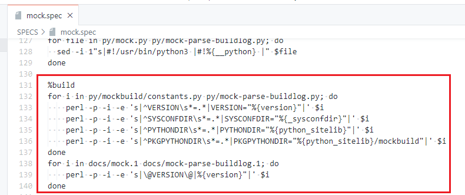
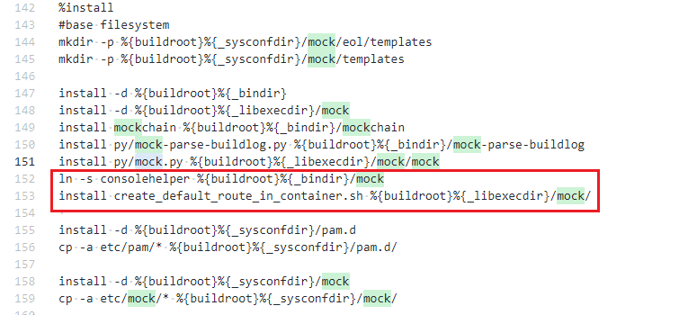
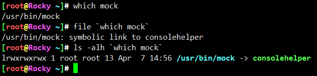
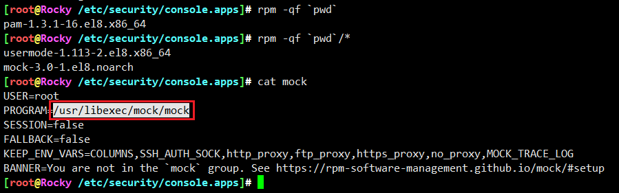
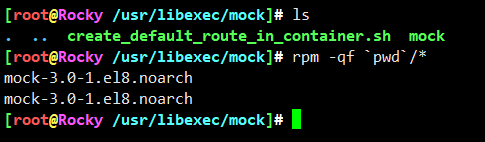
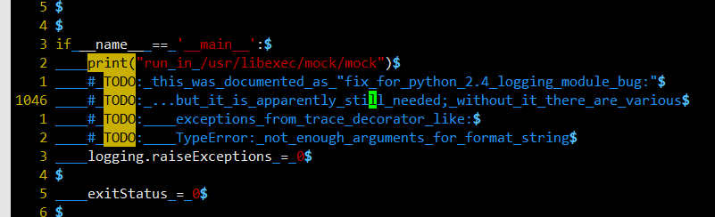
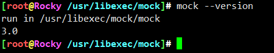
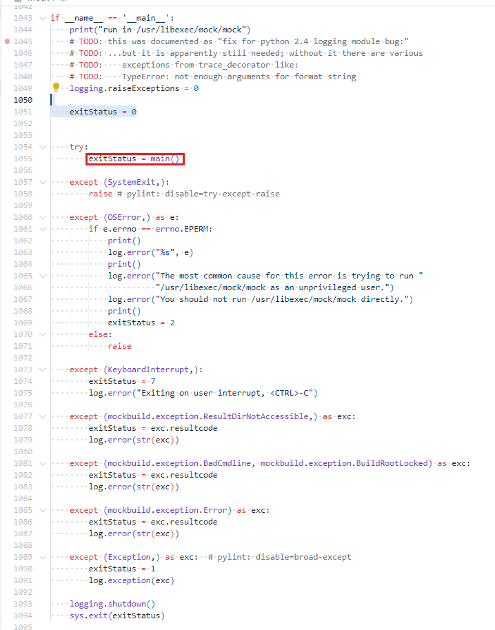
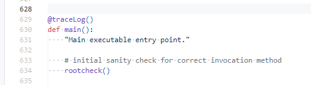
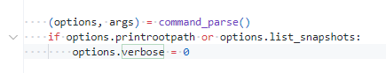

# 入口解析

先看spec



* 入口程序没有实质性编译操作，主要是版本替换。
* 核心还是py程序，没有编译的必要，预编译都可以省



入口程序mock实际上是consolehelper的软链

* consolehelper是个"中介"代理，负责特权处理
* <https://linux.die.net/man/8/consolehelper>

```
consolehelper is a tool that makes it easy for console users to run system programs, doing authentication via PAM (which can be set up to trust all console users or to ask for a password at the system administrator's discretion). When possible, the authentication is done graphically; otherwise, it is done within the text console from which consolehelper was started.
```

* 其实有点类似于setuid、setgid
* 因为mock运行需要特权，做一些挂载操作，又能让普通用户使用，所以务虚一个中间人
* consolehelper用法也不复杂，软链一下



* 那consolehelper怎么发现到底要执行哪个后端程序嘞？



* 好了，中间人下去休息。至于这类权限代理操作有空再撸一撸



```
/usr/libexec/mock/mock
```





* 没错，是ta，就是ta



* 标准python的玩法，外面一对异常包裹，跳进去就跳进了万丈深渊。。
* python写到最后就是一堆状态机（应该是我还没学到家）。。




* 入口还有日志装饰器，当然开头少不了一堆权限校验
* 不重要，继续看
* 走的越远，积攒的坑越多，搞头越多。。四不四~_~

```
/usr/lib/python3.6/site-packages/mockbuild/trace_decorator.py
```



* 参数解析，argparse，老朋友
* 配置一大坨，足够花里胡哨，说明有很多料，这道菜你愿意花多久吃完？


---
