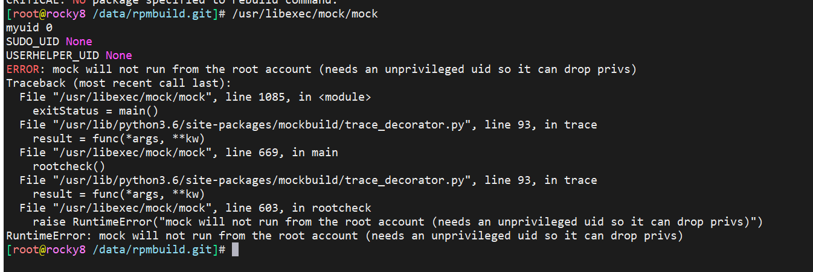

<!-- MDTOC maxdepth:6 firsth1:1 numbering:0 flatten:0 bullets:1 updateOnSave:1 -->

- [入口解析](#入口解析)   
   - [mock consolehelper入口](#mock-consolehelper入口)   
   - [mock真正入口](#mock真正入口)   
   - [mock入口， -限校验](#mock入口，-限校验)   

<!-- /MDTOC -->
# 入口解析

先看spec


* 入口程序没有实质性编译操作，主要是版本替换。
* 核心还是py程序，没有编译的必要，预编译都可以省


## mock consolehelper入口

入口程序mock实际上是consolehelper的软链

* consolehelper是个"中介"代理，负责特权处理
* <https://linux.die.net/man/8/consolehelper>

```
consolehelper is a tool that makes it easy for console users to run system programs, doing authentication via PAM (which can be set up to trust all console users or to ask for a password at the system administrator's discretion). When possible, the authentication is done graphically; otherwise, it is done within the text console from which consolehelper was started.
```

* 其实有点类似于setuid、setgid
* 因为mock运行需要特权，做一些挂载操作，又能让普通用户使用，使用了中间人方式
* consolehelper用法也不复杂，软链一下


* 那consolehelper怎么发现到底要执行哪个后端程序嘞？


* 看到这配置，恍然大悟，基本上写清楚了。用什么用户执行，执行什么，是否建立会话，传递哪些环境变量

consolehelper的配置文件位于/etc/security/console.apps目录下，
每个文件对应一个受管理的程序，文件名和程序名相同1。配置文件中的各个字段的作用和含义如下：

- USER：指定运行程序的用户，通常是root
- PROGRAM：指定要运行的程序的完整路径
- SESSION：指定是否在运行程序之前创建一个新的会话，如果为true，则会创建一个新的会话并设置环境变量；如果为false，则会使用当前的会话和环境变量
- FALLBACK：指定是否在图形界面无法启动时使用文本界面进行身份验证，如果为true，则会尝试使用文本界面；如果为false，则会直接失败
- KEEP_ENV_VARS：指定要保留的环境变量，用逗号分隔，这些变量不会被清除或重置
- BANNER：指定要显示的提示信息，通常用于告知用户需要满足什么条件才能运行程序

除了这些字段外，还有一些其他可以使用的字段，如：

- RUNAS：指定运行程序的用户组，通常是root
- XUSER：指定允许运行程序的用户列表，用逗号分隔
- XGROUP：指定允许运行程序的用户组列表，用逗号分隔
- NICE：指定运行程序的优先级，取值范围是-20到19，越小越高

```
/etc/security/console.apps/mock
USER=root
PROGRAM=/usr/libexec/mock/mock
SESSION=false
FALLBACK=false
KEEP_ENV_VARS=COLUMNS,SSH_AUTH_SOCK,http_proxy,ftp_proxy,https_proxy,no_proxy,MOCK_TRACE_LOG
BANNER=You are not in the `mock` group. See https://rpm-software-management.github.io/mock/#setup
```

这里就要求，mock需要对应执行用户加入到mock group，否则无法执行

```
# rpm -qpi --scripts mock-filesystem-4.1-1.el8.noarch.rpm
Name        : mock-filesystem
Version     : 4.1
Release     : 1.el8
Architecture: noarch
Install Date: (not installed)
Group       : Unspecified
Size        : 18002
License     : GPL-2.0-or-later
Signature   : (none)
Source RPM  : mock-4.1-1.el8.src.rpm
Build Date  : Mon 24 Jul 2023 02:11:56 PM CST
Build Host  : rocky8
Relocations : (not relocatable)
URL         : https://github.com/rpm-software-management/mock/
Summary     : Mock filesystem layout
Description :
Filesystem layout and group for Mock.
preinstall scriptlet (using /bin/sh):
# check for existence of mock group, create it if not found
getent group mock > /dev/null || groupadd -f -g 135 -r mock
exit 0
```


可以看到，mock安装时候会依赖mock-filesystem，安装脚本会创建mock group，group id是135

```
getent group mock > /dev/null || groupadd -f -g 135 -r mock


getent group mock：使用getent命令查询mock这个用户组的信息，包括组名，密码，组ID和组成员12。如果mock这个用户组不存在，这个命令会返回空值。
/dev/null：把getent命令的输出重定向到/dev/null，也就是丢弃掉，不显示在屏幕上。

groupadd -f -g 135 -r mock：使用groupadd命令创建mock这个用户组，-f选项表示如果mock这个用户组已经存在，就忽略错误；-g 135选项表示指定mock这个用户组的组ID为135；-r选项表示创建一个系统用户组

-r, --system                  create a system account


所以，这个命令的逻辑是：如果mock这个用户组不存在，就创建它；如果mock这个用户组已经存在，就什么都不做。
```

后续用户想要使用mock进行编译，则需要添加自己到mock组（135号组）

一般是使用mockbuild用户

```
useradd   mockbuild
usermod -a -G mock mockbuild
```

```
# usermod --help
Usage: usermod [options] LOGIN

Options:
  -c, --comment COMMENT         new value of the GECOS field
  -d, --home HOME_DIR           new home directory for the user account
  -e, --expiredate EXPIRE_DATE  set account expiration date to EXPIRE_DATE
  -f, --inactive INACTIVE       set password inactive after expiration
                                to INACTIVE
  -g, --gid GROUP               force use GROUP as new primary group
  *-G, --groups GROUPS           new list of supplementary GROUPS
  *-a, --append                  append the user to the supplemental GROUPS
                                mentioned by the -G option without removing
                                the user from other groups
  -h, --help                    display this help message and exit
  -l, --login NEW_LOGIN         new value of the login name
  -L, --lock                    lock the user account
  -m, --move-home               move contents of the home directory to the
                                new location (use only with -d)
  -o, --non-unique              allow using duplicate (non-unique) UID
  -p, --password PASSWORD       use encrypted password for the new password
  -R, --root CHROOT_DIR         directory to chroot into
  -P, --prefix PREFIX_DIR       prefix directory where are located the /etc/* files
  -s, --shell SHELL             new login shell for the user account
  -u, --uid UID                 new UID for the user account
  -U, --unlock                  unlock the user account
  -v, --add-subuids FIRST-LAST  add range of subordinate uids
  -V, --del-subuids FIRST-LAST  remove range of subordinate uids
  -w, --add-subgids FIRST-LAST  add range of subordinate gids
  -W, --del-subgids FIRST-LAST  remove range of subordinate gids
  -Z, --selinux-user SEUSER     new SELinux user mapping for the user account
```

* root 默认可以直接跑mock，但是，不推荐。设计理念，是让普通用户通过consolehelper间接进行mockbuild
* mock要求用户用非root用户执行，但真正后端执行又是root执行，尽量做到最小权限法则

## mock真正入口

```
/usr/libexec/mock/mock
```


* 没错，是ta，就是ta

```
if __name__ == '__main__':
    # TODO: this was documented as "fix for python 2.4 logging module bug:"
    # TODO: ...but it is apparently still needed; without it there are various
    # TODO:    exceptions from trace_decorator like:
    # TODO:    TypeError: not enough arguments for format string
    logging.raiseExceptions = 0

    exitStatus = 0


    try:
        exitStatus = main()

    except (SystemExit,):
        raise # pylint: disable=try-except-raise

    except (OSError,) as e:
        if e.errno == errno.EPERM:
            print()
            log.error("%s", e)
            print()
            log.error("The most common cause for this error is trying to run "
                      "/usr/libexec/mock/mock as an unprivileged user.")
            log.error("You should not run /usr/libexec/mock/mock directly.")
            print()
            exitStatus = 2
        else:
            raise

    except (KeyboardInterrupt,):
        exitStatus = 7
        log.error("Exiting on user interrupt, <CTRL>-C")

    except (mockbuild.exception.ResultDirNotAccessible,) as exc:
        exitStatus = exc.resultcode
        log.error(str(exc))

    except (mockbuild.exception.BadCmdline, mockbuild.exception.BuildRootLocked) as exc:
        exitStatus = exc.resultcode
        log.error(str(exc))

    except (mockbuild.exception.Error) as exc:
        exitStatus = exc.resultcode
        log.error(str(exc))

    except (Exception,) as exc:  # pylint: disable=broad-except
        exitStatus = 1
        log.exception(exc)

    logging.shutdown()
    sys.exit(exitStatus)
```

## mock入口， -限校验

```
@traceLog()
def main():
    "Main executable entry point."

    # initial sanity check for correct invocation method
    rootcheck()

```


```

@traceLog()
def rootcheck():
    "verify mock was started correctly (either by sudo or consolehelper)"
    # if we're root due to sudo or consolehelper, we're ok
    # if not raise an exception and bail
    if os.getuid() == 0 and not (os.environ.get("SUDO_UID") or os.environ.get("USERHELPER_UID")):
        raise RuntimeError("mock will not run from the root account (needs an unprivileged uid so it can drop privs)")
```

* 要求用户使用非root用户执行

```
RuntimeError: mock will not run from the root account (needs an unprivileged uid so it can drop privs)

USERHELPER_UID：这个变量是由userhelper程序设置的，它表示调用userhelper的用户的真实用户ID。
    userhelper是一个辅助程序，它可以让普通用户运行一些需要root权限的程序，比如consolehelper2。USERHELPER_UID可以用来在运行这些程序时获取原始用户的身份信息。
SUDO_UID：这个变量是由sudo程序设置的，它表示调用sudo的用户的真实用户ID。
    sudo是一个工具，它可以让一个用户以另一个用户（通常是root）的身份执行命令。SUDO_UID可以用来在执行命令时获取原始用户的身份信息。

```



此处规避了，root用户直接执行 ```/usr/libexec/mock/mock```


如果普通用户绕过consolehelper，直接执行/usr/libexec/mock/mock则会抛出上述错误

但它是从哪里挂掉的，在这里加raise不就知道了


```
def setresuid(ruid=-1, euid=-1, suid=-1):
    ruid = ctypes.c_long(ruid)
    euid = ctypes.c_long(euid)
    suid = ctypes.c_long(suid)
    res = _libc.setresuid(ruid, euid, suid)
    if res:
        raise OSError(ctypes.get_errno(), os.strerror(ctypes.get_errno()))

这个函数的作用是设置当前进程的实际用户ID，有效用户ID和保存的用户ID。非特权用户进程可以将实际UID，

有效UID和保存的UID分别改为以下三者之一：

当前实际UID，当前有效UID或当前保存的UID。

特权用户进程（在Linux上，具有CAP_SETUID能力的进程）可以将实际UID，有效UID和保存的UID设置为任意值。
如果参数之一等于-1，则不改变相应的值。无论对实际UID，有效UID和保存的UID做了什么改变，文件系统UID总是设置为（可能是新的）有效UID的相同值。

类似地，setresgid()函数设置当前进程的实际组ID，有效组ID和保存的组ID（并总是修改文件系统GID使其与有效GID相同），对于非特权进程也有相同的限制
```

因此普通用户直接执行/usr/libexec/mock/mock会在 ```setresuid(0, 0, 0)``` 报错


---
