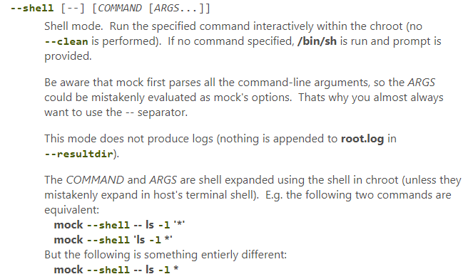
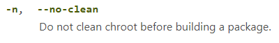

# 如何在不同构建阶段添加hook


## 构建rootfs环境之后，rpmbuild之前

```
mock -r Rocky-20.03-LTS-SP1-x86_64 --chroot rm /etc/profile.d/XXX.sh
mock -r Rocky-20.03-LTS-SP1-x86_64 -n bwa-0.7.17-1.el8.src.rpm
mock -r Rocky-20.03-LTS-SP1-x86_64 --clean
```





* 看代码，看配置，并没有直接提供hook，如果通过配置来hook，其实不好把控，尤其是有比较大的脚本需要先执行
* 但是可以间接来
* 先用shell执行需要的命令，亦或是脚本，然后在build，此时build必须要加-n参数，免得之前的shell失效。
* 编包之后，在clean掉这个rootfs环境，避免dirty


---
