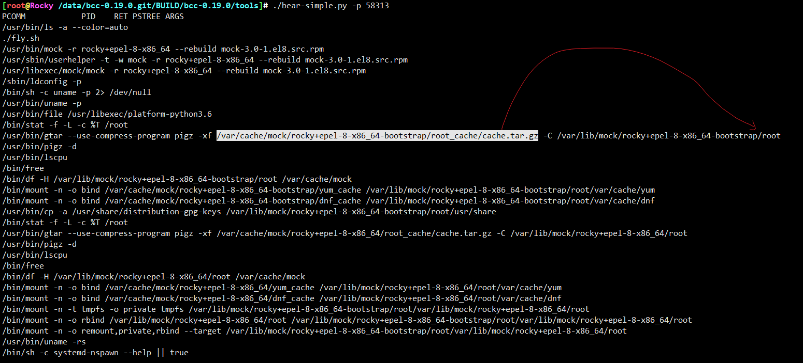

# 捕获mock构建执行流

在bcc基础上微调一下，跟踪进程及其子进程，子子孙孙进程的执行流

```
#!/usr/bin/python
# @lint-avoid-python-3-compatibility-imports
#
# bear Trace new processes via exec() syscalls.
#           For Linux, uses BCC, eBPF. Embedded C.
#
# USAGE: bear [-h] [-T] [-t] [-x] [-q] [-n NAME] [-l LINE]
#                  [--max-args MAX_ARGS]
#
# This currently will print up to a maximum of 19 arguments, plus the process
# name, so 20 fields in total (MAXARG).
#
# This won't catch all new processes: an application may fork() but not exec().
#
# Copyright 2022 yifengyou.
# Licensed under the Apache License, Version 2.0 (the "License")
#
# 07-Feb-2016   Brendan Gregg   Created this.

from __future__ import print_function
from bcc import BPF
from bcc.containers import filter_by_containers
from bcc.utils import ArgString, printb
import bcc.utils as utils
import argparse
import re
import time
import pwd
from collections import defaultdict
from time import strftime


def parse_uid(user):
    try:
        result = int(user)
    except ValueError:
        try:
            user_info = pwd.getpwnam(user)
        except KeyError:
            raise argparse.ArgumentTypeError(
                "{0!r} is not valid UID or user entry".format(user))
        else:
            return user_info.pw_uid
    else:
        # Maybe validate if UID < 0 ?
        return result


def parse_pid(pid):
    try:
        result = int(pid)
    except ValueError:
        raise argparse.ArgumentTypeError(
            "{0!r} is not valid PID".format(pid))
    else:
        # Maybe validate if UID < 0 ?
        return result


# arguments
examples = """examples:
    ./bear           # trace all exec() syscalls
    ./bear -x        # include failed exec()s
    ./bear -T        # include time (HH:MM:SS)
    ./bear -U        # include UID
    ./bear -u 1000   # only trace UID 1000
    ./bear -u user   # get user UID and trace only them
    ./bear -t        # include timestamps
    ./bear -q        # add "quotemarks" around arguments
    ./bear -n main   # only print command lines containing "main"
    ./bear -l tpkg   # only print command where arguments contains "tpkg"
    ./bear --cgroupmap mappath  # only trace cgroups in this BPF map
    ./bear --mntnsmap mappath   # only trace mount namespaces in the map
    ./bear --pid 154789   # watch specific process with subprocess
"""
parser = argparse.ArgumentParser(
    description="Trace exec() syscalls",
    formatter_class=argparse.RawDescriptionHelpFormatter,
    epilog=examples)
parser.add_argument("-T", "--time", action="store_true",
                    help="include time column on output (HH:MM:SS)")
parser.add_argument("-t", "--timestamp", action="store_true",
                    help="include timestamp on output")
parser.add_argument("-x", "--fails", action="store_true",
                    help="include failed exec()s")
parser.add_argument("--cgroupmap",
                    help="trace cgroups in this BPF map only")
parser.add_argument("--mntnsmap",
                    help="trace mount namespaces in this BPF map only")
parser.add_argument("-u", "--uid", type=parse_uid, metavar='USER',
                    help="trace this UID only")
parser.add_argument("-q", "--quote", action="store_true",
                    help="Add quotemarks (\") around arguments."
                    )
parser.add_argument("-n", "--name",
                    type=ArgString,
                    help="only print commands matching this name (regex), any arg")
parser.add_argument("-p", "--pid",
                    type=parse_pid,
                    help="Watch target pid with all subprocess.")
parser.add_argument("-l", "--line",
                    type=ArgString,
                    help="only print commands where arg contains this line (regex)")
parser.add_argument("-U", "--print-uid", action="store_true",
                    help="print UID column")
parser.add_argument("--max-args", default="100",
                    help="maximum number of arguments parsed and displayed, defaults to 100")
parser.add_argument("--ebpf", action="store_true",
                    help=argparse.SUPPRESS)
args = parser.parse_args()

# define BPF program
bpf_text = """
#include <uapi/linux/ptrace.h>
#include <linux/sched.h>
#include <linux/fs.h>

#define ARGSIZE  128

enum event_type {
    EVENT_ARG,
    EVENT_RET,
};

struct data_t {
    u32 pid;  // PID as in the userspace term (i.e. task->tgid in kernel)
    //u32 ppid; // Parent PID as in the userspace term (i.e task->real_parent->tgid in kernel)
    u32 uid;
    u32 ancestors[50];
    char comm[TASK_COMM_LEN];
    enum event_type type;
    char argv[ARGSIZE];
    int retval;
};

BPF_PERF_OUTPUT(events);

static int __submit_arg(struct pt_regs *ctx, void *ptr, struct data_t *data)
{
    bpf_probe_read_user(data->argv, sizeof(data->argv), ptr);
    events.perf_submit(ctx, data, sizeof(struct data_t));
    return 1;
}

static int submit_arg(struct pt_regs *ctx, void *ptr, struct data_t *data)
{
    const char *argp = NULL;
    bpf_probe_read_user(&argp, sizeof(argp), ptr);
    if (argp) {
        return __submit_arg(ctx, (void *)(argp), data);
    }
    return 0;
}

int syscall__execve(struct pt_regs *ctx,
    const char __user *filename,
    const char __user *const __user *__argv,
    const char __user *const __user *__envp)
{

    u32 uid = bpf_get_current_uid_gid() & 0xffffffff;

    UID_FILTER

    if (container_should_be_filtered()) {
        return 0;
    }

    // create data here and pass to submit_arg to save stack space (#555)
    struct data_t data = {};
    struct task_struct *task;

    data.pid = bpf_get_current_pid_tgid() >> 32;

    task = (struct task_struct *)bpf_get_current_task();
    // Some kernels, like Ubuntu 4.13.0-generic, return 0
    // as the real_parent->tgid.
    // We use the get_ppid function as a fallback in those cases. (#1883)
    // data.ppid = task->real_parent->tgid;

    bpf_get_current_comm(&data.comm, sizeof(data.comm));
    data.type = EVENT_ARG;

    __submit_arg(ctx, (void *)filename, &data);

    // skip first arg, as we submitted filename
    #pragma unroll
    for (int i = 1; i < MAXARG; i++) {
        if (submit_arg(ctx, (void *)&__argv[i], &data) == 0)
             goto out;
    }

    // handle truncated argument list
    char ellipsis[] = "...";
    __submit_arg(ctx, (void *)ellipsis, &data);
out:
    return 0;
}

int do_ret_sys_execve(struct pt_regs *ctx)
{
    if (container_should_be_filtered()) {
        return 0;
    }

    struct data_t data = {};
    struct task_struct *task;

    u32 uid = bpf_get_current_uid_gid() & 0xffffffff;
    UID_FILTER

    data.pid = bpf_get_current_pid_tgid() >> 32;
    data.uid = uid;

    task = (struct task_struct *)bpf_get_current_task();
    // Some kernels, like Ubuntu 4.13.0-generic, return 0
    // as the real_parent->tgid.
    // We use the get_ppid function as a fallback in those cases. (#1883)
    // data.ppid = task->real_parent->tgid;
    data.ancestors[0] = data.pid;
    data.ancestors[1] = task->real_parent->tgid;
    if ( 1 != data.ancestors[1] ) {
        struct task_struct * parent_pointer = task->real_parent->real_parent;
        int i = 2;
        for (; parent_pointer->tgid != 1; i ++)  {
            if ( i > 50)
                break;
            data.ancestors[i] = parent_pointer->tgid;
            parent_pointer = parent_pointer->real_parent;
        }
        data.ancestors[i] = 1;
    }

    bpf_get_current_comm(&data.comm, sizeof(data.comm));
    data.type = EVENT_RET;
    data.retval = PT_REGS_RC(ctx);
    events.perf_submit(ctx, &data, sizeof(data));

    return 0;
}
"""

bpf_text = bpf_text.replace("MAXARG", args.max_args)

if args.uid:
    bpf_text = bpf_text.replace('UID_FILTER',
                                'if (uid != %s) { return 0; }' % args.uid)
else:
    bpf_text = bpf_text.replace('UID_FILTER', '')
bpf_text = filter_by_containers(args) + bpf_text
if args.ebpf:
    print(bpf_text)
    exit()

# initialize BPF
b = BPF(text=bpf_text)
execve_fnname = b.get_syscall_fnname("execve")
b.attach_kprobe(event=execve_fnname, fn_name="syscall__execve")
b.attach_kretprobe(event=execve_fnname, fn_name="do_ret_sys_execve")

# header
if args.time:
    print("%-9s" % ("TIME"), end="")
if args.timestamp:
    print("%-8s" % ("TIME(s)"), end="")
if args.print_uid:
    print("%-6s" % ("UID"), end="")
print("%-16s %-6s %3s %s %s" %
      ("PCOMM", "PID", "RET", "PSTREE", "ARGS"))


class EventType(object):
    EVENT_ARG = 0
    EVENT_RET = 1


start_ts = time.time()
argv = defaultdict(list)

# This is best-effort PPID matching. Short-lived processes may exit
# before we get a chance to read the PPID.
# This is a fallback for when fetching the PPID from task->real_parent->tgip
# returns 0, which happens in some kernel versions.


def get_ppid(pid):
    try:
        with open("/proc/%d/status" % pid) as status:
            for line in status:
                if line.startswith("PPid:"):
                    return int(line.split()[1])
    except IOError:
        pass
    return 0

# process event


def print_event(cpu, data, size):
    event = b["events"].event(data)
    skip = False

    if event.type == EventType.EVENT_ARG:
        argv[event.pid].append(event.argv)
    elif event.type == EventType.EVENT_RET:
        if event.retval != 0 and not args.fails:
            skip = True
        if args.name and not re.search(bytes(args.name), event.comm):
            skip = True
        if args.line and not re.search(bytes(args.line),
                                       b' '.join(argv[event.pid])):
            skip = True
        if args.quote:
            argv[event.pid] = [
                b"\"" + arg.replace(b"\"", b"\\\"") + b"\""
                for arg in argv[event.pid]
            ]

        if not skip and int(args.pid) in event.ancestors:
            if args.time:
                printb(b"%-9s" % strftime("%H:%M:%S").encode('ascii'), nl="")
            if args.timestamp:
                printb(b"%-8.3f" % (time.time() - start_ts), nl="")
            if args.print_uid:
                printb(b"%-6d" % event.uid, nl="")
            # ppid = event.ppid if event.ppid > 0 else get_ppid(event.pid)
            # ppid = b"%d" % ppid if ppid > 0 else b"?"
            argv_text = b' '.join(argv[event.pid]).replace(b'\n', b'\\n')

            tree_list = []
            for i in event.ancestors:
                if i != 0:
                    tree_list.append(str(i))
            # print(tree_list)
            printb(b"%-16s %-6d %3d %s %s" % (event.comm,
                                                   event.pid,
                                                   event.retval,
                                                   '->'.join(tree_list).encode(),
                                                   argv_text
                                                   )
                   )
        try:
            del(argv[event.pid])
        except Exception:
            pass


# loop with callback to print_event
b["events"].open_perf_buffer(print_event)
while 1:
    try:
        b.perf_buffer_poll()
    except KeyboardInterrupt:
        exit()

```


## 瞄一眼捕获内容




从缓存，解压rootfs

```
/usr/bin/gtar --use-compress-program pigz -xf /var/cache/mock/rocky+epel-8-x86_64-bootstrap/root_cache/cache.tar.gz -C /var/lib/mock/rocky+epel-8-x86_64-bootstrap/root
```

为什么要两个rootfs?

```
/usr/bin/systemd-nspawn -q -M 0526705b45c840ebbbd905c954f188ea \
  -D /var/lib/mock/rocky+epel-8-x86_64-bootstrap/root \
  -a --capability=cap_ipc_lock --bind=/tmp/mock-resolv.kgjd0nbn:/etc/resolv.conf --setenv=TERM=vt100 --setenv=SHELL=/bin/bash --setenv=HOME=/var/lib/mock/rocky+epel-8-x86_64/root/installation-homedir --setenv=HOSTNAME=mock --setenv=PATH=/usr/bin:/bin:/usr/sbin:/sbin --setenv=PROMPT_COMMAND=printf "\033]0;<mock-chroot>\007" --setenv=PS1=<mock-chroot> \s-\v\$  --setenv=LANG=C.UTF-8 --setenv=LC_MESSAGES=C.UTF-8 --resolv-conf=off \
  /usr/bin/dnf builddep --installroot /var/lib/mock/rocky+epel-8-x86_64/root/ --releasever 8 --setopt=deltarpm=False --allowerasing --disableplugin=local --disableplugin=spacewalk --disableplugin=versionlock --disableplugin=local --disableplugin=spacewalk --disableplugin=versionlock \
  /var/lib/mock/rocky+epel-8-x86_64/root//builddir/build/SRPMS/mock-3.0-1.el8.src.rpm
```

看上面的执行流，大致就是，在rocky+epel-8-x86_64-bootstrap rootfs中执行 dnf builddep ，安装到 rocky+epel-8-x86_64 里


## 捕获输出内容完整版

```
[root@Rocky /data/bcc-0.19.0.git/BUILD/bcc-0.19.0/tools]# ./bear-simple.py -p 58313
PCOMM            PID    RET PSTREE ARGS
/usr/bin/ls -a --color=auto
./fly.sh
/usr/bin/mock -r rocky+epel-8-x86_64 --rebuild mock-3.0-1.el8.src.rpm
/usr/sbin/userhelper -t -w mock -r rocky+epel-8-x86_64 --rebuild mock-3.0-1.el8.src.rpm
/usr/libexec/mock/mock -r rocky+epel-8-x86_64 --rebuild mock-3.0-1.el8.src.rpm
/sbin/ldconfig -p
/bin/sh -c uname -p 2> /dev/null
/usr/bin/uname -p
/usr/bin/file /usr/libexec/platform-python3.6
/bin/stat -f -L -c %T /root
/usr/bin/gtar --use-compress-program pigz -xf /var/cache/mock/rocky+epel-8-x86_64-bootstrap/root_cache/cache.tar.gz -C /var/lib/mock/rocky+epel-8-x86_64-bootstrap/root
/usr/bin/pigz -d
/usr/bin/lscpu
/bin/free
/bin/df -H /var/lib/mock/rocky+epel-8-x86_64-bootstrap/root /var/cache/mock
/bin/mount -n -o bind /var/cache/mock/rocky+epel-8-x86_64-bootstrap/yum_cache /var/lib/mock/rocky+epel-8-x86_64-bootstrap/root/var/cache/yum
/bin/mount -n -o bind /var/cache/mock/rocky+epel-8-x86_64-bootstrap/dnf_cache /var/lib/mock/rocky+epel-8-x86_64-bootstrap/root/var/cache/dnf
/usr/bin/cp -a /usr/share/distribution-gpg-keys /var/lib/mock/rocky+epel-8-x86_64-bootstrap/root/usr/share
/bin/stat -f -L -c %T /root
/usr/bin/gtar --use-compress-program pigz -xf /var/cache/mock/rocky+epel-8-x86_64/root_cache/cache.tar.gz -C /var/lib/mock/rocky+epel-8-x86_64/root
/usr/bin/pigz -d
/usr/bin/lscpu
/bin/free
/bin/df -H /var/lib/mock/rocky+epel-8-x86_64/root /var/cache/mock
/bin/mount -n -o bind /var/cache/mock/rocky+epel-8-x86_64/yum_cache /var/lib/mock/rocky+epel-8-x86_64/root/var/cache/yum
/bin/mount -n -o bind /var/cache/mock/rocky+epel-8-x86_64/dnf_cache /var/lib/mock/rocky+epel-8-x86_64/root/var/cache/dnf
/bin/mount -n -t tmpfs -o private tmpfs /var/lib/mock/rocky+epel-8-x86_64-bootstrap/root/var/lib/mock/rocky+epel-8-x86_64/root
/bin/mount -n -o rbind /var/lib/mock/rocky+epel-8-x86_64/root /var/lib/mock/rocky+epel-8-x86_64-bootstrap/root/var/lib/mock/rocky+epel-8-x86_64/root
/bin/mount -n -o remount,private,rbind --target /var/lib/mock/rocky+epel-8-x86_64-bootstrap/root/var/lib/mock/rocky+epel-8-x86_64/root
/usr/bin/uname -rs
/bin/sh -c systemd-nspawn --help || true
/usr/bin/systemd-nspawn --help
/usr/bin/systemd-nspawn -q -M 42b6fad7adf54b33be9698c5ba4e8ad3 -D /var/lib/mock/rocky+epel-8-x86_64/root -a --setenv=TERM=vt100 --setenv=SHELL=/bin/bash --setenv=HOME=/builddir --setenv=HOSTNAME=mock --setenv=PATH=/usr/bin:/bin:/usr/sbin:/sbin --setenv=PROMPT_COMMAND=printf "\033]0;<mock-chroot>\007" --setenv=PS1=<mock-chroot> \s-\v\$  --setenv=LANG=C.UTF-8 --resolv-conf=off /usr/sbin/userdel -r -f mockbuild
/usr/sbin/userdel -r -f mockbuild
/usr/bin/systemd-nspawn -q -M 49a360beb5644092aa6665bdc45658f8 -D /var/lib/mock/rocky+epel-8-x86_64/root -a --setenv=TERM=vt100 --setenv=SHELL=/bin/bash --setenv=HOME=/builddir --setenv=HOSTNAME=mock --setenv=PATH=/usr/bin:/bin:/usr/sbin:/sbin --setenv=PROMPT_COMMAND=printf "\033]0;<mock-chroot>\007" --setenv=PS1=<mock-chroot> \s-\v\$  --setenv=LANG=C.UTF-8 --resolv-conf=off /usr/sbin/groupdel mock
/usr/sbin/groupdel mock
/usr/bin/systemd-nspawn -q -M f1c575b0b3c0454da26e61a4646199c1 -D /var/lib/mock/rocky+epel-8-x86_64/root -a --setenv=TERM=vt100 --setenv=SHELL=/bin/bash --setenv=HOME=/builddir --setenv=HOSTNAME=mock --setenv=PATH=/usr/bin:/bin:/usr/sbin:/sbin --setenv=PROMPT_COMMAND=printf "\033]0;<mock-chroot>\007" --setenv=PS1=<mock-chroot> \s-\v\$  --setenv=LANG=C.UTF-8 --resolv-conf=off /usr/sbin/groupadd -g 135 mock
/usr/sbin/groupadd -g 135 mock
/usr/bin/systemd-nspawn -q -M bda1a1803bea429fa74faf0f361917a2 -D /var/lib/mock/rocky+epel-8-x86_64/root -a --setenv=TERM=vt100 --setenv=SHELL=/bin/bash --setenv=HOME=/builddir --setenv=HOSTNAME=mock --setenv=PATH=/usr/bin:/bin:/usr/sbin:/sbin --setenv=PROMPT_COMMAND=printf "\033]0;<mock-chroot>\007" --setenv=PS1=<mock-chroot> \s-\v\$  --setenv=LANG=C.UTF-8 --resolv-conf=off /usr/sbin/useradd -o -m -u 0 -g 135 -d /builddir -n mockbuild
/usr/sbin/useradd -o -m -u 0 -g 135 -d /builddir -n mockbuild
/usr/bin/systemd-nspawn -q -M 7cb9e8e7d18e4077b59772960bacd6a2 -D /var/lib/mock/rocky+epel-8-x86_64-bootstrap/root -a --setenv=TERM=vt100 --setenv=SHELL=/bin/bash --setenv=HOME=/builddir --setenv=HOSTNAME=mock --setenv=PATH=/usr/bin:/bin:/usr/sbin:/sbin --setenv=PROMPT_COMMAND=printf "\033]0;<mock-chroot>\007" --setenv=PS1=<mock-chroot> \s-\v\$  --setenv=LANG=C.UTF-8 --resolv-conf=off /bin/rpm -qa --root /var/lib/mock/rocky+epel-8-x86_64/root
/bin/rpm -qa --root /var/lib/mock/rocky+epel-8-x86_64/root
/bin/mount -n -t tmpfs -o rprivate tmpfs /var/lib/mock/rocky+epel-8-x86_64/root/proc
/bin/mount -n -o rbind /proc /var/lib/mock/rocky+epel-8-x86_64/root/proc
/bin/mount -n -o remount,nodev,noexec,nosuid,readonly,rprivate,rbind --target /var/lib/mock/rocky+epel-8-x86_64/root/proc
/bin/mount -n -t tmpfs -o rprivate tmpfs /var/lib/mock/rocky+epel-8-x86_64/root/sys
/bin/mount -n -o rbind /sys /var/lib/mock/rocky+epel-8-x86_64/root/sys
/bin/mount -n -o remount,nodev,noexec,nosuid,readonly,rprivate,rbind --target /var/lib/mock/rocky+epel-8-x86_64/root/sys
/bin/mount -n -t tmpfs tmpfs /var/lib/mock/rocky+epel-8-x86_64/root/dev/shm
/bin/mount -n -t devpts -o gid=5,mode=0620,ptmxmode=0666,newinstance devpts /var/lib/mock/rocky+epel-8-x86_64/root/dev/pts
/usr/bin/systemd-nspawn -q -M aeedcaf386f149248c6f5a07cb5827fd -D /var/lib/mock/rocky+epel-8-x86_64-bootstrap/root -a --capability=cap_ipc_lock --bind=/tmp/mock-resolv.q_dxo7pj:/etc/resolv.conf --setenv=TERM=vt100 --setenv=SHELL=/bin/bash --setenv=HOME=/var/lib/mock/rocky+epel-8-x86_64/root/installation-homedir --setenv=HOSTNAME=mock --setenv=PATH=/usr/bin:/bin:/usr/sbin:/sbin --setenv=PROMPT_COMMAND=printf "\033]0;<mock-chroot>\007" --setenv=PS1=<mock-chroot> \s-\v\$  --setenv=LANG=C.UTF-8 --setenv=LC_MESSAGES=C.UTF-8 --resolv-conf=off /usr/bin/dnf --installroot /var/lib/mock/rocky+epel-8-x86_64/root/ -y --releasever 8 --setopt=deltarpm=False --allowerasing --disableplugin=local --disableplugin=spacewalk --disableplugin=versionlock update
/usr/bin/dnf --installroot /var/lib/mock/rocky+epel-8-x86_64/root/ -y --releasever 8 --setopt=deltarpm=False --allowerasing --disableplugin=local --disableplugin=spacewalk --disableplugin=versionlock update
/bin/umount -n -l /var/lib/mock/rocky+epel-8-x86_64/root/dev/pts
/bin/umount -n -l /var/lib/mock/rocky+epel-8-x86_64/root/dev/shm
/bin/umount -n -l /var/lib/mock/rocky+epel-8-x86_64/root/sys
/bin/umount -n -l /var/lib/mock/rocky+epel-8-x86_64/root/sys
/bin/umount -n -l /var/lib/mock/rocky+epel-8-x86_64/root/proc
/bin/umount -n -l /var/lib/mock/rocky+epel-8-x86_64/root/proc
/usr/bin/systemd-nspawn -q -M 412b3de9ac4246f9921fb0a5b84149aa -D /var/lib/mock/rocky+epel-8-x86_64-bootstrap/root -a --setenv=TERM=vt100 --setenv=SHELL=/bin/bash --setenv=HOME=/builddir --setenv=HOSTNAME=mock --setenv=PATH=/usr/bin:/bin:/usr/sbin:/sbin --setenv=PROMPT_COMMAND=printf "\033]0;<mock-chroot>\007" --setenv=PS1=<mock-chroot> \s-\v\$  --setenv=LANG=C.UTF-8 --resolv-conf=off /bin/rpm -qa --root /var/lib/mock/rocky+epel-8-x86_64/root
/bin/rpm -qa --root /var/lib/mock/rocky+epel-8-x86_64/root
/usr/bin/systemd-nspawn -q -M b099978183344bdb9f8123b811d238ce -D /var/lib/mock/rocky+epel-8-x86_64/root -a -u mockbuild --capability=cap_ipc_lock --bind=/tmp/mock-resolv.6fqilycg:/etc/resolv.conf --bind=/dev/loop-control --bind=/dev/loop0 --bind=/dev/loop1 --bind=/dev/loop2 --bind=/dev/loop3 --bind=/dev/loop4 --bind=/dev/loop5 --bind=/dev/loop6 --bind=/dev/loop7 --bind=/dev/loop8 --bind=/dev/loop9 --bind=/dev/loop10 --bind=/dev/loop11 --setenv=TERM=vt100 --setenv=SHELL=/bin/bash --setenv=HOME=/builddir --setenv=HOSTNAME=mock --setenv=PATH=/usr/bin:/bin:/usr/sbin:/sbin --setenv=PROMPT_COMMAND=printf "\033]0;<mock-chroot>\007" --setenv=PS1=<mock-chroot> \s-\v\$  --setenv=LANG=C.UTF-8 --resolv-conf=off /bin/rpm -Uvh --nodeps /builddir/build/originals/mock-3.0-1.el8.src.rpm
/usr/bin/getent passwd mockbuild
/usr/bin/getent initgroups mockbuild
/bin/rpm -Uvh --nodeps /builddir/build/originals/mock-3.0-1.el8.src.rpm
/usr/bin/systemd-nspawn -q -M d48f9eb70d084abe8ec54e57866999d1 -D /var/lib/mock/rocky+epel-8-x86_64/root -a -u mockbuild --capability=cap_ipc_lock --bind=/tmp/mock-resolv.6fqilycg:/etc/resolv.conf --bind=/dev/loop-control --bind=/dev/loop0 --bind=/dev/loop1 --bind=/dev/loop2 --bind=/dev/loop3 --bind=/dev/loop4 --bind=/dev/loop5 --bind=/dev/loop6 --bind=/dev/loop7 --bind=/dev/loop8 --bind=/dev/loop9 --bind=/dev/loop10 --bind=/dev/loop11 --setenv=TERM=vt100 --setenv=SHELL=/bin/bash --setenv=HOME=/builddir --setenv=HOSTNAME=mock --setenv=PATH=/usr/bin:/bin:/usr/sbin:/sbin --setenv=PROMPT_COMMAND=printf "\033]0;<mock-chroot>\007" --setenv=PS1=<mock-chroot> \s-\v\$  --setenv=LANG=C.UTF-8 --resolv-conf=off /bin/rpm -qpl /builddir/build/originals/mock-3.0-1.el8.src.rpm
/usr/bin/getent passwd mockbuild
/usr/bin/getent initgroups mockbuild
/bin/rpm -qpl /builddir/build/originals/mock-3.0-1.el8.src.rpm
/usr/bin/systemd-nspawn -q -M e89a2e1e98c1428dbdaeeeccbafe4d77 -D /var/lib/mock/rocky+epel-8-x86_64/root -a -u mockbuild --capability=cap_ipc_lock --bind=/tmp/mock-resolv.6fqilycg:/etc/resolv.conf --bind=/dev/loop-control --bind=/dev/loop0 --bind=/dev/loop1 --bind=/dev/loop2 --bind=/dev/loop3 --bind=/dev/loop4 --bind=/dev/loop5 --bind=/dev/loop6 --bind=/dev/loop7 --bind=/dev/loop8 --bind=/dev/loop9 --bind=/dev/loop10 --bind=/dev/loop11 --setenv=TERM=vt100 --setenv=SHELL=/bin/bash --setenv=HOME=/builddir --setenv=HOSTNAME=mock --setenv=PATH=/usr/bin:/bin:/usr/sbin:/sbin --setenv=PROMPT_COMMAND=printf "\033]0;<mock-chroot>\007" --setenv=PS1=<mock-chroot> \s-\v\$  --setenv=LANG=C.UTF-8 --resolv-conf=off bash --login -c /usr/bin/rpmbuild -bs --target x86_64 --nodeps /builddir/build/SPECS/mock.spec
/usr/bin/getent passwd mockbuild
/usr/bin/getent initgroups mockbuild
/usr/bin/bash --login -c /usr/bin/rpmbuild -bs --target x86_64 --nodeps /builddir/build/SPECS/mock.spec
/usr/bin/id -un
/usr/libexec/grepconf.sh -c
/usr/bin/grep -qsi ^COLOR.*none /etc/GREP_COLORS
/usr/libexec/grepconf.sh -c
/usr/bin/grep -qsi ^COLOR.*none /etc/GREP_COLORS
/usr/libexec/grepconf.sh -c
/usr/bin/grep -qsi ^COLOR.*none /etc/GREP_COLORS
/usr/bin/readlink /proc/4/exe
/usr/bin/basename /usr/bin/bash
/usr/bin/rpmbuild -bs --target x86_64 --nodeps /builddir/build/SPECS/mock.spec
  /usr/bin/python3 -Ic "from distutils.sysconfig import get_python_lib; print(get_python_lib())"
  /usr/bin/python3 -Ic "from distutils.sysconfig import get_python_lib; print(get_python_lib())"
  /usr/bin/python3 -Ic "from distutils.sysconfig import get_python_lib; print(get_python_lib())"
  /usr/bin/python3 -Ic "from distutils.sysconfig import get_python_lib; print(get_python_lib())"
/bin/mount -n -t tmpfs -o rprivate tmpfs /var/lib/mock/rocky+epel-8-x86_64/root/proc
/bin/mount -n -o rbind /proc /var/lib/mock/rocky+epel-8-x86_64/root/proc
/bin/mount -n -o remount,nodev,noexec,nosuid,readonly,rprivate,rbind --target /var/lib/mock/rocky+epel-8-x86_64/root/proc
/bin/mount -n -t tmpfs -o rprivate tmpfs /var/lib/mock/rocky+epel-8-x86_64/root/sys
/bin/mount -n -o rbind /sys /var/lib/mock/rocky+epel-8-x86_64/root/sys
/bin/mount -n -o remount,nodev,noexec,nosuid,readonly,rprivate,rbind --target /var/lib/mock/rocky+epel-8-x86_64/root/sys
/bin/mount -n -t tmpfs tmpfs /var/lib/mock/rocky+epel-8-x86_64/root/dev/shm
/bin/mount -n -t devpts -o gid=5,mode=0620,ptmxmode=0666,newinstance devpts /var/lib/mock/rocky+epel-8-x86_64/root/dev/pts
/usr/bin/systemd-nspawn -q -M dd83a1a73a9f47ad830a50d83e0abfd7 -D /var/lib/mock/rocky+epel-8-x86_64-bootstrap/root -a --capability=cap_ipc_lock --bind=/tmp/mock-resolv.q_dxo7pj:/etc/resolv.conf --setenv=TERM=vt100 --setenv=SHELL=/bin/bash --setenv=HOME=/var/lib/mock/rocky+epel-8-x86_64/root/installation-homedir --setenv=HOSTNAME=mock --setenv=PATH=/usr/bin:/bin:/usr/sbin:/sbin --setenv=PROMPT_COMMAND=printf "\033]0;<mock-chroot>\007" --setenv=PS1=<mock-chroot> \s-\v\$  --setenv=LANG=C.UTF-8 --setenv=LC_MESSAGES=C.UTF-8 --resolv-conf=off /usr/bin/dnf builddep --installroot /var/lib/mock/rocky+epel-8-x86_64/root/ --releasever 8 --setopt=deltarpm=False --allowerasing --disableplugin=local --disableplugin=spacewalk --disableplugin=versionlock --disableplugin=local --disableplugin=spacewalk --disableplugin=versionlock /var/lib/mock/rocky+epel-8-x86_64/root//builddir/build/SRPMS/mock-3.0-1.el8.src.rpm
/usr/bin/dnf builddep --installroot /var/lib/mock/rocky+epel-8-x86_64/root/ --releasever 8 --setopt=deltarpm=False --allowerasing --disableplugin=local --disableplugin=spacewalk --disableplugin=versionlock --disableplugin=local --disableplugin=spacewalk --disableplugin=versionlock /var/lib/mock/rocky+epel-8-x86_64/root//builddir/build/SRPMS/mock-3.0-1.el8.src.rpm
/usr/bin/rpmkeys --checksig --root /var/lib/mock/rocky+epel-8-x86_64/root/ --verbose --define=_pkgverify_level signature --define=_pkgverify_flags 0x0 -
/usr/bin/rpmkeys --checksig --root /var/lib/mock/rocky+epel-8-x86_64/root/ --verbose --define=_pkgverify_level signature --define=_pkgverify_flags 0x0 -
/usr/bin/rpmkeys --checksig --root /var/lib/mock/rocky+epel-8-x86_64/root/ --verbose --define=_pkgverify_level signature --define=_pkgverify_flags 0x0 -
/usr/bin/rpmkeys --checksig --root /var/lib/mock/rocky+epel-8-x86_64/root/ --verbose --define=_pkgverify_level signature --define=_pkgverify_flags 0x0 -
/usr/bin/rpmkeys --checksig --root /var/lib/mock/rocky+epel-8-x86_64/root/ --verbose --define=_pkgverify_level signature --define=_pkgverify_flags 0x0 -
/usr/bin/rpmkeys --checksig --root /var/lib/mock/rocky+epel-8-x86_64/root/ --verbose --define=_pkgverify_level signature --define=_pkgverify_flags 0x0 -
/usr/bin/rpmkeys --checksig --root /var/lib/mock/rocky+epel-8-x86_64/root/ --verbose --define=_pkgverify_level signature --define=_pkgverify_flags 0x0 -
/usr/bin/rpmkeys --checksig --root /var/lib/mock/rocky+epel-8-x86_64/root/ --verbose --define=_pkgverify_level signature --define=_pkgverify_flags 0x0 -
/usr/bin/rpmkeys --checksig --root /var/lib/mock/rocky+epel-8-x86_64/root/ --verbose --define=_pkgverify_level signature --define=_pkgverify_flags 0x0 -
/usr/bin/rpmkeys --checksig --root /var/lib/mock/rocky+epel-8-x86_64/root/ --verbose --define=_pkgverify_level signature --define=_pkgverify_flags 0x0 -
/usr/bin/rpmkeys --checksig --root /var/lib/mock/rocky+epel-8-x86_64/root/ --verbose --define=_pkgverify_level signature --define=_pkgverify_flags 0x0 -
/usr/bin/rpmkeys --checksig --root /var/lib/mock/rocky+epel-8-x86_64/root/ --verbose --define=_pkgverify_level signature --define=_pkgverify_flags 0x0 -
/usr/bin/rpmkeys --checksig --root /var/lib/mock/rocky+epel-8-x86_64/root/ --verbose --define=_pkgverify_level signature --define=_pkgverify_flags 0x0 -
/usr/bin/rpmkeys --checksig --root /var/lib/mock/rocky+epel-8-x86_64/root/ --verbose --define=_pkgverify_level signature --define=_pkgverify_flags 0x0 -
/usr/bin/rpmkeys --checksig --root /var/lib/mock/rocky+epel-8-x86_64/root/ --verbose --define=_pkgverify_level signature --define=_pkgverify_flags 0x0 -
/usr/bin/rpmkeys --checksig --root /var/lib/mock/rocky+epel-8-x86_64/root/ --verbose --define=_pkgverify_level signature --define=_pkgverify_flags 0x0 -
/usr/bin/rpmkeys --checksig --root /var/lib/mock/rocky+epel-8-x86_64/root/ --verbose --define=_pkgverify_level signature --define=_pkgverify_flags 0x0 -
/usr/bin/rpmkeys --checksig --root /var/lib/mock/rocky+epel-8-x86_64/root/ --verbose --define=_pkgverify_level signature --define=_pkgverify_flags 0x0 -
/usr/bin/rpmkeys --checksig --root /var/lib/mock/rocky+epel-8-x86_64/root/ --verbose --define=_pkgverify_level signature --define=_pkgverify_flags 0x0 -
/usr/bin/rpmkeys --checksig --root /var/lib/mock/rocky+epel-8-x86_64/root/ --verbose --define=_pkgverify_level signature --define=_pkgverify_flags 0x0 -
/usr/bin/rpmkeys --checksig --root /var/lib/mock/rocky+epel-8-x86_64/root/ --verbose --define=_pkgverify_level signature --define=_pkgverify_flags 0x0 -
/usr/bin/rpmkeys --checksig --root /var/lib/mock/rocky+epel-8-x86_64/root/ --verbose --define=_pkgverify_level signature --define=_pkgverify_flags 0x0 -
/usr/bin/rpmkeys --checksig --root /var/lib/mock/rocky+epel-8-x86_64/root/ --verbose --define=_pkgverify_level signature --define=_pkgverify_flags 0x0 -
/usr/bin/rpmkeys --checksig --root /var/lib/mock/rocky+epel-8-x86_64/root/ --verbose --define=_pkgverify_level signature --define=_pkgverify_flags 0x0 -
/usr/bin/rpmkeys --checksig --root /var/lib/mock/rocky+epel-8-x86_64/root/ --verbose --define=_pkgverify_level signature --define=_pkgverify_flags 0x0 -
/usr/bin/rpmkeys --checksig --root /var/lib/mock/rocky+epel-8-x86_64/root/ --verbose --define=_pkgverify_level signature --define=_pkgverify_flags 0x0 -
/usr/bin/rpmkeys --checksig --root /var/lib/mock/rocky+epel-8-x86_64/root/ --verbose --define=_pkgverify_level signature --define=_pkgverify_flags 0x0 -
/usr/bin/rpmkeys --checksig --root /var/lib/mock/rocky+epel-8-x86_64/root/ --verbose --define=_pkgverify_level signature --define=_pkgverify_flags 0x0 -
/usr/bin/rpmkeys --checksig --root /var/lib/mock/rocky+epel-8-x86_64/root/ --verbose --define=_pkgverify_level signature --define=_pkgverify_flags 0x0 -
/usr/bin/rpmkeys --checksig --root /var/lib/mock/rocky+epel-8-x86_64/root/ --verbose --define=_pkgverify_level signature --define=_pkgverify_flags 0x0 -
/usr/bin/rpmkeys --checksig --root /var/lib/mock/rocky+epel-8-x86_64/root/ --verbose --define=_pkgverify_level signature --define=_pkgverify_flags 0x0 -
/usr/bin/rpmkeys --checksig --root /var/lib/mock/rocky+epel-8-x86_64/root/ --verbose --define=_pkgverify_level signature --define=_pkgverify_flags 0x0 -
/usr/bin/rpmkeys --checksig --root /var/lib/mock/rocky+epel-8-x86_64/root/ --verbose --define=_pkgverify_level signature --define=_pkgverify_flags 0x0 -
/usr/bin/rpmkeys --checksig --root /var/lib/mock/rocky+epel-8-x86_64/root/ --verbose --define=_pkgverify_level signature --define=_pkgverify_flags 0x0 -
/usr/bin/rpmkeys --checksig --root /var/lib/mock/rocky+epel-8-x86_64/root/ --verbose --define=_pkgverify_level signature --define=_pkgverify_flags 0x0 -
/usr/bin/rpmkeys --checksig --root /var/lib/mock/rocky+epel-8-x86_64/root/ --verbose --define=_pkgverify_level signature --define=_pkgverify_flags 0x0 -
/usr/bin/rpmkeys --checksig --root /var/lib/mock/rocky+epel-8-x86_64/root/ --verbose --define=_pkgverify_level signature --define=_pkgverify_flags 0x0 -
/usr/bin/rpmkeys --checksig --root /var/lib/mock/rocky+epel-8-x86_64/root/ --verbose --define=_pkgverify_level signature --define=_pkgverify_flags 0x0 -
/usr/bin/rpmkeys --checksig --root /var/lib/mock/rocky+epel-8-x86_64/root/ --verbose --define=_pkgverify_level signature --define=_pkgverify_flags 0x0 -
/usr/bin/rpmkeys --checksig --root /var/lib/mock/rocky+epel-8-x86_64/root/ --verbose --define=_pkgverify_level signature --define=_pkgverify_flags 0x0 -
/usr/bin/rpmkeys --checksig --root /var/lib/mock/rocky+epel-8-x86_64/root/ --verbose --define=_pkgverify_level signature --define=_pkgverify_flags 0x0 -
/usr/bin/rpmkeys --checksig --root /var/lib/mock/rocky+epel-8-x86_64/root/ --verbose --define=_pkgverify_level signature --define=_pkgverify_flags 0x0 -
/usr/bin/rpmkeys --checksig --root /var/lib/mock/rocky+epel-8-x86_64/root/ --verbose --define=_pkgverify_level signature --define=_pkgverify_flags 0x0 -
/usr/bin/rpmkeys --checksig --root /var/lib/mock/rocky+epel-8-x86_64/root/ --verbose --define=_pkgverify_level signature --define=_pkgverify_flags 0x0 -
/usr/bin/rpmkeys --checksig --root /var/lib/mock/rocky+epel-8-x86_64/root/ --verbose --define=_pkgverify_level signature --define=_pkgverify_flags 0x0 -
/usr/bin/rpmkeys --checksig --root /var/lib/mock/rocky+epel-8-x86_64/root/ --verbose --define=_pkgverify_level signature --define=_pkgverify_flags 0x0 -
/usr/bin/rpmkeys --checksig --root /var/lib/mock/rocky+epel-8-x86_64/root/ --verbose --define=_pkgverify_level signature --define=_pkgverify_flags 0x0 -
/usr/bin/rpmkeys --checksig --root /var/lib/mock/rocky+epel-8-x86_64/root/ --verbose --define=_pkgverify_level signature --define=_pkgverify_flags 0x0 -
/usr/bin/rpmkeys --checksig --root /var/lib/mock/rocky+epel-8-x86_64/root/ --verbose --define=_pkgverify_level signature --define=_pkgverify_flags 0x0 -
/usr/bin/rpmkeys --checksig --root /var/lib/mock/rocky+epel-8-x86_64/root/ --verbose --define=_pkgverify_level signature --define=_pkgverify_flags 0x0 -
/usr/bin/rpmkeys --checksig --root /var/lib/mock/rocky+epel-8-x86_64/root/ --verbose --define=_pkgverify_level signature --define=_pkgverify_flags 0x0 -
/usr/bin/rpmkeys --checksig --root /var/lib/mock/rocky+epel-8-x86_64/root/ --verbose --define=_pkgverify_level signature --define=_pkgverify_flags 0x0 -
/usr/bin/rpmkeys --checksig --root /var/lib/mock/rocky+epel-8-x86_64/root/ --verbose --define=_pkgverify_level signature --define=_pkgverify_flags 0x0 -
/usr/bin/rpmkeys --checksig --root /var/lib/mock/rocky+epel-8-x86_64/root/ --verbose --define=_pkgverify_level signature --define=_pkgverify_flags 0x0 -
/usr/bin/rpmkeys --checksig --root /var/lib/mock/rocky+epel-8-x86_64/root/ --verbose --define=_pkgverify_level signature --define=_pkgverify_flags 0x0 -
/usr/bin/rpmkeys --checksig --root /var/lib/mock/rocky+epel-8-x86_64/root/ --verbose --define=_pkgverify_level signature --define=_pkgverify_flags 0x0 -
/usr/bin/rpmkeys --checksig --root /var/lib/mock/rocky+epel-8-x86_64/root/ --verbose --define=_pkgverify_level signature --define=_pkgverify_flags 0x0 -
/usr/bin/rpmkeys --checksig --root /var/lib/mock/rocky+epel-8-x86_64/root/ --verbose --define=_pkgverify_level signature --define=_pkgverify_flags 0x0 -
/usr/bin/rpmkeys --checksig --root /var/lib/mock/rocky+epel-8-x86_64/root/ --verbose --define=_pkgverify_level signature --define=_pkgverify_flags 0x0 -
/bin/sh /var/tmp/rpm-tmp.Csqd8D 1
/sbin/alternatives --install /usr/bin/unversioned-python python /usr/bin/python3 300 --slave /usr/bin/python unversioned-python /usr/bin/python3 --slave /usr/share/man/man1/python.1.gz unversioned-python-man /usr/share/man/man1/python3.1.gz
/sbin/alternatives --display python3
/bin/grep -c ^/usr/bin/python3.6 - priority [0-9]*
/sbin/alternatives --install /usr/bin/python3 python3 /usr/bin/python3.6 1000000 --slave /usr/share/man/man1/python3.1.gz python3-man /usr/share/man/man1/python3.6.1.gz --slave /usr/bin/pip3 pip3 /usr/bin/pip3.6 --slave /usr/bin/pip-3 pip-3 /usr/bin/pip-3.6 --slave /usr/bin/easy_install-3 easy_install-3 /usr/bin/easy_install-3.6 --slave /usr/bin/pydoc3 pydoc3 /usr/bin/pydoc3.6 --slave /usr/bin/pydoc-3 pydoc-3 /usr/bin/pydoc3.6 --slave /usr/bin/pyvenv-3 pyvenv-3 /usr/bin/pyvenv-3.6
/bin/sh /var/tmp/rpm-tmp.JLn8o0 1
/sbin/alternatives --add-slave python3 /usr/bin/python3.6 /usr/bin/python3-config python3-config /usr/bin/python3.6-config
/bin/sh /var/tmp/rpm-tmp.t2aX16 0 0
/sbin/ldconfig
/bin/umount -n -l /var/lib/mock/rocky+epel-8-x86_64/root/dev/pts
/bin/umount -n -l /var/lib/mock/rocky+epel-8-x86_64/root/dev/shm
/bin/umount -n -l /var/lib/mock/rocky+epel-8-x86_64/root/sys
/bin/umount -n -l /var/lib/mock/rocky+epel-8-x86_64/root/sys
/bin/umount -n -l /var/lib/mock/rocky+epel-8-x86_64/root/proc
/bin/umount -n -l /var/lib/mock/rocky+epel-8-x86_64/root/proc
/usr/bin/systemd-nspawn -q -M 432fbac4ee2249b0ae54d9a94eedd9a5 -D /var/lib/mock/rocky+epel-8-x86_64-bootstrap/root -a --setenv=TERM=vt100 --setenv=SHELL=/bin/bash --setenv=HOME=/builddir --setenv=HOSTNAME=mock --setenv=PATH=/usr/bin:/bin:/usr/sbin:/sbin --setenv=PROMPT_COMMAND=printf "\033]0;<mock-chroot>\007" --setenv=PS1=<mock-chroot> \s-\v\$  --setenv=LANG=C.UTF-8 --resolv-conf=off /bin/sh -c rpm -qa --root '/var/lib/mock/rocky+epel-8-x86_64/root' --qf '%{nevra} %{buildtime} %{size} %{pkgid} installed\n'
/bin/sh -c rpm -qa --root '/var/lib/mock/rocky+epel-8-x86_64/root' --qf '%{nevra} %{buildtime} %{size} %{pkgid} installed\n'
/usr/bin/rpm -qa --root /var/lib/mock/rocky+epel-8-x86_64/root --qf %{nevra} %{buildtime} %{size} %{pkgid} installed\n
/usr/bin/systemd-nspawn -q -M 7c9795f7b64b49d187a3491286e8508e -D /var/lib/mock/rocky+epel-8-x86_64/root -a -u mockbuild --capability=cap_ipc_lock --bind=/tmp/mock-resolv.6fqilycg:/etc/resolv.conf --bind=/dev/loop-control --bind=/dev/loop0 --bind=/dev/loop1 --bind=/dev/loop2 --bind=/dev/loop3 --bind=/dev/loop4 --bind=/dev/loop5 --bind=/dev/loop6 --bind=/dev/loop7 --bind=/dev/loop8 --bind=/dev/loop9 --bind=/dev/loop10 --bind=/dev/loop11 --setenv=TERM=vt100 --setenv=SHELL=/bin/bash --setenv=HOME=/builddir --setenv=HOSTNAME=mock --setenv=PATH=/usr/bin:/bin:/usr/sbin:/sbin --setenv=PROMPT_COMMAND=printf "\033]0;<mock-chroot>\007" --setenv=PS1=<mock-chroot> \s-\v\$  --setenv=LANG=C.UTF-8 --resolv-conf=off bash --login -c /usr/bin/rpmbuild -bb --target x86_64 --nodeps /builddir/build/SPECS/mock.spec
/usr/bin/getent passwd mockbuild
/usr/bin/getent initgroups mockbuild
/usr/bin/bash --login -c /usr/bin/rpmbuild -bb --target x86_64 --nodeps /builddir/build/SPECS/mock.spec
/usr/bin/id -un
/usr/libexec/grepconf.sh -c
/usr/bin/grep -qsi ^COLOR.*none /etc/GREP_COLORS
/usr/libexec/grepconf.sh -c
/usr/bin/grep -qsi ^COLOR.*none /etc/GREP_COLORS
/usr/libexec/grepconf.sh -c
/usr/bin/grep -qsi ^COLOR.*none /etc/GREP_COLORS
/usr/bin/readlink /proc/4/exe
/usr/bin/basename /usr/bin/bash
/usr/bin/rpmbuild -bb --target x86_64 --nodeps /builddir/build/SPECS/mock.spec
  /usr/bin/python3 -Ic "from distutils.sysconfig import get_python_lib; print(get_python_lib())"
/usr/bin/python3 -Ic from distutils.sysconfig import get_python_lib; print(get_python_lib())
  /usr/bin/python3 -Ic "from distutils.sysconfig import get_python_lib; print(get_python_lib())"
/usr/bin/python3 -Ic from distutils.sysconfig import get_python_lib; print(get_python_lib())
  /usr/bin/python3 -Ic "from distutils.sysconfig import get_python_lib; print(get_python_lib())"
/usr/bin/python3 -Ic from distutils.sysconfig import get_python_lib; print(get_python_lib())
  /usr/bin/python3 -Ic "from distutils.sysconfig import get_python_lib; print(get_python_lib())"
/usr/bin/python3 -Ic from distutils.sysconfig import get_python_lib; print(get_python_lib())
  [ -z "$RPM_BUILD_NCPUS" ] \\n	&& RPM_BUILD_NCPUS="`/usr/bin/getconf _NPROCESSORS_ONLN`"; \\n        ncpus_max=; \\n        if [ -n
/usr/bin/getconf _NPROCESSORS_ONLN
/bin/sh -e /var/tmp/rpm-tmp.IoRjgX
/usr/bin/rm -rf mock-3.0
/usr/bin/gzip -dc /builddir/build/SOURCES/mock-3.0.tar.gz
/usr/bin/tar -xof -
/usr/bin/chmod -Rf a+rX,u+w,g-w,o-w .
/usr/bin/sed -i 1s|#!/usr/bin/python3 |#!/usr/bin/python3 | py/mock.py
/usr/bin/sed -i 1s|#!/usr/bin/python3 |#!/usr/bin/python3 | py/mock-parse-buildlog.py
  [ -z "$RPM_BUILD_NCPUS" ] \\n	&& RPM_BUILD_NCPUS="`/usr/bin/getconf _NPROCESSORS_ONLN`"; \\n        ncpus_max=; \\n        if [ -n
/usr/bin/getconf _NPROCESSORS_ONLN
/bin/sh -e /var/tmp/rpm-tmp.Dmf3v9
/usr/bin/perl -p -i -e s|^VERSION\s*=.*|VERSION="3.0"| py/mockbuild/constants.py
/usr/bin/perl -p -i -e s|^SYSCONFDIR\s*=.*|SYSCONFDIR="/etc"| py/mockbuild/constants.py
/usr/bin/perl -p -i -e s|^PYTHONDIR\s*=.*|PYTHONDIR="/usr/lib/python3.6/site-packages"| py/mockbuild/constants.py
/usr/bin/perl -p -i -e s|^PKGPYTHONDIR\s*=.*|PKGPYTHONDIR="/usr/lib/python3.6/site-packages/mockbuild"| py/mockbuild/constants.py
/usr/bin/perl -p -i -e s|^VERSION\s*=.*|VERSION="3.0"| py/mock-parse-buildlog.py
/usr/bin/perl -p -i -e s|^SYSCONFDIR\s*=.*|SYSCONFDIR="/etc"| py/mock-parse-buildlog.py
/usr/bin/perl -p -i -e s|^PYTHONDIR\s*=.*|PYTHONDIR="/usr/lib/python3.6/site-packages"| py/mock-parse-buildlog.py
/usr/bin/perl -p -i -e s|^PKGPYTHONDIR\s*=.*|PKGPYTHONDIR="/usr/lib/python3.6/site-packages/mockbuild"| py/mock-parse-buildlog.py
/usr/bin/perl -p -i -e s|\@VERSION\@|3.0"| docs/mock.1
/usr/bin/perl -p -i -e s|\@VERSION\@|3.0"| docs/mock-parse-buildlog.1
  [ -z "$RPM_BUILD_NCPUS" ] \\n	&& RPM_BUILD_NCPUS="`/usr/bin/getconf _NPROCESSORS_ONLN`"; \\n        ncpus_max=; \\n        if [ -n
/usr/bin/getconf _NPROCESSORS_ONLN
  [ -z "$RPM_BUILD_NCPUS" ] \\n	&& RPM_BUILD_NCPUS="`/usr/bin/getconf _NPROCESSORS_ONLN`"; \\n        ncpus_max=; \\n        if [ -n
/usr/bin/getconf _NPROCESSORS_ONLN
/bin/sh -e /var/tmp/rpm-tmp.OWjGBf
/usr/bin/rm -rf /builddir/build/BUILDROOT/mock-3.0-1.el8.x86_64
/usr/bin/dirname /builddir/build/BUILDROOT/mock-3.0-1.el8.x86_64
/usr/bin/mkdir -p /builddir/build/BUILDROOT
/usr/bin/mkdir /builddir/build/BUILDROOT/mock-3.0-1.el8.x86_64
/usr/bin/mkdir -p /builddir/build/BUILDROOT/mock-3.0-1.el8.x86_64/etc/mock/eol/templates
/usr/bin/mkdir -p /builddir/build/BUILDROOT/mock-3.0-1.el8.x86_64/etc/mock/templates
/usr/bin/install -d /builddir/build/BUILDROOT/mock-3.0-1.el8.x86_64/usr/bin
/usr/bin/install -d /builddir/build/BUILDROOT/mock-3.0-1.el8.x86_64/usr/libexec/mock
/usr/bin/install mockchain /builddir/build/BUILDROOT/mock-3.0-1.el8.x86_64/usr/bin/mockchain
/usr/bin/install py/mock-parse-buildlog.py /builddir/build/BUILDROOT/mock-3.0-1.el8.x86_64/usr/bin/mock-parse-buildlog
/usr/bin/install py/mock.py /builddir/build/BUILDROOT/mock-3.0-1.el8.x86_64/usr/libexec/mock/mock
/usr/bin/ln -s consolehelper /builddir/build/BUILDROOT/mock-3.0-1.el8.x86_64/usr/bin/mock
/usr/bin/install create_default_route_in_container.sh /builddir/build/BUILDROOT/mock-3.0-1.el8.x86_64/usr/libexec/mock/
/usr/bin/install -d /builddir/build/BUILDROOT/mock-3.0-1.el8.x86_64/etc/pam.d
/usr/bin/cp -a etc/pam/mock /builddir/build/BUILDROOT/mock-3.0-1.el8.x86_64/etc/pam.d/
/usr/bin/install -d /builddir/build/BUILDROOT/mock-3.0-1.el8.x86_64/etc/mock
/usr/bin/cp -a etc/mock/logging.ini /builddir/build/BUILDROOT/mock-3.0-1.el8.x86_64/etc/mock/
/usr/bin/install -d /builddir/build/BUILDROOT/mock-3.0-1.el8.x86_64/etc/security/console.apps/
/usr/bin/cp -a etc/consolehelper/mock /builddir/build/BUILDROOT/mock-3.0-1.el8.x86_64/etc/security/console.apps/mock
/usr/bin/install -d /builddir/build/BUILDROOT/mock-3.0-1.el8.x86_64/usr/share/bash-completion/completions/
/usr/bin/cp -a etc/bash_completion.d/mock /builddir/build/BUILDROOT/mock-3.0-1.el8.x86_64/usr/share/bash-completion/completions/
/usr/bin/ln -s mock /builddir/build/BUILDROOT/mock-3.0-1.el8.x86_64/usr/share/bash-completion/completions/mock-parse-buildlog
/usr/bin/install -d /builddir/build/BUILDROOT/mock-3.0-1.el8.x86_64/etc/pki/mock
/usr/bin/cp -a etc/pki/README.txt /builddir/build/BUILDROOT/mock-3.0-1.el8.x86_64/etc/pki/mock/
/usr/bin/install -d /builddir/build/BUILDROOT/mock-3.0-1.el8.x86_64/usr/lib/python3.6/site-packages/
/usr/bin/cp -a py/mockbuild /builddir/build/BUILDROOT/mock-3.0-1.el8.x86_64/usr/lib/python3.6/site-packages/
/usr/bin/install -d /builddir/build/BUILDROOT/mock-3.0-1.el8.x86_64/usr/share/man/man1
/usr/bin/cp -a docs/mock.1 docs/mock-parse-buildlog.1 /builddir/build/BUILDROOT/mock-3.0-1.el8.x86_64/usr/share/man/man1/
/usr/bin/install -d /builddir/build/BUILDROOT/mock-3.0-1.el8.x86_64/usr/share/cheat
/usr/bin/cp -a docs/mock.cheat /builddir/build/BUILDROOT/mock-3.0-1.el8.x86_64/usr/share/cheat/mock
/usr/bin/install -d /builddir/build/BUILDROOT/mock-3.0-1.el8.x86_64/var/lib/mock
/usr/bin/install -d /builddir/build/BUILDROOT/mock-3.0-1.el8.x86_64/var/cache/mock
/usr/bin/mkdir -p /builddir/build/BUILDROOT/mock-3.0-1.el8.x86_64/usr/share/doc/mock
/usr/bin/install -p -m 0644 docs/site-defaults.cfg /builddir/build/BUILDROOT/mock-3.0-1.el8.x86_64/usr/share/doc/mock
/usr/bin/sed -i s/^_MOCK_NVR = None$/_MOCK_NVR = "mock-3.0-1.el8"/ /builddir/build/BUILDROOT/mock-3.0-1.el8.x86_64/usr/libexec/mock/mock
/usr/lib/rpm/find-debuginfo.sh -j28 --strict-build-id -m -i --build-id-seed 3.0-1.el8 --unique-debug-suffix -3.0-1.el8.x86_64 --unique-debug-src-base mock-3.0-1.el8.x86_64 --run-dwz --dwz-low-mem-die-limit 10000000 --dwz-max-die-limit 110000000 -S debugsourcefiles.list /builddir/build/BUILD/mock-3.0
/usr/bin/dirname /usr/lib/rpm/find-debuginfo.sh
/usr/bin/mktemp -d /tmp/find-debuginfo.XXXXXX
/usr/bin/touch /tmp/find-debuginfo.lNbCSe/primary
/usr/bin/find /builddir/build/BUILDROOT/mock-3.0-1.el8.x86_64 ! -path /builddir/build/BUILDROOT/mock-3.0-1.el8.x86_64/usr/lib/debug/*.debug -type f ( -perm -0100 -or -perm -0010 -or -perm -0001 ) -print
/usr/bin/sort
/usr/bin/file -N -f -
/usr/bin/sed -n -e s/^\(.*\):[ 	]*.*ELF.*, not stripped.*/\1/p
/usr/bin/xargs --no-run-if-empty stat -c %h %D_%i %n
/usr/bin/wc -l
/usr/bin/find /builddir/build/BUILDROOT/mock-3.0-1.el8.x86_64 ! -path /builddir/build/BUILDROOT/mock-3.0-1.el8.x86_64/usr/lib/debug/* -type l -print
/usr/bin/readlink -m /builddir/build/BUILDROOT/mock-3.0-1.el8.x86_64/usr/bin/mock
/usr/bin/readlink -m /builddir/build/BUILDROOT/mock-3.0-1.el8.x86_64/usr/share/bash-completion/completions/mock-parse-buildlog
/usr/bin/find debug -type d
/usr/bin/sed s,^,%dir /usr/lib/,
/usr/bin/sed s,^,/usr/,
/usr/bin/rm -rf /tmp/find-debuginfo.lNbCSe
/usr/lib/rpm/check-buildroot
/usr/bin/mktemp /tmp/cbr.XXXXXX
/usr/bin/find /builddir/build/BUILDROOT/mock-3.0-1.el8.x86_64 ! ( -name *.pyo -o -name *.pyc -o -name *.elc -o -name .packlist ) -type f -print0
/usr/bin/xargs -0r -P28 -n16 grep -F /builddir/build/BUILDROOT/mock-3.0-1.el8.x86_64
/usr/bin/grep -F /builddir/build/BUILDROOT/mock-3.0-1.el8.x86_64 /builddir/build/BUILDROOT/mock-3.0-1.el8.x86_64/etc/mock/logging.ini /builddir/build/BUILDROOT/mock-3.0-1.el8.x86_64/etc/pam.d/mock /builddir/build/BUILDROOT/mock-3.0-1.el8.x86_64/etc/security/console.apps/mock /builddir/build/BUILDROOT/mock-3.0-1.el8.x86_64/etc/pki/mock/README.txt /builddir/build/BUILDROOT/mock-3.0-1.el8.x86_64/usr/bin/mockchain /builddir/build/BUILDROOT/mock-3.0-1.el8.x86_64/usr/bin/mock-parse-buildlog /builddir/build/BUILDROOT/mock-3.0-1.el8.x86_64/usr/libexec/mock/mock /builddir/build/BUILDROOT/mock-3.0-1.el8.x86_64/usr/libexec/mock/create_default_route_in_container.sh /builddir/build/BUILDROOT/mock-3.0-1.el8.x86_64/usr/share/bash-completion/completions/mock /builddir/build/BUILDROOT/mock-3.0-1.el8.x86_64/usr/share/man/man1/mock.1 /builddir/build/BUILDROOT/mock-3.0-1.el8.x86_64/usr/share/man/man1/mock-parse-buildlog.1 /builddir/build/BUILDROOT/mock-3.0-1.el8.x86_64/usr/share/cheat/mock /builddir/build/BUILDROOT/mock-3.0-1.el8.x86_64/usr/share/doc/mock/site-defaults.cfg /builddir/build/BUILDROOT/mock-3.0-1.el8.x86_64/usr/lib/python3.6/site-packages/mockbuild/__init__.py /builddir/build/BUILDROOT/mock-3.0-1.el8.x86_64/usr/lib/python3.6/site-packages/mockbuild/backend.py /builddir/build/BUILDROOT/mock-3.0-1.el8.x86_64/usr/lib/python3.6/site-packages/mockbuild/buildroot.py
/usr/bin/grep -F /builddir/build/BUILDROOT/mock-3.0-1.el8.x86_64 /builddir/build/BUILDROOT/mock-3.0-1.el8.x86_64/usr/lib/python3.6/site-packages/mockbuild/config.py /builddir/build/BUILDROOT/mock-3.0-1.el8.x86_64/usr/lib/python3.6/site-packages/mockbuild/constants.py /builddir/build/BUILDROOT/mock-3.0-1.el8.x86_64/usr/lib/python3.6/site-packages/mockbuild/exception.py /builddir/build/BUILDROOT/mock-3.0-1.el8.x86_64/usr/lib/python3.6/site-packages/mockbuild/external.py /builddir/build/BUILDROOT/mock-3.0-1.el8.x86_64/usr/lib/python3.6/site-packages/mockbuild/file_downloader.py /builddir/build/BUILDROOT/mock-3.0-1.el8.x86_64/usr/lib/python3.6/site-packages/mockbuild/file_util.py /builddir/build/BUILDROOT/mock-3.0-1.el8.x86_64/usr/lib/python3.6/site-packages/mockbuild/mounts.py /builddir/build/BUILDROOT/mock-3.0-1.el8.x86_64/usr/lib/python3.6/site-packages/mockbuild/package_manager.py /builddir/build/BUILDROOT/mock-3.0-1.el8.x86_64/usr/lib/python3.6/site-packages/mockbuild/plugin.py /builddir/build/BUILDROOT/mock-3.0-1.el8.x86_64/usr/lib/python3.6/site-packages/mockbuild/podman.py /builddir/build/BUILDROOT/mock-3.0-1.el8.x86_64/usr/lib/python3.6/site-packages/mockbuild/rebuild.py /builddir/build/BUILDROOT/mock-3.0-1.el8.x86_64/usr/lib/python3.6/site-packages/mockbuild/scm.py /builddir/build/BUILDROOT/mock-3.0-1.el8.x86_64/usr/lib/python3.6/site-packages/mockbuild/state.py /builddir/build/BUILDROOT/mock-3.0-1.el8.x86_64/usr/lib/python3.6/site-packages/mockbuild/text.py /builddir/build/BUILDROOT/mock-3.0-1.el8.x86_64/usr/lib/python3.6/site-packages/mockbuild/trace_decorator.py /builddir/build/BUILDROOT/mock-3.0-1.el8.x86_64/usr/lib/python3.6/site-packages/mockbuild/uid.py
/usr/bin/grep -F /builddir/build/BUILDROOT/mock-3.0-1.el8.x86_64 /builddir/build/BUILDROOT/mock-3.0-1.el8.x86_64/usr/lib/python3.6/site-packages/mockbuild/util.py /builddir/build/BUILDROOT/mock-3.0-1.el8.x86_64/usr/lib/python3.6/site-packages/mockbuild/plugins/bind_mount.py /builddir/build/BUILDROOT/mock-3.0-1.el8.x86_64/usr/lib/python3.6/site-packages/mockbuild/plugins/ccache.py /builddir/build/BUILDROOT/mock-3.0-1.el8.x86_64/usr/lib/python3.6/site-packages/mockbuild/plugins/chroot_scan.py /builddir/build/BUILDROOT/mock-3.0-1.el8.x86_64/usr/lib/python3.6/site-packages/mockbuild/plugins/compress_logs.py /builddir/build/BUILDROOT/mock-3.0-1.el8.x86_64/usr/lib/python3.6/site-packages/mockbuild/plugins/hw_info.py /builddir/build/BUILDROOT/mock-3.0-1.el8.x86_64/usr/lib/python3.6/site-packages/mockbuild/plugins/lvm_root.py /builddir/build/BUILDROOT/mock-3.0-1.el8.x86_64/usr/lib/python3.6/site-packages/mockbuild/plugins/mount.py /builddir/build/BUILDROOT/mock-3.0-1.el8.x86_64/usr/lib/python3.6/site-packages/mockbuild/plugins/overlayfs.py /builddir/build/BUILDROOT/mock-3.0-1.el8.x86_64/usr/lib/python3.6/site-packages/mockbuild/plugins/package_state.py /builddir/build/BUILDROOT/mock-3.0-1.el8.x86_64/usr/lib/python3.6/site-packages/mockbuild/plugins/pm_request.py /builddir/build/BUILDROOT/mock-3.0-1.el8.x86_64/usr/lib/python3.6/site-packages/mockbuild/plugins/procenv.py /builddir/build/BUILDROOT/mock-3.0-1.el8.x86_64/usr/lib/python3.6/site-packages/mockbuild/plugins/root_cache.py /builddir/build/BUILDROOT/mock-3.0-1.el8.x86_64/usr/lib/python3.6/site-packages/mockbuild/plugins/rpkg_preprocessor.py /builddir/build/BUILDROOT/mock-3.0-1.el8.x86_64/usr/lib/python3.6/site-packages/mockbuild/plugins/selinux.py /builddir/build/BUILDROOT/mock-3.0-1.el8.x86_64/usr/lib/python3.6/site-packages/mockbuild/plugins/showrc.py
/usr/bin/grep -F /builddir/build/BUILDROOT/mock-3.0-1.el8.x86_64 /builddir/build/BUILDROOT/mock-3.0-1.el8.x86_64/usr/lib/python3.6/site-packages/mockbuild/plugins/sign.py /builddir/build/BUILDROOT/mock-3.0-1.el8.x86_64/usr/lib/python3.6/site-packages/mockbuild/plugins/tmpfs.py /builddir/build/BUILDROOT/mock-3.0-1.el8.x86_64/usr/lib/python3.6/site-packages/mockbuild/plugins/yum_cache.py
/usr/bin/rm -f /tmp/cbr.3ZXfaw
/usr/lib/rpm/redhat/brp-ldconfig
/sbin/ldconfig -N -r /builddir/build/BUILDROOT/mock-3.0-1.el8.x86_64
/usr/lib/rpm/brp-compress
/usr/bin/find ./usr/share/man/man1 -type f ! -name dir
/usr/bin/gzip -9 -n ./usr/share/man/man1/mock.1
/usr/bin/gzip -9 -n ./usr/share/man/man1/mock-parse-buildlog.1
/usr/bin/find ./usr/share/man/man1 -type l
/usr/lib/rpm/brp-strip-static-archive /usr/bin/strip
/usr/bin/uname -a
/usr/bin/find /builddir/build/BUILDROOT/mock-3.0-1.el8.x86_64 -type f
/usr/bin/grep -v ^/builddir/build/BUILDROOT/mock-3.0-1.el8.x86_64/\?usr/lib/debug
/usr/bin/xargs -d \n -r -P28 -n32 sh -c file "$@" | sed 's/:  */: /' | grep 'current ar archive' | sed -n -e 's/^\(.*\):[  ]*current ar archive/\1/p' | xargs -d '\n' -I ARG0
Possibly lost 13 samples
Possibly lost 12 samples
Possibly lost 1 samples
/usr/bin/sh -c file "$@" | sed 's/:  */: /' | grep 'current ar archive' | sed -n -e 's/^\(.*\):[  ]*current ar archive/\1/p' | xargs -d '\n' -I ARG0 /builddir/build/BUILDROOT/mock-3.0-1.el8.x86_64/etc/mock/logging.ini /builddir/build/BUILDROOT/mock-3.0-1.el8.x86_64/etc/pam.d/mock /builddir/build/BUILDROOT/mock-3.0-1.el8.x86_64/etc/security/console.apps/mock /builddir/build/BUILDROOT/mock-3.0-1.el8.x86_64/etc/pki/mock/README.txt /builddir/build/BUILDROOT/mock-3.0-1.el8.x86_64/usr/lib/python3.6/site-packages/mockbuild/constants.py /builddir/build/BUILDROOT/mock-3.0-1.el8.x86_64/usr/lib/python3.6/site-packages/mockbuild/trace_decorator.py
/usr/bin/sh -c file "$@" | sed 's/:  */: /' | grep 'current ar archive' | sed -n -e 's/^\(.*\):[  ]*current ar archive/\1/p' | xargs -d '\n' -I ARG0 /builddir/build/BUILDROOT/mock-3.0-1.el8.x86_64/usr/lib/python3.6/site-packages/mockbuild/util.py /builddir/build/BUILDROOT/mock-3.0-1.el8.x86_64/usr/lib/python3.6/site-packages/mockbuild/plugins/bind_mount.py /builddir/build/BUILDROOT/mock-3.0-1.el8.x86_64/usr/lib/python3.6/site-packages/mockbuild/plugins/ccache.py /builddir/build/BUILDROOT/mock-3.0-1.el8.x86_64/usr/lib/python3.6/site-packages/mockbuild/plugins/chroot_scan.py /builddir/build/BUILDROOT/mock-3.0-1.el8.x86_64/usr/lib/python3.6/site-packages/mockbuild/plugins/compress_logs.py /builddir/build/BUILDROOT/mock-3.0-1.el8.x86_64/usr/lib/python3.6/site-packages/mockbuild/plugins/hw_info.py /builddir/build/BUILDROOT/mock-3.0-1.el8.x86_64/usr/lib/python3.6/site-packages/mockbuild/plugins/lvm_root.py /builddir/build/BUILDROOT/mock-3.0-1.el8.x86_64/usr/lib/python3.6/site-packages/mockbuild/plugins/mount.py /builddir/build/BUILDROOT/mock-3.0-1.el8.x86_64/usr/lib/python3.6/site-packages/mockbuild/plugins/overlayfs.py /builddir/build/BUILDROOT/mock-3.0-1.el8.x86_64/usr/lib/python3.6/site-packages/mockbuild/plugins/package_state.py /builddir/build/BUILDROOT/mock-3.0-1.el8.x86_64/usr/lib/python3.6/site-packages/mockbuild/plugins/pm_request.py /builddir/build/BUILDROOT/mock-3.0-1.el8.x86_64/usr/lib/python3.6/site-packages/mockbuild/plugins/procenv.py /builddir/build/BUILDROOT/mock-3.0-1.el8.x86_64/usr/lib/python3.6/site-packages/mockbuild/plugins/root_cache.py /builddir/build/BUILDROOT/mock-3.0-1.el8.x86_64/usr/lib/python3.6/site-packages/mockbuild/plugins/rpkg_preprocessor.py /builddir/build/BUILDROOT/mock-3.0-1.el8.x86_64/usr/lib/python3.6/site-packages/mockbuild/plugins/selinux.py /builddir/build/BUILDROOT/mock-3.0-1.el8.x86_64/usr/lib/python3.6/site-packages/mockbuild/plugins/showrc.py /builddir/build/BUILDROOT/mock-3.0-1.el8.x86_64/usr/lib/python3.6/site-packages/mockbuild/plugins/sign.py /builddir/build/BUILDROOT/mock-3.0-1.el8.x86_64/usr/lib/python3.6/site-packages/mockbuild/plugins/tmpfs.py /builddir/build/BUILDROOT/mock-3.0-1.el8.x86_64/usr/lib/python3.6/site-packages/mockbuild/plugins/yum_cache.py
/usr/bin/file /builddir/build/BUILDROOT/mock-3.0-1.el8.x86_64/etc/mock/logging.ini /builddir/build/BUILDROOT/mock-3.0-1.el8.x86_64/etc/pam.d/mock /builddir/build/BUILDROOT/mock-3.0-1.el8.x86_64/etc/security/console.apps/mock /builddir/build/BUILDROOT/mock-3.0-1.el8.x86_64/etc/pki/mock/README.txt /builddir/build/BUILDROOT/mock-3.0-1.el8.x86_64/usr/bin/mockchain /builddir/build/BUILDROOT/mock-3.0-1.el8.x86_64/usr/bin/mock-parse-buildlog /builddir/build/BUILDROOT/mock-3.0-1.el8.x86_64/usr/libexec/mock/mock /builddir/build/BUILDROOT/mock-3.0-1.el8.x86_64/usr/libexec/mock/create_default_route_in_container.sh /builddir/build/BUILDROOT/mock-3.0-1.el8.x86_64/usr/share/bash-completion/completions/mock /builddir/build/BUILDROOT/mock-3.0-1.el8.x86_64/usr/share/man/man1/mock.1.gz /builddir/build/BUILDROOT/mock-3.0-1.el8.x86_64/usr/share/man/man1/mock-parse-buildlog.1.gz /builddir/build/BUILDROOT/mock-3.0-1.el8.x86_64/usr/share/cheat/mock /builddir/build/BUILDROOT/mock-3.0-1.el8.x86_64/usr/share/doc/mock/site-defaults.cfg /builddir/build/BUILDROOT/mock-3.0-1.el8.x86_64/usr/lib/python3.6/site-packages/mockbuild/__init__.py /builddir/build/BUILDROOT/mock-3.0-1.el8.x86_64/usr/lib/python3.6/site-packages/mockbuild/backend.py /builddir/build/BUILDROOT/mock-3.0-1.el8.x86_64/usr/lib/python3.6/site-packages/mockbuild/buildroot.py /builddir/build/BUILDROOT/mock-3.0-1.el8.x86_64/usr/lib/python3.6/site-packages/mockbuild/config.py /builddir/build/BUILDROOT/mock-3.0-1.el8.x86_64/usr/lib/python3.6/site-packages/mockbuild/constants.py /builddir/build/BUILDROOT/mock-3.0-1.el8.x86_64/usr/lib/python3.6/site-packages/mockbuild/exception.py /builddir/build/BUILDROOT/mock-3.0-1.el8.x86_64/usr/lib/python3.6/site-packages/mockbuild/external.py /builddir/build/BUILDROOT/mock-3.0-1.el8.x86_64/usr/lib/python3.6/site-packages/mockbuild/file_downloader.py /builddir/build/BUILDROOT/mock-3.0-1.el8.x86_64/usr/lib/python3.6/site-packages/mockbuild/file_util.py /builddir/build/BUILDROOT/mock-3.0-1.el8.x86_64/usr/lib/python3.6/site-packages/mockbuild/mounts.py /builddir/build/BUILDROOT/mock-3.0-1.el8.x86_64/usr/lib/python3.6/site-packages/mockbuild/package_manager.py /builddir/build/BUILDROOT/mock-3.0-1.el8.x86_64/usr/lib/python3.6/site-packages/mockbuild/plugin.py /builddir/build/BUILDROOT/mock-3.0-1.el8.x86_64/usr/lib/python3.6/site-packages/mockbuild/podman.py /builddir/build/BUILDROOT/mock-3.0-1.el8.x86_64/usr/lib/python3.6/site-packages/mockbuild/rebuild.py /builddir/build/BUILDROOT/mock-3.0-1.el8.x86_64/usr/lib/python3.6/site-packages/mockbuild/scm.py /builddir/build/BUILDROOT/mock-3.0-1.el8.x86_64/usr/lib/python3.6/site-packages/mockbuild/state.py /builddir/build/BUILDROOT/mock-3.0-1.el8.x86_64/usr/lib/python3.6/site-packages/mockbuild/text.py /builddir/build/BUILDROOT/mock-3.0-1.el8.x86_64/usr/lib/python3.6/site-packages/mockbuild/trace_decorator.py /builddir/build/BUILDROOT/mock-3.0-1.el8.x86_64/usr/lib/python3.6/site-packages/mockbuild/uid.py
/usr/bin/sed s/:  */: /
/usr/bin/grep current ar archive
/usr/bin/sed -n -e s/^\(.*\):[  ]*current ar archive/\1/p
/usr/bin/xargs -d \n -I{} /usr/bin/strip -g {}
/usr/bin/file /builddir/build/BUILDROOT/mock-3.0-1.el8.x86_64/usr/lib/python3.6/site-packages/mockbuild/util.py /builddir/build/BUILDROOT/mock-3.0-1.el8.x86_64/usr/lib/python3.6/site-packages/mockbuild/plugins/bind_mount.py /builddir/build/BUILDROOT/mock-3.0-1.el8.x86_64/usr/lib/python3.6/site-packages/mockbuild/plugins/ccache.py /builddir/build/BUILDROOT/mock-3.0-1.el8.x86_64/usr/lib/python3.6/site-packages/mockbuild/plugins/chroot_scan.py /builddir/build/BUILDROOT/mock-3.0-1.el8.x86_64/usr/lib/python3.6/site-packages/mockbuild/plugins/compress_logs.py /builddir/build/BUILDROOT/mock-3.0-1.el8.x86_64/usr/lib/python3.6/site-packages/mockbuild/plugins/hw_info.py /builddir/build/BUILDROOT/mock-3.0-1.el8.x86_64/usr/lib/python3.6/site-packages/mockbuild/plugins/lvm_root.py /builddir/build/BUILDROOT/mock-3.0-1.el8.x86_64/usr/lib/python3.6/site-packages/mockbuild/plugins/mount.py /builddir/build/BUILDROOT/mock-3.0-1.el8.x86_64/usr/lib/python3.6/site-packages/mockbuild/plugins/overlayfs.py /builddir/build/BUILDROOT/mock-3.0-1.el8.x86_64/usr/lib/python3.6/site-packages/mockbuild/plugins/package_state.py /builddir/build/BUILDROOT/mock-3.0-1.el8.x86_64/usr/lib/python3.6/site-packages/mockbuild/plugins/pm_request.py /builddir/build/BUILDROOT/mock-3.0-1.el8.x86_64/usr/lib/python3.6/site-packages/mockbuild/plugins/procenv.py /builddir/build/BUILDROOT/mock-3.0-1.el8.x86_64/usr/lib/python3.6/site-packages/mockbuild/plugins/root_cache.py /builddir/build/BUILDROOT/mock-3.0-1.el8.x86_64/usr/lib/python3.6/site-packages/mockbuild/plugins/rpkg_preprocessor.py /builddir/build/BUILDROOT/mock-3.0-1.el8.x86_64/usr/lib/python3.6/site-packages/mockbuild/plugins/selinux.py /builddir/build/BUILDROOT/mock-3.0-1.el8.x86_64/usr/lib/python3.6/site-packages/mockbuild/plugins/showrc.py /builddir/build/BUILDROOT/mock-3.0-1.el8.x86_64/usr/lib/python3.6/site-packages/mockbuild/plugins/sign.py /builddir/build/BUILDROOT/mock-3.0-1.el8.x86_64/usr/lib/python3.6/site-packages/mockbuild/plugins/tmpfs.py /builddir/build/BUILDROOT/mock-3.0-1.el8.x86_64/usr/lib/python3.6/site-packages/mockbuild/plugins/yum_cache.py
/usr/bin/sed s/:  */: /
/usr/bin/grep current ar archive
/usr/bin/sed -n -e s/^\(.*\):[  ]*current ar archive/\1/p
/usr/bin/xargs -d \n -I{} /usr/bin/strip -g {}
/usr/lib/rpm/brp-python-bytecompile  1
/usr/bin/xargs -0 -n 1 dirname
/usr/bin/find /builddir/build/BUILDROOT/mock-3.0-1.el8.x86_64 -type f -name *.py -print0
/usr/bin/sed s,[^/],,g
/usr/bin/sort -u
/usr/bin/tail -n 1
/usr/bin/wc -c
/usr/bin/dirname /builddir/build/BUILDROOT/mock-3.0-1.el8.x86_64/usr/lib/python3.6/site-packages/mockbuild/__init__.py
/usr/bin/dirname /builddir/build/BUILDROOT/mock-3.0-1.el8.x86_64/usr/lib/python3.6/site-packages/mockbuild/backend.py
/usr/bin/dirname /builddir/build/BUILDROOT/mock-3.0-1.el8.x86_64/usr/lib/python3.6/site-packages/mockbuild/buildroot.py
/usr/bin/dirname /builddir/build/BUILDROOT/mock-3.0-1.el8.x86_64/usr/lib/python3.6/site-packages/mockbuild/config.py
/usr/bin/dirname /builddir/build/BUILDROOT/mock-3.0-1.el8.x86_64/usr/lib/python3.6/site-packages/mockbuild/constants.py
/usr/bin/dirname /builddir/build/BUILDROOT/mock-3.0-1.el8.x86_64/usr/lib/python3.6/site-packages/mockbuild/exception.py
/usr/bin/dirname /builddir/build/BUILDROOT/mock-3.0-1.el8.x86_64/usr/lib/python3.6/site-packages/mockbuild/external.py
/usr/bin/dirname /builddir/build/BUILDROOT/mock-3.0-1.el8.x86_64/usr/lib/python3.6/site-packages/mockbuild/file_downloader.py
/usr/bin/dirname /builddir/build/BUILDROOT/mock-3.0-1.el8.x86_64/usr/lib/python3.6/site-packages/mockbuild/file_util.py
/usr/bin/dirname /builddir/build/BUILDROOT/mock-3.0-1.el8.x86_64/usr/lib/python3.6/site-packages/mockbuild/mounts.py
/usr/bin/dirname /builddir/build/BUILDROOT/mock-3.0-1.el8.x86_64/usr/lib/python3.6/site-packages/mockbuild/package_manager.py
/usr/bin/dirname /builddir/build/BUILDROOT/mock-3.0-1.el8.x86_64/usr/lib/python3.6/site-packages/mockbuild/plugin.py
/usr/bin/dirname /builddir/build/BUILDROOT/mock-3.0-1.el8.x86_64/usr/lib/python3.6/site-packages/mockbuild/podman.py
/usr/bin/dirname /builddir/build/BUILDROOT/mock-3.0-1.el8.x86_64/usr/lib/python3.6/site-packages/mockbuild/rebuild.py
/usr/bin/dirname /builddir/build/BUILDROOT/mock-3.0-1.el8.x86_64/usr/lib/python3.6/site-packages/mockbuild/scm.py
/usr/bin/dirname /builddir/build/BUILDROOT/mock-3.0-1.el8.x86_64/usr/lib/python3.6/site-packages/mockbuild/state.py
/usr/bin/dirname /builddir/build/BUILDROOT/mock-3.0-1.el8.x86_64/usr/lib/python3.6/site-packages/mockbuild/text.py
/usr/bin/dirname /builddir/build/BUILDROOT/mock-3.0-1.el8.x86_64/usr/lib/python3.6/site-packages/mockbuild/trace_decorator.py
/usr/bin/dirname /builddir/build/BUILDROOT/mock-3.0-1.el8.x86_64/usr/lib/python3.6/site-packages/mockbuild/uid.py
/usr/bin/dirname /builddir/build/BUILDROOT/mock-3.0-1.el8.x86_64/usr/lib/python3.6/site-packages/mockbuild/util.py
/usr/bin/dirname /builddir/build/BUILDROOT/mock-3.0-1.el8.x86_64/usr/lib/python3.6/site-packages/mockbuild/plugins/bind_mount.py
/usr/bin/dirname /builddir/build/BUILDROOT/mock-3.0-1.el8.x86_64/usr/lib/python3.6/site-packages/mockbuild/plugins/ccache.py
/usr/bin/dirname /builddir/build/BUILDROOT/mock-3.0-1.el8.x86_64/usr/lib/python3.6/site-packages/mockbuild/plugins/chroot_scan.py
/usr/bin/dirname /builddir/build/BUILDROOT/mock-3.0-1.el8.x86_64/usr/lib/python3.6/site-packages/mockbuild/plugins/compress_logs.py
/usr/bin/dirname /builddir/build/BUILDROOT/mock-3.0-1.el8.x86_64/usr/lib/python3.6/site-packages/mockbuild/plugins/hw_info.py
/usr/bin/dirname /builddir/build/BUILDROOT/mock-3.0-1.el8.x86_64/usr/lib/python3.6/site-packages/mockbuild/plugins/lvm_root.py
/usr/bin/dirname /builddir/build/BUILDROOT/mock-3.0-1.el8.x86_64/usr/lib/python3.6/site-packages/mockbuild/plugins/mount.py
/usr/bin/dirname /builddir/build/BUILDROOT/mock-3.0-1.el8.x86_64/usr/lib/python3.6/site-packages/mockbuild/plugins/overlayfs.py
/usr/bin/dirname /builddir/build/BUILDROOT/mock-3.0-1.el8.x86_64/usr/lib/python3.6/site-packages/mockbuild/plugins/package_state.py
/usr/bin/dirname /builddir/build/BUILDROOT/mock-3.0-1.el8.x86_64/usr/lib/python3.6/site-packages/mockbuild/plugins/pm_request.py
/usr/bin/dirname /builddir/build/BUILDROOT/mock-3.0-1.el8.x86_64/usr/lib/python3.6/site-packages/mockbuild/plugins/procenv.py
/usr/bin/dirname /builddir/build/BUILDROOT/mock-3.0-1.el8.x86_64/usr/lib/python3.6/site-packages/mockbuild/plugins/root_cache.py
/usr/bin/dirname /builddir/build/BUILDROOT/mock-3.0-1.el8.x86_64/usr/lib/python3.6/site-packages/mockbuild/plugins/rpkg_preprocessor.py
/usr/bin/dirname /builddir/build/BUILDROOT/mock-3.0-1.el8.x86_64/usr/lib/python3.6/site-packages/mockbuild/plugins/selinux.py
/usr/bin/dirname /builddir/build/BUILDROOT/mock-3.0-1.el8.x86_64/usr/lib/python3.6/site-packages/mockbuild/plugins/showrc.py
/usr/bin/dirname /builddir/build/BUILDROOT/mock-3.0-1.el8.x86_64/usr/lib/python3.6/site-packages/mockbuild/plugins/sign.py
/usr/bin/dirname /builddir/build/BUILDROOT/mock-3.0-1.el8.x86_64/usr/lib/python3.6/site-packages/mockbuild/plugins/tmpfs.py
/usr/bin/dirname /builddir/build/BUILDROOT/mock-3.0-1.el8.x86_64/usr/lib/python3.6/site-packages/mockbuild/plugins/yum_cache.py
/usr/bin/dirname /\n
/usr/bin/find /builddir/build/BUILDROOT/mock-3.0-1.el8.x86_64 -type d
/usr/bin/grep -E /usr/lib(64)?/python[0-9]\.[0-9]$
/usr/bin/basename /builddir/build/BUILDROOT/mock-3.0-1.el8.x86_64/usr/lib/python3.6
/usr/bin/cat
/usr/libexec/platform-python
/usr/bin/cat
/usr/libexec/platform-python -O
/usr/lib/rpm/brp-python-hardlink
/usr/bin/find /builddir/build/BUILDROOT/mock-3.0-1.el8.x86_64 -type f -name *.pyc -not -name *.opt-[12].pyc
/usr/bin/cmp -s /builddir/build/BUILDROOT/mock-3.0-1.el8.x86_64/usr/lib/python3.6/site-packages/mockbuild/plugins/__pycache__/bind_mount.cpython /builddir/build/BUILDROOT/mock-3.0-1.el8.x86_64/usr/lib/python3.6/site-packages/mockbuild/plugins/__pycache__/bind_mount.cpython
/usr/bin/cmp -s /builddir/build/BUILDROOT/mock-3.0-1.el8.x86_64/usr/lib/python3.6/site-packages/mockbuild/plugins/__pycache__/bind_mount.cpython /builddir/build/BUILDROOT/mock-3.0-1.el8.x86_64/usr/lib/python3.6/site-packages/mockbuild/plugins/__pycache__/bind_mount.cpython
/usr/bin/ln -f /builddir/build/BUILDROOT/mock-3.0-1.el8.x86_64/usr/lib/python3.6/site-packages/mockbuild/plugins/__pycache__/bind_mount.cpython /builddir/build/BUILDROOT/mock-3.0-1.el8.x86_64/usr/lib/python3.6/site-packages/mockbuild/plugins/__pycache__/bind_mount.cpython
/usr/bin/cmp -s /builddir/build/BUILDROOT/mock-3.0-1.el8.x86_64/usr/lib/python3.6/site-packages/mockbuild/plugins/__pycache__/bind_mount.cpython /builddir/build/BUILDROOT/mock-3.0-1.el8.x86_64/usr/lib/python3.6/site-packages/mockbuild/plugins/__pycache__/bind_mount.cpython
/usr/bin/cmp -s /builddir/build/BUILDROOT/mock-3.0-1.el8.x86_64/usr/lib/python3.6/site-packages/mockbuild/plugins/__pycache__/bind_mount.cpython /builddir/build/BUILDROOT/mock-3.0-1.el8.x86_64/usr/lib/python3.6/site-packages/mockbuild/plugins/__pycache__/bind_mount.cpython
/usr/bin/cmp -s /builddir/build/BUILDROOT/mock-3.0-1.el8.x86_64/usr/lib/python3.6/site-packages/mockbuild/plugins/__pycache__/ccache.cpython-36. /builddir/build/BUILDROOT/mock-3.0-1.el8.x86_64/usr/lib/python3.6/site-packages/mockbuild/plugins/__pycache__/ccache.cpython-36.
/usr/bin/cmp -s /builddir/build/BUILDROOT/mock-3.0-1.el8.x86_64/usr/lib/python3.6/site-packages/mockbuild/plugins/__pycache__/ccache.cpython-36. /builddir/build/BUILDROOT/mock-3.0-1.el8.x86_64/usr/lib/python3.6/site-packages/mockbuild/plugins/__pycache__/ccache.cpython-36.
/usr/bin/ln -f /builddir/build/BUILDROOT/mock-3.0-1.el8.x86_64/usr/lib/python3.6/site-packages/mockbuild/plugins/__pycache__/ccache.cpython-36. /builddir/build/BUILDROOT/mock-3.0-1.el8.x86_64/usr/lib/python3.6/site-packages/mockbuild/plugins/__pycache__/ccache.cpython-36.
/usr/bin/cmp -s /builddir/build/BUILDROOT/mock-3.0-1.el8.x86_64/usr/lib/python3.6/site-packages/mockbuild/plugins/__pycache__/ccache.cpython-36. /builddir/build/BUILDROOT/mock-3.0-1.el8.x86_64/usr/lib/python3.6/site-packages/mockbuild/plugins/__pycache__/ccache.cpython-36.
/usr/bin/cmp -s /builddir/build/BUILDROOT/mock-3.0-1.el8.x86_64/usr/lib/python3.6/site-packages/mockbuild/plugins/__pycache__/ccache.cpython-36. /builddir/build/BUILDROOT/mock-3.0-1.el8.x86_64/usr/lib/python3.6/site-packages/mockbuild/plugins/__pycache__/ccache.cpython-36.
/usr/bin/cmp -s /builddir/build/BUILDROOT/mock-3.0-1.el8.x86_64/usr/lib/python3.6/site-packages/mockbuild/plugins/__pycache__/chroot_scan.cpytho /builddir/build/BUILDROOT/mock-3.0-1.el8.x86_64/usr/lib/python3.6/site-packages/mockbuild/plugins/__pycache__/chroot_scan.cpytho
/usr/bin/cmp -s /builddir/build/BUILDROOT/mock-3.0-1.el8.x86_64/usr/lib/python3.6/site-packages/mockbuild/plugins/__pycache__/chroot_scan.cpytho /builddir/build/BUILDROOT/mock-3.0-1.el8.x86_64/usr/lib/python3.6/site-packages/mockbuild/plugins/__pycache__/chroot_scan.cpytho
/usr/bin/ln -f /builddir/build/BUILDROOT/mock-3.0-1.el8.x86_64/usr/lib/python3.6/site-packages/mockbuild/plugins/__pycache__/chroot_scan.cpytho /builddir/build/BUILDROOT/mock-3.0-1.el8.x86_64/usr/lib/python3.6/site-packages/mockbuild/plugins/__pycache__/chroot_scan.cpytho
/usr/bin/cmp -s /builddir/build/BUILDROOT/mock-3.0-1.el8.x86_64/usr/lib/python3.6/site-packages/mockbuild/plugins/__pycache__/chroot_scan.cpytho /builddir/build/BUILDROOT/mock-3.0-1.el8.x86_64/usr/lib/python3.6/site-packages/mockbuild/plugins/__pycache__/chroot_scan.cpytho
/usr/bin/cmp -s /builddir/build/BUILDROOT/mock-3.0-1.el8.x86_64/usr/lib/python3.6/site-packages/mockbuild/plugins/__pycache__/chroot_scan.cpytho /builddir/build/BUILDROOT/mock-3.0-1.el8.x86_64/usr/lib/python3.6/site-packages/mockbuild/plugins/__pycache__/chroot_scan.cpytho
/usr/bin/cmp -s /builddir/build/BUILDROOT/mock-3.0-1.el8.x86_64/usr/lib/python3.6/site-packages/mockbuild/plugins/__pycache__/compress_logs.cpyt /builddir/build/BUILDROOT/mock-3.0-1.el8.x86_64/usr/lib/python3.6/site-packages/mockbuild/plugins/__pycache__/compress_logs.cpyt
/usr/bin/cmp -s /builddir/build/BUILDROOT/mock-3.0-1.el8.x86_64/usr/lib/python3.6/site-packages/mockbuild/plugins/__pycache__/compress_logs.cpyt /builddir/build/BUILDROOT/mock-3.0-1.el8.x86_64/usr/lib/python3.6/site-packages/mockbuild/plugins/__pycache__/compress_logs.cpyt
/usr/bin/ln -f /builddir/build/BUILDROOT/mock-3.0-1.el8.x86_64/usr/lib/python3.6/site-packages/mockbuild/plugins/__pycache__/compress_logs.cpyt /builddir/build/BUILDROOT/mock-3.0-1.el8.x86_64/usr/lib/python3.6/site-packages/mockbuild/plugins/__pycache__/compress_logs.cpyt
/usr/bin/cmp -s /builddir/build/BUILDROOT/mock-3.0-1.el8.x86_64/usr/lib/python3.6/site-packages/mockbuild/plugins/__pycache__/compress_logs.cpyt /builddir/build/BUILDROOT/mock-3.0-1.el8.x86_64/usr/lib/python3.6/site-packages/mockbuild/plugins/__pycache__/compress_logs.cpyt
/usr/bin/cmp -s /builddir/build/BUILDROOT/mock-3.0-1.el8.x86_64/usr/lib/python3.6/site-packages/mockbuild/plugins/__pycache__/compress_logs.cpyt /builddir/build/BUILDROOT/mock-3.0-1.el8.x86_64/usr/lib/python3.6/site-packages/mockbuild/plugins/__pycache__/compress_logs.cpyt
/usr/bin/cmp -s /builddir/build/BUILDROOT/mock-3.0-1.el8.x86_64/usr/lib/python3.6/site-packages/mockbuild/plugins/__pycache__/hw_info.cpython-36 /builddir/build/BUILDROOT/mock-3.0-1.el8.x86_64/usr/lib/python3.6/site-packages/mockbuild/plugins/__pycache__/hw_info.cpython-36
/usr/bin/cmp -s /builddir/build/BUILDROOT/mock-3.0-1.el8.x86_64/usr/lib/python3.6/site-packages/mockbuild/plugins/__pycache__/hw_info.cpython-36 /builddir/build/BUILDROOT/mock-3.0-1.el8.x86_64/usr/lib/python3.6/site-packages/mockbuild/plugins/__pycache__/hw_info.cpython-36
/usr/bin/ln -f /builddir/build/BUILDROOT/mock-3.0-1.el8.x86_64/usr/lib/python3.6/site-packages/mockbuild/plugins/__pycache__/hw_info.cpython-36 /builddir/build/BUILDROOT/mock-3.0-1.el8.x86_64/usr/lib/python3.6/site-packages/mockbuild/plugins/__pycache__/hw_info.cpython-36
/usr/bin/cmp -s /builddir/build/BUILDROOT/mock-3.0-1.el8.x86_64/usr/lib/python3.6/site-packages/mockbuild/plugins/__pycache__/hw_info.cpython-36 /builddir/build/BUILDROOT/mock-3.0-1.el8.x86_64/usr/lib/python3.6/site-packages/mockbuild/plugins/__pycache__/hw_info.cpython-36
/usr/bin/cmp -s /builddir/build/BUILDROOT/mock-3.0-1.el8.x86_64/usr/lib/python3.6/site-packages/mockbuild/plugins/__pycache__/hw_info.cpython-36 /builddir/build/BUILDROOT/mock-3.0-1.el8.x86_64/usr/lib/python3.6/site-packages/mockbuild/plugins/__pycache__/hw_info.cpython-36
/usr/bin/cmp -s /builddir/build/BUILDROOT/mock-3.0-1.el8.x86_64/usr/lib/python3.6/site-packages/mockbuild/plugins/__pycache__/lvm_root.cpython-3 /builddir/build/BUILDROOT/mock-3.0-1.el8.x86_64/usr/lib/python3.6/site-packages/mockbuild/plugins/__pycache__/lvm_root.cpython-3
/usr/bin/cmp -s /builddir/build/BUILDROOT/mock-3.0-1.el8.x86_64/usr/lib/python3.6/site-packages/mockbuild/plugins/__pycache__/lvm_root.cpython-3 /builddir/build/BUILDROOT/mock-3.0-1.el8.x86_64/usr/lib/python3.6/site-packages/mockbuild/plugins/__pycache__/lvm_root.cpython-3
/usr/bin/ln -f /builddir/build/BUILDROOT/mock-3.0-1.el8.x86_64/usr/lib/python3.6/site-packages/mockbuild/plugins/__pycache__/lvm_root.cpython-3 /builddir/build/BUILDROOT/mock-3.0-1.el8.x86_64/usr/lib/python3.6/site-packages/mockbuild/plugins/__pycache__/lvm_root.cpython-3
/usr/bin/cmp -s /builddir/build/BUILDROOT/mock-3.0-1.el8.x86_64/usr/lib/python3.6/site-packages/mockbuild/plugins/__pycache__/lvm_root.cpython-3 /builddir/build/BUILDROOT/mock-3.0-1.el8.x86_64/usr/lib/python3.6/site-packages/mockbuild/plugins/__pycache__/lvm_root.cpython-3
/usr/bin/cmp -s /builddir/build/BUILDROOT/mock-3.0-1.el8.x86_64/usr/lib/python3.6/site-packages/mockbuild/plugins/__pycache__/lvm_root.cpython-3 /builddir/build/BUILDROOT/mock-3.0-1.el8.x86_64/usr/lib/python3.6/site-packages/mockbuild/plugins/__pycache__/lvm_root.cpython-3
/usr/bin/cmp -s /builddir/build/BUILDROOT/mock-3.0-1.el8.x86_64/usr/lib/python3.6/site-packages/mockbuild/plugins/__pycache__/mount.cpython-36.p /builddir/build/BUILDROOT/mock-3.0-1.el8.x86_64/usr/lib/python3.6/site-packages/mockbuild/plugins/__pycache__/mount.cpython-36.p
/usr/bin/cmp -s /builddir/build/BUILDROOT/mock-3.0-1.el8.x86_64/usr/lib/python3.6/site-packages/mockbuild/plugins/__pycache__/mount.cpython-36.p /builddir/build/BUILDROOT/mock-3.0-1.el8.x86_64/usr/lib/python3.6/site-packages/mockbuild/plugins/__pycache__/mount.cpython-36.o
/usr/bin/ln -f /builddir/build/BUILDROOT/mock-3.0-1.el8.x86_64/usr/lib/python3.6/site-packages/mockbuild/plugins/__pycache__/mount.cpython-36.p /builddir/build/BUILDROOT/mock-3.0-1.el8.x86_64/usr/lib/python3.6/site-packages/mockbuild/plugins/__pycache__/mount.cpython-36.o
/usr/bin/cmp -s /builddir/build/BUILDROOT/mock-3.0-1.el8.x86_64/usr/lib/python3.6/site-packages/mockbuild/plugins/__pycache__/mount.cpython-36.p /builddir/build/BUILDROOT/mock-3.0-1.el8.x86_64/usr/lib/python3.6/site-packages/mockbuild/plugins/__pycache__/mount.cpython-36.o
/usr/bin/cmp -s /builddir/build/BUILDROOT/mock-3.0-1.el8.x86_64/usr/lib/python3.6/site-packages/mockbuild/plugins/__pycache__/mount.cpython-36.o /builddir/build/BUILDROOT/mock-3.0-1.el8.x86_64/usr/lib/python3.6/site-packages/mockbuild/plugins/__pycache__/mount.cpython-36.o
/usr/bin/cmp -s /builddir/build/BUILDROOT/mock-3.0-1.el8.x86_64/usr/lib/python3.6/site-packages/mockbuild/plugins/__pycache__/overlayfs.cpython- /builddir/build/BUILDROOT/mock-3.0-1.el8.x86_64/usr/lib/python3.6/site-packages/mockbuild/plugins/__pycache__/overlayfs.cpython-
/usr/bin/cmp -s /builddir/build/BUILDROOT/mock-3.0-1.el8.x86_64/usr/lib/python3.6/site-packages/mockbuild/plugins/__pycache__/overlayfs.cpython- /builddir/build/BUILDROOT/mock-3.0-1.el8.x86_64/usr/lib/python3.6/site-packages/mockbuild/plugins/__pycache__/overlayfs.cpython-
/usr/bin/ln -f /builddir/build/BUILDROOT/mock-3.0-1.el8.x86_64/usr/lib/python3.6/site-packages/mockbuild/plugins/__pycache__/overlayfs.cpython- /builddir/build/BUILDROOT/mock-3.0-1.el8.x86_64/usr/lib/python3.6/site-packages/mockbuild/plugins/__pycache__/overlayfs.cpython-
/usr/bin/cmp -s /builddir/build/BUILDROOT/mock-3.0-1.el8.x86_64/usr/lib/python3.6/site-packages/mockbuild/plugins/__pycache__/overlayfs.cpython- /builddir/build/BUILDROOT/mock-3.0-1.el8.x86_64/usr/lib/python3.6/site-packages/mockbuild/plugins/__pycache__/overlayfs.cpython-
/usr/bin/cmp -s /builddir/build/BUILDROOT/mock-3.0-1.el8.x86_64/usr/lib/python3.6/site-packages/mockbuild/plugins/__pycache__/overlayfs.cpython- /builddir/build/BUILDROOT/mock-3.0-1.el8.x86_64/usr/lib/python3.6/site-packages/mockbuild/plugins/__pycache__/overlayfs.cpython-
/usr/bin/cmp -s /builddir/build/BUILDROOT/mock-3.0-1.el8.x86_64/usr/lib/python3.6/site-packages/mockbuild/plugins/__pycache__/package_state.cpyt /builddir/build/BUILDROOT/mock-3.0-1.el8.x86_64/usr/lib/python3.6/site-packages/mockbuild/plugins/__pycache__/package_state.cpyt
/usr/bin/cmp -s /builddir/build/BUILDROOT/mock-3.0-1.el8.x86_64/usr/lib/python3.6/site-packages/mockbuild/plugins/__pycache__/package_state.cpyt /builddir/build/BUILDROOT/mock-3.0-1.el8.x86_64/usr/lib/python3.6/site-packages/mockbuild/plugins/__pycache__/package_state.cpyt
/usr/bin/ln -f /builddir/build/BUILDROOT/mock-3.0-1.el8.x86_64/usr/lib/python3.6/site-packages/mockbuild/plugins/__pycache__/package_state.cpyt /builddir/build/BUILDROOT/mock-3.0-1.el8.x86_64/usr/lib/python3.6/site-packages/mockbuild/plugins/__pycache__/package_state.cpyt
/usr/bin/cmp -s /builddir/build/BUILDROOT/mock-3.0-1.el8.x86_64/usr/lib/python3.6/site-packages/mockbuild/plugins/__pycache__/package_state.cpyt /builddir/build/BUILDROOT/mock-3.0-1.el8.x86_64/usr/lib/python3.6/site-packages/mockbuild/plugins/__pycache__/package_state.cpyt
/usr/bin/cmp -s /builddir/build/BUILDROOT/mock-3.0-1.el8.x86_64/usr/lib/python3.6/site-packages/mockbuild/plugins/__pycache__/package_state.cpyt /builddir/build/BUILDROOT/mock-3.0-1.el8.x86_64/usr/lib/python3.6/site-packages/mockbuild/plugins/__pycache__/package_state.cpyt
/usr/bin/cmp -s /builddir/build/BUILDROOT/mock-3.0-1.el8.x86_64/usr/lib/python3.6/site-packages/mockbuild/plugins/__pycache__/pm_request.cpython /builddir/build/BUILDROOT/mock-3.0-1.el8.x86_64/usr/lib/python3.6/site-packages/mockbuild/plugins/__pycache__/pm_request.cpython
/usr/bin/cmp -s /builddir/build/BUILDROOT/mock-3.0-1.el8.x86_64/usr/lib/python3.6/site-packages/mockbuild/plugins/__pycache__/pm_request.cpython /builddir/build/BUILDROOT/mock-3.0-1.el8.x86_64/usr/lib/python3.6/site-packages/mockbuild/plugins/__pycache__/pm_request.cpython
/usr/bin/ln -f /builddir/build/BUILDROOT/mock-3.0-1.el8.x86_64/usr/lib/python3.6/site-packages/mockbuild/plugins/__pycache__/pm_request.cpython /builddir/build/BUILDROOT/mock-3.0-1.el8.x86_64/usr/lib/python3.6/site-packages/mockbuild/plugins/__pycache__/pm_request.cpython
/usr/bin/cmp -s /builddir/build/BUILDROOT/mock-3.0-1.el8.x86_64/usr/lib/python3.6/site-packages/mockbuild/plugins/__pycache__/pm_request.cpython /builddir/build/BUILDROOT/mock-3.0-1.el8.x86_64/usr/lib/python3.6/site-packages/mockbuild/plugins/__pycache__/pm_request.cpython
/usr/bin/cmp -s /builddir/build/BUILDROOT/mock-3.0-1.el8.x86_64/usr/lib/python3.6/site-packages/mockbuild/plugins/__pycache__/pm_request.cpython /builddir/build/BUILDROOT/mock-3.0-1.el8.x86_64/usr/lib/python3.6/site-packages/mockbuild/plugins/__pycache__/pm_request.cpython
/usr/bin/cmp -s /builddir/build/BUILDROOT/mock-3.0-1.el8.x86_64/usr/lib/python3.6/site-packages/mockbuild/plugins/__pycache__/procenv.cpython-36 /builddir/build/BUILDROOT/mock-3.0-1.el8.x86_64/usr/lib/python3.6/site-packages/mockbuild/plugins/__pycache__/procenv.cpython-36
/usr/bin/cmp -s /builddir/build/BUILDROOT/mock-3.0-1.el8.x86_64/usr/lib/python3.6/site-packages/mockbuild/plugins/__pycache__/procenv.cpython-36 /builddir/build/BUILDROOT/mock-3.0-1.el8.x86_64/usr/lib/python3.6/site-packages/mockbuild/plugins/__pycache__/procenv.cpython-36
/usr/bin/ln -f /builddir/build/BUILDROOT/mock-3.0-1.el8.x86_64/usr/lib/python3.6/site-packages/mockbuild/plugins/__pycache__/procenv.cpython-36 /builddir/build/BUILDROOT/mock-3.0-1.el8.x86_64/usr/lib/python3.6/site-packages/mockbuild/plugins/__pycache__/procenv.cpython-36
/usr/bin/cmp -s /builddir/build/BUILDROOT/mock-3.0-1.el8.x86_64/usr/lib/python3.6/site-packages/mockbuild/plugins/__pycache__/procenv.cpython-36 /builddir/build/BUILDROOT/mock-3.0-1.el8.x86_64/usr/lib/python3.6/site-packages/mockbuild/plugins/__pycache__/procenv.cpython-36
/usr/bin/cmp -s /builddir/build/BUILDROOT/mock-3.0-1.el8.x86_64/usr/lib/python3.6/site-packages/mockbuild/plugins/__pycache__/procenv.cpython-36 /builddir/build/BUILDROOT/mock-3.0-1.el8.x86_64/usr/lib/python3.6/site-packages/mockbuild/plugins/__pycache__/procenv.cpython-36
/usr/bin/cmp -s /builddir/build/BUILDROOT/mock-3.0-1.el8.x86_64/usr/lib/python3.6/site-packages/mockbuild/plugins/__pycache__/root_cache.cpython /builddir/build/BUILDROOT/mock-3.0-1.el8.x86_64/usr/lib/python3.6/site-packages/mockbuild/plugins/__pycache__/root_cache.cpython
/usr/bin/cmp -s /builddir/build/BUILDROOT/mock-3.0-1.el8.x86_64/usr/lib/python3.6/site-packages/mockbuild/plugins/__pycache__/root_cache.cpython /builddir/build/BUILDROOT/mock-3.0-1.el8.x86_64/usr/lib/python3.6/site-packages/mockbuild/plugins/__pycache__/root_cache.cpython
/usr/bin/ln -f /builddir/build/BUILDROOT/mock-3.0-1.el8.x86_64/usr/lib/python3.6/site-packages/mockbuild/plugins/__pycache__/root_cache.cpython /builddir/build/BUILDROOT/mock-3.0-1.el8.x86_64/usr/lib/python3.6/site-packages/mockbuild/plugins/__pycache__/root_cache.cpython
/usr/bin/cmp -s /builddir/build/BUILDROOT/mock-3.0-1.el8.x86_64/usr/lib/python3.6/site-packages/mockbuild/plugins/__pycache__/root_cache.cpython /builddir/build/BUILDROOT/mock-3.0-1.el8.x86_64/usr/lib/python3.6/site-packages/mockbuild/plugins/__pycache__/root_cache.cpython
/usr/bin/cmp -s /builddir/build/BUILDROOT/mock-3.0-1.el8.x86_64/usr/lib/python3.6/site-packages/mockbuild/plugins/__pycache__/root_cache.cpython /builddir/build/BUILDROOT/mock-3.0-1.el8.x86_64/usr/lib/python3.6/site-packages/mockbuild/plugins/__pycache__/root_cache.cpython
/usr/bin/cmp -s /builddir/build/BUILDROOT/mock-3.0-1.el8.x86_64/usr/lib/python3.6/site-packages/mockbuild/plugins/__pycache__/rpkg_preprocessor. /builddir/build/BUILDROOT/mock-3.0-1.el8.x86_64/usr/lib/python3.6/site-packages/mockbuild/plugins/__pycache__/rpkg_preprocessor.
/usr/bin/cmp -s /builddir/build/BUILDROOT/mock-3.0-1.el8.x86_64/usr/lib/python3.6/site-packages/mockbuild/plugins/__pycache__/rpkg_preprocessor. /builddir/build/BUILDROOT/mock-3.0-1.el8.x86_64/usr/lib/python3.6/site-packages/mockbuild/plugins/__pycache__/rpkg_preprocessor.
/usr/bin/ln -f /builddir/build/BUILDROOT/mock-3.0-1.el8.x86_64/usr/lib/python3.6/site-packages/mockbuild/plugins/__pycache__/rpkg_preprocessor. /builddir/build/BUILDROOT/mock-3.0-1.el8.x86_64/usr/lib/python3.6/site-packages/mockbuild/plugins/__pycache__/rpkg_preprocessor.
/usr/bin/cmp -s /builddir/build/BUILDROOT/mock-3.0-1.el8.x86_64/usr/lib/python3.6/site-packages/mockbuild/plugins/__pycache__/rpkg_preprocessor. /builddir/build/BUILDROOT/mock-3.0-1.el8.x86_64/usr/lib/python3.6/site-packages/mockbuild/plugins/__pycache__/rpkg_preprocessor.
/usr/bin/cmp -s /builddir/build/BUILDROOT/mock-3.0-1.el8.x86_64/usr/lib/python3.6/site-packages/mockbuild/plugins/__pycache__/rpkg_preprocessor. /builddir/build/BUILDROOT/mock-3.0-1.el8.x86_64/usr/lib/python3.6/site-packages/mockbuild/plugins/__pycache__/rpkg_preprocessor.
/usr/bin/cmp -s /builddir/build/BUILDROOT/mock-3.0-1.el8.x86_64/usr/lib/python3.6/site-packages/mockbuild/plugins/__pycache__/selinux.cpython-36 /builddir/build/BUILDROOT/mock-3.0-1.el8.x86_64/usr/lib/python3.6/site-packages/mockbuild/plugins/__pycache__/selinux.cpython-36
/usr/bin/cmp -s /builddir/build/BUILDROOT/mock-3.0-1.el8.x86_64/usr/lib/python3.6/site-packages/mockbuild/plugins/__pycache__/selinux.cpython-36 /builddir/build/BUILDROOT/mock-3.0-1.el8.x86_64/usr/lib/python3.6/site-packages/mockbuild/plugins/__pycache__/selinux.cpython-36
/usr/bin/ln -f /builddir/build/BUILDROOT/mock-3.0-1.el8.x86_64/usr/lib/python3.6/site-packages/mockbuild/plugins/__pycache__/selinux.cpython-36 /builddir/build/BUILDROOT/mock-3.0-1.el8.x86_64/usr/lib/python3.6/site-packages/mockbuild/plugins/__pycache__/selinux.cpython-36
/usr/bin/cmp -s /builddir/build/BUILDROOT/mock-3.0-1.el8.x86_64/usr/lib/python3.6/site-packages/mockbuild/plugins/__pycache__/selinux.cpython-36 /builddir/build/BUILDROOT/mock-3.0-1.el8.x86_64/usr/lib/python3.6/site-packages/mockbuild/plugins/__pycache__/selinux.cpython-36
/usr/bin/cmp -s /builddir/build/BUILDROOT/mock-3.0-1.el8.x86_64/usr/lib/python3.6/site-packages/mockbuild/plugins/__pycache__/selinux.cpython-36 /builddir/build/BUILDROOT/mock-3.0-1.el8.x86_64/usr/lib/python3.6/site-packages/mockbuild/plugins/__pycache__/selinux.cpython-36
/usr/bin/cmp -s /builddir/build/BUILDROOT/mock-3.0-1.el8.x86_64/usr/lib/python3.6/site-packages/mockbuild/plugins/__pycache__/showrc.cpython-36. /builddir/build/BUILDROOT/mock-3.0-1.el8.x86_64/usr/lib/python3.6/site-packages/mockbuild/plugins/__pycache__/showrc.cpython-36.
/usr/bin/cmp -s /builddir/build/BUILDROOT/mock-3.0-1.el8.x86_64/usr/lib/python3.6/site-packages/mockbuild/plugins/__pycache__/showrc.cpython-36. /builddir/build/BUILDROOT/mock-3.0-1.el8.x86_64/usr/lib/python3.6/site-packages/mockbuild/plugins/__pycache__/showrc.cpython-36.
/usr/bin/ln -f /builddir/build/BUILDROOT/mock-3.0-1.el8.x86_64/usr/lib/python3.6/site-packages/mockbuild/plugins/__pycache__/showrc.cpython-36. /builddir/build/BUILDROOT/mock-3.0-1.el8.x86_64/usr/lib/python3.6/site-packages/mockbuild/plugins/__pycache__/showrc.cpython-36.
/usr/bin/cmp -s /builddir/build/BUILDROOT/mock-3.0-1.el8.x86_64/usr/lib/python3.6/site-packages/mockbuild/plugins/__pycache__/showrc.cpython-36. /builddir/build/BUILDROOT/mock-3.0-1.el8.x86_64/usr/lib/python3.6/site-packages/mockbuild/plugins/__pycache__/showrc.cpython-36.
/usr/bin/cmp -s /builddir/build/BUILDROOT/mock-3.0-1.el8.x86_64/usr/lib/python3.6/site-packages/mockbuild/plugins/__pycache__/showrc.cpython-36. /builddir/build/BUILDROOT/mock-3.0-1.el8.x86_64/usr/lib/python3.6/site-packages/mockbuild/plugins/__pycache__/showrc.cpython-36.
/usr/bin/cmp -s /builddir/build/BUILDROOT/mock-3.0-1.el8.x86_64/usr/lib/python3.6/site-packages/mockbuild/plugins/__pycache__/sign.cpython-36.py /builddir/build/BUILDROOT/mock-3.0-1.el8.x86_64/usr/lib/python3.6/site-packages/mockbuild/plugins/__pycache__/sign.cpython-36.py
/usr/bin/cmp -s /builddir/build/BUILDROOT/mock-3.0-1.el8.x86_64/usr/lib/python3.6/site-packages/mockbuild/plugins/__pycache__/sign.cpython-36.py /builddir/build/BUILDROOT/mock-3.0-1.el8.x86_64/usr/lib/python3.6/site-packages/mockbuild/plugins/__pycache__/sign.cpython-36.op
/usr/bin/ln -f /builddir/build/BUILDROOT/mock-3.0-1.el8.x86_64/usr/lib/python3.6/site-packages/mockbuild/plugins/__pycache__/sign.cpython-36.py /builddir/build/BUILDROOT/mock-3.0-1.el8.x86_64/usr/lib/python3.6/site-packages/mockbuild/plugins/__pycache__/sign.cpython-36.op
/usr/bin/cmp -s /builddir/build/BUILDROOT/mock-3.0-1.el8.x86_64/usr/lib/python3.6/site-packages/mockbuild/plugins/__pycache__/sign.cpython-36.py /builddir/build/BUILDROOT/mock-3.0-1.el8.x86_64/usr/lib/python3.6/site-packages/mockbuild/plugins/__pycache__/sign.cpython-36.op
/usr/bin/cmp -s /builddir/build/BUILDROOT/mock-3.0-1.el8.x86_64/usr/lib/python3.6/site-packages/mockbuild/plugins/__pycache__/sign.cpython-36.op /builddir/build/BUILDROOT/mock-3.0-1.el8.x86_64/usr/lib/python3.6/site-packages/mockbuild/plugins/__pycache__/sign.cpython-36.op
/usr/bin/cmp -s /builddir/build/BUILDROOT/mock-3.0-1.el8.x86_64/usr/lib/python3.6/site-packages/mockbuild/plugins/__pycache__/tmpfs.cpython-36.p /builddir/build/BUILDROOT/mock-3.0-1.el8.x86_64/usr/lib/python3.6/site-packages/mockbuild/plugins/__pycache__/tmpfs.cpython-36.p
/usr/bin/cmp -s /builddir/build/BUILDROOT/mock-3.0-1.el8.x86_64/usr/lib/python3.6/site-packages/mockbuild/plugins/__pycache__/tmpfs.cpython-36.p /builddir/build/BUILDROOT/mock-3.0-1.el8.x86_64/usr/lib/python3.6/site-packages/mockbuild/plugins/__pycache__/tmpfs.cpython-36.o
/usr/bin/ln -f /builddir/build/BUILDROOT/mock-3.0-1.el8.x86_64/usr/lib/python3.6/site-packages/mockbuild/plugins/__pycache__/tmpfs.cpython-36.p /builddir/build/BUILDROOT/mock-3.0-1.el8.x86_64/usr/lib/python3.6/site-packages/mockbuild/plugins/__pycache__/tmpfs.cpython-36.o
/usr/bin/cmp -s /builddir/build/BUILDROOT/mock-3.0-1.el8.x86_64/usr/lib/python3.6/site-packages/mockbuild/plugins/__pycache__/tmpfs.cpython-36.p /builddir/build/BUILDROOT/mock-3.0-1.el8.x86_64/usr/lib/python3.6/site-packages/mockbuild/plugins/__pycache__/tmpfs.cpython-36.o
/usr/bin/cmp -s /builddir/build/BUILDROOT/mock-3.0-1.el8.x86_64/usr/lib/python3.6/site-packages/mockbuild/plugins/__pycache__/tmpfs.cpython-36.o /builddir/build/BUILDROOT/mock-3.0-1.el8.x86_64/usr/lib/python3.6/site-packages/mockbuild/plugins/__pycache__/tmpfs.cpython-36.o
/usr/bin/cmp -s /builddir/build/BUILDROOT/mock-3.0-1.el8.x86_64/usr/lib/python3.6/site-packages/mockbuild/plugins/__pycache__/yum_cache.cpython- /builddir/build/BUILDROOT/mock-3.0-1.el8.x86_64/usr/lib/python3.6/site-packages/mockbuild/plugins/__pycache__/yum_cache.cpython-
/usr/bin/cmp -s /builddir/build/BUILDROOT/mock-3.0-1.el8.x86_64/usr/lib/python3.6/site-packages/mockbuild/plugins/__pycache__/yum_cache.cpython- /builddir/build/BUILDROOT/mock-3.0-1.el8.x86_64/usr/lib/python3.6/site-packages/mockbuild/plugins/__pycache__/yum_cache.cpython-
/usr/bin/ln -f /builddir/build/BUILDROOT/mock-3.0-1.el8.x86_64/usr/lib/python3.6/site-packages/mockbuild/plugins/__pycache__/yum_cache.cpython- /builddir/build/BUILDROOT/mock-3.0-1.el8.x86_64/usr/lib/python3.6/site-packages/mockbuild/plugins/__pycache__/yum_cache.cpython-
/usr/bin/cmp -s /builddir/build/BUILDROOT/mock-3.0-1.el8.x86_64/usr/lib/python3.6/site-packages/mockbuild/plugins/__pycache__/yum_cache.cpython- /builddir/build/BUILDROOT/mock-3.0-1.el8.x86_64/usr/lib/python3.6/site-packages/mockbuild/plugins/__pycache__/yum_cache.cpython-
/usr/bin/cmp -s /builddir/build/BUILDROOT/mock-3.0-1.el8.x86_64/usr/lib/python3.6/site-packages/mockbuild/plugins/__pycache__/yum_cache.cpython- /builddir/build/BUILDROOT/mock-3.0-1.el8.x86_64/usr/lib/python3.6/site-packages/mockbuild/plugins/__pycache__/yum_cache.cpython-
/usr/bin/cmp -s /builddir/build/BUILDROOT/mock-3.0-1.el8.x86_64/usr/lib/python3.6/site-packages/mockbuild/__pycache__/__init__.cpython-36.pyc /builddir/build/BUILDROOT/mock-3.0-1.el8.x86_64/usr/lib/python3.6/site-packages/mockbuild/__pycache__/__init__.cpython-36.pyo
/usr/bin/cmp -s /builddir/build/BUILDROOT/mock-3.0-1.el8.x86_64/usr/lib/python3.6/site-packages/mockbuild/__pycache__/__init__.cpython-36.pyc /builddir/build/BUILDROOT/mock-3.0-1.el8.x86_64/usr/lib/python3.6/site-packages/mockbuild/__pycache__/__init__.cpython-36.opt-1.
/usr/bin/ln -f /builddir/build/BUILDROOT/mock-3.0-1.el8.x86_64/usr/lib/python3.6/site-packages/mockbuild/__pycache__/__init__.cpython-36.pyc /builddir/build/BUILDROOT/mock-3.0-1.el8.x86_64/usr/lib/python3.6/site-packages/mockbuild/__pycache__/__init__.cpython-36.opt-1.
/usr/bin/cmp -s /builddir/build/BUILDROOT/mock-3.0-1.el8.x86_64/usr/lib/python3.6/site-packages/mockbuild/__pycache__/__init__.cpython-36.pyc /builddir/build/BUILDROOT/mock-3.0-1.el8.x86_64/usr/lib/python3.6/site-packages/mockbuild/__pycache__/__init__.cpython-36.opt-2.
/usr/bin/cmp -s /builddir/build/BUILDROOT/mock-3.0-1.el8.x86_64/usr/lib/python3.6/site-packages/mockbuild/__pycache__/__init__.cpython-36.opt-1. /builddir/build/BUILDROOT/mock-3.0-1.el8.x86_64/usr/lib/python3.6/site-packages/mockbuild/__pycache__/__init__.cpython-36.opt-2.
/usr/bin/cmp -s /builddir/build/BUILDROOT/mock-3.0-1.el8.x86_64/usr/lib/python3.6/site-packages/mockbuild/__pycache__/backend.cpython-36.pyc /builddir/build/BUILDROOT/mock-3.0-1.el8.x86_64/usr/lib/python3.6/site-packages/mockbuild/__pycache__/backend.cpython-36.pyo
/usr/bin/cmp -s /builddir/build/BUILDROOT/mock-3.0-1.el8.x86_64/usr/lib/python3.6/site-packages/mockbuild/__pycache__/backend.cpython-36.pyc /builddir/build/BUILDROOT/mock-3.0-1.el8.x86_64/usr/lib/python3.6/site-packages/mockbuild/__pycache__/backend.cpython-36.opt-1.p
/usr/bin/ln -f /builddir/build/BUILDROOT/mock-3.0-1.el8.x86_64/usr/lib/python3.6/site-packages/mockbuild/__pycache__/backend.cpython-36.pyc /builddir/build/BUILDROOT/mock-3.0-1.el8.x86_64/usr/lib/python3.6/site-packages/mockbuild/__pycache__/backend.cpython-36.opt-1.p
/usr/bin/cmp -s /builddir/build/BUILDROOT/mock-3.0-1.el8.x86_64/usr/lib/python3.6/site-packages/mockbuild/__pycache__/backend.cpython-36.pyc /builddir/build/BUILDROOT/mock-3.0-1.el8.x86_64/usr/lib/python3.6/site-packages/mockbuild/__pycache__/backend.cpython-36.opt-2.p
/usr/bin/cmp -s /builddir/build/BUILDROOT/mock-3.0-1.el8.x86_64/usr/lib/python3.6/site-packages/mockbuild/__pycache__/backend.cpython-36.opt-1.p /builddir/build/BUILDROOT/mock-3.0-1.el8.x86_64/usr/lib/python3.6/site-packages/mockbuild/__pycache__/backend.cpython-36.opt-2.p
/usr/bin/cmp -s /builddir/build/BUILDROOT/mock-3.0-1.el8.x86_64/usr/lib/python3.6/site-packages/mockbuild/__pycache__/buildroot.cpython-36.pyc /builddir/build/BUILDROOT/mock-3.0-1.el8.x86_64/usr/lib/python3.6/site-packages/mockbuild/__pycache__/buildroot.cpython-36.pyo
/usr/bin/cmp -s /builddir/build/BUILDROOT/mock-3.0-1.el8.x86_64/usr/lib/python3.6/site-packages/mockbuild/__pycache__/buildroot.cpython-36.pyc /builddir/build/BUILDROOT/mock-3.0-1.el8.x86_64/usr/lib/python3.6/site-packages/mockbuild/__pycache__/buildroot.cpython-36.opt-1
/usr/bin/ln -f /builddir/build/BUILDROOT/mock-3.0-1.el8.x86_64/usr/lib/python3.6/site-packages/mockbuild/__pycache__/buildroot.cpython-36.pyc /builddir/build/BUILDROOT/mock-3.0-1.el8.x86_64/usr/lib/python3.6/site-packages/mockbuild/__pycache__/buildroot.cpython-36.opt-1
/usr/bin/cmp -s /builddir/build/BUILDROOT/mock-3.0-1.el8.x86_64/usr/lib/python3.6/site-packages/mockbuild/__pycache__/buildroot.cpython-36.pyc /builddir/build/BUILDROOT/mock-3.0-1.el8.x86_64/usr/lib/python3.6/site-packages/mockbuild/__pycache__/buildroot.cpython-36.opt-2
/usr/bin/cmp -s /builddir/build/BUILDROOT/mock-3.0-1.el8.x86_64/usr/lib/python3.6/site-packages/mockbuild/__pycache__/buildroot.cpython-36.opt-1 /builddir/build/BUILDROOT/mock-3.0-1.el8.x86_64/usr/lib/python3.6/site-packages/mockbuild/__pycache__/buildroot.cpython-36.opt-2
/usr/bin/cmp -s /builddir/build/BUILDROOT/mock-3.0-1.el8.x86_64/usr/lib/python3.6/site-packages/mockbuild/__pycache__/config.cpython-36.pyc /builddir/build/BUILDROOT/mock-3.0-1.el8.x86_64/usr/lib/python3.6/site-packages/mockbuild/__pycache__/config.cpython-36.pyo
/usr/bin/cmp -s /builddir/build/BUILDROOT/mock-3.0-1.el8.x86_64/usr/lib/python3.6/site-packages/mockbuild/__pycache__/config.cpython-36.pyc /builddir/build/BUILDROOT/mock-3.0-1.el8.x86_64/usr/lib/python3.6/site-packages/mockbuild/__pycache__/config.cpython-36.opt-1.py
/usr/bin/ln -f /builddir/build/BUILDROOT/mock-3.0-1.el8.x86_64/usr/lib/python3.6/site-packages/mockbuild/__pycache__/config.cpython-36.pyc /builddir/build/BUILDROOT/mock-3.0-1.el8.x86_64/usr/lib/python3.6/site-packages/mockbuild/__pycache__/config.cpython-36.opt-1.py
/usr/bin/cmp -s /builddir/build/BUILDROOT/mock-3.0-1.el8.x86_64/usr/lib/python3.6/site-packages/mockbuild/__pycache__/config.cpython-36.pyc /builddir/build/BUILDROOT/mock-3.0-1.el8.x86_64/usr/lib/python3.6/site-packages/mockbuild/__pycache__/config.cpython-36.opt-2.py
/usr/bin/cmp -s /builddir/build/BUILDROOT/mock-3.0-1.el8.x86_64/usr/lib/python3.6/site-packages/mockbuild/__pycache__/config.cpython-36.opt-1.py /builddir/build/BUILDROOT/mock-3.0-1.el8.x86_64/usr/lib/python3.6/site-packages/mockbuild/__pycache__/config.cpython-36.opt-2.py
/usr/bin/cmp -s /builddir/build/BUILDROOT/mock-3.0-1.el8.x86_64/usr/lib/python3.6/site-packages/mockbuild/__pycache__/constants.cpython-36.pyc /builddir/build/BUILDROOT/mock-3.0-1.el8.x86_64/usr/lib/python3.6/site-packages/mockbuild/__pycache__/constants.cpython-36.pyo
/usr/bin/cmp -s /builddir/build/BUILDROOT/mock-3.0-1.el8.x86_64/usr/lib/python3.6/site-packages/mockbuild/__pycache__/constants.cpython-36.pyc /builddir/build/BUILDROOT/mock-3.0-1.el8.x86_64/usr/lib/python3.6/site-packages/mockbuild/__pycache__/constants.cpython-36.opt-1
/usr/bin/ln -f /builddir/build/BUILDROOT/mock-3.0-1.el8.x86_64/usr/lib/python3.6/site-packages/mockbuild/__pycache__/constants.cpython-36.pyc /builddir/build/BUILDROOT/mock-3.0-1.el8.x86_64/usr/lib/python3.6/site-packages/mockbuild/__pycache__/constants.cpython-36.opt-1
/usr/bin/cmp -s /builddir/build/BUILDROOT/mock-3.0-1.el8.x86_64/usr/lib/python3.6/site-packages/mockbuild/__pycache__/constants.cpython-36.pyc /builddir/build/BUILDROOT/mock-3.0-1.el8.x86_64/usr/lib/python3.6/site-packages/mockbuild/__pycache__/constants.cpython-36.opt-2
/usr/bin/cmp -s /builddir/build/BUILDROOT/mock-3.0-1.el8.x86_64/usr/lib/python3.6/site-packages/mockbuild/__pycache__/constants.cpython-36.opt-1 /builddir/build/BUILDROOT/mock-3.0-1.el8.x86_64/usr/lib/python3.6/site-packages/mockbuild/__pycache__/constants.cpython-36.opt-2
/usr/bin/cmp -s /builddir/build/BUILDROOT/mock-3.0-1.el8.x86_64/usr/lib/python3.6/site-packages/mockbuild/__pycache__/exception.cpython-36.pyc /builddir/build/BUILDROOT/mock-3.0-1.el8.x86_64/usr/lib/python3.6/site-packages/mockbuild/__pycache__/exception.cpython-36.pyo
/usr/bin/cmp -s /builddir/build/BUILDROOT/mock-3.0-1.el8.x86_64/usr/lib/python3.6/site-packages/mockbuild/__pycache__/exception.cpython-36.pyc /builddir/build/BUILDROOT/mock-3.0-1.el8.x86_64/usr/lib/python3.6/site-packages/mockbuild/__pycache__/exception.cpython-36.opt-1
/usr/bin/ln -f /builddir/build/BUILDROOT/mock-3.0-1.el8.x86_64/usr/lib/python3.6/site-packages/mockbuild/__pycache__/exception.cpython-36.pyc /builddir/build/BUILDROOT/mock-3.0-1.el8.x86_64/usr/lib/python3.6/site-packages/mockbuild/__pycache__/exception.cpython-36.opt-1
/usr/bin/cmp -s /builddir/build/BUILDROOT/mock-3.0-1.el8.x86_64/usr/lib/python3.6/site-packages/mockbuild/__pycache__/exception.cpython-36.pyc /builddir/build/BUILDROOT/mock-3.0-1.el8.x86_64/usr/lib/python3.6/site-packages/mockbuild/__pycache__/exception.cpython-36.opt-2
/usr/bin/cmp -s /builddir/build/BUILDROOT/mock-3.0-1.el8.x86_64/usr/lib/python3.6/site-packages/mockbuild/__pycache__/exception.cpython-36.opt-1 /builddir/build/BUILDROOT/mock-3.0-1.el8.x86_64/usr/lib/python3.6/site-packages/mockbuild/__pycache__/exception.cpython-36.opt-2
/usr/bin/cmp -s /builddir/build/BUILDROOT/mock-3.0-1.el8.x86_64/usr/lib/python3.6/site-packages/mockbuild/__pycache__/external.cpython-36.pyc /builddir/build/BUILDROOT/mock-3.0-1.el8.x86_64/usr/lib/python3.6/site-packages/mockbuild/__pycache__/external.cpython-36.pyo
/usr/bin/cmp -s /builddir/build/BUILDROOT/mock-3.0-1.el8.x86_64/usr/lib/python3.6/site-packages/mockbuild/__pycache__/external.cpython-36.pyc /builddir/build/BUILDROOT/mock-3.0-1.el8.x86_64/usr/lib/python3.6/site-packages/mockbuild/__pycache__/external.cpython-36.opt-1.
/usr/bin/ln -f /builddir/build/BUILDROOT/mock-3.0-1.el8.x86_64/usr/lib/python3.6/site-packages/mockbuild/__pycache__/external.cpython-36.pyc /builddir/build/BUILDROOT/mock-3.0-1.el8.x86_64/usr/lib/python3.6/site-packages/mockbuild/__pycache__/external.cpython-36.opt-1.
/usr/bin/cmp -s /builddir/build/BUILDROOT/mock-3.0-1.el8.x86_64/usr/lib/python3.6/site-packages/mockbuild/__pycache__/external.cpython-36.pyc /builddir/build/BUILDROOT/mock-3.0-1.el8.x86_64/usr/lib/python3.6/site-packages/mockbuild/__pycache__/external.cpython-36.opt-2.
/usr/bin/cmp -s /builddir/build/BUILDROOT/mock-3.0-1.el8.x86_64/usr/lib/python3.6/site-packages/mockbuild/__pycache__/external.cpython-36.opt-1. /builddir/build/BUILDROOT/mock-3.0-1.el8.x86_64/usr/lib/python3.6/site-packages/mockbuild/__pycache__/external.cpython-36.opt-2.
/usr/bin/cmp -s /builddir/build/BUILDROOT/mock-3.0-1.el8.x86_64/usr/lib/python3.6/site-packages/mockbuild/__pycache__/file_downloader.cpython-36 /builddir/build/BUILDROOT/mock-3.0-1.el8.x86_64/usr/lib/python3.6/site-packages/mockbuild/__pycache__/file_downloader.cpython-36
/usr/bin/cmp -s /builddir/build/BUILDROOT/mock-3.0-1.el8.x86_64/usr/lib/python3.6/site-packages/mockbuild/__pycache__/file_downloader.cpython-36 /builddir/build/BUILDROOT/mock-3.0-1.el8.x86_64/usr/lib/python3.6/site-packages/mockbuild/__pycache__/file_downloader.cpython-36
/usr/bin/ln -f /builddir/build/BUILDROOT/mock-3.0-1.el8.x86_64/usr/lib/python3.6/site-packages/mockbuild/__pycache__/file_downloader.cpython-36 /builddir/build/BUILDROOT/mock-3.0-1.el8.x86_64/usr/lib/python3.6/site-packages/mockbuild/__pycache__/file_downloader.cpython-36
/usr/bin/cmp -s /builddir/build/BUILDROOT/mock-3.0-1.el8.x86_64/usr/lib/python3.6/site-packages/mockbuild/__pycache__/file_downloader.cpython-36 /builddir/build/BUILDROOT/mock-3.0-1.el8.x86_64/usr/lib/python3.6/site-packages/mockbuild/__pycache__/file_downloader.cpython-36
/usr/bin/cmp -s /builddir/build/BUILDROOT/mock-3.0-1.el8.x86_64/usr/lib/python3.6/site-packages/mockbuild/__pycache__/file_downloader.cpython-36 /builddir/build/BUILDROOT/mock-3.0-1.el8.x86_64/usr/lib/python3.6/site-packages/mockbuild/__pycache__/file_downloader.cpython-36
/usr/bin/cmp -s /builddir/build/BUILDROOT/mock-3.0-1.el8.x86_64/usr/lib/python3.6/site-packages/mockbuild/__pycache__/file_util.cpython-36.pyc /builddir/build/BUILDROOT/mock-3.0-1.el8.x86_64/usr/lib/python3.6/site-packages/mockbuild/__pycache__/file_util.cpython-36.pyo
/usr/bin/cmp -s /builddir/build/BUILDROOT/mock-3.0-1.el8.x86_64/usr/lib/python3.6/site-packages/mockbuild/__pycache__/file_util.cpython-36.pyc /builddir/build/BUILDROOT/mock-3.0-1.el8.x86_64/usr/lib/python3.6/site-packages/mockbuild/__pycache__/file_util.cpython-36.opt-1
/usr/bin/ln -f /builddir/build/BUILDROOT/mock-3.0-1.el8.x86_64/usr/lib/python3.6/site-packages/mockbuild/__pycache__/file_util.cpython-36.pyc /builddir/build/BUILDROOT/mock-3.0-1.el8.x86_64/usr/lib/python3.6/site-packages/mockbuild/__pycache__/file_util.cpython-36.opt-1
/usr/bin/cmp -s /builddir/build/BUILDROOT/mock-3.0-1.el8.x86_64/usr/lib/python3.6/site-packages/mockbuild/__pycache__/file_util.cpython-36.pyc /builddir/build/BUILDROOT/mock-3.0-1.el8.x86_64/usr/lib/python3.6/site-packages/mockbuild/__pycache__/file_util.cpython-36.opt-2
/usr/bin/cmp -s /builddir/build/BUILDROOT/mock-3.0-1.el8.x86_64/usr/lib/python3.6/site-packages/mockbuild/__pycache__/file_util.cpython-36.opt-1 /builddir/build/BUILDROOT/mock-3.0-1.el8.x86_64/usr/lib/python3.6/site-packages/mockbuild/__pycache__/file_util.cpython-36.opt-2
/usr/bin/cmp -s /builddir/build/BUILDROOT/mock-3.0-1.el8.x86_64/usr/lib/python3.6/site-packages/mockbuild/__pycache__/mounts.cpython-36.pyc /builddir/build/BUILDROOT/mock-3.0-1.el8.x86_64/usr/lib/python3.6/site-packages/mockbuild/__pycache__/mounts.cpython-36.pyo
/usr/bin/cmp -s /builddir/build/BUILDROOT/mock-3.0-1.el8.x86_64/usr/lib/python3.6/site-packages/mockbuild/__pycache__/mounts.cpython-36.pyc /builddir/build/BUILDROOT/mock-3.0-1.el8.x86_64/usr/lib/python3.6/site-packages/mockbuild/__pycache__/mounts.cpython-36.opt-1.py
/usr/bin/ln -f /builddir/build/BUILDROOT/mock-3.0-1.el8.x86_64/usr/lib/python3.6/site-packages/mockbuild/__pycache__/mounts.cpython-36.pyc /builddir/build/BUILDROOT/mock-3.0-1.el8.x86_64/usr/lib/python3.6/site-packages/mockbuild/__pycache__/mounts.cpython-36.opt-1.py
/usr/bin/cmp -s /builddir/build/BUILDROOT/mock-3.0-1.el8.x86_64/usr/lib/python3.6/site-packages/mockbuild/__pycache__/mounts.cpython-36.pyc /builddir/build/BUILDROOT/mock-3.0-1.el8.x86_64/usr/lib/python3.6/site-packages/mockbuild/__pycache__/mounts.cpython-36.opt-2.py
/usr/bin/cmp -s /builddir/build/BUILDROOT/mock-3.0-1.el8.x86_64/usr/lib/python3.6/site-packages/mockbuild/__pycache__/mounts.cpython-36.opt-1.py /builddir/build/BUILDROOT/mock-3.0-1.el8.x86_64/usr/lib/python3.6/site-packages/mockbuild/__pycache__/mounts.cpython-36.opt-2.py
/usr/bin/cmp -s /builddir/build/BUILDROOT/mock-3.0-1.el8.x86_64/usr/lib/python3.6/site-packages/mockbuild/__pycache__/package_manager.cpython-36 /builddir/build/BUILDROOT/mock-3.0-1.el8.x86_64/usr/lib/python3.6/site-packages/mockbuild/__pycache__/package_manager.cpython-36
/usr/bin/cmp -s /builddir/build/BUILDROOT/mock-3.0-1.el8.x86_64/usr/lib/python3.6/site-packages/mockbuild/__pycache__/package_manager.cpython-36 /builddir/build/BUILDROOT/mock-3.0-1.el8.x86_64/usr/lib/python3.6/site-packages/mockbuild/__pycache__/package_manager.cpython-36
/usr/bin/ln -f /builddir/build/BUILDROOT/mock-3.0-1.el8.x86_64/usr/lib/python3.6/site-packages/mockbuild/__pycache__/package_manager.cpython-36 /builddir/build/BUILDROOT/mock-3.0-1.el8.x86_64/usr/lib/python3.6/site-packages/mockbuild/__pycache__/package_manager.cpython-36
/usr/bin/cmp -s /builddir/build/BUILDROOT/mock-3.0-1.el8.x86_64/usr/lib/python3.6/site-packages/mockbuild/__pycache__/package_manager.cpython-36 /builddir/build/BUILDROOT/mock-3.0-1.el8.x86_64/usr/lib/python3.6/site-packages/mockbuild/__pycache__/package_manager.cpython-36
/usr/bin/cmp -s /builddir/build/BUILDROOT/mock-3.0-1.el8.x86_64/usr/lib/python3.6/site-packages/mockbuild/__pycache__/package_manager.cpython-36 /builddir/build/BUILDROOT/mock-3.0-1.el8.x86_64/usr/lib/python3.6/site-packages/mockbuild/__pycache__/package_manager.cpython-36
/usr/bin/cmp -s /builddir/build/BUILDROOT/mock-3.0-1.el8.x86_64/usr/lib/python3.6/site-packages/mockbuild/__pycache__/plugin.cpython-36.pyc /builddir/build/BUILDROOT/mock-3.0-1.el8.x86_64/usr/lib/python3.6/site-packages/mockbuild/__pycache__/plugin.cpython-36.pyo
/usr/bin/cmp -s /builddir/build/BUILDROOT/mock-3.0-1.el8.x86_64/usr/lib/python3.6/site-packages/mockbuild/__pycache__/plugin.cpython-36.pyc /builddir/build/BUILDROOT/mock-3.0-1.el8.x86_64/usr/lib/python3.6/site-packages/mockbuild/__pycache__/plugin.cpython-36.opt-1.py
/usr/bin/ln -f /builddir/build/BUILDROOT/mock-3.0-1.el8.x86_64/usr/lib/python3.6/site-packages/mockbuild/__pycache__/plugin.cpython-36.pyc /builddir/build/BUILDROOT/mock-3.0-1.el8.x86_64/usr/lib/python3.6/site-packages/mockbuild/__pycache__/plugin.cpython-36.opt-1.py
/usr/bin/cmp -s /builddir/build/BUILDROOT/mock-3.0-1.el8.x86_64/usr/lib/python3.6/site-packages/mockbuild/__pycache__/plugin.cpython-36.pyc /builddir/build/BUILDROOT/mock-3.0-1.el8.x86_64/usr/lib/python3.6/site-packages/mockbuild/__pycache__/plugin.cpython-36.opt-2.py
/usr/bin/cmp -s /builddir/build/BUILDROOT/mock-3.0-1.el8.x86_64/usr/lib/python3.6/site-packages/mockbuild/__pycache__/plugin.cpython-36.opt-1.py /builddir/build/BUILDROOT/mock-3.0-1.el8.x86_64/usr/lib/python3.6/site-packages/mockbuild/__pycache__/plugin.cpython-36.opt-2.py
/usr/bin/cmp -s /builddir/build/BUILDROOT/mock-3.0-1.el8.x86_64/usr/lib/python3.6/site-packages/mockbuild/__pycache__/podman.cpython-36.pyc /builddir/build/BUILDROOT/mock-3.0-1.el8.x86_64/usr/lib/python3.6/site-packages/mockbuild/__pycache__/podman.cpython-36.pyo
/usr/bin/cmp -s /builddir/build/BUILDROOT/mock-3.0-1.el8.x86_64/usr/lib/python3.6/site-packages/mockbuild/__pycache__/podman.cpython-36.pyc /builddir/build/BUILDROOT/mock-3.0-1.el8.x86_64/usr/lib/python3.6/site-packages/mockbuild/__pycache__/podman.cpython-36.opt-1.py
/usr/bin/ln -f /builddir/build/BUILDROOT/mock-3.0-1.el8.x86_64/usr/lib/python3.6/site-packages/mockbuild/__pycache__/podman.cpython-36.pyc /builddir/build/BUILDROOT/mock-3.0-1.el8.x86_64/usr/lib/python3.6/site-packages/mockbuild/__pycache__/podman.cpython-36.opt-1.py
/usr/bin/cmp -s /builddir/build/BUILDROOT/mock-3.0-1.el8.x86_64/usr/lib/python3.6/site-packages/mockbuild/__pycache__/podman.cpython-36.pyc /builddir/build/BUILDROOT/mock-3.0-1.el8.x86_64/usr/lib/python3.6/site-packages/mockbuild/__pycache__/podman.cpython-36.opt-2.py
/usr/bin/cmp -s /builddir/build/BUILDROOT/mock-3.0-1.el8.x86_64/usr/lib/python3.6/site-packages/mockbuild/__pycache__/podman.cpython-36.opt-1.py /builddir/build/BUILDROOT/mock-3.0-1.el8.x86_64/usr/lib/python3.6/site-packages/mockbuild/__pycache__/podman.cpython-36.opt-2.py
/usr/bin/cmp -s /builddir/build/BUILDROOT/mock-3.0-1.el8.x86_64/usr/lib/python3.6/site-packages/mockbuild/__pycache__/rebuild.cpython-36.pyc /builddir/build/BUILDROOT/mock-3.0-1.el8.x86_64/usr/lib/python3.6/site-packages/mockbuild/__pycache__/rebuild.cpython-36.pyo
/usr/bin/cmp -s /builddir/build/BUILDROOT/mock-3.0-1.el8.x86_64/usr/lib/python3.6/site-packages/mockbuild/__pycache__/rebuild.cpython-36.pyc /builddir/build/BUILDROOT/mock-3.0-1.el8.x86_64/usr/lib/python3.6/site-packages/mockbuild/__pycache__/rebuild.cpython-36.opt-1.p
/usr/bin/ln -f /builddir/build/BUILDROOT/mock-3.0-1.el8.x86_64/usr/lib/python3.6/site-packages/mockbuild/__pycache__/rebuild.cpython-36.pyc /builddir/build/BUILDROOT/mock-3.0-1.el8.x86_64/usr/lib/python3.6/site-packages/mockbuild/__pycache__/rebuild.cpython-36.opt-1.p
/usr/bin/cmp -s /builddir/build/BUILDROOT/mock-3.0-1.el8.x86_64/usr/lib/python3.6/site-packages/mockbuild/__pycache__/rebuild.cpython-36.pyc /builddir/build/BUILDROOT/mock-3.0-1.el8.x86_64/usr/lib/python3.6/site-packages/mockbuild/__pycache__/rebuild.cpython-36.opt-2.p
/usr/bin/cmp -s /builddir/build/BUILDROOT/mock-3.0-1.el8.x86_64/usr/lib/python3.6/site-packages/mockbuild/__pycache__/rebuild.cpython-36.opt-1.p /builddir/build/BUILDROOT/mock-3.0-1.el8.x86_64/usr/lib/python3.6/site-packages/mockbuild/__pycache__/rebuild.cpython-36.opt-2.p
/usr/bin/cmp -s /builddir/build/BUILDROOT/mock-3.0-1.el8.x86_64/usr/lib/python3.6/site-packages/mockbuild/__pycache__/scm.cpython-36.pyc /builddir/build/BUILDROOT/mock-3.0-1.el8.x86_64/usr/lib/python3.6/site-packages/mockbuild/__pycache__/scm.cpython-36.pyo
/usr/bin/cmp -s /builddir/build/BUILDROOT/mock-3.0-1.el8.x86_64/usr/lib/python3.6/site-packages/mockbuild/__pycache__/scm.cpython-36.pyc /builddir/build/BUILDROOT/mock-3.0-1.el8.x86_64/usr/lib/python3.6/site-packages/mockbuild/__pycache__/scm.cpython-36.opt-1.pyc
/usr/bin/ln -f /builddir/build/BUILDROOT/mock-3.0-1.el8.x86_64/usr/lib/python3.6/site-packages/mockbuild/__pycache__/scm.cpython-36.pyc /builddir/build/BUILDROOT/mock-3.0-1.el8.x86_64/usr/lib/python3.6/site-packages/mockbuild/__pycache__/scm.cpython-36.opt-1.pyc
/usr/bin/cmp -s /builddir/build/BUILDROOT/mock-3.0-1.el8.x86_64/usr/lib/python3.6/site-packages/mockbuild/__pycache__/scm.cpython-36.pyc /builddir/build/BUILDROOT/mock-3.0-1.el8.x86_64/usr/lib/python3.6/site-packages/mockbuild/__pycache__/scm.cpython-36.opt-2.pyc
/usr/bin/cmp -s /builddir/build/BUILDROOT/mock-3.0-1.el8.x86_64/usr/lib/python3.6/site-packages/mockbuild/__pycache__/scm.cpython-36.opt-1.pyc /builddir/build/BUILDROOT/mock-3.0-1.el8.x86_64/usr/lib/python3.6/site-packages/mockbuild/__pycache__/scm.cpython-36.opt-2.pyc
/usr/bin/cmp -s /builddir/build/BUILDROOT/mock-3.0-1.el8.x86_64/usr/lib/python3.6/site-packages/mockbuild/__pycache__/state.cpython-36.pyc /builddir/build/BUILDROOT/mock-3.0-1.el8.x86_64/usr/lib/python3.6/site-packages/mockbuild/__pycache__/state.cpython-36.pyo
/usr/bin/cmp -s /builddir/build/BUILDROOT/mock-3.0-1.el8.x86_64/usr/lib/python3.6/site-packages/mockbuild/__pycache__/state.cpython-36.pyc /builddir/build/BUILDROOT/mock-3.0-1.el8.x86_64/usr/lib/python3.6/site-packages/mockbuild/__pycache__/state.cpython-36.opt-1.pyc
/usr/bin/ln -f /builddir/build/BUILDROOT/mock-3.0-1.el8.x86_64/usr/lib/python3.6/site-packages/mockbuild/__pycache__/state.cpython-36.pyc /builddir/build/BUILDROOT/mock-3.0-1.el8.x86_64/usr/lib/python3.6/site-packages/mockbuild/__pycache__/state.cpython-36.opt-1.pyc
/usr/bin/cmp -s /builddir/build/BUILDROOT/mock-3.0-1.el8.x86_64/usr/lib/python3.6/site-packages/mockbuild/__pycache__/state.cpython-36.pyc /builddir/build/BUILDROOT/mock-3.0-1.el8.x86_64/usr/lib/python3.6/site-packages/mockbuild/__pycache__/state.cpython-36.opt-2.pyc
/usr/bin/cmp -s /builddir/build/BUILDROOT/mock-3.0-1.el8.x86_64/usr/lib/python3.6/site-packages/mockbuild/__pycache__/state.cpython-36.opt-1.pyc /builddir/build/BUILDROOT/mock-3.0-1.el8.x86_64/usr/lib/python3.6/site-packages/mockbuild/__pycache__/state.cpython-36.opt-2.pyc
/usr/bin/cmp -s /builddir/build/BUILDROOT/mock-3.0-1.el8.x86_64/usr/lib/python3.6/site-packages/mockbuild/__pycache__/text.cpython-36.pyc /builddir/build/BUILDROOT/mock-3.0-1.el8.x86_64/usr/lib/python3.6/site-packages/mockbuild/__pycache__/text.cpython-36.pyo
/usr/bin/cmp -s /builddir/build/BUILDROOT/mock-3.0-1.el8.x86_64/usr/lib/python3.6/site-packages/mockbuild/__pycache__/text.cpython-36.pyc /builddir/build/BUILDROOT/mock-3.0-1.el8.x86_64/usr/lib/python3.6/site-packages/mockbuild/__pycache__/text.cpython-36.opt-1.pyc
/usr/bin/ln -f /builddir/build/BUILDROOT/mock-3.0-1.el8.x86_64/usr/lib/python3.6/site-packages/mockbuild/__pycache__/text.cpython-36.pyc /builddir/build/BUILDROOT/mock-3.0-1.el8.x86_64/usr/lib/python3.6/site-packages/mockbuild/__pycache__/text.cpython-36.opt-1.pyc
/usr/bin/cmp -s /builddir/build/BUILDROOT/mock-3.0-1.el8.x86_64/usr/lib/python3.6/site-packages/mockbuild/__pycache__/text.cpython-36.pyc /builddir/build/BUILDROOT/mock-3.0-1.el8.x86_64/usr/lib/python3.6/site-packages/mockbuild/__pycache__/text.cpython-36.opt-2.pyc
/usr/bin/cmp -s /builddir/build/BUILDROOT/mock-3.0-1.el8.x86_64/usr/lib/python3.6/site-packages/mockbuild/__pycache__/text.cpython-36.opt-1.pyc /builddir/build/BUILDROOT/mock-3.0-1.el8.x86_64/usr/lib/python3.6/site-packages/mockbuild/__pycache__/text.cpython-36.opt-2.pyc
/usr/bin/cmp -s /builddir/build/BUILDROOT/mock-3.0-1.el8.x86_64/usr/lib/python3.6/site-packages/mockbuild/__pycache__/trace_decorator.cpython-36 /builddir/build/BUILDROOT/mock-3.0-1.el8.x86_64/usr/lib/python3.6/site-packages/mockbuild/__pycache__/trace_decorator.cpython-36
/usr/bin/cmp -s /builddir/build/BUILDROOT/mock-3.0-1.el8.x86_64/usr/lib/python3.6/site-packages/mockbuild/__pycache__/trace_decorator.cpython-36 /builddir/build/BUILDROOT/mock-3.0-1.el8.x86_64/usr/lib/python3.6/site-packages/mockbuild/__pycache__/trace_decorator.cpython-36
/usr/bin/ln -f /builddir/build/BUILDROOT/mock-3.0-1.el8.x86_64/usr/lib/python3.6/site-packages/mockbuild/__pycache__/trace_decorator.cpython-36 /builddir/build/BUILDROOT/mock-3.0-1.el8.x86_64/usr/lib/python3.6/site-packages/mockbuild/__pycache__/trace_decorator.cpython-36
/usr/bin/cmp -s /builddir/build/BUILDROOT/mock-3.0-1.el8.x86_64/usr/lib/python3.6/site-packages/mockbuild/__pycache__/trace_decorator.cpython-36 /builddir/build/BUILDROOT/mock-3.0-1.el8.x86_64/usr/lib/python3.6/site-packages/mockbuild/__pycache__/trace_decorator.cpython-36
/usr/bin/cmp -s /builddir/build/BUILDROOT/mock-3.0-1.el8.x86_64/usr/lib/python3.6/site-packages/mockbuild/__pycache__/trace_decorator.cpython-36 /builddir/build/BUILDROOT/mock-3.0-1.el8.x86_64/usr/lib/python3.6/site-packages/mockbuild/__pycache__/trace_decorator.cpython-36
/usr/bin/cmp -s /builddir/build/BUILDROOT/mock-3.0-1.el8.x86_64/usr/lib/python3.6/site-packages/mockbuild/__pycache__/uid.cpython-36.pyc /builddir/build/BUILDROOT/mock-3.0-1.el8.x86_64/usr/lib/python3.6/site-packages/mockbuild/__pycache__/uid.cpython-36.pyo
/usr/bin/cmp -s /builddir/build/BUILDROOT/mock-3.0-1.el8.x86_64/usr/lib/python3.6/site-packages/mockbuild/__pycache__/uid.cpython-36.pyc /builddir/build/BUILDROOT/mock-3.0-1.el8.x86_64/usr/lib/python3.6/site-packages/mockbuild/__pycache__/uid.cpython-36.opt-1.pyc
/usr/bin/ln -f /builddir/build/BUILDROOT/mock-3.0-1.el8.x86_64/usr/lib/python3.6/site-packages/mockbuild/__pycache__/uid.cpython-36.pyc /builddir/build/BUILDROOT/mock-3.0-1.el8.x86_64/usr/lib/python3.6/site-packages/mockbuild/__pycache__/uid.cpython-36.opt-1.pyc
/usr/bin/cmp -s /builddir/build/BUILDROOT/mock-3.0-1.el8.x86_64/usr/lib/python3.6/site-packages/mockbuild/__pycache__/uid.cpython-36.pyc /builddir/build/BUILDROOT/mock-3.0-1.el8.x86_64/usr/lib/python3.6/site-packages/mockbuild/__pycache__/uid.cpython-36.opt-2.pyc
/usr/bin/cmp -s /builddir/build/BUILDROOT/mock-3.0-1.el8.x86_64/usr/lib/python3.6/site-packages/mockbuild/__pycache__/uid.cpython-36.opt-1.pyc /builddir/build/BUILDROOT/mock-3.0-1.el8.x86_64/usr/lib/python3.6/site-packages/mockbuild/__pycache__/uid.cpython-36.opt-2.pyc
/usr/bin/cmp -s /builddir/build/BUILDROOT/mock-3.0-1.el8.x86_64/usr/lib/python3.6/site-packages/mockbuild/__pycache__/util.cpython-36.pyc /builddir/build/BUILDROOT/mock-3.0-1.el8.x86_64/usr/lib/python3.6/site-packages/mockbuild/__pycache__/util.cpython-36.pyo
/usr/bin/cmp -s /builddir/build/BUILDROOT/mock-3.0-1.el8.x86_64/usr/lib/python3.6/site-packages/mockbuild/__pycache__/util.cpython-36.pyc /builddir/build/BUILDROOT/mock-3.0-1.el8.x86_64/usr/lib/python3.6/site-packages/mockbuild/__pycache__/util.cpython-36.opt-1.pyc
/usr/bin/cmp -s /builddir/build/BUILDROOT/mock-3.0-1.el8.x86_64/usr/lib/python3.6/site-packages/mockbuild/__pycache__/util.cpython-36.pyc /builddir/build/BUILDROOT/mock-3.0-1.el8.x86_64/usr/lib/python3.6/site-packages/mockbuild/__pycache__/util.cpython-36.opt-2.pyc
/usr/bin/cmp -s /builddir/build/BUILDROOT/mock-3.0-1.el8.x86_64/usr/lib/python3.6/site-packages/mockbuild/__pycache__/util.cpython-36.opt-1.pyc /builddir/build/BUILDROOT/mock-3.0-1.el8.x86_64/usr/lib/python3.6/site-packages/mockbuild/__pycache__/util.cpython-36.opt-2.pyc
/usr/lib/rpm/redhat/brp-mangle-shebangs
/usr/bin/find -executable -type f ! -path *:* ! -path *\n*
/usr/bin/file -N --mime-type -f -
/usr/bin/grep -P .+(?=: text/)
/usr/bin/grep -q -P ^/(?:usr/)?(?:bin|sbin)/
/usr/bin/sed -r -e s@^(.+)/env /(.+)$@/\2@
/usr/bin/sed -r -e s@^(.+/)env (.+)$@\1\2@
/usr/bin/sed -r -e s@/usr/bin/python3(\s|$)@/usr/bin/python3\1@
/usr/bin/sed -r -e s@/usr/bin/python(\s|$)@/usr/bin/python2\1@
/usr/bin/grep -q -P ^/(?:usr/)?(?:bin|sbin)/
/usr/bin/sed -r -e s@^(.+)/env /(.+)$@/\2@
/usr/bin/sed -r -e s@^(.+/)env (.+)$@\1\2@
/usr/bin/sed -r -e s@/usr/bin/python3(\s|$)@/usr/bin/python3\1@
/usr/bin/sed -r -e s@/usr/bin/python(\s|$)@/usr/bin/python2\1@
/usr/bin/grep -q -P ^/(?:usr/)?(?:bin|sbin)/
/usr/bin/sed -r -e s@^(.+)/env /(.+)$@/\2@
/usr/bin/sed -r -e s@^(.+/)env (.+)$@\1\2@
/usr/bin/sed -r -e s@/usr/bin/python3(\s|$)@/usr/bin/python3\1@
/usr/bin/sed -r -e s@/usr/bin/python(\s|$)@/usr/bin/python2\1@
/usr/bin/grep -q -P ^/(?:usr/)?(?:bin|sbin)/
/usr/bin/sed -r -e s@^(.+)/env /(.+)$@/\2@
/usr/bin/sed -r -e s@^(.+/)env (.+)$@\1\2@
/usr/bin/sed -r -e s@/usr/bin/python3(\s|$)@/usr/bin/python3\1@
/usr/bin/sed -r -e s@/usr/bin/python(\s|$)@/usr/bin/python2\1@
  [ -z "$RPM_BUILD_NCPUS" ] \\n	&& RPM_BUILD_NCPUS="`/usr/bin/getconf _NPROCESSORS_ONLN`"; \\n        ncpus_max=; \\n        if [ -n
/usr/bin/getconf _NPROCESSORS_ONLN
/bin/sh -e /var/tmp/rpm-tmp.p9tKE2
./run-tests.sh --no-cov
/usr/bin/readlink -f ./run-tests.sh
/usr/bin/dirname /builddir/build/BUILD/mock-3.0/run-tests.sh
/usr/bin/readlink -f /builddir/build/BUILD/mock-3.0/tests/../py
/usr/bin/python3 -B -m pytest /builddir/build/BUILD/mock-3.0/tests
/sbin/ldconfig -p
/bin/sh -c uname -p 2> /dev/null
/usr/bin/uname -p
/usr/bin/file /usr/libexec/platform-python3.6
/usr/lib/rpm/pythondistdeps.py --provides --majorver-provides-versions 2.7,3.6
/usr/lib/rpm/pythondeps.sh --requires
/usr/bin/grep /usr/lib[^/]*/python.\../.*
/usr/bin/sed -e s|.*/usr/lib[^/]*/python\(.\..\)/.*|python(abi) = \1|g
/usr/bin/sort
/usr/bin/uniq
/usr/lib/rpm/script.req
/usr/bin/sed -n -e 1s:^#![[:space:]]*\(/[^[:space:]]\{1,\}\).*:\1:p /builddir/build/BUILDROOT/mock-3.0-1.el8.x86_64/usr/bin/mock-parse-buildlog
/usr/bin/sed -n -e 1s:^#![[:space:]]*[^[:space:]]*/bin/env[[:space:]]\{1,\}\(/[^[:space:]]\{1,\}\):\1:p /builddir/build/BUILDROOT/mock-3.0-1.el8.x86_64/usr/bin/mock-parse-buildlog
/usr/lib/rpm/script.req
/usr/bin/sed -n -e 1s:^#![[:space:]]*\(/[^[:space:]]\{1,\}\).*:\1:p /builddir/build/BUILDROOT/mock-3.0-1.el8.x86_64/usr/bin/mockchain
/usr/bin/sed -n -e 1s:^#![[:space:]]*[^[:space:]]*/bin/env[[:space:]]\{1,\}\(/[^[:space:]]\{1,\}\):\1:p /builddir/build/BUILDROOT/mock-3.0-1.el8.x86_64/usr/bin/mockchain
/usr/lib/rpm/pythondistdeps.py --provides --majorver-provides-versions 2.7,3.6
/usr/lib/rpm/pythondeps.sh --requires
/usr/bin/grep /usr/lib[^/]*/python.\../.*
/usr/bin/sed -e s|.*/usr/lib[^/]*/python\(.\..\)/.*|python(abi) = \1|g
/usr/bin/sort
/usr/bin/uniq
/usr/lib/rpm/pythondistdeps.py --provides --majorver-provides-versions 2.7,3.6
/usr/lib/rpm/pythondeps.sh --requires
/usr/bin/grep /usr/lib[^/]*/python.\../.*
/usr/bin/sed -e s|.*/usr/lib[^/]*/python\(.\..\)/.*|python(abi) = \1|g
/usr/bin/sort
/usr/bin/uniq
/usr/lib/rpm/pythondistdeps.py --provides --majorver-provides-versions 2.7,3.6
/usr/lib/rpm/pythondeps.sh --requires
/usr/bin/grep /usr/lib[^/]*/python.\../.*
/usr/bin/sed -e s|.*/usr/lib[^/]*/python\(.\..\)/.*|python(abi) = \1|g
/usr/bin/sort
/usr/bin/uniq
/usr/lib/rpm/pythondistdeps.py --provides --majorver-provides-versions 2.7,3.6
/usr/lib/rpm/pythondeps.sh --requires
/usr/bin/grep /usr/lib[^/]*/python.\../.*
/usr/bin/sed -e s|.*/usr/lib[^/]*/python\(.\..\)/.*|python(abi) = \1|g
/usr/bin/sort
/usr/bin/uniq
/usr/lib/rpm/pythondistdeps.py --provides --majorver-provides-versions 2.7,3.6
/usr/lib/rpm/pythondeps.sh --requires
/usr/bin/grep /usr/lib[^/]*/python.\../.*
/usr/bin/sed -e s|.*/usr/lib[^/]*/python\(.\..\)/.*|python(abi) = \1|g
/usr/bin/sort
/usr/bin/uniq
/usr/lib/rpm/pythondistdeps.py --provides --majorver-provides-versions 2.7,3.6
/usr/lib/rpm/pythondeps.sh --requires
/usr/bin/grep /usr/lib[^/]*/python.\../.*
/usr/bin/sed -e s|.*/usr/lib[^/]*/python\(.\..\)/.*|python(abi) = \1|g
/usr/bin/sort
/usr/bin/uniq
/usr/lib/rpm/pythondistdeps.py --provides --majorver-provides-versions 2.7,3.6
/usr/lib/rpm/pythondeps.sh --requires
/usr/bin/grep /usr/lib[^/]*/python.\../.*
/usr/bin/sed -e s|.*/usr/lib[^/]*/python\(.\..\)/.*|python(abi) = \1|g
/usr/bin/sort
/usr/bin/uniq
/usr/lib/rpm/pythondistdeps.py --provides --majorver-provides-versions 2.7,3.6
/usr/lib/rpm/pythondeps.sh --requires
/usr/bin/grep /usr/lib[^/]*/python.\../.*
/usr/bin/sed -e s|.*/usr/lib[^/]*/python\(.\..\)/.*|python(abi) = \1|g
/usr/bin/sort
/usr/bin/uniq
/usr/lib/rpm/pythondistdeps.py --provides --majorver-provides-versions 2.7,3.6
/usr/lib/rpm/pythondeps.sh --requires
/usr/bin/grep /usr/lib[^/]*/python.\../.*
/usr/bin/sed -e s|.*/usr/lib[^/]*/python\(.\..\)/.*|python(abi) = \1|g
/usr/bin/sort
/usr/bin/uniq
/usr/lib/rpm/pythondistdeps.py --provides --majorver-provides-versions 2.7,3.6
/usr/lib/rpm/pythondeps.sh --requires
/usr/bin/grep /usr/lib[^/]*/python.\../.*
/usr/bin/sed -e s|.*/usr/lib[^/]*/python\(.\..\)/.*|python(abi) = \1|g
/usr/bin/sort
/usr/bin/uniq
/usr/lib/rpm/pythondistdeps.py --provides --majorver-provides-versions 2.7,3.6
/usr/lib/rpm/pythondeps.sh --requires
/usr/bin/grep /usr/lib[^/]*/python.\../.*
/usr/bin/sed -e s|.*/usr/lib[^/]*/python\(.\..\)/.*|python(abi) = \1|g
/usr/bin/sort
/usr/bin/uniq
/usr/lib/rpm/pythondistdeps.py --provides --majorver-provides-versions 2.7,3.6
/usr/lib/rpm/pythondeps.sh --requires
/usr/bin/grep /usr/lib[^/]*/python.\../.*
/usr/bin/sed -e s|.*/usr/lib[^/]*/python\(.\..\)/.*|python(abi) = \1|g
/usr/bin/sort
/usr/bin/uniq
/usr/lib/rpm/pythondistdeps.py --provides --majorver-provides-versions 2.7,3.6
/usr/lib/rpm/pythondeps.sh --requires
/usr/bin/grep /usr/lib[^/]*/python.\../.*
/usr/bin/sed -e s|.*/usr/lib[^/]*/python\(.\..\)/.*|python(abi) = \1|g
/usr/bin/sort
/usr/bin/uniq
/usr/lib/rpm/pythondistdeps.py --provides --majorver-provides-versions 2.7,3.6
/usr/lib/rpm/pythondeps.sh --requires
/usr/bin/grep /usr/lib[^/]*/python.\../.*
/usr/bin/sed -e s|.*/usr/lib[^/]*/python\(.\..\)/.*|python(abi) = \1|g
/usr/bin/sort
/usr/bin/uniq
/usr/lib/rpm/pythondistdeps.py --provides --majorver-provides-versions 2.7,3.6
/usr/lib/rpm/pythondeps.sh --requires
/usr/bin/grep /usr/lib[^/]*/python.\../.*
/usr/bin/sed -e s|.*/usr/lib[^/]*/python\(.\..\)/.*|python(abi) = \1|g
/usr/bin/sort
/usr/bin/uniq
/usr/lib/rpm/pythondistdeps.py --provides --majorver-provides-versions 2.7,3.6
/usr/lib/rpm/pythondeps.sh --requires
/usr/bin/grep /usr/lib[^/]*/python.\../.*
/usr/bin/sed -e s|.*/usr/lib[^/]*/python\(.\..\)/.*|python(abi) = \1|g
/usr/bin/sort
/usr/bin/uniq
/usr/lib/rpm/pythondistdeps.py --provides --majorver-provides-versions 2.7,3.6
/usr/lib/rpm/pythondeps.sh --requires
/usr/bin/grep /usr/lib[^/]*/python.\../.*
/usr/bin/sed -e s|.*/usr/lib[^/]*/python\(.\..\)/.*|python(abi) = \1|g
/usr/bin/sort
/usr/bin/uniq
/usr/lib/rpm/pythondistdeps.py --provides --majorver-provides-versions 2.7,3.6
/usr/lib/rpm/pythondeps.sh --requires
/usr/bin/grep /usr/lib[^/]*/python.\../.*
/usr/bin/sed -e s|.*/usr/lib[^/]*/python\(.\..\)/.*|python(abi) = \1|g
/usr/bin/sort
/usr/bin/uniq
/usr/lib/rpm/pythondistdeps.py --provides --majorver-provides-versions 2.7,3.6
/usr/lib/rpm/pythondeps.sh --requires
/usr/bin/grep /usr/lib[^/]*/python.\../.*
/usr/bin/sed -e s|.*/usr/lib[^/]*/python\(.\..\)/.*|python(abi) = \1|g
/usr/bin/sort
/usr/bin/uniq
/usr/lib/rpm/pythondistdeps.py --provides --majorver-provides-versions 2.7,3.6
/usr/lib/rpm/pythondeps.sh --requires
/usr/bin/grep /usr/lib[^/]*/python.\../.*
/usr/bin/sed -e s|.*/usr/lib[^/]*/python\(.\..\)/.*|python(abi) = \1|g
/usr/bin/sort
/usr/bin/uniq
/usr/lib/rpm/pythondistdeps.py --provides --majorver-provides-versions 2.7,3.6
/usr/lib/rpm/pythondeps.sh --requires
/usr/bin/grep /usr/lib[^/]*/python.\../.*
/usr/bin/sed -e s|.*/usr/lib[^/]*/python\(.\..\)/.*|python(abi) = \1|g
/usr/bin/sort
/usr/bin/uniq
/usr/lib/rpm/pythondistdeps.py --provides --majorver-provides-versions 2.7,3.6
/usr/lib/rpm/pythondeps.sh --requires
/usr/bin/grep /usr/lib[^/]*/python.\../.*
/usr/bin/sed -e s|.*/usr/lib[^/]*/python\(.\..\)/.*|python(abi) = \1|g
/usr/bin/sort
/usr/bin/uniq
/usr/lib/rpm/pythondistdeps.py --provides --majorver-provides-versions 2.7,3.6
/usr/lib/rpm/pythondeps.sh --requires
/usr/bin/grep /usr/lib[^/]*/python.\../.*
/usr/bin/sed -e s|.*/usr/lib[^/]*/python\(.\..\)/.*|python(abi) = \1|g
/usr/bin/sort
/usr/bin/uniq
/usr/lib/rpm/pythondistdeps.py --provides --majorver-provides-versions 2.7,3.6
/usr/lib/rpm/pythondeps.sh --requires
/usr/bin/grep /usr/lib[^/]*/python.\../.*
/usr/bin/sed -e s|.*/usr/lib[^/]*/python\(.\..\)/.*|python(abi) = \1|g
/usr/bin/sort
/usr/bin/uniq
/usr/lib/rpm/pythondistdeps.py --provides --majorver-provides-versions 2.7,3.6
/usr/lib/rpm/pythondeps.sh --requires
/usr/bin/grep /usr/lib[^/]*/python.\../.*
/usr/bin/sed -e s|.*/usr/lib[^/]*/python\(.\..\)/.*|python(abi) = \1|g
/usr/bin/sort
/usr/bin/uniq
/usr/lib/rpm/pythondistdeps.py --provides --majorver-provides-versions 2.7,3.6
/usr/lib/rpm/pythondeps.sh --requires
/usr/bin/grep /usr/lib[^/]*/python.\../.*
/usr/bin/sed -e s|.*/usr/lib[^/]*/python\(.\..\)/.*|python(abi) = \1|g
/usr/bin/sort
/usr/bin/uniq
/usr/lib/rpm/pythondistdeps.py --provides --majorver-provides-versions 2.7,3.6
/usr/lib/rpm/pythondeps.sh --requires
/usr/bin/grep /usr/lib[^/]*/python.\../.*
/usr/bin/sed -e s|.*/usr/lib[^/]*/python\(.\..\)/.*|python(abi) = \1|g
/usr/bin/sort
/usr/bin/uniq
/usr/lib/rpm/pythondistdeps.py --provides --majorver-provides-versions 2.7,3.6
/usr/lib/rpm/pythondeps.sh --requires
/usr/bin/grep /usr/lib[^/]*/python.\../.*
/usr/bin/sed -e s|.*/usr/lib[^/]*/python\(.\..\)/.*|python(abi) = \1|g
/usr/bin/sort
/usr/bin/uniq
/usr/lib/rpm/pythondistdeps.py --provides --majorver-provides-versions 2.7,3.6
/usr/lib/rpm/pythondeps.sh --requires
/usr/bin/grep /usr/lib[^/]*/python.\../.*
/usr/bin/sort
/usr/bin/sed -e s|.*/usr/lib[^/]*/python\(.\..\)/.*|python(abi) = \1|g
/usr/bin/uniq
/usr/lib/rpm/pythondistdeps.py --provides --majorver-provides-versions 2.7,3.6
/usr/lib/rpm/pythondeps.sh --requires
/usr/bin/grep /usr/lib[^/]*/python.\../.*
/usr/bin/sed -e s|.*/usr/lib[^/]*/python\(.\..\)/.*|python(abi) = \1|g
/usr/bin/sort
/usr/bin/uniq
/usr/lib/rpm/pythondistdeps.py --provides --majorver-provides-versions 2.7,3.6
/usr/lib/rpm/pythondeps.sh --requires
/usr/bin/grep /usr/lib[^/]*/python.\../.*
/usr/bin/sed -e s|.*/usr/lib[^/]*/python\(.\..\)/.*|python(abi) = \1|g
/usr/bin/sort
/usr/bin/uniq
/usr/lib/rpm/pythondistdeps.py --provides --majorver-provides-versions 2.7,3.6
/usr/lib/rpm/pythondeps.sh --requires
/usr/bin/grep /usr/lib[^/]*/python.\../.*
/usr/bin/sed -e s|.*/usr/lib[^/]*/python\(.\..\)/.*|python(abi) = \1|g
/usr/bin/sort
/usr/bin/uniq
/usr/lib/rpm/pythondistdeps.py --provides --majorver-provides-versions 2.7,3.6
/usr/lib/rpm/pythondeps.sh --requires
/usr/bin/grep /usr/lib[^/]*/python.\../.*
/usr/bin/sed -e s|.*/usr/lib[^/]*/python\(.\..\)/.*|python(abi) = \1|g
/usr/bin/sort
/usr/bin/uniq
/usr/lib/rpm/pythondistdeps.py --provides --majorver-provides-versions 2.7,3.6
/usr/lib/rpm/pythondeps.sh --requires
/usr/bin/grep /usr/lib[^/]*/python.\../.*
/usr/bin/sed -e s|.*/usr/lib[^/]*/python\(.\..\)/.*|python(abi) = \1|g
/usr/bin/sort
/usr/bin/uniq
/usr/lib/rpm/pythondistdeps.py --provides --majorver-provides-versions 2.7,3.6
/usr/lib/rpm/pythondeps.sh --requires
/usr/bin/grep /usr/lib[^/]*/python.\../.*
/usr/bin/sed -e s|.*/usr/lib[^/]*/python\(.\..\)/.*|python(abi) = \1|g
/usr/bin/sort
/usr/bin/uniq
/usr/lib/rpm/pythondistdeps.py --provides --majorver-provides-versions 2.7,3.6
/usr/lib/rpm/pythondeps.sh --requires
/usr/bin/grep /usr/lib[^/]*/python.\../.*
/usr/bin/sed -e s|.*/usr/lib[^/]*/python\(.\..\)/.*|python(abi) = \1|g
/usr/bin/sort
/usr/bin/uniq
/usr/lib/rpm/pythondistdeps.py --provides --majorver-provides-versions 2.7,3.6
/usr/lib/rpm/pythondeps.sh --requires
/usr/bin/grep /usr/lib[^/]*/python.\../.*
/usr/bin/sed -e s|.*/usr/lib[^/]*/python\(.\..\)/.*|python(abi) = \1|g
/usr/bin/sort
/usr/bin/uniq
/usr/lib/rpm/pythondistdeps.py --provides --majorver-provides-versions 2.7,3.6
/usr/lib/rpm/pythondeps.sh --requires
/usr/bin/grep /usr/lib[^/]*/python.\../.*
/usr/bin/sed -e s|.*/usr/lib[^/]*/python\(.\..\)/.*|python(abi) = \1|g
/usr/bin/sort
/usr/bin/uniq
/usr/lib/rpm/pythondistdeps.py --provides --majorver-provides-versions 2.7,3.6
/usr/lib/rpm/pythondeps.sh --requires
/usr/bin/grep /usr/lib[^/]*/python.\../.*
/usr/bin/sed -e s|.*/usr/lib[^/]*/python\(.\..\)/.*|python(abi) = \1|g
/usr/bin/sort
/usr/bin/uniq
/usr/lib/rpm/pythondistdeps.py --provides --majorver-provides-versions 2.7,3.6
/usr/lib/rpm/pythondeps.sh --requires
/usr/bin/grep /usr/lib[^/]*/python.\../.*
/usr/bin/sed -e s|.*/usr/lib[^/]*/python\(.\..\)/.*|python(abi) = \1|g
/usr/bin/sort
/usr/bin/uniq
/usr/lib/rpm/pythondistdeps.py --provides --majorver-provides-versions 2.7,3.6
/usr/lib/rpm/pythondeps.sh --requires
/usr/bin/grep /usr/lib[^/]*/python.\../.*
/usr/bin/sed -e s|.*/usr/lib[^/]*/python\(.\..\)/.*|python(abi) = \1|g
/usr/bin/sort
/usr/bin/uniq
/usr/lib/rpm/pythondistdeps.py --provides --majorver-provides-versions 2.7,3.6
/usr/lib/rpm/pythondeps.sh --requires
/usr/bin/grep /usr/lib[^/]*/python.\../.*
/usr/bin/sed -e s|.*/usr/lib[^/]*/python\(.\..\)/.*|python(abi) = \1|g
/usr/bin/sort
/usr/bin/uniq
/usr/lib/rpm/pythondistdeps.py --provides --majorver-provides-versions 2.7,3.6
/usr/lib/rpm/pythondeps.sh --requires
/usr/bin/grep /usr/lib[^/]*/python.\../.*
/usr/bin/sed -e s|.*/usr/lib[^/]*/python\(.\..\)/.*|python(abi) = \1|g
/usr/bin/sort
/usr/bin/uniq
/usr/lib/rpm/pythondistdeps.py --provides --majorver-provides-versions 2.7,3.6
/usr/lib/rpm/pythondeps.sh --requires
/usr/bin/grep /usr/lib[^/]*/python.\../.*
/usr/bin/sed -e s|.*/usr/lib[^/]*/python\(.\..\)/.*|python(abi) = \1|g
/usr/bin/sort
/usr/bin/uniq
/usr/lib/rpm/pythondistdeps.py --provides --majorver-provides-versions 2.7,3.6
/usr/lib/rpm/pythondeps.sh --requires
/usr/bin/grep /usr/lib[^/]*/python.\../.*
/usr/bin/sed -e s|.*/usr/lib[^/]*/python\(.\..\)/.*|python(abi) = \1|g
/usr/bin/sort
/usr/bin/uniq
/usr/lib/rpm/pythondistdeps.py --provides --majorver-provides-versions 2.7,3.6
/usr/lib/rpm/pythondeps.sh --requires
/usr/bin/grep /usr/lib[^/]*/python.\../.*
/usr/bin/sed -e s|.*/usr/lib[^/]*/python\(.\..\)/.*|python(abi) = \1|g
/usr/bin/sort
/usr/bin/uniq
/usr/lib/rpm/pythondistdeps.py --provides --majorver-provides-versions 2.7,3.6
/usr/lib/rpm/pythondeps.sh --requires
/usr/bin/grep /usr/lib[^/]*/python.\../.*
/usr/bin/sed -e s|.*/usr/lib[^/]*/python\(.\..\)/.*|python(abi) = \1|g
/usr/bin/sort
/usr/bin/uniq
/usr/lib/rpm/pythondistdeps.py --provides --majorver-provides-versions 2.7,3.6
/usr/lib/rpm/pythondeps.sh --requires
/usr/bin/grep /usr/lib[^/]*/python.\../.*
/usr/bin/sed -e s|.*/usr/lib[^/]*/python\(.\..\)/.*|python(abi) = \1|g
/usr/bin/sort
/usr/bin/uniq
/usr/lib/rpm/pythondistdeps.py --provides --majorver-provides-versions 2.7,3.6
/usr/lib/rpm/pythondeps.sh --requires
/usr/bin/grep /usr/lib[^/]*/python.\../.*
/usr/bin/sed -e s|.*/usr/lib[^/]*/python\(.\..\)/.*|python(abi) = \1|g
/usr/bin/sort
/usr/bin/uniq
/usr/lib/rpm/pythondistdeps.py --provides --majorver-provides-versions 2.7,3.6
/usr/lib/rpm/pythondeps.sh --requires
/usr/bin/grep /usr/lib[^/]*/python.\../.*
/usr/bin/sed -e s|.*/usr/lib[^/]*/python\(.\..\)/.*|python(abi) = \1|g
/usr/bin/sort
/usr/bin/uniq
/usr/lib/rpm/pythondistdeps.py --provides --majorver-provides-versions 2.7,3.6
/usr/lib/rpm/pythondeps.sh --requires
/usr/bin/grep /usr/lib[^/]*/python.\../.*
/usr/bin/sed -e s|.*/usr/lib[^/]*/python\(.\..\)/.*|python(abi) = \1|g
/usr/bin/sort
/usr/bin/uniq
/usr/lib/rpm/pythondistdeps.py --provides --majorver-provides-versions 2.7,3.6
/usr/lib/rpm/pythondeps.sh --requires
/usr/bin/grep /usr/lib[^/]*/python.\../.*
/usr/bin/sed -e s|.*/usr/lib[^/]*/python\(.\..\)/.*|python(abi) = \1|g
/usr/bin/sort
/usr/bin/uniq
/usr/lib/rpm/pythondistdeps.py --provides --majorver-provides-versions 2.7,3.6
/usr/lib/rpm/pythondeps.sh --requires
/usr/bin/grep /usr/lib[^/]*/python.\../.*
/usr/bin/sed -e s|.*/usr/lib[^/]*/python\(.\..\)/.*|python(abi) = \1|g
/usr/bin/sort
/usr/bin/uniq
/usr/lib/rpm/pythondistdeps.py --provides --majorver-provides-versions 2.7,3.6
/usr/lib/rpm/pythondeps.sh --requires
/usr/bin/grep /usr/lib[^/]*/python.\../.*
/usr/bin/sed -e s|.*/usr/lib[^/]*/python\(.\..\)/.*|python(abi) = \1|g
/usr/bin/sort
/usr/bin/uniq
/usr/lib/rpm/pythondistdeps.py --provides --majorver-provides-versions 2.7,3.6
/usr/lib/rpm/pythondeps.sh --requires
/usr/bin/grep /usr/lib[^/]*/python.\../.*
/usr/bin/sed -e s|.*/usr/lib[^/]*/python\(.\..\)/.*|python(abi) = \1|g
/usr/bin/sort
/usr/bin/uniq
/usr/lib/rpm/pythondistdeps.py --provides --majorver-provides-versions 2.7,3.6
/usr/lib/rpm/pythondeps.sh --requires
/usr/bin/grep /usr/lib[^/]*/python.\../.*
/usr/bin/sed -e s|.*/usr/lib[^/]*/python\(.\..\)/.*|python(abi) = \1|g
/usr/bin/sort
/usr/bin/uniq
/usr/lib/rpm/pythondistdeps.py --provides --majorver-provides-versions 2.7,3.6
/usr/lib/rpm/pythondeps.sh --requires
/usr/bin/grep /usr/lib[^/]*/python.\../.*
/usr/bin/sed -e s|.*/usr/lib[^/]*/python\(.\..\)/.*|python(abi) = \1|g
/usr/bin/sort
/usr/bin/uniq
/usr/lib/rpm/pythondistdeps.py --provides --majorver-provides-versions 2.7,3.6
/usr/lib/rpm/pythondeps.sh --requires
/usr/bin/grep /usr/lib[^/]*/python.\../.*
/usr/bin/sed -e s|.*/usr/lib[^/]*/python\(.\..\)/.*|python(abi) = \1|g
/usr/bin/sort
/usr/bin/uniq
/usr/lib/rpm/pythondistdeps.py --provides --majorver-provides-versions 2.7,3.6
/usr/lib/rpm/pythondeps.sh --requires
/usr/bin/grep /usr/lib[^/]*/python.\../.*
/usr/bin/sed -e s|.*/usr/lib[^/]*/python\(.\..\)/.*|python(abi) = \1|g
/usr/bin/sort
/usr/bin/uniq
/usr/lib/rpm/pythondistdeps.py --provides --majorver-provides-versions 2.7,3.6
/usr/lib/rpm/pythondeps.sh --requires
/usr/bin/grep /usr/lib[^/]*/python.\../.*
/usr/bin/sed -e s|.*/usr/lib[^/]*/python\(.\..\)/.*|python(abi) = \1|g
/usr/bin/sort
/usr/bin/uniq
/usr/lib/rpm/pythondistdeps.py --provides --majorver-provides-versions 2.7,3.6
/usr/lib/rpm/pythondeps.sh --requires
/usr/bin/grep /usr/lib[^/]*/python.\../.*
/usr/bin/sed -e s|.*/usr/lib[^/]*/python\(.\..\)/.*|python(abi) = \1|g
/usr/bin/sort
/usr/bin/uniq
/usr/lib/rpm/pythondistdeps.py --provides --majorver-provides-versions 2.7,3.6
/usr/lib/rpm/pythondeps.sh --requires
/usr/bin/grep /usr/lib[^/]*/python.\../.*
/usr/bin/sed -e s|.*/usr/lib[^/]*/python\(.\..\)/.*|python(abi) = \1|g
/usr/bin/sort
/usr/bin/uniq
/usr/lib/rpm/pythondistdeps.py --provides --majorver-provides-versions 2.7,3.6
/usr/lib/rpm/pythondeps.sh --requires
/usr/bin/grep /usr/lib[^/]*/python.\../.*
/usr/bin/sed -e s|.*/usr/lib[^/]*/python\(.\..\)/.*|python(abi) = \1|g
/usr/bin/sort
/usr/bin/uniq
/usr/lib/rpm/pythondistdeps.py --provides --majorver-provides-versions 2.7,3.6
/usr/lib/rpm/pythondeps.sh --requires
/usr/bin/grep /usr/lib[^/]*/python.\../.*
/usr/bin/sed -e s|.*/usr/lib[^/]*/python\(.\..\)/.*|python(abi) = \1|g
/usr/bin/sort
/usr/bin/uniq
/usr/lib/rpm/pythondistdeps.py --provides --majorver-provides-versions 2.7,3.6
/usr/lib/rpm/pythondeps.sh --requires
/usr/bin/grep /usr/lib[^/]*/python.\../.*
/usr/bin/sed -e s|.*/usr/lib[^/]*/python\(.\..\)/.*|python(abi) = \1|g
/usr/bin/sort
/usr/bin/uniq
/usr/lib/rpm/pythondistdeps.py --provides --majorver-provides-versions 2.7,3.6
/usr/lib/rpm/pythondeps.sh --requires
/usr/bin/grep /usr/lib[^/]*/python.\../.*
/usr/bin/sed -e s|.*/usr/lib[^/]*/python\(.\..\)/.*|python(abi) = \1|g
/usr/bin/sort
/usr/bin/uniq
/usr/lib/rpm/pythondistdeps.py --provides --majorver-provides-versions 2.7,3.6
/usr/lib/rpm/pythondeps.sh --requires
/usr/bin/grep /usr/lib[^/]*/python.\../.*
/usr/bin/sed -e s|.*/usr/lib[^/]*/python\(.\..\)/.*|python(abi) = \1|g
/usr/bin/sort
/usr/bin/uniq
/usr/lib/rpm/pythondistdeps.py --provides --majorver-provides-versions 2.7,3.6
/usr/lib/rpm/pythondeps.sh --requires
/usr/bin/grep /usr/lib[^/]*/python.\../.*
/usr/bin/sed -e s|.*/usr/lib[^/]*/python\(.\..\)/.*|python(abi) = \1|g
/usr/bin/sort
/usr/bin/uniq
/usr/lib/rpm/pythondistdeps.py --provides --majorver-provides-versions 2.7,3.6
/usr/lib/rpm/pythondeps.sh --requires
/usr/bin/grep /usr/lib[^/]*/python.\../.*
/usr/bin/sed -e s|.*/usr/lib[^/]*/python\(.\..\)/.*|python(abi) = \1|g
/usr/bin/sort
/usr/bin/uniq
/usr/lib/rpm/pythondistdeps.py --provides --majorver-provides-versions 2.7,3.6
/usr/lib/rpm/pythondeps.sh --requires
/usr/bin/grep /usr/lib[^/]*/python.\../.*
/usr/bin/sed -e s|.*/usr/lib[^/]*/python\(.\..\)/.*|python(abi) = \1|g
/usr/bin/sort
/usr/bin/uniq
/usr/lib/rpm/pythondistdeps.py --provides --majorver-provides-versions 2.7,3.6
/usr/lib/rpm/pythondeps.sh --requires
/usr/bin/grep /usr/lib[^/]*/python.\../.*
/usr/bin/sed -e s|.*/usr/lib[^/]*/python\(.\..\)/.*|python(abi) = \1|g
/usr/bin/sort
/usr/bin/uniq
/usr/lib/rpm/pythondistdeps.py --provides --majorver-provides-versions 2.7,3.6
/usr/lib/rpm/pythondeps.sh --requires
/usr/bin/grep /usr/lib[^/]*/python.\../.*
/usr/bin/sed -e s|.*/usr/lib[^/]*/python\(.\..\)/.*|python(abi) = \1|g
/usr/bin/sort
/usr/bin/uniq
/usr/lib/rpm/pythondistdeps.py --provides --majorver-provides-versions 2.7,3.6
/usr/lib/rpm/pythondeps.sh --requires
/usr/bin/grep /usr/lib[^/]*/python.\../.*
/usr/bin/sed -e s|.*/usr/lib[^/]*/python\(.\..\)/.*|python(abi) = \1|g
/usr/bin/sort
/usr/bin/uniq
/usr/lib/rpm/pythondistdeps.py --provides --majorver-provides-versions 2.7,3.6
/usr/lib/rpm/pythondeps.sh --requires
/usr/bin/grep /usr/lib[^/]*/python.\../.*
/usr/bin/sort
/usr/bin/sed -e s|.*/usr/lib[^/]*/python\(.\..\)/.*|python(abi) = \1|g
/usr/bin/uniq
/usr/lib/rpm/pythondistdeps.py --provides --majorver-provides-versions 2.7,3.6
/usr/lib/rpm/pythondeps.sh --requires
/usr/bin/grep /usr/lib[^/]*/python.\../.*
/usr/bin/sed -e s|.*/usr/lib[^/]*/python\(.\..\)/.*|python(abi) = \1|g
/usr/bin/sort
/usr/bin/uniq
/usr/lib/rpm/pythondistdeps.py --provides --majorver-provides-versions 2.7,3.6
/usr/lib/rpm/pythondeps.sh --requires
/usr/bin/grep /usr/lib[^/]*/python.\../.*
/usr/bin/sed -e s|.*/usr/lib[^/]*/python\(.\..\)/.*|python(abi) = \1|g
/usr/bin/sort
/usr/bin/uniq
/usr/lib/rpm/pythondistdeps.py --provides --majorver-provides-versions 2.7,3.6
/usr/lib/rpm/pythondeps.sh --requires
/usr/bin/grep /usr/lib[^/]*/python.\../.*
/usr/bin/sed -e s|.*/usr/lib[^/]*/python\(.\..\)/.*|python(abi) = \1|g
/usr/bin/sort
/usr/bin/uniq
/usr/lib/rpm/pythondistdeps.py --provides --majorver-provides-versions 2.7,3.6
/usr/lib/rpm/pythondeps.sh --requires
/usr/bin/grep /usr/lib[^/]*/python.\../.*
/usr/bin/sed -e s|.*/usr/lib[^/]*/python\(.\..\)/.*|python(abi) = \1|g
/usr/bin/sort
/usr/bin/uniq
/usr/lib/rpm/pythondistdeps.py --provides --majorver-provides-versions 2.7,3.6
/usr/lib/rpm/pythondeps.sh --requires
/usr/bin/grep /usr/lib[^/]*/python.\../.*
/usr/bin/sed -e s|.*/usr/lib[^/]*/python\(.\..\)/.*|python(abi) = \1|g
/usr/bin/uniq
/usr/bin/sort
/usr/lib/rpm/pythondistdeps.py --provides --majorver-provides-versions 2.7,3.6
/usr/lib/rpm/pythondeps.sh --requires
/usr/bin/grep /usr/lib[^/]*/python.\../.*
/usr/bin/sed -e s|.*/usr/lib[^/]*/python\(.\..\)/.*|python(abi) = \1|g
/usr/bin/sort
/usr/bin/uniq
/usr/lib/rpm/pythondistdeps.py --provides --majorver-provides-versions 2.7,3.6
/usr/lib/rpm/pythondeps.sh --requires
/usr/bin/grep /usr/lib[^/]*/python.\../.*
/usr/bin/sed -e s|.*/usr/lib[^/]*/python\(.\..\)/.*|python(abi) = \1|g
/usr/bin/sort
/usr/bin/uniq
/usr/lib/rpm/pythondistdeps.py --provides --majorver-provides-versions 2.7,3.6
/usr/lib/rpm/pythondeps.sh --requires
/usr/bin/grep /usr/lib[^/]*/python.\../.*
/usr/bin/sed -e s|.*/usr/lib[^/]*/python\(.\..\)/.*|python(abi) = \1|g
/usr/bin/sort
/usr/bin/uniq
/usr/lib/rpm/pythondistdeps.py --provides --majorver-provides-versions 2.7,3.6
/usr/lib/rpm/pythondeps.sh --requires
/usr/bin/grep /usr/lib[^/]*/python.\../.*
/usr/bin/sed -e s|.*/usr/lib[^/]*/python\(.\..\)/.*|python(abi) = \1|g
/usr/bin/sort
/usr/bin/uniq
/usr/lib/rpm/pythondistdeps.py --provides --majorver-provides-versions 2.7,3.6
/usr/lib/rpm/pythondeps.sh --requires
/usr/bin/grep /usr/lib[^/]*/python.\../.*
/usr/bin/sed -e s|.*/usr/lib[^/]*/python\(.\..\)/.*|python(abi) = \1|g
/usr/bin/sort
/usr/bin/uniq
/usr/lib/rpm/pythondistdeps.py --provides --majorver-provides-versions 2.7,3.6
/usr/lib/rpm/pythondeps.sh --requires
/usr/bin/grep /usr/lib[^/]*/python.\../.*
/usr/bin/sed -e s|.*/usr/lib[^/]*/python\(.\..\)/.*|python(abi) = \1|g
/usr/bin/sort
/usr/bin/uniq
/usr/lib/rpm/pythondistdeps.py --provides --majorver-provides-versions 2.7,3.6
/usr/lib/rpm/pythondeps.sh --requires
/usr/bin/grep /usr/lib[^/]*/python.\../.*
/usr/bin/sed -e s|.*/usr/lib[^/]*/python\(.\..\)/.*|python(abi) = \1|g
/usr/bin/sort
/usr/bin/uniq
/usr/lib/rpm/pythondistdeps.py --provides --majorver-provides-versions 2.7,3.6
/usr/lib/rpm/pythondeps.sh --requires
/usr/bin/grep /usr/lib[^/]*/python.\../.*
/usr/bin/sed -e s|.*/usr/lib[^/]*/python\(.\..\)/.*|python(abi) = \1|g
/usr/bin/sort
/usr/bin/uniq
/usr/lib/rpm/pythondistdeps.py --provides --majorver-provides-versions 2.7,3.6
/usr/lib/rpm/pythondeps.sh --requires
/usr/bin/grep /usr/lib[^/]*/python.\../.*
/usr/bin/sed -e s|.*/usr/lib[^/]*/python\(.\..\)/.*|python(abi) = \1|g
/usr/bin/sort
/usr/bin/uniq
/usr/lib/rpm/pythondistdeps.py --provides --majorver-provides-versions 2.7,3.6
/usr/lib/rpm/pythondeps.sh --requires
/usr/bin/grep /usr/lib[^/]*/python.\../.*
/usr/bin/sed -e s|.*/usr/lib[^/]*/python\(.\..\)/.*|python(abi) = \1|g
/usr/bin/sort
/usr/bin/uniq
/usr/lib/rpm/pythondistdeps.py --provides --majorver-provides-versions 2.7,3.6
/usr/lib/rpm/pythondeps.sh --requires
/usr/bin/grep /usr/lib[^/]*/python.\../.*
/usr/bin/sed -e s|.*/usr/lib[^/]*/python\(.\..\)/.*|python(abi) = \1|g
/usr/bin/sort
/usr/bin/uniq
/usr/lib/rpm/pythondistdeps.py --provides --majorver-provides-versions 2.7,3.6
/usr/lib/rpm/pythondeps.sh --requires
/usr/bin/grep /usr/lib[^/]*/python.\../.*
/usr/bin/sed -e s|.*/usr/lib[^/]*/python\(.\..\)/.*|python(abi) = \1|g
/usr/bin/sort
/usr/bin/uniq
/usr/lib/rpm/pythondistdeps.py --provides --majorver-provides-versions 2.7,3.6
/usr/lib/rpm/pythondeps.sh --requires
/usr/bin/grep /usr/lib[^/]*/python.\../.*
/usr/bin/sed -e s|.*/usr/lib[^/]*/python\(.\..\)/.*|python(abi) = \1|g
/usr/bin/sort
/usr/bin/uniq
/usr/lib/rpm/pythondistdeps.py --provides --majorver-provides-versions 2.7,3.6
/usr/lib/rpm/pythondeps.sh --requires
/usr/bin/grep /usr/lib[^/]*/python.\../.*
/usr/bin/sed -e s|.*/usr/lib[^/]*/python\(.\..\)/.*|python(abi) = \1|g
/usr/bin/sort
/usr/bin/uniq
/usr/lib/rpm/pythondistdeps.py --provides --majorver-provides-versions 2.7,3.6
/usr/lib/rpm/pythondeps.sh --requires
/usr/bin/grep /usr/lib[^/]*/python.\../.*
/usr/bin/sed -e s|.*/usr/lib[^/]*/python\(.\..\)/.*|python(abi) = \1|g
/usr/bin/sort
/usr/bin/uniq
/usr/lib/rpm/pythondistdeps.py --provides --majorver-provides-versions 2.7,3.6
/usr/lib/rpm/pythondeps.sh --requires
/usr/bin/grep /usr/lib[^/]*/python.\../.*
/usr/bin/sed -e s|.*/usr/lib[^/]*/python\(.\..\)/.*|python(abi) = \1|g
/usr/bin/sort
/usr/bin/uniq
/usr/lib/rpm/pythondistdeps.py --provides --majorver-provides-versions 2.7,3.6
/usr/lib/rpm/pythondeps.sh --requires
/usr/bin/grep /usr/lib[^/]*/python.\../.*
/usr/bin/sed -e s|.*/usr/lib[^/]*/python\(.\..\)/.*|python(abi) = \1|g
/usr/bin/sort
/usr/bin/uniq
/usr/lib/rpm/pythondistdeps.py --provides --majorver-provides-versions 2.7,3.6
/usr/lib/rpm/pythondeps.sh --requires
/usr/bin/grep /usr/lib[^/]*/python.\../.*
/usr/bin/sed -e s|.*/usr/lib[^/]*/python\(.\..\)/.*|python(abi) = \1|g
/usr/bin/sort
/usr/bin/uniq
/usr/lib/rpm/pythondistdeps.py --provides --majorver-provides-versions 2.7,3.6
/usr/lib/rpm/pythondeps.sh --requires
/usr/bin/grep /usr/lib[^/]*/python.\../.*
/usr/bin/sed -e s|.*/usr/lib[^/]*/python\(.\..\)/.*|python(abi) = \1|g
/usr/bin/sort
/usr/bin/uniq
/usr/lib/rpm/pythondistdeps.py --provides --majorver-provides-versions 2.7,3.6
/usr/lib/rpm/pythondeps.sh --requires
/usr/bin/grep /usr/lib[^/]*/python.\../.*
/usr/bin/sed -e s|.*/usr/lib[^/]*/python\(.\..\)/.*|python(abi) = \1|g
/usr/bin/sort
/usr/bin/uniq
/usr/lib/rpm/pythondistdeps.py --provides --majorver-provides-versions 2.7,3.6
/usr/lib/rpm/pythondeps.sh --requires
/usr/bin/grep /usr/lib[^/]*/python.\../.*
/usr/bin/sed -e s|.*/usr/lib[^/]*/python\(.\..\)/.*|python(abi) = \1|g
/usr/bin/sort
/usr/bin/uniq
/usr/lib/rpm/pythondistdeps.py --provides --majorver-provides-versions 2.7,3.6
/usr/lib/rpm/pythondeps.sh --requires
/usr/bin/grep /usr/lib[^/]*/python.\../.*
/usr/bin/sed -e s|.*/usr/lib[^/]*/python\(.\..\)/.*|python(abi) = \1|g
/usr/bin/sort
/usr/bin/uniq
/usr/lib/rpm/pythondistdeps.py --provides --majorver-provides-versions 2.7,3.6
/usr/lib/rpm/pythondeps.sh --requires
/usr/bin/grep /usr/lib[^/]*/python.\../.*
/usr/bin/sed -e s|.*/usr/lib[^/]*/python\(.\..\)/.*|python(abi) = \1|g
/usr/bin/sort
/usr/bin/uniq
/usr/lib/rpm/pythondistdeps.py --provides --majorver-provides-versions 2.7,3.6
/usr/lib/rpm/pythondeps.sh --requires
/usr/bin/grep /usr/lib[^/]*/python.\../.*
/usr/bin/sed -e s|.*/usr/lib[^/]*/python\(.\..\)/.*|python(abi) = \1|g
/usr/bin/sort
/usr/bin/uniq
/usr/lib/rpm/pythondistdeps.py --provides --majorver-provides-versions 2.7,3.6
/usr/lib/rpm/pythondeps.sh --requires
/usr/bin/grep /usr/lib[^/]*/python.\../.*
/usr/bin/sed -e s|.*/usr/lib[^/]*/python\(.\..\)/.*|python(abi) = \1|g
/usr/bin/sort
/usr/bin/uniq
/usr/lib/rpm/pythondistdeps.py --provides --majorver-provides-versions 2.7,3.6
/usr/lib/rpm/pythondeps.sh --requires
/usr/bin/grep /usr/lib[^/]*/python.\../.*
/usr/bin/sed -e s|.*/usr/lib[^/]*/python\(.\..\)/.*|python(abi) = \1|g
/usr/bin/sort
/usr/bin/uniq
/usr/lib/rpm/pythondistdeps.py --provides --majorver-provides-versions 2.7,3.6
/usr/lib/rpm/pythondeps.sh --requires
/usr/bin/grep /usr/lib[^/]*/python.\../.*
/usr/bin/sed -e s|.*/usr/lib[^/]*/python\(.\..\)/.*|python(abi) = \1|g
/usr/bin/sort
/usr/bin/uniq
/usr/lib/rpm/pythondistdeps.py --provides --majorver-provides-versions 2.7,3.6
/usr/lib/rpm/pythondeps.sh --requires
/usr/bin/grep /usr/lib[^/]*/python.\../.*
/usr/bin/sed -e s|.*/usr/lib[^/]*/python\(.\..\)/.*|python(abi) = \1|g
/usr/bin/uniq
/usr/bin/sort
/usr/lib/rpm/pythondistdeps.py --provides --majorver-provides-versions 2.7,3.6
/usr/lib/rpm/pythondeps.sh --requires
/usr/bin/grep /usr/lib[^/]*/python.\../.*
/usr/bin/sed -e s|.*/usr/lib[^/]*/python\(.\..\)/.*|python(abi) = \1|g
/usr/bin/sort
/usr/bin/uniq
/usr/lib/rpm/script.req
/usr/bin/sed -n -e 1s:^#![[:space:]]*\(/[^[:space:]]\{1,\}\).*:\1:p /builddir/build/BUILDROOT/mock-3.0-1.el8.x86_64/usr/libexec/mock/create_default_route_in_container.sh
/usr/bin/sed -n -e 1s:^#![[:space:]]*[^[:space:]]*/bin/env[[:space:]]\{1,\}\(/[^[:space:]]\{1,\}\):\1:p /builddir/build/BUILDROOT/mock-3.0-1.el8.x86_64/usr/libexec/mock/create_default_route_in_container.sh
/usr/lib/rpm/pythondistdeps.py --provides --majorver-provides-versions 2.7,3.6
/usr/lib/rpm/pythondeps.sh --requires
/usr/bin/grep /usr/lib[^/]*/python.\../.*
/usr/bin/sed -e s|.*/usr/lib[^/]*/python\(.\..\)/.*|python(abi) = \1|g
/usr/bin/sort
/usr/bin/uniq
/usr/lib/rpm/script.req
/usr/bin/sed -n -e 1s:^#![[:space:]]*\(/[^[:space:]]\{1,\}\).*:\1:p /builddir/build/BUILDROOT/mock-3.0-1.el8.x86_64/usr/libexec/mock/mock
/usr/bin/sed -n -e 1s:^#![[:space:]]*[^[:space:]]*/bin/env[[:space:]]\{1,\}\(/[^[:space:]]\{1,\}\):\1:p /builddir/build/BUILDROOT/mock-3.0-1.el8.x86_64/usr/libexec/mock/mock
/usr/lib/rpm/pythondistdeps.py --provides --majorver-provides-versions 2.7,3.6
/usr/lib/rpm/pythondeps.sh --requires
/usr/bin/grep /usr/lib[^/]*/python.\../.*
/usr/bin/sed -e s|.*/usr/lib[^/]*/python\(.\..\)/.*|python(abi) = \1|g
/usr/bin/sort
/usr/bin/uniq
/usr/lib/rpm/pythondistdeps.py --provides --majorver-provides-versions 2.7,3.6
/usr/lib/rpm/pythondeps.sh --requires
/usr/bin/grep /usr/lib[^/]*/python.\../.*
/usr/bin/sed -e s|.*/usr/lib[^/]*/python\(.\..\)/.*|python(abi) = \1|g
/usr/bin/sort
/usr/bin/uniq
/usr/lib/rpm/pythondistdeps.py --provides --majorver-provides-versions 2.7,3.6
/usr/lib/rpm/pythondeps.sh --requires
/usr/bin/grep /usr/lib[^/]*/python.\../.*
/usr/bin/sed -e s|.*/usr/lib[^/]*/python\(.\..\)/.*|python(abi) = \1|g
/usr/bin/sort
/usr/bin/uniq
/usr/lib/rpm/pythondistdeps.py --provides --majorver-provides-versions 2.7,3.6
/usr/lib/rpm/pythondeps.sh --requires
/usr/bin/grep /usr/lib[^/]*/python.\../.*
/usr/bin/sed -e s|.*/usr/lib[^/]*/python\(.\..\)/.*|python(abi) = \1|g
/usr/bin/sort
/usr/bin/uniq
/usr/lib/rpm/pythondistdeps.py --provides --majorver-provides-versions 2.7,3.6
/usr/lib/rpm/pythondeps.sh --requires
/usr/bin/grep /usr/lib[^/]*/python.\../.*
/usr/bin/sed -e s|.*/usr/lib[^/]*/python\(.\..\)/.*|python(abi) = \1|g
/usr/bin/sort
/usr/bin/uniq
/usr/lib/rpm/pythondistdeps.py --provides --majorver-provides-versions 2.7,3.6
/usr/lib/rpm/pythondeps.sh --requires
/usr/bin/grep /usr/lib[^/]*/python.\../.*
/usr/bin/sed -e s|.*/usr/lib[^/]*/python\(.\..\)/.*|python(abi) = \1|g
/usr/bin/sort
/usr/bin/uniq
  [ -z "$RPM_BUILD_NCPUS" ] \\n	&& RPM_BUILD_NCPUS="`/usr/bin/getconf _NPROCESSORS_ONLN`"; \\n        ncpus_max=; \\n        if [ -n
/usr/bin/getconf _NPROCESSORS_ONLN
/bin/sh -e /var/tmp/rpm-tmp.UOByvg
/usr/bin/mkdir -p /builddir/build/BUILDROOT/mock-3.0-1.el8.x86_64/usr/share/licenses/mock-filesystem
/usr/bin/cp -pr COPYING /builddir/build/BUILDROOT/mock-3.0-1.el8.x86_64/usr/share/licenses/mock-filesystem
/usr/lib/rpm/check-files /builddir/build/BUILDROOT/mock-3.0-1.el8.x86_64
/usr/bin/mktemp /tmp/rpmXXXXXX
/usr/bin/find /builddir/build/BUILDROOT/mock-3.0-1.el8.x86_64 -type f -o -type l
/usr/bin/sort
/usr/bin/sort
/usr/bin/diff -d /tmp/rpmfOeheV -
/usr/bin/sed -n s|^< /builddir/build/BUILDROOT/mock-3.0-1.el8.x86_64\(.*\)$|   \1|gp
/usr/bin/rm -f /tmp/rpmfOeheV
  [ -z "$RPM_BUILD_NCPUS" ] \\n	&& RPM_BUILD_NCPUS="`/usr/bin/getconf _NPROCESSORS_ONLN`"; \\n        ncpus_max=; \\n        if [ -n
/usr/bin/getconf _NPROCESSORS_ONLN
/bin/sh -e /var/tmp/rpm-tmp.hSrSbq
/usr/bin/rm -rf /builddir/build/BUILDROOT/mock-3.0-1.el8.x86_64
/bin/machinectl list --no-legend --no-pager
/bin/umount -n -l /var/lib/mock/rocky+epel-8-x86_64-bootstrap/root/var/lib/mock/rocky+epel-8-x86_64/root
/bin/umount -n -l /var/lib/mock/rocky+epel-8-x86_64-bootstrap/root/var/lib/mock/rocky+epel-8-x86_64/root
/bin/umount -n /var/lib/mock/rocky+epel-8-x86_64/root/var/cache/dnf
/bin/umount -n /var/lib/mock/rocky+epel-8-x86_64/root/var/cache/yum
/bin/machinectl list --no-legend --no-pager
/bin/umount -n /var/lib/mock/rocky+epel-8-x86_64-bootstrap/root/var/cache/dnf
/bin/umount -n /var/lib/mock/rocky+epel-8-x86_64-bootstrap/root/var/cache/yum
```
