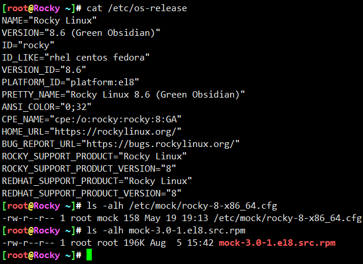
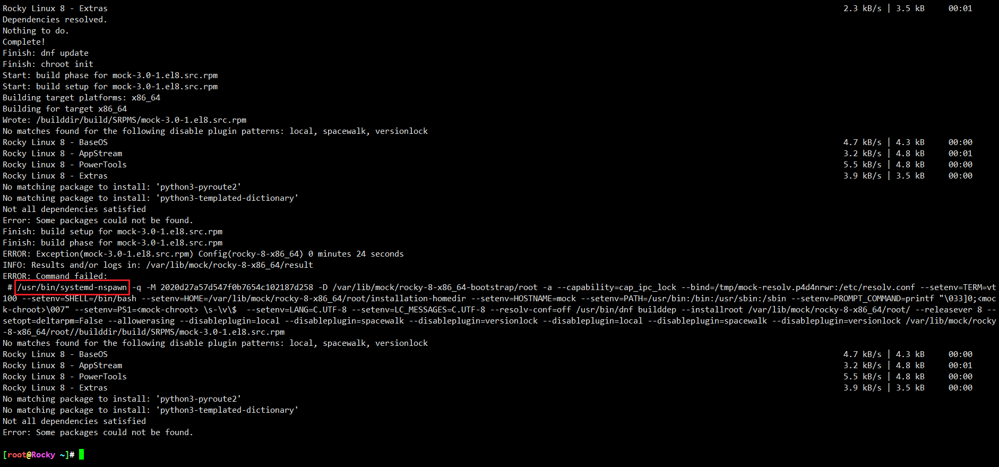
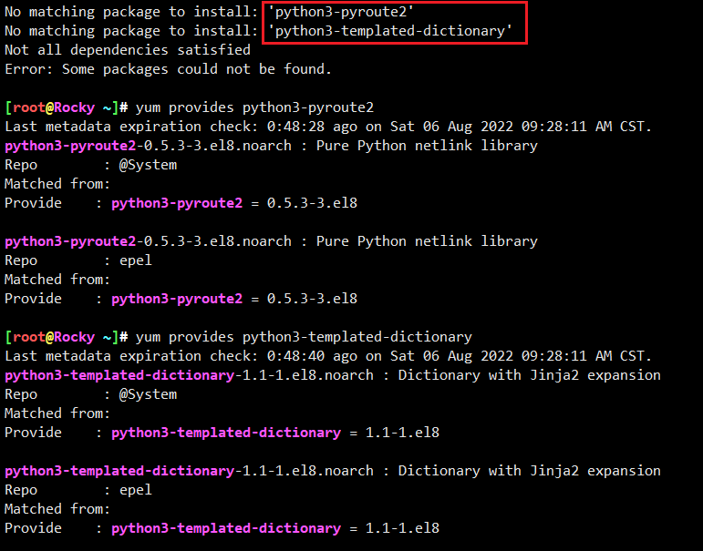
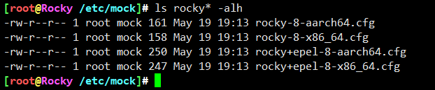
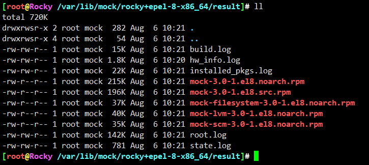
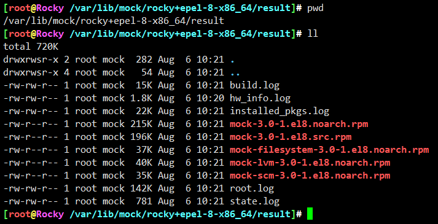

# 玩起来


* 原材料准备




```
[root@Rocky ~]# mock -r rocky-8-x86_64 mock-3.0-1.el8.src.rpm
run in /usr/libexec/mock/mock
INFO: mock.py version 3.0 starting (python version = 3.6.8, NVR = mock-3.0-1.el8)...
Start(bootstrap): init plugins
INFO: selinux disabled
Finish(bootstrap): init plugins
Start: init plugins
INFO: selinux disabled
Finish: init plugins
INFO: Signal handler active
Start: run
INFO: Start(mock-3.0-1.el8.src.rpm)  Config(rocky-8-x86_64)
Start: clean chroot
Finish: clean chroot
Start(bootstrap): chroot init
INFO: calling preinit hooks
INFO: enabled root cache
INFO: enabled package manager cache
Start(bootstrap): cleaning package manager metadata
Finish(bootstrap): cleaning package manager metadata
INFO: enabled HW Info plugin
Mock Version: 3.0
INFO: Mock Version: 3.0
Finish(bootstrap): chroot init
Start: chroot init
INFO: calling preinit hooks
INFO: enabled root cache
Start: unpacking root cache
Finish: unpacking root cache
INFO: enabled package manager cache
Start: cleaning package manager metadata
Finish: cleaning package manager metadata
INFO: enabled HW Info plugin
Mock Version: 3.0
INFO: Mock Version: 3.0
Start: dnf update
No matches found for the following disable plugin patterns: local, spacewalk, versionlock
Rocky Linux 8 - BaseOS                                                                                                                                                          2.2 kB/s | 4.3 kB     00:01    
Rocky Linux 8 - AppStream                                                                                                                                                       2.7 kB/s | 4.8 kB     00:01    
Rocky Linux 8 - PowerTools                                                                                                                                                      4.0 kB/s | 4.8 kB     00:01    
Rocky Linux 8 - Extras                                                                                                                                                          2.3 kB/s | 3.5 kB     00:01    
Dependencies resolved.
Nothing to do.
Complete!
Finish: dnf update
Finish: chroot init
Start: build phase for mock-3.0-1.el8.src.rpm
Start: build setup for mock-3.0-1.el8.src.rpm
Building target platforms: x86_64
Building for target x86_64
Wrote: /builddir/build/SRPMS/mock-3.0-1.el8.src.rpm
No matches found for the following disable plugin patterns: local, spacewalk, versionlock
Rocky Linux 8 - BaseOS                                                                                                                                                          4.7 kB/s | 4.3 kB     00:00    
Rocky Linux 8 - AppStream                                                                                                                                                       3.2 kB/s | 4.8 kB     00:01    
Rocky Linux 8 - PowerTools                                                                                                                                                      5.5 kB/s | 4.8 kB     00:00    
Rocky Linux 8 - Extras                                                                                                                                                          3.9 kB/s | 3.5 kB     00:00    
No matching package to install: 'python3-pyroute2'
No matching package to install: 'python3-templated-dictionary'
Not all dependencies satisfied
Error: Some packages could not be found.
Finish: build setup for mock-3.0-1.el8.src.rpm
Finish: build phase for mock-3.0-1.el8.src.rpm
ERROR: Exception(mock-3.0-1.el8.src.rpm) Config(rocky-8-x86_64) 0 minutes 24 seconds
INFO: Results and/or logs in: /var/lib/mock/rocky-8-x86_64/result
ERROR: Command failed:
 # /usr/bin/systemd-nspawn -q -M 2020d27a57d547f0b7654c102187d258 -D /var/lib/mock/rocky-8-x86_64-bootstrap/root -a --capability=cap_ipc_lock --bind=/tmp/mock-resolv.p4d4nrwr:/etc/resolv.conf --setenv=TERM=vt100 --setenv=SHELL=/bin/bash --setenv=HOME=/var/lib/mock/rocky-8-x86_64/root/installation-homedir --setenv=HOSTNAME=mock --setenv=PATH=/usr/bin:/bin:/usr/sbin:/sbin --setenv=PROMPT_COMMAND=printf "\033]0;<mock-chroot>\007" --setenv=PS1=<mock-chroot> \s-\v\$  --setenv=LANG=C.UTF-8 --setenv=LC_MESSAGES=C.UTF-8 --resolv-conf=off /usr/bin/dnf builddep --installroot /var/lib/mock/rocky-8-x86_64/root/ --releasever 8 --setopt=deltarpm=False --allowerasing --disableplugin=local --disableplugin=spacewalk --disableplugin=versionlock --disableplugin=local --disableplugin=spacewalk --disableplugin=versionlock /var/lib/mock/rocky-8-x86_64/root//builddir/build/SRPMS/mock-3.0-1.el8.src.rpm
No matches found for the following disable plugin patterns: local, spacewalk, versionlock
Rocky Linux 8 - BaseOS                                                                                                                                                          4.7 kB/s | 4.3 kB     00:00    
Rocky Linux 8 - AppStream                                                                                                                                                       3.2 kB/s | 4.8 kB     00:01    
Rocky Linux 8 - PowerTools                                                                                                                                                      5.5 kB/s | 4.8 kB     00:00    
Rocky Linux 8 - Extras                                                                                                                                                          3.9 kB/s | 3.5 kB     00:00    
No matching package to install: 'python3-pyroute2'
No matching package to install: 'python3-templated-dictionary'
Not all dependencies satisfied
Error: Some packages could not be found.
```

* 极速翻车，打扰了



* 长进了，不再是chroot了，也都知道systemd-nspawn这神器了，这工具确实很方便



两个依赖都是epel仓库里面的



翻一下/etc/mock下的配置，好家伙，这名字不能再显眼了，用错配置了。再来

```


## 总结

```
输入： 配置 + src.rpm包， 命令 mock -r rocky+epel-8-x86_64  mock-3.0-1.el8.src.rpm
中间过程： systemd-nspawn
输出: /var/lib/mock/rocky+epel-8-x86_64/result ,
```




## 完整构建过程

```
INFO: mock.py version 3.0 starting (python version = 3.6.8, NVR = mock-3.0-1.el8)...
Start(bootstrap): init plugins
INFO: selinux disabled
Finish(bootstrap): init plugins
Start: init plugins
INFO: selinux disabled
Finish: init plugins
INFO: Signal handler active
Start: run
INFO: Start(mock-3.0-1.el8.src.rpm)  Config(rocky+epel-8-x86_64)
Start: clean chroot
Finish: clean chroot
Start(bootstrap): chroot init
INFO: calling preinit hooks
INFO: enabled root cache
INFO: enabled package manager cache
Start(bootstrap): cleaning package manager metadata
Finish(bootstrap): cleaning package manager metadata
INFO: enabled HW Info plugin
Mock Version: 3.0
INFO: Mock Version: 3.0
Finish(bootstrap): chroot init
Start: chroot init
INFO: calling preinit hooks
INFO: enabled root cache
Start: unpacking root cache
Finish: unpacking root cache
INFO: enabled package manager cache
Start: cleaning package manager metadata
Finish: cleaning package manager metadata
INFO: enabled HW Info plugin
Mock Version: 3.0
INFO: Mock Version: 3.0
Start: dnf update
No matches found for the following disable plugin patterns: local, spacewalk, versionlock
Rocky Linux 8 - BaseOS                                                                                                                                                          616  B/s | 4.3 kB     00:07    
Rocky Linux 8 - BaseOS                                                                                                                                                          2.5 MB/s | 3.7 MB     00:01    
Rocky Linux 8 - AppStream                                                                                                                                                       5.0 kB/s | 4.8 kB     00:00    
Rocky Linux 8 - PowerTools                                                                                                                                                      2.8 kB/s | 4.8 kB     00:01    
Rocky Linux 8 - Extras                                                                                                                                                          2.2 kB/s | 3.5 kB     00:01    
Extra Packages for Enterprise Linux 8 - x86_64                                                                                                                                  3.4 kB/s | 4.7 kB     00:01    
Dependencies resolved.
Nothing to do.
Complete!
Finish: dnf update
Finish: chroot init
Start: build phase for mock-3.0-1.el8.src.rpm
Start: build setup for mock-3.0-1.el8.src.rpm
sh: /usr/bin/python3: No such file or directory
sh: /usr/bin/python3: No such file or directory
sh: /usr/bin/python3: No such file or directory
sh: /usr/bin/python3: No such file or directory
Building target platforms: x86_64
Building for target x86_64
Wrote: /builddir/build/SRPMS/mock-3.0-1.el8.src.rpm
No matches found for the following disable plugin patterns: local, spacewalk, versionlock
Rocky Linux 8 - BaseOS                                                                                                                                                          2.8 kB/s | 4.3 kB     00:01    
Rocky Linux 8 - AppStream                                                                                                                                                       5.3 kB/s | 4.8 kB     00:00    
Rocky Linux 8 - PowerTools                                                                                                                                                      5.4 kB/s | 4.8 kB     00:00    
Rocky Linux 8 - Extras                                                                                                                                                          564  B/s | 3.5 kB     00:06    
Extra Packages for Enterprise Linux 8 - x86_64                                                                                                                                  791  B/s | 4.7 kB     00:06    
Dependencies resolved.
================================================================================================================================================================================================================
 Package                                                   Architecture                        Version                                                             Repository                              Size
================================================================================================================================================================================================================
Installing:
 bash-completion                                           noarch                              1:2.7-5.el8                                                         baseos                                 272 k
 perl-interpreter                                          x86_64                              4:5.26.3-421.el8                                                    baseos                                 6.3 M
 python3-distro                                            noarch                              1.4.0-2.module+el8.3.0+120+426d8baf                                 appstream                               36 k
 python3-jinja2                                            noarch                              2.10.1-3.el8                                                        appstream                              537 k
 python3-pyroute2                                          noarch                              0.5.3-3.el8                                                         epel                                   503 k
 python3-pytest                                            noarch                              3.4.2-11.el8                                                        appstream                              1.3 M
 python3-requests                                          noarch                              2.20.0-2.1.el8_1                                                    baseos                                 122 k
 python3-templated-dictionary                              noarch                              1.1-1.el8                                                           epel                                    19 k
 python36-devel                                            x86_64                              3.6.8-38.module+el8.5.0+671+195e4563                                appstream                               15 k
Installing dependencies:
 groff-base                                                x86_64                              1.22.3-18.el8                                                       baseos                                 1.0 M
 perl-Carp                                                 noarch                              1.42-396.el8                                                        baseos                                  29 k
 perl-Encode                                               x86_64                              4:2.97-3.el8                                                        baseos                                 1.5 M
 perl-Errno                                                x86_64                              1.28-421.el8                                                        baseos                                  75 k
 perl-Exporter                                             noarch                              5.72-396.el8                                                        baseos                                  33 k
 perl-File-Path                                            noarch                              2.15-2.el8                                                          baseos                                  37 k
 perl-File-Temp                                            noarch                              0.230.600-1.el8                                                     baseos                                  62 k
 perl-Getopt-Long                                          noarch                              1:2.50-4.el8                                                        baseos                                  62 k
 perl-HTTP-Tiny                                            noarch                              0.074-1.el8                                                         baseos                                  57 k
 perl-IO                                                   x86_64                              1.38-421.el8                                                        baseos                                 141 k
 perl-MIME-Base64                                          x86_64                              3.15-396.el8                                                        baseos                                  30 k
 perl-PathTools                                            x86_64                              3.74-1.el8                                                          baseos                                  89 k
 perl-Pod-Escapes                                          noarch                              1:1.07-395.el8                                                      baseos                                  19 k
 perl-Pod-Perldoc                                          noarch                              3.28-396.el8                                                        baseos                                  85 k
 perl-Pod-Simple                                           noarch                              1:3.35-395.el8                                                      baseos                                 212 k
 perl-Pod-Usage                                            noarch                              4:1.69-395.el8                                                      baseos                                  33 k
 perl-Scalar-List-Utils                                    x86_64                              3:1.49-2.el8                                                        baseos                                  67 k
 perl-Socket                                               x86_64                              4:2.027-3.el8                                                       baseos                                  58 k
 perl-Storable                                             x86_64                              1:3.11-3.el8                                                        baseos                                  97 k
 perl-Term-ANSIColor                                       noarch                              4.06-396.el8                                                        baseos                                  45 k
 perl-Term-Cap                                             noarch                              1.17-395.el8                                                        baseos                                  22 k
 perl-Text-ParseWords                                      noarch                              3.30-395.el8                                                        baseos                                  17 k
 perl-Text-Tabs+Wrap                                       noarch                              2013.0523-395.el8                                                   baseos                                  23 k
 perl-Time-Local                                           noarch                              1:1.280-1.el8                                                       baseos                                  32 k
 perl-Unicode-Normalize                                    x86_64                              1.25-396.el8                                                        baseos                                  81 k
 perl-constant                                             noarch                              1.33-396.el8                                                        baseos                                  24 k
 perl-libs                                                 x86_64                              4:5.26.3-421.el8                                                    baseos                                 1.6 M
 perl-macros                                               x86_64                              4:5.26.3-421.el8                                                    baseos                                  71 k
 perl-parent                                               noarch                              1:0.237-1.el8                                                       baseos                                  19 k
 perl-podlators                                            noarch                              4.11-1.el8                                                          baseos                                 117 k
 perl-threads                                              x86_64                              1:2.21-2.el8                                                        baseos                                  60 k
 perl-threads-shared                                       x86_64                              1.58-2.el8                                                          baseos                                  47 k
 platform-python-devel                                     x86_64                              3.6.8-45.el8.rocky.0                                                appstream                              250 k
 platform-python-pip                                       noarch                              9.0.3-22.el8.rocky.0                                                baseos                                 1.6 M
 python3-attrs                                             noarch                              17.4.0-6.el8                                                        appstream                               52 k
 python3-babel                                             noarch                              2.5.1-7.el8                                                         appstream                              4.8 M
 python3-chardet                                           noarch                              3.0.4-7.el8                                                         baseos                                 194 k
 python3-idna                                              noarch                              2.5-5.el8                                                           baseos                                  96 k
 python3-markupsafe                                        x86_64                              0.23-19.el8                                                         appstream                               38 k
 python3-pip                                               noarch                              9.0.3-22.el8.rocky.0                                                appstream                               19 k
 python3-pluggy                                            noarch                              0.6.0-3.el8                                                         appstream                               31 k
 python3-py                                                noarch                              1.5.3-4.el8                                                         appstream                              471 k
 python3-pysocks                                           noarch                              1.6.8-3.el8                                                         baseos                                  33 k
 python3-pytz                                              noarch                              2017.2-9.el8                                                        appstream                               53 k
 python3-rpm-generators                                    noarch                              5-7.el8                                                             appstream                               24 k
 python3-setuptools                                        noarch                              39.2.0-6.el8                                                        baseos                                 162 k
 python3-six                                               noarch                              1.11.0-8.el8                                                        baseos                                  37 k
 python3-urllib3                                           noarch                              1.24.2-5.el8                                                        baseos                                 176 k
 python36                                                  x86_64                              3.6.8-38.module+el8.5.0+671+195e4563                                appstream                               18 k
 python36-rpm-macros                                       noarch                              3.6.8-38.module+el8.5.0+671+195e4563                                appstream                               14 k
Enabling module streams:
 python36                                                                                      3.6                                                                                                             

Transaction Summary
================================================================================================================================================================================================================
Install  59 Packages

Total download size: 23 M
Installed size: 83 M
Downloading Packages:
(1/59): perl-Carp-1.42-396.el8.noarch.rpm                                                                                                                                       131 kB/s |  29 kB     00:00    
(2/59): bash-completion-2.7-5.el8.noarch.rpm                                                                                                                                    680 kB/s | 272 kB     00:00    
(3/59): perl-Errno-1.28-421.el8.x86_64.rpm                                                                                                                                      1.2 MB/s |  75 kB     00:00    
(4/59): perl-Exporter-5.72-396.el8.noarch.rpm                                                                                                                                   556 kB/s |  33 kB     00:00    
(5/59): groff-base-1.22.3-18.el8.x86_64.rpm                                                                                                                                     1.9 MB/s | 1.0 MB     00:00    
(6/59): perl-File-Path-2.15-2.el8.noarch.rpm                                                                                                                                    605 kB/s |  37 kB     00:00    
(7/59): perl-Encode-2.97-3.el8.x86_64.rpm                                                                                                                                       3.9 MB/s | 1.5 MB     00:00    
(8/59): perl-File-Temp-0.230.600-1.el8.noarch.rpm                                                                                                                               973 kB/s |  62 kB     00:00    
(9/59): perl-Getopt-Long-2.50-4.el8.noarch.rpm                                                                                                                                  1.0 MB/s |  62 kB     00:00    
(10/59): perl-HTTP-Tiny-0.074-1.el8.noarch.rpm                                                                                                                                  903 kB/s |  57 kB     00:00    
(11/59): perl-IO-1.38-421.el8.x86_64.rpm                                                                                                                                        2.1 MB/s | 141 kB     00:00    
(12/59): perl-MIME-Base64-3.15-396.el8.x86_64.rpm                                                                                                                               509 kB/s |  30 kB     00:00    
(13/59): perl-PathTools-3.74-1.el8.x86_64.rpm                                                                                                                                   1.4 MB/s |  89 kB     00:00    
(14/59): perl-Pod-Escapes-1.07-395.el8.noarch.rpm                                                                                                                               304 kB/s |  19 kB     00:00    
(15/59): perl-Pod-Perldoc-3.28-396.el8.noarch.rpm                                                                                                                               1.3 MB/s |  85 kB     00:00    
(16/59): perl-Pod-Simple-3.35-395.el8.noarch.rpm                                                                                                                                3.0 MB/s | 212 kB     00:00    
(17/59): perl-Pod-Usage-1.69-395.el8.noarch.rpm                                                                                                                                 534 kB/s |  33 kB     00:00    
(18/59): perl-Scalar-List-Utils-1.49-2.el8.x86_64.rpm                                                                                                                           1.1 MB/s |  67 kB     00:00    
(19/59): perl-Socket-2.027-3.el8.x86_64.rpm                                                                                                                                     898 kB/s |  58 kB     00:00    
(20/59): perl-Storable-3.11-3.el8.x86_64.rpm                                                                                                                                    1.5 MB/s |  97 kB     00:00    
(21/59): perl-Term-ANSIColor-4.06-396.el8.noarch.rpm                                                                                                                            759 kB/s |  45 kB     00:00    
(22/59): perl-Term-Cap-1.17-395.el8.noarch.rpm                                                                                                                                  347 kB/s |  22 kB     00:00    
(23/59): perl-Text-ParseWords-3.30-395.el8.noarch.rpm                                                                                                                           272 kB/s |  17 kB     00:00    
(24/59): perl-Text-Tabs+Wrap-2013.0523-395.el8.noarch.rpm                                                                                                                       388 kB/s |  23 kB     00:00    
(25/59): perl-Time-Local-1.280-1.el8.noarch.rpm                                                                                                                                 512 kB/s |  32 kB     00:00    
(26/59): perl-Unicode-Normalize-1.25-396.el8.x86_64.rpm                                                                                                                         1.2 MB/s |  81 kB     00:00    
(27/59): perl-constant-1.33-396.el8.noarch.rpm                                                                                                                                  409 kB/s |  24 kB     00:00    
(28/59): perl-macros-5.26.3-421.el8.x86_64.rpm                                                                                                                                  983 kB/s |  71 kB     00:00    
(29/59): perl-libs-5.26.3-421.el8.x86_64.rpm                                                                                                                                     10 MB/s | 1.6 MB     00:00    
(30/59): perl-parent-0.237-1.el8.noarch.rpm                                                                                                                                     264 kB/s |  19 kB     00:00    
(31/59): perl-podlators-4.11-1.el8.noarch.rpm                                                                                                                                   1.8 MB/s | 117 kB     00:00    
(32/59): perl-threads-2.21-2.el8.x86_64.rpm                                                                                                                                     939 kB/s |  60 kB     00:00    
(33/59): perl-interpreter-5.26.3-421.el8.x86_64.rpm                                                                                                                              22 MB/s | 6.3 MB     00:00    
(34/59): perl-threads-shared-1.58-2.el8.x86_64.rpm                                                                                                                              680 kB/s |  47 kB     00:00    
(35/59): python3-idna-2.5-5.el8.noarch.rpm                                                                                                                                      1.5 MB/s |  96 kB     00:00    
(36/59): python3-chardet-3.0.4-7.el8.noarch.rpm                                                                                                                                 1.9 MB/s | 194 kB     00:00    
(37/59): platform-python-pip-9.0.3-22.el8.rocky.0.noarch.rpm                                                                                                                    8.3 MB/s | 1.6 MB     00:00    
(38/59): python3-pysocks-1.6.8-3.el8.noarch.rpm                                                                                                                                 480 kB/s |  33 kB     00:00    
(39/59): python3-requests-2.20.0-2.1.el8_1.noarch.rpm                                                                                                                           119 kB/s | 122 kB     00:01    
(40/59): python3-six-1.11.0-8.el8.noarch.rpm                                                                                                                                     37 kB/s |  37 kB     00:00    
(41/59): python3-setuptools-39.2.0-6.el8.noarch.rpm                                                                                                                             162 kB/s | 162 kB     00:00    
(42/59): python3-attrs-17.4.0-6.el8.noarch.rpm                                                                                                                                  675 kB/s |  52 kB     00:00    
(43/59): platform-python-devel-3.6.8-45.el8.rocky.0.x86_64.rpm                                                                                                                  1.6 MB/s | 250 kB     00:00    
(44/59): python3-distro-1.4.0-2.module+el8.3.0+120+426d8baf.noarch.rpm                                                                                                          496 kB/s |  36 kB     00:00    
(45/59): python3-urllib3-1.24.2-5.el8.noarch.rpm                                                                                                                                687 kB/s | 176 kB     00:00    
(46/59): python3-jinja2-2.10.1-3.el8.noarch.rpm                                                                                                                                 4.4 MB/s | 537 kB     00:00    
(47/59): python3-markupsafe-0.23-19.el8.x86_64.rpm                                                                                                                              386 kB/s |  38 kB     00:00    
(48/59): python3-babel-2.5.1-7.el8.noarch.rpm                                                                                                                                    14 MB/s | 4.8 MB     00:00    
(49/59): python3-pip-9.0.3-22.el8.rocky.0.noarch.rpm                                                                                                                            228 kB/s |  19 kB     00:00    
(50/59): python3-pluggy-0.6.0-3.el8.noarch.rpm                                                                                                                                  355 kB/s |  31 kB     00:00    
(51/59): python3-py-1.5.3-4.el8.noarch.rpm                                                                                                                                      5.6 MB/s | 471 kB     00:00    
(52/59): python3-pytz-2017.2-9.el8.noarch.rpm                                                                                                                                   697 kB/s |  53 kB     00:00    
(53/59): python3-pytest-3.4.2-11.el8.noarch.rpm                                                                                                                                 8.9 MB/s | 1.3 MB     00:00    
(54/59): python36-3.6.8-38.module+el8.5.0+671+195e4563.x86_64.rpm                                                                                                               265 kB/s |  18 kB     00:00    
(55/59): python3-rpm-generators-5-7.el8.noarch.rpm                                                                                                                              301 kB/s |  24 kB     00:00    
(56/59): python36-rpm-macros-3.6.8-38.module+el8.5.0+671+195e4563.noarch.rpm                                                                                                    197 kB/s |  14 kB     00:00    
(57/59): python36-devel-3.6.8-38.module+el8.5.0+671+195e4563.x86_64.rpm                                                                                                         195 kB/s |  15 kB     00:00    
(58/59): python3-templated-dictionary-1.1-1.el8.noarch.rpm                                                                                                                       88 kB/s |  19 kB     00:00    
(59/59): python3-pyroute2-0.5.3-3.el8.noarch.rpm                                                                                                                                929 kB/s | 503 kB     00:00    
----------------------------------------------------------------------------------------------------------------------------------------------------------------------------------------------------------------
Total                                                                                                                                                                           3.5 MB/s |  23 MB     00:06     
Running transaction check
Transaction check succeeded.
Running transaction test
Transaction test succeeded.
Running transaction
  Preparing        :                                                                                                                                                                                        1/1
  Installing       : python3-six-1.11.0-8.el8.noarch                                                                                                                                                       1/59
  Installing       : python3-rpm-generators-5-7.el8.noarch                                                                                                                                                 2/59
  Installing       : platform-python-devel-3.6.8-45.el8.rocky.0.x86_64                                                                                                                                     3/59
  Installing       : python3-pytz-2017.2-9.el8.noarch                                                                                                                                                      4/59
  Installing       : python3-babel-2.5.1-7.el8.noarch                                                                                                                                                      5/59
  Installing       : python3-py-1.5.3-4.el8.noarch                                                                                                                                                         6/59
  Installing       : python3-pluggy-0.6.0-3.el8.noarch                                                                                                                                                     7/59
  Installing       : python3-markupsafe-0.23-19.el8.x86_64                                                                                                                                                 8/59
  Installing       : python3-jinja2-2.10.1-3.el8.noarch                                                                                                                                                    9/59
  Installing       : python3-attrs-17.4.0-6.el8.noarch                                                                                                                                                    10/59
  Installing       : python3-setuptools-39.2.0-6.el8.noarch                                                                                                                                               11/59
  Installing       : python3-pysocks-1.6.8-3.el8.noarch                                                                                                                                                   12/59
  Installing       : python3-urllib3-1.24.2-5.el8.noarch                                                                                                                                                  13/59
  Installing       : python3-idna-2.5-5.el8.noarch                                                                                                                                                        14/59
  Installing       : python3-chardet-3.0.4-7.el8.noarch                                                                                                                                                   15/59
  Installing       : platform-python-pip-9.0.3-22.el8.rocky.0.noarch                                                                                                                                      16/59
  Installing       : python36-3.6.8-38.module+el8.5.0+671+195e4563.x86_64                                                                                                                                 17/59
  Running scriptlet: python36-3.6.8-38.module+el8.5.0+671+195e4563.x86_64                                                                                                                                 17/59
  Installing       : python3-pip-9.0.3-22.el8.rocky.0.noarch                                                                                                                                              18/59
  Installing       : groff-base-1.22.3-18.el8.x86_64                                                                                                                                                      19/59
  Installing       : perl-Pod-Escapes-1:1.07-395.el8.noarch                                                                                                                                               20/59
  Installing       : perl-Time-Local-1:1.280-1.el8.noarch                                                                                                                                                 21/59
  Installing       : perl-Term-ANSIColor-4.06-396.el8.noarch                                                                                                                                              22/59
  Installing       : perl-Term-Cap-1.17-395.el8.noarch                                                                                                                                                    23/59
  Installing       : perl-File-Temp-0.230.600-1.el8.noarch                                                                                                                                                24/59
  Installing       : perl-HTTP-Tiny-0.074-1.el8.noarch                                                                                                                                                    25/59
  Installing       : perl-Pod-Simple-1:3.35-395.el8.noarch                                                                                                                                                26/59
  Installing       : perl-podlators-4.11-1.el8.noarch                                                                                                                                                     27/59
  Installing       : perl-Pod-Perldoc-3.28-396.el8.noarch                                                                                                                                                 28/59
  Installing       : perl-Text-ParseWords-3.30-395.el8.noarch                                                                                                                                             29/59
  Installing       : perl-Pod-Usage-4:1.69-395.el8.noarch                                                                                                                                                 30/59
  Installing       : perl-MIME-Base64-3.15-396.el8.x86_64                                                                                                                                                 31/59
  Installing       : perl-Storable-1:3.11-3.el8.x86_64                                                                                                                                                    32/59
  Installing       : perl-Getopt-Long-1:2.50-4.el8.noarch                                                                                                                                                 33/59
  Installing       : perl-Errno-1.28-421.el8.x86_64                                                                                                                                                       34/59
  Installing       : perl-Socket-4:2.027-3.el8.x86_64                                                                                                                                                     35/59
  Installing       : perl-Encode-4:2.97-3.el8.x86_64                                                                                                                                                      36/59
  Installing       : perl-Carp-1.42-396.el8.noarch                                                                                                                                                        37/59
  Installing       : perl-Exporter-5.72-396.el8.noarch                                                                                                                                                    38/59
  Installing       : perl-libs-4:5.26.3-421.el8.x86_64                                                                                                                                                    39/59
  Installing       : perl-parent-1:0.237-1.el8.noarch                                                                                                                                                     40/59
  Installing       : perl-Scalar-List-Utils-3:1.49-2.el8.x86_64                                                                                                                                           41/59
  Installing       : perl-macros-4:5.26.3-421.el8.x86_64                                                                                                                                                  42/59
  Installing       : perl-Text-Tabs+Wrap-2013.0523-395.el8.noarch                                                                                                                                         43/59
  Installing       : perl-Unicode-Normalize-1.25-396.el8.x86_64                                                                                                                                           44/59
  Installing       : perl-File-Path-2.15-2.el8.noarch                                                                                                                                                     45/59
  Installing       : perl-IO-1.38-421.el8.x86_64                                                                                                                                                          46/59
  Installing       : perl-PathTools-3.74-1.el8.x86_64                                                                                                                                                     47/59
  Installing       : perl-constant-1.33-396.el8.noarch                                                                                                                                                    48/59
  Installing       : perl-threads-1:2.21-2.el8.x86_64                                                                                                                                                     49/59
  Installing       : perl-threads-shared-1.58-2.el8.x86_64                                                                                                                                                50/59
  Installing       : perl-interpreter-4:5.26.3-421.el8.x86_64                                                                                                                                             51/59
  Installing       : python36-devel-3.6.8-38.module+el8.5.0+671+195e4563.x86_64                                                                                                                           52/59
  Running scriptlet: python36-devel-3.6.8-38.module+el8.5.0+671+195e4563.x86_64                                                                                                                           52/59
  Installing       : python3-requests-2.20.0-2.1.el8_1.noarch                                                                                                                                             53/59
  Installing       : python3-pytest-3.4.2-11.el8.noarch                                                                                                                                                   54/59
  Installing       : python3-templated-dictionary-1.1-1.el8.noarch                                                                                                                                        55/59
  Installing       : python3-pyroute2-0.5.3-3.el8.noarch                                                                                                                                                  56/59
  Installing       : python36-rpm-macros-3.6.8-38.module+el8.5.0+671+195e4563.noarch                                                                                                                      57/59
  Installing       : python3-distro-1.4.0-2.module+el8.3.0+120+426d8baf.noarch                                                                                                                            58/59
  Installing       : bash-completion-1:2.7-5.el8.noarch                                                                                                                                                   59/59
  Running scriptlet: bash-completion-1:2.7-5.el8.noarch                                                                                                                                                   59/59
  Verifying        : bash-completion-1:2.7-5.el8.noarch                                                                                                                                                    1/59
  Verifying        : groff-base-1.22.3-18.el8.x86_64                                                                                                                                                       2/59
  Verifying        : perl-Carp-1.42-396.el8.noarch                                                                                                                                                         3/59
  Verifying        : perl-Encode-4:2.97-3.el8.x86_64                                                                                                                                                       4/59
  Verifying        : perl-Errno-1.28-421.el8.x86_64                                                                                                                                                        5/59
  Verifying        : perl-Exporter-5.72-396.el8.noarch                                                                                                                                                     6/59
  Verifying        : perl-File-Path-2.15-2.el8.noarch                                                                                                                                                      7/59
  Verifying        : perl-File-Temp-0.230.600-1.el8.noarch                                                                                                                                                 8/59
  Verifying        : perl-Getopt-Long-1:2.50-4.el8.noarch                                                                                                                                                  9/59
  Verifying        : perl-HTTP-Tiny-0.074-1.el8.noarch                                                                                                                                                    10/59
  Verifying        : perl-IO-1.38-421.el8.x86_64                                                                                                                                                          11/59
  Verifying        : perl-MIME-Base64-3.15-396.el8.x86_64                                                                                                                                                 12/59
  Verifying        : perl-PathTools-3.74-1.el8.x86_64                                                                                                                                                     13/59
  Verifying        : perl-Pod-Escapes-1:1.07-395.el8.noarch                                                                                                                                               14/59
  Verifying        : perl-Pod-Perldoc-3.28-396.el8.noarch                                                                                                                                                 15/59
  Verifying        : perl-Pod-Simple-1:3.35-395.el8.noarch                                                                                                                                                16/59
  Verifying        : perl-Pod-Usage-4:1.69-395.el8.noarch                                                                                                                                                 17/59
  Verifying        : perl-Scalar-List-Utils-3:1.49-2.el8.x86_64                                                                                                                                           18/59
  Verifying        : perl-Socket-4:2.027-3.el8.x86_64                                                                                                                                                     19/59
  Verifying        : perl-Storable-1:3.11-3.el8.x86_64                                                                                                                                                    20/59
  Verifying        : perl-Term-ANSIColor-4.06-396.el8.noarch                                                                                                                                              21/59
  Verifying        : perl-Term-Cap-1.17-395.el8.noarch                                                                                                                                                    22/59
  Verifying        : perl-Text-ParseWords-3.30-395.el8.noarch                                                                                                                                             23/59
  Verifying        : perl-Text-Tabs+Wrap-2013.0523-395.el8.noarch                                                                                                                                         24/59
  Verifying        : perl-Time-Local-1:1.280-1.el8.noarch                                                                                                                                                 25/59
  Verifying        : perl-Unicode-Normalize-1.25-396.el8.x86_64                                                                                                                                           26/59
  Verifying        : perl-constant-1.33-396.el8.noarch                                                                                                                                                    27/59
  Verifying        : perl-interpreter-4:5.26.3-421.el8.x86_64                                                                                                                                             28/59
  Verifying        : perl-libs-4:5.26.3-421.el8.x86_64                                                                                                                                                    29/59
  Verifying        : perl-macros-4:5.26.3-421.el8.x86_64                                                                                                                                                  30/59
  Verifying        : perl-parent-1:0.237-1.el8.noarch                                                                                                                                                     31/59
  Verifying        : perl-podlators-4.11-1.el8.noarch                                                                                                                                                     32/59
  Verifying        : perl-threads-1:2.21-2.el8.x86_64                                                                                                                                                     33/59
  Verifying        : perl-threads-shared-1.58-2.el8.x86_64                                                                                                                                                34/59
  Verifying        : platform-python-pip-9.0.3-22.el8.rocky.0.noarch                                                                                                                                      35/59
  Verifying        : python3-chardet-3.0.4-7.el8.noarch                                                                                                                                                   36/59
  Verifying        : python3-idna-2.5-5.el8.noarch                                                                                                                                                        37/59
  Verifying        : python3-pysocks-1.6.8-3.el8.noarch                                                                                                                                                   38/59
  Verifying        : python3-requests-2.20.0-2.1.el8_1.noarch                                                                                                                                             39/59
  Verifying        : python3-setuptools-39.2.0-6.el8.noarch                                                                                                                                               40/59
  Verifying        : python3-six-1.11.0-8.el8.noarch                                                                                                                                                      41/59
  Verifying        : python3-urllib3-1.24.2-5.el8.noarch                                                                                                                                                  42/59
  Verifying        : platform-python-devel-3.6.8-45.el8.rocky.0.x86_64                                                                                                                                    43/59
  Verifying        : python3-attrs-17.4.0-6.el8.noarch                                                                                                                                                    44/59
  Verifying        : python3-babel-2.5.1-7.el8.noarch                                                                                                                                                     45/59
  Verifying        : python3-distro-1.4.0-2.module+el8.3.0+120+426d8baf.noarch                                                                                                                            46/59
  Verifying        : python3-jinja2-2.10.1-3.el8.noarch                                                                                                                                                   47/59
  Verifying        : python3-markupsafe-0.23-19.el8.x86_64                                                                                                                                                48/59
  Verifying        : python3-pip-9.0.3-22.el8.rocky.0.noarch                                                                                                                                              49/59
  Verifying        : python3-pluggy-0.6.0-3.el8.noarch                                                                                                                                                    50/59
  Verifying        : python3-py-1.5.3-4.el8.noarch                                                                                                                                                        51/59
  Verifying        : python3-pytest-3.4.2-11.el8.noarch                                                                                                                                                   52/59
  Verifying        : python3-pytz-2017.2-9.el8.noarch                                                                                                                                                     53/59
  Verifying        : python3-rpm-generators-5-7.el8.noarch                                                                                                                                                54/59
  Verifying        : python36-3.6.8-38.module+el8.5.0+671+195e4563.x86_64                                                                                                                                 55/59
  Verifying        : python36-devel-3.6.8-38.module+el8.5.0+671+195e4563.x86_64                                                                                                                           56/59
  Verifying        : python36-rpm-macros-3.6.8-38.module+el8.5.0+671+195e4563.noarch                                                                                                                      57/59
  Verifying        : python3-pyroute2-0.5.3-3.el8.noarch                                                                                                                                                  58/59
  Verifying        : python3-templated-dictionary-1.1-1.el8.noarch                                                                                                                                        59/59

Installed:
  bash-completion-1:2.7-5.el8.noarch                                   groff-base-1.22.3-18.el8.x86_64                                           perl-Carp-1.42-396.el8.noarch                                 
  perl-Encode-4:2.97-3.el8.x86_64                                      perl-Errno-1.28-421.el8.x86_64                                            perl-Exporter-5.72-396.el8.noarch                             
  perl-File-Path-2.15-2.el8.noarch                                     perl-File-Temp-0.230.600-1.el8.noarch                                     perl-Getopt-Long-1:2.50-4.el8.noarch                          
  perl-HTTP-Tiny-0.074-1.el8.noarch                                    perl-IO-1.38-421.el8.x86_64                                               perl-MIME-Base64-3.15-396.el8.x86_64                          
  perl-PathTools-3.74-1.el8.x86_64                                     perl-Pod-Escapes-1:1.07-395.el8.noarch                                    perl-Pod-Perldoc-3.28-396.el8.noarch                          
  perl-Pod-Simple-1:3.35-395.el8.noarch                                perl-Pod-Usage-4:1.69-395.el8.noarch                                      perl-Scalar-List-Utils-3:1.49-2.el8.x86_64                    
  perl-Socket-4:2.027-3.el8.x86_64                                     perl-Storable-1:3.11-3.el8.x86_64                                         perl-Term-ANSIColor-4.06-396.el8.noarch                       
  perl-Term-Cap-1.17-395.el8.noarch                                    perl-Text-ParseWords-3.30-395.el8.noarch                                  perl-Text-Tabs+Wrap-2013.0523-395.el8.noarch                  
  perl-Time-Local-1:1.280-1.el8.noarch                                 perl-Unicode-Normalize-1.25-396.el8.x86_64                                perl-constant-1.33-396.el8.noarch                             
  perl-interpreter-4:5.26.3-421.el8.x86_64                             perl-libs-4:5.26.3-421.el8.x86_64                                         perl-macros-4:5.26.3-421.el8.x86_64                           
  perl-parent-1:0.237-1.el8.noarch                                     perl-podlators-4.11-1.el8.noarch                                          perl-threads-1:2.21-2.el8.x86_64                              
  perl-threads-shared-1.58-2.el8.x86_64                                platform-python-devel-3.6.8-45.el8.rocky.0.x86_64                         platform-python-pip-9.0.3-22.el8.rocky.0.noarch               
  python3-attrs-17.4.0-6.el8.noarch                                    python3-babel-2.5.1-7.el8.noarch                                          python3-chardet-3.0.4-7.el8.noarch                            
  python3-distro-1.4.0-2.module+el8.3.0+120+426d8baf.noarch            python3-idna-2.5-5.el8.noarch                                             python3-jinja2-2.10.1-3.el8.noarch                            
  python3-markupsafe-0.23-19.el8.x86_64                                python3-pip-9.0.3-22.el8.rocky.0.noarch                                   python3-pluggy-0.6.0-3.el8.noarch                             
  python3-py-1.5.3-4.el8.noarch                                        python3-pyroute2-0.5.3-3.el8.noarch                                       python3-pysocks-1.6.8-3.el8.noarch                            
  python3-pytest-3.4.2-11.el8.noarch                                   python3-pytz-2017.2-9.el8.noarch                                          python3-requests-2.20.0-2.1.el8_1.noarch                      
  python3-rpm-generators-5-7.el8.noarch                                python3-setuptools-39.2.0-6.el8.noarch                                    python3-six-1.11.0-8.el8.noarch                               
  python3-templated-dictionary-1.1-1.el8.noarch                        python3-urllib3-1.24.2-5.el8.noarch                                       python36-3.6.8-38.module+el8.5.0+671+195e4563.x86_64          
  python36-devel-3.6.8-38.module+el8.5.0+671+195e4563.x86_64           python36-rpm-macros-3.6.8-38.module+el8.5.0+671+195e4563.noarch          

Complete!
Finish: build setup for mock-3.0-1.el8.src.rpm
Start: Outputting list of installed packages
Finish: Outputting list of installed packages
Start: rpmbuild mock-3.0-1.el8.src.rpm
Building target platforms: x86_64
Building for target x86_64
Executing(%prep): /bin/sh -e /var/tmp/rpm-tmp.uZx0hC
+ umask 022
+ cd /builddir/build/BUILD
+ cd /builddir/build/BUILD
+ rm -rf mock-3.0
+ /usr/bin/gzip -dc /builddir/build/SOURCES/mock-3.0.tar.gz
+ /usr/bin/tar -xof -
+ STATUS=0
+ '[' 0 -ne 0 ']'
+ cd mock-3.0
+ /usr/bin/chmod -Rf a+rX,u+w,g-w,o-w .
+ for file in py/mock.py py/mock-parse-buildlog.py
+ sed -i '1s|#!/usr/bin/python3 |#!/usr/bin/python3 |' py/mock.py
+ for file in py/mock.py py/mock-parse-buildlog.py
+ sed -i '1s|#!/usr/bin/python3 |#!/usr/bin/python3 |' py/mock-parse-buildlog.py
+ exit 0
Executing(%build): /bin/sh -e /var/tmp/rpm-tmp.HigDst
+ umask 022
+ cd /builddir/build/BUILD
+ cd mock-3.0
+ for i in py/mockbuild/constants.py py/mock-parse-buildlog.py
+ perl -p -i -e 's|^VERSION\s*=.*|VERSION="3.0"|' py/mockbuild/constants.py
+ perl -p -i -e 's|^SYSCONFDIR\s*=.*|SYSCONFDIR="/etc"|' py/mockbuild/constants.py
+ perl -p -i -e 's|^PYTHONDIR\s*=.*|PYTHONDIR="/usr/lib/python3.6/site-packages"|' py/mockbuild/constants.py
+ perl -p -i -e 's|^PKGPYTHONDIR\s*=.*|PKGPYTHONDIR="/usr/lib/python3.6/site-packages/mockbuild"|' py/mockbuild/constants.py
+ for i in py/mockbuild/constants.py py/mock-parse-buildlog.py
+ perl -p -i -e 's|^VERSION\s*=.*|VERSION="3.0"|' py/mock-parse-buildlog.py
+ perl -p -i -e 's|^SYSCONFDIR\s*=.*|SYSCONFDIR="/etc"|' py/mock-parse-buildlog.py
+ perl -p -i -e 's|^PYTHONDIR\s*=.*|PYTHONDIR="/usr/lib/python3.6/site-packages"|' py/mock-parse-buildlog.py
+ perl -p -i -e 's|^PKGPYTHONDIR\s*=.*|PKGPYTHONDIR="/usr/lib/python3.6/site-packages/mockbuild"|' py/mock-parse-buildlog.py
+ for i in docs/mock.1 docs/mock-parse-buildlog.1
+ perl -p -i -e 's|\@VERSION\@|3.0"|' docs/mock.1
+ for i in docs/mock.1 docs/mock-parse-buildlog.1
+ perl -p -i -e 's|\@VERSION\@|3.0"|' docs/mock-parse-buildlog.1
+ exit 0
Executing(%install): /bin/sh -e /var/tmp/rpm-tmp.NDu1qH
+ umask 022
+ cd /builddir/build/BUILD
+ '[' /builddir/build/BUILDROOT/mock-3.0-1.el8.x86_64 '!=' / ']'
+ rm -rf /builddir/build/BUILDROOT/mock-3.0-1.el8.x86_64
++ dirname /builddir/build/BUILDROOT/mock-3.0-1.el8.x86_64
+ mkdir -p /builddir/build/BUILDROOT
+ mkdir /builddir/build/BUILDROOT/mock-3.0-1.el8.x86_64
+ cd mock-3.0
+ mkdir -p /builddir/build/BUILDROOT/mock-3.0-1.el8.x86_64/etc/mock/eol/templates
+ mkdir -p /builddir/build/BUILDROOT/mock-3.0-1.el8.x86_64/etc/mock/templates
+ install -d /builddir/build/BUILDROOT/mock-3.0-1.el8.x86_64/usr/bin
+ install -d /builddir/build/BUILDROOT/mock-3.0-1.el8.x86_64/usr/libexec/mock
+ install mockchain /builddir/build/BUILDROOT/mock-3.0-1.el8.x86_64/usr/bin/mockchain
+ install py/mock-parse-buildlog.py /builddir/build/BUILDROOT/mock-3.0-1.el8.x86_64/usr/bin/mock-parse-buildlog
+ install py/mock.py /builddir/build/BUILDROOT/mock-3.0-1.el8.x86_64/usr/libexec/mock/mock
+ ln -s consolehelper /builddir/build/BUILDROOT/mock-3.0-1.el8.x86_64/usr/bin/mock
+ install create_default_route_in_container.sh /builddir/build/BUILDROOT/mock-3.0-1.el8.x86_64/usr/libexec/mock/
+ install -d /builddir/build/BUILDROOT/mock-3.0-1.el8.x86_64/etc/pam.d
+ cp -a etc/pam/mock /builddir/build/BUILDROOT/mock-3.0-1.el8.x86_64/etc/pam.d/
+ install -d /builddir/build/BUILDROOT/mock-3.0-1.el8.x86_64/etc/mock
+ cp -a etc/mock/logging.ini /builddir/build/BUILDROOT/mock-3.0-1.el8.x86_64/etc/mock/
+ install -d /builddir/build/BUILDROOT/mock-3.0-1.el8.x86_64/etc/security/console.apps/
+ cp -a etc/consolehelper/mock /builddir/build/BUILDROOT/mock-3.0-1.el8.x86_64/etc/security/console.apps/mock
+ install -d /builddir/build/BUILDROOT/mock-3.0-1.el8.x86_64/usr/share/bash-completion/completions/
+ cp -a etc/bash_completion.d/mock /builddir/build/BUILDROOT/mock-3.0-1.el8.x86_64/usr/share/bash-completion/completions/
+ ln -s mock /builddir/build/BUILDROOT/mock-3.0-1.el8.x86_64/usr/share/bash-completion/completions/mock-parse-buildlog
+ install -d /builddir/build/BUILDROOT/mock-3.0-1.el8.x86_64/etc/pki/mock
+ cp -a etc/pki/README.txt /builddir/build/BUILDROOT/mock-3.0-1.el8.x86_64/etc/pki/mock/
+ install -d /builddir/build/BUILDROOT/mock-3.0-1.el8.x86_64/usr/lib/python3.6/site-packages/
+ cp -a py/mockbuild /builddir/build/BUILDROOT/mock-3.0-1.el8.x86_64/usr/lib/python3.6/site-packages/
+ install -d /builddir/build/BUILDROOT/mock-3.0-1.el8.x86_64/usr/share/man/man1
+ cp -a docs/mock.1 docs/mock-parse-buildlog.1 /builddir/build/BUILDROOT/mock-3.0-1.el8.x86_64/usr/share/man/man1/
+ install -d /builddir/build/BUILDROOT/mock-3.0-1.el8.x86_64/usr/share/cheat
+ cp -a docs/mock.cheat /builddir/build/BUILDROOT/mock-3.0-1.el8.x86_64/usr/share/cheat/mock
+ install -d /builddir/build/BUILDROOT/mock-3.0-1.el8.x86_64/var/lib/mock
+ install -d /builddir/build/BUILDROOT/mock-3.0-1.el8.x86_64/var/cache/mock
+ mkdir -p /builddir/build/BUILDROOT/mock-3.0-1.el8.x86_64/usr/share/doc/mock
+ install -p -m 0644 docs/site-defaults.cfg /builddir/build/BUILDROOT/mock-3.0-1.el8.x86_64/usr/share/doc/mock
+ sed -i 's/^_MOCK_NVR = None$/_MOCK_NVR = "mock-3.0-1.el8"/' /builddir/build/BUILDROOT/mock-3.0-1.el8.x86_64/usr/libexec/mock/mock
+ /usr/lib/rpm/find-debuginfo.sh -j28 --strict-build-id -m -i --build-id-seed 3.0-1.el8 --unique-debug-suffix -3.0-1.el8.x86_64 --unique-debug-src-base mock-3.0-1.el8.x86_64 --run-dwz --dwz-low-mem-die-limit 10000000 --dwz-max-die-limit 110000000 -S debugsourcefiles.list /builddir/build/BUILD/mock-3.0
find: 'debug': No such file or directory
+ /usr/lib/rpm/check-buildroot
+ /usr/lib/rpm/redhat/brp-ldconfig
/sbin/ldconfig: Warning: ignoring configuration file that cannot be opened: /etc/ld.so.conf: No such file or directory
+ /usr/lib/rpm/brp-compress
+ /usr/lib/rpm/brp-strip-static-archive /usr/bin/strip
+ /usr/lib/rpm/brp-python-bytecompile '' 1
Bytecompiling .py files below /builddir/build/BUILDROOT/mock-3.0-1.el8.x86_64/usr/lib/python3.6 using /usr/libexec/platform-python
+ /usr/lib/rpm/brp-python-hardlink
+ PYTHON3=/usr/bin/python3
+ /usr/lib/rpm/redhat/brp-mangle-shebangs
Executing(%check): /bin/sh -e /var/tmp/rpm-tmp.CpCGS7
+ umask 022
+ cd /builddir/build/BUILD
+ cd mock-3.0
+ ./run-tests.sh --no-cov
 * sourcedir:  /builddir/build/BUILD/mock-3.0/py
 * testdir:    /builddir/build/BUILD/mock-3.0/tests
 * PYTHON:     /usr/bin/python3
 * PYTHONPATH: /builddir/build/BUILD/mock-3.0/py
+ /usr/bin/python3 -B -m pytest /builddir/build/BUILD/mock-3.0/tests
============================= test session starts ==============================
platform linux -- Python 3.6.8, pytest-3.4.2, py-1.5.3, pluggy-0.6.0
rootdir: /builddir/build/BUILD/mock-3.0, inifile:
collected 16 items

tests/test_buildroot.py .                                                [  6%]
tests/test_config_templates.py ..x...                                    [ 43%]
tests/test_package_manager.py .........                                  [100%]

===================== 15 passed, 1 xfailed in 1.11 seconds =====================
+ exit 0
Processing files: mock-3.0-1.el8.noarch
Provides: config(mock) = 3.0-1.el8 mock = 3.0-1.el8
Requires(rpmlib): rpmlib(CompressedFileNames) <= 3.0.4-1 rpmlib(FileDigests) <= 4.6.0-1 rpmlib(PartialHardlinkSets) <= 4.0.4-1 rpmlib(PayloadFilesHavePrefix) <= 4.0-1
Requires: /bin/bash /usr/bin/bash /usr/bin/python3 python(abi) = 3.6
Conflicts: mock-core-configs < 33
Recommends: btrfs-progs dnf-utils
Suggests: mock-core-configs podman procenv qemu-user-static yum
Processing files: mock-scm-3.0-1.el8.noarch
Provides: mock-scm = 3.0-1.el8
Requires(rpmlib): rpmlib(CompressedFileNames) <= 3.0.4-1 rpmlib(FileDigests) <= 4.6.0-1 rpmlib(PartialHardlinkSets) <= 4.0.4-1 rpmlib(PayloadFilesHavePrefix) <= 4.0-1
Requires: python(abi) = 3.6
Recommends: cvs git subversion tar
Processing files: mock-lvm-3.0-1.el8.noarch
Provides: mock-lvm = 3.0-1.el8
Requires(rpmlib): rpmlib(CompressedFileNames) <= 3.0.4-1 rpmlib(FileDigests) <= 4.6.0-1 rpmlib(PartialHardlinkSets) <= 4.0.4-1 rpmlib(PayloadFilesHavePrefix) <= 4.0-1
Requires: python(abi) = 3.6
Processing files: mock-filesystem-3.0-1.el8.noarch
Executing(%license): /bin/sh -e /var/tmp/rpm-tmp.AJjOWt
+ umask 022
+ cd /builddir/build/BUILD
+ cd mock-3.0
+ LICENSEDIR=/builddir/build/BUILDROOT/mock-3.0-1.el8.x86_64/usr/share/licenses/mock-filesystem
+ export LC_ALL=C
+ LC_ALL=C
+ export LICENSEDIR
+ /usr/bin/mkdir -p /builddir/build/BUILDROOT/mock-3.0-1.el8.x86_64/usr/share/licenses/mock-filesystem
+ cp -pr COPYING /builddir/build/BUILDROOT/mock-3.0-1.el8.x86_64/usr/share/licenses/mock-filesystem
+ exit 0
Provides: mock-filesystem = 3.0-1.el8
Requires(interp): /bin/sh
Requires(rpmlib): rpmlib(CompressedFileNames) <= 3.0.4-1 rpmlib(FileDigests) <= 4.6.0-1 rpmlib(PayloadFilesHavePrefix) <= 4.0-1
Requires(pre): /bin/sh shadow-utils
Checking for unpackaged file(s): /usr/lib/rpm/check-files /builddir/build/BUILDROOT/mock-3.0-1.el8.x86_64
Wrote: /builddir/build/RPMS/mock-3.0-1.el8.noarch.rpm
Wrote: /builddir/build/RPMS/mock-scm-3.0-1.el8.noarch.rpm
Wrote: /builddir/build/RPMS/mock-lvm-3.0-1.el8.noarch.rpm
Wrote: /builddir/build/RPMS/mock-filesystem-3.0-1.el8.noarch.rpm
Executing(%clean): /bin/sh -e /var/tmp/rpm-tmp.QVP5zs
+ umask 022
+ cd /builddir/build/BUILD
+ cd mock-3.0
+ /usr/bin/rm -rf /builddir/build/BUILDROOT/mock-3.0-1.el8.x86_64
+ exit 0
Finish: rpmbuild mock-3.0-1.el8.src.rpm
Finish: build phase for mock-3.0-1.el8.src.rpm
INFO: Done(mock-3.0-1.el8.src.rpm) Config(rocky+epel-8-x86_64) 1 minutes 7 seconds
INFO: Results and/or logs in: /var/lib/mock/rocky+epel-8-x86_64/result
Finish: run
All done![0]
```




---
