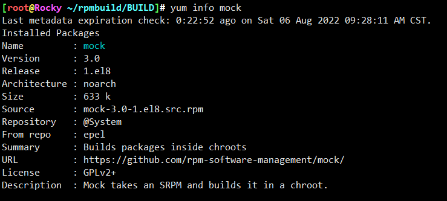
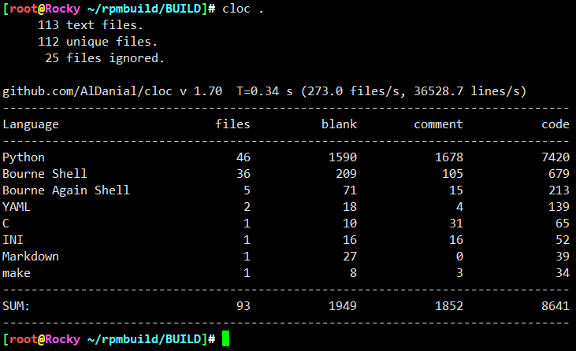
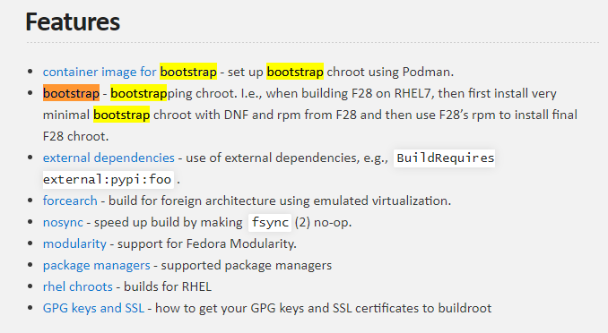

# 知己知彼

* mock其实就是在chroot环境构建rpm包
* 但是，这个chroot构建涉及到的因素比较多，mock只是其中的一种处理方案
* 另外，何不把mock装进docker？

## 特性

* 最初是基于chroot，隔离效果一般，现在都换成systemd-nspawn
* 越发跟docker关联紧密了哟
* 确实docker在兼容性方面确实值得抄袭一番，此处docker不代表docker，指代一类技术。

## 竞品

* tito
* koji
* obs

---
